# Outlier detection with weather data of Tokyo region
## From datasets of 30 years of daily weather
http://www.data.jma.go.jp/obd/stats/etrn/index.php

## Objective

Objective of this notebook is to detect outliers in daily weather over 30 years of weather data of Tokyo region. The dataset is acquired from [Japan Meteorogical Agency](http://www.data.jma.go.jp/obd/stats/etrn/index.php).
I used unsupervised learning from scikit-learn, the methodologies include one class svm, kernel density estimator, local outlier factor, gaussian mixture, isolation forest and elliptic envelope.

### Thanks to the following decks:
https://www.slideshare.net/KosukeNakago/dllab-20180214-88470902 <br>
http://scikit-learn.org/dev/auto_examples/plot_anomaly_comparison.html <br>
http://scikit-learn.org/stable/auto_examples/covariance/plot_outlier_detection.html#sphx-glr-auto-examples-covariance-plot-outlier-detection-py


```python
import pandas as pd
import numpy as np
import matplotlib.pyplot as plt
from IPython.display import display
import sklearn
from sklearn import svm
from sklearn import preprocessing
from sklearn.neighbors import KernelDensity, LocalOutlierFactor
from sklearn.mixture import GaussianMixture
from sklearn.ensemble import IsolationForest
from sklearn.covariance import EllipticEnvelope
import copy

%matplotlib inline
```

## Prerequisite
The dataset is acquired from [Japan Meteorogical Agency](http://www.data.jma.go.jp/obd/stats/etrn/index.php), daily, from January 1st, 1987, to December 31, 2017. <br>
The columns I selected are as follows:<br>
- average temperature
- highest temperature
- lowest temperature
- precipitation
- daylight time
- snowfall 
- average wind speed
- highest wind speed
- highest wind direction


```python
# load dataset
weather = pd.read_csv("./1987-2017.csv")
months = ["Jan","Feb","Mar","Apr","May","Jun",
          "Jul","Aug","Sep","Oct","Nov","Dec"]
```


```python
weather
```


<div>
<style scoped>
    .dataframe tbody tr th:only-of-type {
        vertical-align: middle;
    }

    .dataframe tbody tr th {
        vertical-align: top;
    }

    .dataframe thead th {
        text-align: right;
    }
</style>
<table border="1" class="dataframe">
  <thead>
    <tr style="text-align: right;">
      <th></th>
      <th>yyyy/mm/dd</th>
      <th>year</th>
      <th>month</th>
      <th>day</th>
      <th>ave_temp</th>
      <th>high_temp</th>
      <th>low_temp</th>
      <th>precip</th>
      <th>daylight</th>
      <th>snowfall</th>
      <th>ave_wind_speed</th>
      <th>high_wind_speed</th>
      <th>high_wind_direc</th>
    </tr>
  </thead>
  <tbody>
    <tr>
      <th>0</th>
      <td>1987/1/1</td>
      <td>1987</td>
      <td>1</td>
      <td>1</td>
      <td>6.7</td>
      <td>9.5</td>
      <td>4.0</td>
      <td>0.0</td>
      <td>9.3</td>
      <td>0</td>
      <td>7.3</td>
      <td>12.7</td>
      <td>NNW</td>
    </tr>
    <tr>
      <th>1</th>
      <td>1987/1/2</td>
      <td>1987</td>
      <td>1</td>
      <td>2</td>
      <td>2.9</td>
      <td>4.7</td>
      <td>1.1</td>
      <td>2.5</td>
      <td>0.0</td>
      <td>0</td>
      <td>4.4</td>
      <td>7.8</td>
      <td>NNW</td>
    </tr>
    <tr>
      <th>2</th>
      <td>1987/1/3</td>
      <td>1987</td>
      <td>1</td>
      <td>3</td>
      <td>5.9</td>
      <td>9.3</td>
      <td>1.3</td>
      <td>2.0</td>
      <td>0.8</td>
      <td>0</td>
      <td>2.5</td>
      <td>5.9</td>
      <td>N</td>
    </tr>
    <tr>
      <th>3</th>
      <td>1987/1/4</td>
      <td>1987</td>
      <td>1</td>
      <td>4</td>
      <td>6.8</td>
      <td>11.9</td>
      <td>3.2</td>
      <td>0.0</td>
      <td>8.9</td>
      <td>0</td>
      <td>4.9</td>
      <td>8.0</td>
      <td>NNW</td>
    </tr>
    <tr>
      <th>4</th>
      <td>1987/1/5</td>
      <td>1987</td>
      <td>1</td>
      <td>5</td>
      <td>2.7</td>
      <td>4.7</td>
      <td>0.5</td>
      <td>6.0</td>
      <td>0.0</td>
      <td>1</td>
      <td>4.2</td>
      <td>8.0</td>
      <td>N</td>
    </tr>
    <tr>
      <th>5</th>
      <td>1987/1/6</td>
      <td>1987</td>
      <td>1</td>
      <td>6</td>
      <td>3.5</td>
      <td>6.7</td>
      <td>0.4</td>
      <td>3.0</td>
      <td>5.7</td>
      <td>5</td>
      <td>3.3</td>
      <td>7.5</td>
      <td>NNW</td>
    </tr>
    <tr>
      <th>6</th>
      <td>1987/1/7</td>
      <td>1987</td>
      <td>1</td>
      <td>7</td>
      <td>5.0</td>
      <td>8.7</td>
      <td>2.7</td>
      <td>0.0</td>
      <td>2.5</td>
      <td>0</td>
      <td>2.9</td>
      <td>6.0</td>
      <td>N</td>
    </tr>
    <tr>
      <th>7</th>
      <td>1987/1/8</td>
      <td>1987</td>
      <td>1</td>
      <td>8</td>
      <td>8.7</td>
      <td>15.1</td>
      <td>2.5</td>
      <td>0.0</td>
      <td>7.6</td>
      <td>0</td>
      <td>3.4</td>
      <td>6.4</td>
      <td>NW</td>
    </tr>
    <tr>
      <th>8</th>
      <td>1987/1/9</td>
      <td>1987</td>
      <td>1</td>
      <td>9</td>
      <td>8.7</td>
      <td>15.4</td>
      <td>3.1</td>
      <td>0.0</td>
      <td>8.9</td>
      <td>0</td>
      <td>2.4</td>
      <td>5.5</td>
      <td>NNW</td>
    </tr>
    <tr>
      <th>9</th>
      <td>1987/1/10</td>
      <td>1987</td>
      <td>1</td>
      <td>10</td>
      <td>4.3</td>
      <td>8.3</td>
      <td>1.5</td>
      <td>0.0</td>
      <td>4.4</td>
      <td>0</td>
      <td>4.8</td>
      <td>9.4</td>
      <td>N</td>
    </tr>
    <tr>
      <th>10</th>
      <td>1987/1/11</td>
      <td>1987</td>
      <td>1</td>
      <td>11</td>
      <td>2.9</td>
      <td>5.4</td>
      <td>0.3</td>
      <td>0.0</td>
      <td>7.5</td>
      <td>0</td>
      <td>4.8</td>
      <td>10.4</td>
      <td>NNW</td>
    </tr>
    <tr>
      <th>11</th>
      <td>1987/1/12</td>
      <td>1987</td>
      <td>1</td>
      <td>12</td>
      <td>1.6</td>
      <td>4.2</td>
      <td>0.2</td>
      <td>12.0</td>
      <td>0.9</td>
      <td>2</td>
      <td>3.5</td>
      <td>7.2</td>
      <td>NNW</td>
    </tr>
    <tr>
      <th>12</th>
      <td>1987/1/13</td>
      <td>1987</td>
      <td>1</td>
      <td>13</td>
      <td>5.0</td>
      <td>9.7</td>
      <td>0.5</td>
      <td>0.0</td>
      <td>6.8</td>
      <td>4</td>
      <td>3.3</td>
      <td>8.9</td>
      <td>NW</td>
    </tr>
    <tr>
      <th>13</th>
      <td>1987/1/14</td>
      <td>1987</td>
      <td>1</td>
      <td>14</td>
      <td>4.9</td>
      <td>7.9</td>
      <td>2.2</td>
      <td>0.0</td>
      <td>9.5</td>
      <td>0</td>
      <td>3.5</td>
      <td>6.2</td>
      <td>NNW</td>
    </tr>
    <tr>
      <th>14</th>
      <td>1987/1/15</td>
      <td>1987</td>
      <td>1</td>
      <td>15</td>
      <td>6.7</td>
      <td>12.1</td>
      <td>0.1</td>
      <td>0.0</td>
      <td>9.4</td>
      <td>0</td>
      <td>2.6</td>
      <td>6.3</td>
      <td>NNW</td>
    </tr>
    <tr>
      <th>15</th>
      <td>1987/1/16</td>
      <td>1987</td>
      <td>1</td>
      <td>16</td>
      <td>7.8</td>
      <td>10.8</td>
      <td>3.6</td>
      <td>0.0</td>
      <td>2.0</td>
      <td>0</td>
      <td>3.2</td>
      <td>5.4</td>
      <td>N</td>
    </tr>
    <tr>
      <th>16</th>
      <td>1987/1/17</td>
      <td>1987</td>
      <td>1</td>
      <td>17</td>
      <td>10.4</td>
      <td>18.0</td>
      <td>4.6</td>
      <td>0.0</td>
      <td>7.4</td>
      <td>0</td>
      <td>4.0</td>
      <td>9.5</td>
      <td>SW</td>
    </tr>
    <tr>
      <th>17</th>
      <td>1987/1/18</td>
      <td>1987</td>
      <td>1</td>
      <td>18</td>
      <td>7.1</td>
      <td>10.6</td>
      <td>4.5</td>
      <td>0.0</td>
      <td>9.2</td>
      <td>0</td>
      <td>3.8</td>
      <td>6.8</td>
      <td>NNW</td>
    </tr>
    <tr>
      <th>18</th>
      <td>1987/1/19</td>
      <td>1987</td>
      <td>1</td>
      <td>19</td>
      <td>5.5</td>
      <td>9.3</td>
      <td>1.7</td>
      <td>0.0</td>
      <td>6.4</td>
      <td>0</td>
      <td>2.8</td>
      <td>7.5</td>
      <td>NNE</td>
    </tr>
    <tr>
      <th>19</th>
      <td>1987/1/20</td>
      <td>1987</td>
      <td>1</td>
      <td>20</td>
      <td>2.8</td>
      <td>5.9</td>
      <td>0.1</td>
      <td>0.0</td>
      <td>8.1</td>
      <td>0</td>
      <td>5.9</td>
      <td>9.6</td>
      <td>NNW</td>
    </tr>
    <tr>
      <th>20</th>
      <td>1987/1/21</td>
      <td>1987</td>
      <td>1</td>
      <td>21</td>
      <td>3.1</td>
      <td>6.5</td>
      <td>-0.1</td>
      <td>0.0</td>
      <td>6.8</td>
      <td>0</td>
      <td>3.0</td>
      <td>6.5</td>
      <td>NNW</td>
    </tr>
    <tr>
      <th>21</th>
      <td>1987/1/22</td>
      <td>1987</td>
      <td>1</td>
      <td>22</td>
      <td>5.4</td>
      <td>9.2</td>
      <td>0.4</td>
      <td>0.0</td>
      <td>8.7</td>
      <td>0</td>
      <td>2.5</td>
      <td>4.9</td>
      <td>N</td>
    </tr>
    <tr>
      <th>22</th>
      <td>1987/1/23</td>
      <td>1987</td>
      <td>1</td>
      <td>23</td>
      <td>8.1</td>
      <td>16.2</td>
      <td>2.7</td>
      <td>2.0</td>
      <td>0.0</td>
      <td>0</td>
      <td>3.2</td>
      <td>10.0</td>
      <td>SW</td>
    </tr>
    <tr>
      <th>23</th>
      <td>1987/1/24</td>
      <td>1987</td>
      <td>1</td>
      <td>24</td>
      <td>10.2</td>
      <td>16.0</td>
      <td>6.0</td>
      <td>10.5</td>
      <td>0.0</td>
      <td>0</td>
      <td>5.3</td>
      <td>10.2</td>
      <td>SW</td>
    </tr>
    <tr>
      <th>24</th>
      <td>1987/1/25</td>
      <td>1987</td>
      <td>1</td>
      <td>25</td>
      <td>4.1</td>
      <td>7.5</td>
      <td>1.4</td>
      <td>0.0</td>
      <td>1.6</td>
      <td>0</td>
      <td>5.7</td>
      <td>8.8</td>
      <td>NNW</td>
    </tr>
    <tr>
      <th>25</th>
      <td>1987/1/26</td>
      <td>1987</td>
      <td>1</td>
      <td>26</td>
      <td>3.7</td>
      <td>8.2</td>
      <td>-0.4</td>
      <td>0.0</td>
      <td>8.9</td>
      <td>0</td>
      <td>2.9</td>
      <td>6.0</td>
      <td>NW</td>
    </tr>
    <tr>
      <th>26</th>
      <td>1987/1/27</td>
      <td>1987</td>
      <td>1</td>
      <td>27</td>
      <td>5.5</td>
      <td>10.1</td>
      <td>-0.2</td>
      <td>0.0</td>
      <td>8.8</td>
      <td>0</td>
      <td>1.8</td>
      <td>3.6</td>
      <td>S</td>
    </tr>
    <tr>
      <th>27</th>
      <td>1987/1/28</td>
      <td>1987</td>
      <td>1</td>
      <td>28</td>
      <td>7.6</td>
      <td>12.0</td>
      <td>2.6</td>
      <td>0.0</td>
      <td>9.4</td>
      <td>0</td>
      <td>2.9</td>
      <td>5.4</td>
      <td>NNW</td>
    </tr>
    <tr>
      <th>28</th>
      <td>1987/1/29</td>
      <td>1987</td>
      <td>1</td>
      <td>29</td>
      <td>8.2</td>
      <td>12.8</td>
      <td>3.4</td>
      <td>0.0</td>
      <td>9.3</td>
      <td>0</td>
      <td>1.9</td>
      <td>3.2</td>
      <td>SSW</td>
    </tr>
    <tr>
      <th>29</th>
      <td>1987/1/30</td>
      <td>1987</td>
      <td>1</td>
      <td>30</td>
      <td>9.1</td>
      <td>16.1</td>
      <td>3.7</td>
      <td>0.0</td>
      <td>8.3</td>
      <td>0</td>
      <td>2.7</td>
      <td>7.4</td>
      <td>NNW</td>
    </tr>
    <tr>
      <th>...</th>
      <td>...</td>
      <td>...</td>
      <td>...</td>
      <td>...</td>
      <td>...</td>
      <td>...</td>
      <td>...</td>
      <td>...</td>
      <td>...</td>
      <td>...</td>
      <td>...</td>
      <td>...</td>
      <td>...</td>
    </tr>
    <tr>
      <th>11293</th>
      <td>2017/12/2</td>
      <td>2017</td>
      <td>12</td>
      <td>2</td>
      <td>7.6</td>
      <td>11.1</td>
      <td>4.5</td>
      <td>0.0</td>
      <td>7.3</td>
      <td>0</td>
      <td>2.0</td>
      <td>3.6</td>
      <td>NE</td>
    </tr>
    <tr>
      <th>11294</th>
      <td>2017/12/3</td>
      <td>2017</td>
      <td>12</td>
      <td>3</td>
      <td>8.2</td>
      <td>12.5</td>
      <td>5.2</td>
      <td>0.0</td>
      <td>8.1</td>
      <td>0</td>
      <td>2.0</td>
      <td>3.8</td>
      <td>NNW</td>
    </tr>
    <tr>
      <th>11295</th>
      <td>2017/12/4</td>
      <td>2017</td>
      <td>12</td>
      <td>4</td>
      <td>8.8</td>
      <td>12.6</td>
      <td>4.6</td>
      <td>0.0</td>
      <td>2.8</td>
      <td>0</td>
      <td>2.1</td>
      <td>4.5</td>
      <td>WNW</td>
    </tr>
    <tr>
      <th>11296</th>
      <td>2017/12/5</td>
      <td>2017</td>
      <td>12</td>
      <td>5</td>
      <td>9.2</td>
      <td>14.5</td>
      <td>4.4</td>
      <td>0.0</td>
      <td>8.5</td>
      <td>0</td>
      <td>2.6</td>
      <td>5.8</td>
      <td>SSW</td>
    </tr>
    <tr>
      <th>11297</th>
      <td>2017/12/6</td>
      <td>2017</td>
      <td>12</td>
      <td>6</td>
      <td>6.9</td>
      <td>11.1</td>
      <td>2.8</td>
      <td>0.0</td>
      <td>8.9</td>
      <td>0</td>
      <td>2.2</td>
      <td>3.9</td>
      <td>NW</td>
    </tr>
    <tr>
      <th>11298</th>
      <td>2017/12/7</td>
      <td>2017</td>
      <td>12</td>
      <td>7</td>
      <td>6.4</td>
      <td>11.5</td>
      <td>2.7</td>
      <td>0.0</td>
      <td>7.8</td>
      <td>0</td>
      <td>2.0</td>
      <td>4.1</td>
      <td>WNW</td>
    </tr>
    <tr>
      <th>11299</th>
      <td>2017/12/8</td>
      <td>2017</td>
      <td>12</td>
      <td>8</td>
      <td>5.7</td>
      <td>9.5</td>
      <td>2.6</td>
      <td>4.5</td>
      <td>0.5</td>
      <td>0</td>
      <td>2.1</td>
      <td>6.3</td>
      <td>NW</td>
    </tr>
    <tr>
      <th>11300</th>
      <td>2017/12/9</td>
      <td>2017</td>
      <td>12</td>
      <td>9</td>
      <td>5.9</td>
      <td>10.4</td>
      <td>1.2</td>
      <td>0.0</td>
      <td>8.9</td>
      <td>0</td>
      <td>2.4</td>
      <td>6.0</td>
      <td>NW</td>
    </tr>
    <tr>
      <th>11301</th>
      <td>2017/12/10</td>
      <td>2017</td>
      <td>12</td>
      <td>10</td>
      <td>6.9</td>
      <td>13.3</td>
      <td>1.3</td>
      <td>0.0</td>
      <td>8.4</td>
      <td>0</td>
      <td>1.9</td>
      <td>5.8</td>
      <td>S</td>
    </tr>
    <tr>
      <th>11302</th>
      <td>2017/12/11</td>
      <td>2017</td>
      <td>12</td>
      <td>11</td>
      <td>9.9</td>
      <td>16.0</td>
      <td>5.1</td>
      <td>0.0</td>
      <td>8.6</td>
      <td>0</td>
      <td>2.7</td>
      <td>6.6</td>
      <td>WSW</td>
    </tr>
    <tr>
      <th>11303</th>
      <td>2017/12/12</td>
      <td>2017</td>
      <td>12</td>
      <td>12</td>
      <td>6.8</td>
      <td>10.3</td>
      <td>3.8</td>
      <td>0.0</td>
      <td>8.4</td>
      <td>0</td>
      <td>2.9</td>
      <td>5.9</td>
      <td>SSW</td>
    </tr>
    <tr>
      <th>11304</th>
      <td>2017/12/13</td>
      <td>2017</td>
      <td>12</td>
      <td>13</td>
      <td>5.9</td>
      <td>10.4</td>
      <td>2.6</td>
      <td>0.0</td>
      <td>7.9</td>
      <td>0</td>
      <td>2.8</td>
      <td>5.8</td>
      <td>NNW</td>
    </tr>
    <tr>
      <th>11305</th>
      <td>2017/12/14</td>
      <td>2017</td>
      <td>12</td>
      <td>14</td>
      <td>5.7</td>
      <td>10.1</td>
      <td>1.6</td>
      <td>0.0</td>
      <td>8.9</td>
      <td>0</td>
      <td>3.5</td>
      <td>9.6</td>
      <td>NW</td>
    </tr>
    <tr>
      <th>11306</th>
      <td>2017/12/15</td>
      <td>2017</td>
      <td>12</td>
      <td>15</td>
      <td>5.4</td>
      <td>8.3</td>
      <td>3.0</td>
      <td>0.0</td>
      <td>0.4</td>
      <td>0</td>
      <td>1.8</td>
      <td>4.3</td>
      <td>NW</td>
    </tr>
    <tr>
      <th>11307</th>
      <td>2017/12/16</td>
      <td>2017</td>
      <td>12</td>
      <td>16</td>
      <td>7.7</td>
      <td>13.3</td>
      <td>2.1</td>
      <td>0.0</td>
      <td>6.6</td>
      <td>0</td>
      <td>1.6</td>
      <td>4.0</td>
      <td>SSW</td>
    </tr>
    <tr>
      <th>11308</th>
      <td>2017/12/17</td>
      <td>2017</td>
      <td>12</td>
      <td>17</td>
      <td>6.1</td>
      <td>9.3</td>
      <td>3.3</td>
      <td>0.0</td>
      <td>8.8</td>
      <td>0</td>
      <td>3.8</td>
      <td>8.8</td>
      <td>NW</td>
    </tr>
    <tr>
      <th>11309</th>
      <td>2017/12/18</td>
      <td>2017</td>
      <td>12</td>
      <td>18</td>
      <td>4.4</td>
      <td>9.5</td>
      <td>-0.2</td>
      <td>0.0</td>
      <td>8.8</td>
      <td>0</td>
      <td>2.0</td>
      <td>4.6</td>
      <td>NW</td>
    </tr>
    <tr>
      <th>11310</th>
      <td>2017/12/19</td>
      <td>2017</td>
      <td>12</td>
      <td>19</td>
      <td>6.5</td>
      <td>12.8</td>
      <td>0.3</td>
      <td>0.0</td>
      <td>9.0</td>
      <td>0</td>
      <td>2.3</td>
      <td>5.1</td>
      <td>NNW</td>
    </tr>
    <tr>
      <th>11311</th>
      <td>2017/12/20</td>
      <td>2017</td>
      <td>12</td>
      <td>20</td>
      <td>5.7</td>
      <td>9.4</td>
      <td>2.3</td>
      <td>0.0</td>
      <td>5.7</td>
      <td>0</td>
      <td>1.9</td>
      <td>3.8</td>
      <td>NNW</td>
    </tr>
    <tr>
      <th>11312</th>
      <td>2017/12/21</td>
      <td>2017</td>
      <td>12</td>
      <td>21</td>
      <td>5.3</td>
      <td>10.4</td>
      <td>0.7</td>
      <td>0.0</td>
      <td>6.8</td>
      <td>0</td>
      <td>2.0</td>
      <td>3.6</td>
      <td>NW</td>
    </tr>
    <tr>
      <th>11313</th>
      <td>2017/12/22</td>
      <td>2017</td>
      <td>12</td>
      <td>22</td>
      <td>5.4</td>
      <td>10.9</td>
      <td>1.5</td>
      <td>0.0</td>
      <td>5.7</td>
      <td>0</td>
      <td>1.9</td>
      <td>3.8</td>
      <td>SE</td>
    </tr>
    <tr>
      <th>11314</th>
      <td>2017/12/23</td>
      <td>2017</td>
      <td>12</td>
      <td>23</td>
      <td>7.1</td>
      <td>13.4</td>
      <td>1.0</td>
      <td>0.0</td>
      <td>7.9</td>
      <td>0</td>
      <td>1.8</td>
      <td>4.0</td>
      <td>NW</td>
    </tr>
    <tr>
      <th>11315</th>
      <td>2017/12/24</td>
      <td>2017</td>
      <td>12</td>
      <td>24</td>
      <td>7.4</td>
      <td>10.8</td>
      <td>4.5</td>
      <td>0.0</td>
      <td>2.9</td>
      <td>0</td>
      <td>1.6</td>
      <td>3.7</td>
      <td>S</td>
    </tr>
    <tr>
      <th>11316</th>
      <td>2017/12/25</td>
      <td>2017</td>
      <td>12</td>
      <td>25</td>
      <td>9.4</td>
      <td>15.0</td>
      <td>5.4</td>
      <td>10.5</td>
      <td>8.1</td>
      <td>0</td>
      <td>4.2</td>
      <td>7.0</td>
      <td>NW</td>
    </tr>
    <tr>
      <th>11317</th>
      <td>2017/12/26</td>
      <td>2017</td>
      <td>12</td>
      <td>26</td>
      <td>7.5</td>
      <td>12.6</td>
      <td>3.6</td>
      <td>0.0</td>
      <td>9.0</td>
      <td>0</td>
      <td>3.1</td>
      <td>6.2</td>
      <td>NW</td>
    </tr>
    <tr>
      <th>11318</th>
      <td>2017/12/27</td>
      <td>2017</td>
      <td>12</td>
      <td>27</td>
      <td>4.5</td>
      <td>9.2</td>
      <td>1.0</td>
      <td>0.0</td>
      <td>9.0</td>
      <td>0</td>
      <td>3.1</td>
      <td>5.6</td>
      <td>NNW</td>
    </tr>
    <tr>
      <th>11319</th>
      <td>2017/12/28</td>
      <td>2017</td>
      <td>12</td>
      <td>28</td>
      <td>4.8</td>
      <td>9.8</td>
      <td>1.1</td>
      <td>0.0</td>
      <td>9.0</td>
      <td>0</td>
      <td>3.3</td>
      <td>6.0</td>
      <td>NW</td>
    </tr>
    <tr>
      <th>11320</th>
      <td>2017/12/29</td>
      <td>2017</td>
      <td>12</td>
      <td>29</td>
      <td>6.1</td>
      <td>10.5</td>
      <td>2.3</td>
      <td>0.0</td>
      <td>8.6</td>
      <td>0</td>
      <td>3.4</td>
      <td>6.7</td>
      <td>NW</td>
    </tr>
    <tr>
      <th>11321</th>
      <td>2017/12/30</td>
      <td>2017</td>
      <td>12</td>
      <td>30</td>
      <td>6.2</td>
      <td>11.1</td>
      <td>1.0</td>
      <td>0.0</td>
      <td>8.9</td>
      <td>0</td>
      <td>2.8</td>
      <td>5.8</td>
      <td>NW</td>
    </tr>
    <tr>
      <th>11322</th>
      <td>2017/12/31</td>
      <td>2017</td>
      <td>12</td>
      <td>31</td>
      <td>3.8</td>
      <td>5.4</td>
      <td>2.2</td>
      <td>0.0</td>
      <td>0.4</td>
      <td>0</td>
      <td>2.1</td>
      <td>4.3</td>
      <td>NW</td>
    </tr>
  </tbody>
</table>
<p>11323 rows × 13 columns</p>
</div>


```python
# dividing the original dataset to monthly datasets
orig_monthly_weathers = {}
for i in range(1,13,1):
    orig_monthly_weathers[i] = weather.query("month=={0}".format(i))
    orig_monthly_weathers[i].reset_index(inplace=True, drop=True)
```

### Drawing boxplot on each month, in order to see if there are outliers
It is possible to observe from the boxplots that there are obvious outliers in the dataset.


```python
r = ['ave_temp', 'high_temp', 'low_temp', 'precip','daylight', 'snowfall', 'ave_wind_speed', 'high_wind_speed']
for i in range(1,13,1):
    fig = plt.figure()
    ax = fig.add_subplot(111)
    ax.boxplot(np.array(orig_monthly_weathers[i][r]))
    ax.set_xticklabels(r)
    plt.title(months[i-1])
    plt.grid()
    plt.show()
```

    /opt/anaconda3/lib/python3.5/site-packages/numpy/lib/function_base.py:4274: RuntimeWarning: Invalid value encountered in percentile
      interpolation=interpolation)
    /opt/anaconda3/lib/python3.5/site-packages/matplotlib/cbook.py:2066: RuntimeWarning: invalid value encountered in less_equal
      wiskhi = np.compress(x <= hival, x)
    /opt/anaconda3/lib/python3.5/site-packages/matplotlib/cbook.py:2073: RuntimeWarning: invalid value encountered in greater_equal
      wisklo = np.compress(x >= loval, x)
    /opt/anaconda3/lib/python3.5/site-packages/matplotlib/cbook.py:2081: RuntimeWarning: invalid value encountered in less
      np.compress(x < stats['whislo'], x),
    /opt/anaconda3/lib/python3.5/site-packages/matplotlib/cbook.py:2082: RuntimeWarning: invalid value encountered in greater
      np.compress(x > stats['whishi'], x)


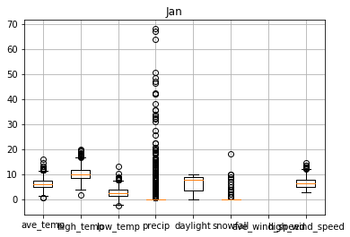


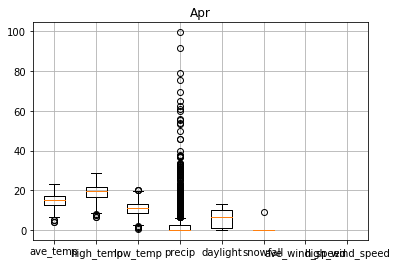


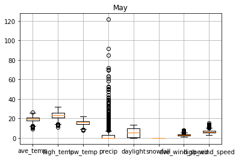


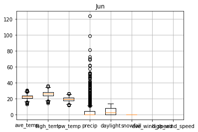


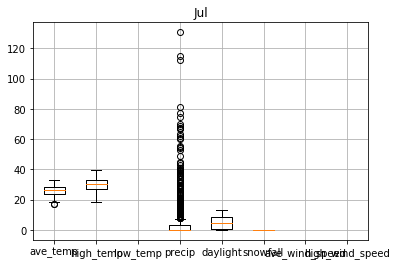


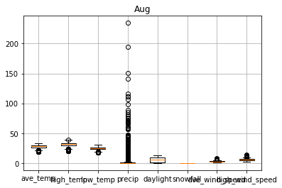


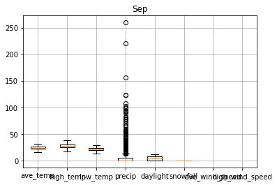


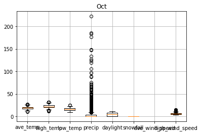


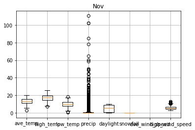


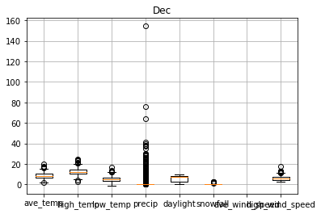


## Data refining and cleansing
In order to refine and cleanse data, I did followings:
- identified columns to use on outlier detection
- transpose nominal scale data to numerical scale
- imputed null values
- rescaled continuous variables to standard scale


```python
# get dummy columns for high_wind_direc to tranpose nominal scale to numerical scale
high_wind_dummies = pd.get_dummies(weather[["high_wind_direc"]])
weather_con = pd.merge(weather, high_wind_dummies, left_index=True, right_index=True)
```


```python
weather_con
```


<div>
<style scoped>
    .dataframe tbody tr th:only-of-type {
        vertical-align: middle;
    }

    .dataframe tbody tr th {
        vertical-align: top;
    }

    .dataframe thead th {
        text-align: right;
    }
</style>
<table border="1" class="dataframe">
  <thead>
    <tr style="text-align: right;">
      <th></th>
      <th>yyyy/mm/dd</th>
      <th>year</th>
      <th>month</th>
      <th>day</th>
      <th>ave_temp</th>
      <th>high_temp</th>
      <th>low_temp</th>
      <th>precip</th>
      <th>daylight</th>
      <th>snowfall</th>
      <th>...</th>
      <th>high_wind_direc_NNW</th>
      <th>high_wind_direc_NW</th>
      <th>high_wind_direc_S</th>
      <th>high_wind_direc_SE</th>
      <th>high_wind_direc_SSE</th>
      <th>high_wind_direc_SSW</th>
      <th>high_wind_direc_SW</th>
      <th>high_wind_direc_W</th>
      <th>high_wind_direc_WNW</th>
      <th>high_wind_direc_WSW</th>
    </tr>
  </thead>
  <tbody>
    <tr>
      <th>0</th>
      <td>1987/1/1</td>
      <td>1987</td>
      <td>1</td>
      <td>1</td>
      <td>6.7</td>
      <td>9.5</td>
      <td>4.0</td>
      <td>0.0</td>
      <td>9.3</td>
      <td>0</td>
      <td>...</td>
      <td>1</td>
      <td>0</td>
      <td>0</td>
      <td>0</td>
      <td>0</td>
      <td>0</td>
      <td>0</td>
      <td>0</td>
      <td>0</td>
      <td>0</td>
    </tr>
    <tr>
      <th>1</th>
      <td>1987/1/2</td>
      <td>1987</td>
      <td>1</td>
      <td>2</td>
      <td>2.9</td>
      <td>4.7</td>
      <td>1.1</td>
      <td>2.5</td>
      <td>0.0</td>
      <td>0</td>
      <td>...</td>
      <td>1</td>
      <td>0</td>
      <td>0</td>
      <td>0</td>
      <td>0</td>
      <td>0</td>
      <td>0</td>
      <td>0</td>
      <td>0</td>
      <td>0</td>
    </tr>
    <tr>
      <th>2</th>
      <td>1987/1/3</td>
      <td>1987</td>
      <td>1</td>
      <td>3</td>
      <td>5.9</td>
      <td>9.3</td>
      <td>1.3</td>
      <td>2.0</td>
      <td>0.8</td>
      <td>0</td>
      <td>...</td>
      <td>0</td>
      <td>0</td>
      <td>0</td>
      <td>0</td>
      <td>0</td>
      <td>0</td>
      <td>0</td>
      <td>0</td>
      <td>0</td>
      <td>0</td>
    </tr>
    <tr>
      <th>3</th>
      <td>1987/1/4</td>
      <td>1987</td>
      <td>1</td>
      <td>4</td>
      <td>6.8</td>
      <td>11.9</td>
      <td>3.2</td>
      <td>0.0</td>
      <td>8.9</td>
      <td>0</td>
      <td>...</td>
      <td>1</td>
      <td>0</td>
      <td>0</td>
      <td>0</td>
      <td>0</td>
      <td>0</td>
      <td>0</td>
      <td>0</td>
      <td>0</td>
      <td>0</td>
    </tr>
    <tr>
      <th>4</th>
      <td>1987/1/5</td>
      <td>1987</td>
      <td>1</td>
      <td>5</td>
      <td>2.7</td>
      <td>4.7</td>
      <td>0.5</td>
      <td>6.0</td>
      <td>0.0</td>
      <td>1</td>
      <td>...</td>
      <td>0</td>
      <td>0</td>
      <td>0</td>
      <td>0</td>
      <td>0</td>
      <td>0</td>
      <td>0</td>
      <td>0</td>
      <td>0</td>
      <td>0</td>
    </tr>
    <tr>
      <th>5</th>
      <td>1987/1/6</td>
      <td>1987</td>
      <td>1</td>
      <td>6</td>
      <td>3.5</td>
      <td>6.7</td>
      <td>0.4</td>
      <td>3.0</td>
      <td>5.7</td>
      <td>5</td>
      <td>...</td>
      <td>1</td>
      <td>0</td>
      <td>0</td>
      <td>0</td>
      <td>0</td>
      <td>0</td>
      <td>0</td>
      <td>0</td>
      <td>0</td>
      <td>0</td>
    </tr>
    <tr>
      <th>6</th>
      <td>1987/1/7</td>
      <td>1987</td>
      <td>1</td>
      <td>7</td>
      <td>5.0</td>
      <td>8.7</td>
      <td>2.7</td>
      <td>0.0</td>
      <td>2.5</td>
      <td>0</td>
      <td>...</td>
      <td>0</td>
      <td>0</td>
      <td>0</td>
      <td>0</td>
      <td>0</td>
      <td>0</td>
      <td>0</td>
      <td>0</td>
      <td>0</td>
      <td>0</td>
    </tr>
    <tr>
      <th>7</th>
      <td>1987/1/8</td>
      <td>1987</td>
      <td>1</td>
      <td>8</td>
      <td>8.7</td>
      <td>15.1</td>
      <td>2.5</td>
      <td>0.0</td>
      <td>7.6</td>
      <td>0</td>
      <td>...</td>
      <td>0</td>
      <td>1</td>
      <td>0</td>
      <td>0</td>
      <td>0</td>
      <td>0</td>
      <td>0</td>
      <td>0</td>
      <td>0</td>
      <td>0</td>
    </tr>
    <tr>
      <th>8</th>
      <td>1987/1/9</td>
      <td>1987</td>
      <td>1</td>
      <td>9</td>
      <td>8.7</td>
      <td>15.4</td>
      <td>3.1</td>
      <td>0.0</td>
      <td>8.9</td>
      <td>0</td>
      <td>...</td>
      <td>1</td>
      <td>0</td>
      <td>0</td>
      <td>0</td>
      <td>0</td>
      <td>0</td>
      <td>0</td>
      <td>0</td>
      <td>0</td>
      <td>0</td>
    </tr>
    <tr>
      <th>9</th>
      <td>1987/1/10</td>
      <td>1987</td>
      <td>1</td>
      <td>10</td>
      <td>4.3</td>
      <td>8.3</td>
      <td>1.5</td>
      <td>0.0</td>
      <td>4.4</td>
      <td>0</td>
      <td>...</td>
      <td>0</td>
      <td>0</td>
      <td>0</td>
      <td>0</td>
      <td>0</td>
      <td>0</td>
      <td>0</td>
      <td>0</td>
      <td>0</td>
      <td>0</td>
    </tr>
    <tr>
      <th>10</th>
      <td>1987/1/11</td>
      <td>1987</td>
      <td>1</td>
      <td>11</td>
      <td>2.9</td>
      <td>5.4</td>
      <td>0.3</td>
      <td>0.0</td>
      <td>7.5</td>
      <td>0</td>
      <td>...</td>
      <td>1</td>
      <td>0</td>
      <td>0</td>
      <td>0</td>
      <td>0</td>
      <td>0</td>
      <td>0</td>
      <td>0</td>
      <td>0</td>
      <td>0</td>
    </tr>
    <tr>
      <th>11</th>
      <td>1987/1/12</td>
      <td>1987</td>
      <td>1</td>
      <td>12</td>
      <td>1.6</td>
      <td>4.2</td>
      <td>0.2</td>
      <td>12.0</td>
      <td>0.9</td>
      <td>2</td>
      <td>...</td>
      <td>1</td>
      <td>0</td>
      <td>0</td>
      <td>0</td>
      <td>0</td>
      <td>0</td>
      <td>0</td>
      <td>0</td>
      <td>0</td>
      <td>0</td>
    </tr>
    <tr>
      <th>12</th>
      <td>1987/1/13</td>
      <td>1987</td>
      <td>1</td>
      <td>13</td>
      <td>5.0</td>
      <td>9.7</td>
      <td>0.5</td>
      <td>0.0</td>
      <td>6.8</td>
      <td>4</td>
      <td>...</td>
      <td>0</td>
      <td>1</td>
      <td>0</td>
      <td>0</td>
      <td>0</td>
      <td>0</td>
      <td>0</td>
      <td>0</td>
      <td>0</td>
      <td>0</td>
    </tr>
    <tr>
      <th>13</th>
      <td>1987/1/14</td>
      <td>1987</td>
      <td>1</td>
      <td>14</td>
      <td>4.9</td>
      <td>7.9</td>
      <td>2.2</td>
      <td>0.0</td>
      <td>9.5</td>
      <td>0</td>
      <td>...</td>
      <td>1</td>
      <td>0</td>
      <td>0</td>
      <td>0</td>
      <td>0</td>
      <td>0</td>
      <td>0</td>
      <td>0</td>
      <td>0</td>
      <td>0</td>
    </tr>
    <tr>
      <th>14</th>
      <td>1987/1/15</td>
      <td>1987</td>
      <td>1</td>
      <td>15</td>
      <td>6.7</td>
      <td>12.1</td>
      <td>0.1</td>
      <td>0.0</td>
      <td>9.4</td>
      <td>0</td>
      <td>...</td>
      <td>1</td>
      <td>0</td>
      <td>0</td>
      <td>0</td>
      <td>0</td>
      <td>0</td>
      <td>0</td>
      <td>0</td>
      <td>0</td>
      <td>0</td>
    </tr>
    <tr>
      <th>15</th>
      <td>1987/1/16</td>
      <td>1987</td>
      <td>1</td>
      <td>16</td>
      <td>7.8</td>
      <td>10.8</td>
      <td>3.6</td>
      <td>0.0</td>
      <td>2.0</td>
      <td>0</td>
      <td>...</td>
      <td>0</td>
      <td>0</td>
      <td>0</td>
      <td>0</td>
      <td>0</td>
      <td>0</td>
      <td>0</td>
      <td>0</td>
      <td>0</td>
      <td>0</td>
    </tr>
    <tr>
      <th>16</th>
      <td>1987/1/17</td>
      <td>1987</td>
      <td>1</td>
      <td>17</td>
      <td>10.4</td>
      <td>18.0</td>
      <td>4.6</td>
      <td>0.0</td>
      <td>7.4</td>
      <td>0</td>
      <td>...</td>
      <td>0</td>
      <td>0</td>
      <td>0</td>
      <td>0</td>
      <td>0</td>
      <td>0</td>
      <td>1</td>
      <td>0</td>
      <td>0</td>
      <td>0</td>
    </tr>
    <tr>
      <th>17</th>
      <td>1987/1/18</td>
      <td>1987</td>
      <td>1</td>
      <td>18</td>
      <td>7.1</td>
      <td>10.6</td>
      <td>4.5</td>
      <td>0.0</td>
      <td>9.2</td>
      <td>0</td>
      <td>...</td>
      <td>1</td>
      <td>0</td>
      <td>0</td>
      <td>0</td>
      <td>0</td>
      <td>0</td>
      <td>0</td>
      <td>0</td>
      <td>0</td>
      <td>0</td>
    </tr>
    <tr>
      <th>18</th>
      <td>1987/1/19</td>
      <td>1987</td>
      <td>1</td>
      <td>19</td>
      <td>5.5</td>
      <td>9.3</td>
      <td>1.7</td>
      <td>0.0</td>
      <td>6.4</td>
      <td>0</td>
      <td>...</td>
      <td>0</td>
      <td>0</td>
      <td>0</td>
      <td>0</td>
      <td>0</td>
      <td>0</td>
      <td>0</td>
      <td>0</td>
      <td>0</td>
      <td>0</td>
    </tr>
    <tr>
      <th>19</th>
      <td>1987/1/20</td>
      <td>1987</td>
      <td>1</td>
      <td>20</td>
      <td>2.8</td>
      <td>5.9</td>
      <td>0.1</td>
      <td>0.0</td>
      <td>8.1</td>
      <td>0</td>
      <td>...</td>
      <td>1</td>
      <td>0</td>
      <td>0</td>
      <td>0</td>
      <td>0</td>
      <td>0</td>
      <td>0</td>
      <td>0</td>
      <td>0</td>
      <td>0</td>
    </tr>
    <tr>
      <th>20</th>
      <td>1987/1/21</td>
      <td>1987</td>
      <td>1</td>
      <td>21</td>
      <td>3.1</td>
      <td>6.5</td>
      <td>-0.1</td>
      <td>0.0</td>
      <td>6.8</td>
      <td>0</td>
      <td>...</td>
      <td>1</td>
      <td>0</td>
      <td>0</td>
      <td>0</td>
      <td>0</td>
      <td>0</td>
      <td>0</td>
      <td>0</td>
      <td>0</td>
      <td>0</td>
    </tr>
    <tr>
      <th>21</th>
      <td>1987/1/22</td>
      <td>1987</td>
      <td>1</td>
      <td>22</td>
      <td>5.4</td>
      <td>9.2</td>
      <td>0.4</td>
      <td>0.0</td>
      <td>8.7</td>
      <td>0</td>
      <td>...</td>
      <td>0</td>
      <td>0</td>
      <td>0</td>
      <td>0</td>
      <td>0</td>
      <td>0</td>
      <td>0</td>
      <td>0</td>
      <td>0</td>
      <td>0</td>
    </tr>
    <tr>
      <th>22</th>
      <td>1987/1/23</td>
      <td>1987</td>
      <td>1</td>
      <td>23</td>
      <td>8.1</td>
      <td>16.2</td>
      <td>2.7</td>
      <td>2.0</td>
      <td>0.0</td>
      <td>0</td>
      <td>...</td>
      <td>0</td>
      <td>0</td>
      <td>0</td>
      <td>0</td>
      <td>0</td>
      <td>0</td>
      <td>1</td>
      <td>0</td>
      <td>0</td>
      <td>0</td>
    </tr>
    <tr>
      <th>23</th>
      <td>1987/1/24</td>
      <td>1987</td>
      <td>1</td>
      <td>24</td>
      <td>10.2</td>
      <td>16.0</td>
      <td>6.0</td>
      <td>10.5</td>
      <td>0.0</td>
      <td>0</td>
      <td>...</td>
      <td>0</td>
      <td>0</td>
      <td>0</td>
      <td>0</td>
      <td>0</td>
      <td>0</td>
      <td>1</td>
      <td>0</td>
      <td>0</td>
      <td>0</td>
    </tr>
    <tr>
      <th>24</th>
      <td>1987/1/25</td>
      <td>1987</td>
      <td>1</td>
      <td>25</td>
      <td>4.1</td>
      <td>7.5</td>
      <td>1.4</td>
      <td>0.0</td>
      <td>1.6</td>
      <td>0</td>
      <td>...</td>
      <td>1</td>
      <td>0</td>
      <td>0</td>
      <td>0</td>
      <td>0</td>
      <td>0</td>
      <td>0</td>
      <td>0</td>
      <td>0</td>
      <td>0</td>
    </tr>
    <tr>
      <th>25</th>
      <td>1987/1/26</td>
      <td>1987</td>
      <td>1</td>
      <td>26</td>
      <td>3.7</td>
      <td>8.2</td>
      <td>-0.4</td>
      <td>0.0</td>
      <td>8.9</td>
      <td>0</td>
      <td>...</td>
      <td>0</td>
      <td>1</td>
      <td>0</td>
      <td>0</td>
      <td>0</td>
      <td>0</td>
      <td>0</td>
      <td>0</td>
      <td>0</td>
      <td>0</td>
    </tr>
    <tr>
      <th>26</th>
      <td>1987/1/27</td>
      <td>1987</td>
      <td>1</td>
      <td>27</td>
      <td>5.5</td>
      <td>10.1</td>
      <td>-0.2</td>
      <td>0.0</td>
      <td>8.8</td>
      <td>0</td>
      <td>...</td>
      <td>0</td>
      <td>0</td>
      <td>1</td>
      <td>0</td>
      <td>0</td>
      <td>0</td>
      <td>0</td>
      <td>0</td>
      <td>0</td>
      <td>0</td>
    </tr>
    <tr>
      <th>27</th>
      <td>1987/1/28</td>
      <td>1987</td>
      <td>1</td>
      <td>28</td>
      <td>7.6</td>
      <td>12.0</td>
      <td>2.6</td>
      <td>0.0</td>
      <td>9.4</td>
      <td>0</td>
      <td>...</td>
      <td>1</td>
      <td>0</td>
      <td>0</td>
      <td>0</td>
      <td>0</td>
      <td>0</td>
      <td>0</td>
      <td>0</td>
      <td>0</td>
      <td>0</td>
    </tr>
    <tr>
      <th>28</th>
      <td>1987/1/29</td>
      <td>1987</td>
      <td>1</td>
      <td>29</td>
      <td>8.2</td>
      <td>12.8</td>
      <td>3.4</td>
      <td>0.0</td>
      <td>9.3</td>
      <td>0</td>
      <td>...</td>
      <td>0</td>
      <td>0</td>
      <td>0</td>
      <td>0</td>
      <td>0</td>
      <td>1</td>
      <td>0</td>
      <td>0</td>
      <td>0</td>
      <td>0</td>
    </tr>
    <tr>
      <th>29</th>
      <td>1987/1/30</td>
      <td>1987</td>
      <td>1</td>
      <td>30</td>
      <td>9.1</td>
      <td>16.1</td>
      <td>3.7</td>
      <td>0.0</td>
      <td>8.3</td>
      <td>0</td>
      <td>...</td>
      <td>1</td>
      <td>0</td>
      <td>0</td>
      <td>0</td>
      <td>0</td>
      <td>0</td>
      <td>0</td>
      <td>0</td>
      <td>0</td>
      <td>0</td>
    </tr>
    <tr>
      <th>...</th>
      <td>...</td>
      <td>...</td>
      <td>...</td>
      <td>...</td>
      <td>...</td>
      <td>...</td>
      <td>...</td>
      <td>...</td>
      <td>...</td>
      <td>...</td>
      <td>...</td>
      <td>...</td>
      <td>...</td>
      <td>...</td>
      <td>...</td>
      <td>...</td>
      <td>...</td>
      <td>...</td>
      <td>...</td>
      <td>...</td>
      <td>...</td>
    </tr>
    <tr>
      <th>11293</th>
      <td>2017/12/2</td>
      <td>2017</td>
      <td>12</td>
      <td>2</td>
      <td>7.6</td>
      <td>11.1</td>
      <td>4.5</td>
      <td>0.0</td>
      <td>7.3</td>
      <td>0</td>
      <td>...</td>
      <td>0</td>
      <td>0</td>
      <td>0</td>
      <td>0</td>
      <td>0</td>
      <td>0</td>
      <td>0</td>
      <td>0</td>
      <td>0</td>
      <td>0</td>
    </tr>
    <tr>
      <th>11294</th>
      <td>2017/12/3</td>
      <td>2017</td>
      <td>12</td>
      <td>3</td>
      <td>8.2</td>
      <td>12.5</td>
      <td>5.2</td>
      <td>0.0</td>
      <td>8.1</td>
      <td>0</td>
      <td>...</td>
      <td>1</td>
      <td>0</td>
      <td>0</td>
      <td>0</td>
      <td>0</td>
      <td>0</td>
      <td>0</td>
      <td>0</td>
      <td>0</td>
      <td>0</td>
    </tr>
    <tr>
      <th>11295</th>
      <td>2017/12/4</td>
      <td>2017</td>
      <td>12</td>
      <td>4</td>
      <td>8.8</td>
      <td>12.6</td>
      <td>4.6</td>
      <td>0.0</td>
      <td>2.8</td>
      <td>0</td>
      <td>...</td>
      <td>0</td>
      <td>0</td>
      <td>0</td>
      <td>0</td>
      <td>0</td>
      <td>0</td>
      <td>0</td>
      <td>0</td>
      <td>1</td>
      <td>0</td>
    </tr>
    <tr>
      <th>11296</th>
      <td>2017/12/5</td>
      <td>2017</td>
      <td>12</td>
      <td>5</td>
      <td>9.2</td>
      <td>14.5</td>
      <td>4.4</td>
      <td>0.0</td>
      <td>8.5</td>
      <td>0</td>
      <td>...</td>
      <td>0</td>
      <td>0</td>
      <td>0</td>
      <td>0</td>
      <td>0</td>
      <td>1</td>
      <td>0</td>
      <td>0</td>
      <td>0</td>
      <td>0</td>
    </tr>
    <tr>
      <th>11297</th>
      <td>2017/12/6</td>
      <td>2017</td>
      <td>12</td>
      <td>6</td>
      <td>6.9</td>
      <td>11.1</td>
      <td>2.8</td>
      <td>0.0</td>
      <td>8.9</td>
      <td>0</td>
      <td>...</td>
      <td>0</td>
      <td>1</td>
      <td>0</td>
      <td>0</td>
      <td>0</td>
      <td>0</td>
      <td>0</td>
      <td>0</td>
      <td>0</td>
      <td>0</td>
    </tr>
    <tr>
      <th>11298</th>
      <td>2017/12/7</td>
      <td>2017</td>
      <td>12</td>
      <td>7</td>
      <td>6.4</td>
      <td>11.5</td>
      <td>2.7</td>
      <td>0.0</td>
      <td>7.8</td>
      <td>0</td>
      <td>...</td>
      <td>0</td>
      <td>0</td>
      <td>0</td>
      <td>0</td>
      <td>0</td>
      <td>0</td>
      <td>0</td>
      <td>0</td>
      <td>1</td>
      <td>0</td>
    </tr>
    <tr>
      <th>11299</th>
      <td>2017/12/8</td>
      <td>2017</td>
      <td>12</td>
      <td>8</td>
      <td>5.7</td>
      <td>9.5</td>
      <td>2.6</td>
      <td>4.5</td>
      <td>0.5</td>
      <td>0</td>
      <td>...</td>
      <td>0</td>
      <td>1</td>
      <td>0</td>
      <td>0</td>
      <td>0</td>
      <td>0</td>
      <td>0</td>
      <td>0</td>
      <td>0</td>
      <td>0</td>
    </tr>
    <tr>
      <th>11300</th>
      <td>2017/12/9</td>
      <td>2017</td>
      <td>12</td>
      <td>9</td>
      <td>5.9</td>
      <td>10.4</td>
      <td>1.2</td>
      <td>0.0</td>
      <td>8.9</td>
      <td>0</td>
      <td>...</td>
      <td>0</td>
      <td>1</td>
      <td>0</td>
      <td>0</td>
      <td>0</td>
      <td>0</td>
      <td>0</td>
      <td>0</td>
      <td>0</td>
      <td>0</td>
    </tr>
    <tr>
      <th>11301</th>
      <td>2017/12/10</td>
      <td>2017</td>
      <td>12</td>
      <td>10</td>
      <td>6.9</td>
      <td>13.3</td>
      <td>1.3</td>
      <td>0.0</td>
      <td>8.4</td>
      <td>0</td>
      <td>...</td>
      <td>0</td>
      <td>0</td>
      <td>1</td>
      <td>0</td>
      <td>0</td>
      <td>0</td>
      <td>0</td>
      <td>0</td>
      <td>0</td>
      <td>0</td>
    </tr>
    <tr>
      <th>11302</th>
      <td>2017/12/11</td>
      <td>2017</td>
      <td>12</td>
      <td>11</td>
      <td>9.9</td>
      <td>16.0</td>
      <td>5.1</td>
      <td>0.0</td>
      <td>8.6</td>
      <td>0</td>
      <td>...</td>
      <td>0</td>
      <td>0</td>
      <td>0</td>
      <td>0</td>
      <td>0</td>
      <td>0</td>
      <td>0</td>
      <td>0</td>
      <td>0</td>
      <td>1</td>
    </tr>
    <tr>
      <th>11303</th>
      <td>2017/12/12</td>
      <td>2017</td>
      <td>12</td>
      <td>12</td>
      <td>6.8</td>
      <td>10.3</td>
      <td>3.8</td>
      <td>0.0</td>
      <td>8.4</td>
      <td>0</td>
      <td>...</td>
      <td>0</td>
      <td>0</td>
      <td>0</td>
      <td>0</td>
      <td>0</td>
      <td>1</td>
      <td>0</td>
      <td>0</td>
      <td>0</td>
      <td>0</td>
    </tr>
    <tr>
      <th>11304</th>
      <td>2017/12/13</td>
      <td>2017</td>
      <td>12</td>
      <td>13</td>
      <td>5.9</td>
      <td>10.4</td>
      <td>2.6</td>
      <td>0.0</td>
      <td>7.9</td>
      <td>0</td>
      <td>...</td>
      <td>1</td>
      <td>0</td>
      <td>0</td>
      <td>0</td>
      <td>0</td>
      <td>0</td>
      <td>0</td>
      <td>0</td>
      <td>0</td>
      <td>0</td>
    </tr>
    <tr>
      <th>11305</th>
      <td>2017/12/14</td>
      <td>2017</td>
      <td>12</td>
      <td>14</td>
      <td>5.7</td>
      <td>10.1</td>
      <td>1.6</td>
      <td>0.0</td>
      <td>8.9</td>
      <td>0</td>
      <td>...</td>
      <td>0</td>
      <td>1</td>
      <td>0</td>
      <td>0</td>
      <td>0</td>
      <td>0</td>
      <td>0</td>
      <td>0</td>
      <td>0</td>
      <td>0</td>
    </tr>
    <tr>
      <th>11306</th>
      <td>2017/12/15</td>
      <td>2017</td>
      <td>12</td>
      <td>15</td>
      <td>5.4</td>
      <td>8.3</td>
      <td>3.0</td>
      <td>0.0</td>
      <td>0.4</td>
      <td>0</td>
      <td>...</td>
      <td>0</td>
      <td>1</td>
      <td>0</td>
      <td>0</td>
      <td>0</td>
      <td>0</td>
      <td>0</td>
      <td>0</td>
      <td>0</td>
      <td>0</td>
    </tr>
    <tr>
      <th>11307</th>
      <td>2017/12/16</td>
      <td>2017</td>
      <td>12</td>
      <td>16</td>
      <td>7.7</td>
      <td>13.3</td>
      <td>2.1</td>
      <td>0.0</td>
      <td>6.6</td>
      <td>0</td>
      <td>...</td>
      <td>0</td>
      <td>0</td>
      <td>0</td>
      <td>0</td>
      <td>0</td>
      <td>1</td>
      <td>0</td>
      <td>0</td>
      <td>0</td>
      <td>0</td>
    </tr>
    <tr>
      <th>11308</th>
      <td>2017/12/17</td>
      <td>2017</td>
      <td>12</td>
      <td>17</td>
      <td>6.1</td>
      <td>9.3</td>
      <td>3.3</td>
      <td>0.0</td>
      <td>8.8</td>
      <td>0</td>
      <td>...</td>
      <td>0</td>
      <td>1</td>
      <td>0</td>
      <td>0</td>
      <td>0</td>
      <td>0</td>
      <td>0</td>
      <td>0</td>
      <td>0</td>
      <td>0</td>
    </tr>
    <tr>
      <th>11309</th>
      <td>2017/12/18</td>
      <td>2017</td>
      <td>12</td>
      <td>18</td>
      <td>4.4</td>
      <td>9.5</td>
      <td>-0.2</td>
      <td>0.0</td>
      <td>8.8</td>
      <td>0</td>
      <td>...</td>
      <td>0</td>
      <td>1</td>
      <td>0</td>
      <td>0</td>
      <td>0</td>
      <td>0</td>
      <td>0</td>
      <td>0</td>
      <td>0</td>
      <td>0</td>
    </tr>
    <tr>
      <th>11310</th>
      <td>2017/12/19</td>
      <td>2017</td>
      <td>12</td>
      <td>19</td>
      <td>6.5</td>
      <td>12.8</td>
      <td>0.3</td>
      <td>0.0</td>
      <td>9.0</td>
      <td>0</td>
      <td>...</td>
      <td>1</td>
      <td>0</td>
      <td>0</td>
      <td>0</td>
      <td>0</td>
      <td>0</td>
      <td>0</td>
      <td>0</td>
      <td>0</td>
      <td>0</td>
    </tr>
    <tr>
      <th>11311</th>
      <td>2017/12/20</td>
      <td>2017</td>
      <td>12</td>
      <td>20</td>
      <td>5.7</td>
      <td>9.4</td>
      <td>2.3</td>
      <td>0.0</td>
      <td>5.7</td>
      <td>0</td>
      <td>...</td>
      <td>1</td>
      <td>0</td>
      <td>0</td>
      <td>0</td>
      <td>0</td>
      <td>0</td>
      <td>0</td>
      <td>0</td>
      <td>0</td>
      <td>0</td>
    </tr>
    <tr>
      <th>11312</th>
      <td>2017/12/21</td>
      <td>2017</td>
      <td>12</td>
      <td>21</td>
      <td>5.3</td>
      <td>10.4</td>
      <td>0.7</td>
      <td>0.0</td>
      <td>6.8</td>
      <td>0</td>
      <td>...</td>
      <td>0</td>
      <td>1</td>
      <td>0</td>
      <td>0</td>
      <td>0</td>
      <td>0</td>
      <td>0</td>
      <td>0</td>
      <td>0</td>
      <td>0</td>
    </tr>
    <tr>
      <th>11313</th>
      <td>2017/12/22</td>
      <td>2017</td>
      <td>12</td>
      <td>22</td>
      <td>5.4</td>
      <td>10.9</td>
      <td>1.5</td>
      <td>0.0</td>
      <td>5.7</td>
      <td>0</td>
      <td>...</td>
      <td>0</td>
      <td>0</td>
      <td>0</td>
      <td>1</td>
      <td>0</td>
      <td>0</td>
      <td>0</td>
      <td>0</td>
      <td>0</td>
      <td>0</td>
    </tr>
    <tr>
      <th>11314</th>
      <td>2017/12/23</td>
      <td>2017</td>
      <td>12</td>
      <td>23</td>
      <td>7.1</td>
      <td>13.4</td>
      <td>1.0</td>
      <td>0.0</td>
      <td>7.9</td>
      <td>0</td>
      <td>...</td>
      <td>0</td>
      <td>1</td>
      <td>0</td>
      <td>0</td>
      <td>0</td>
      <td>0</td>
      <td>0</td>
      <td>0</td>
      <td>0</td>
      <td>0</td>
    </tr>
    <tr>
      <th>11315</th>
      <td>2017/12/24</td>
      <td>2017</td>
      <td>12</td>
      <td>24</td>
      <td>7.4</td>
      <td>10.8</td>
      <td>4.5</td>
      <td>0.0</td>
      <td>2.9</td>
      <td>0</td>
      <td>...</td>
      <td>0</td>
      <td>0</td>
      <td>1</td>
      <td>0</td>
      <td>0</td>
      <td>0</td>
      <td>0</td>
      <td>0</td>
      <td>0</td>
      <td>0</td>
    </tr>
    <tr>
      <th>11316</th>
      <td>2017/12/25</td>
      <td>2017</td>
      <td>12</td>
      <td>25</td>
      <td>9.4</td>
      <td>15.0</td>
      <td>5.4</td>
      <td>10.5</td>
      <td>8.1</td>
      <td>0</td>
      <td>...</td>
      <td>0</td>
      <td>1</td>
      <td>0</td>
      <td>0</td>
      <td>0</td>
      <td>0</td>
      <td>0</td>
      <td>0</td>
      <td>0</td>
      <td>0</td>
    </tr>
    <tr>
      <th>11317</th>
      <td>2017/12/26</td>
      <td>2017</td>
      <td>12</td>
      <td>26</td>
      <td>7.5</td>
      <td>12.6</td>
      <td>3.6</td>
      <td>0.0</td>
      <td>9.0</td>
      <td>0</td>
      <td>...</td>
      <td>0</td>
      <td>1</td>
      <td>0</td>
      <td>0</td>
      <td>0</td>
      <td>0</td>
      <td>0</td>
      <td>0</td>
      <td>0</td>
      <td>0</td>
    </tr>
    <tr>
      <th>11318</th>
      <td>2017/12/27</td>
      <td>2017</td>
      <td>12</td>
      <td>27</td>
      <td>4.5</td>
      <td>9.2</td>
      <td>1.0</td>
      <td>0.0</td>
      <td>9.0</td>
      <td>0</td>
      <td>...</td>
      <td>1</td>
      <td>0</td>
      <td>0</td>
      <td>0</td>
      <td>0</td>
      <td>0</td>
      <td>0</td>
      <td>0</td>
      <td>0</td>
      <td>0</td>
    </tr>
    <tr>
      <th>11319</th>
      <td>2017/12/28</td>
      <td>2017</td>
      <td>12</td>
      <td>28</td>
      <td>4.8</td>
      <td>9.8</td>
      <td>1.1</td>
      <td>0.0</td>
      <td>9.0</td>
      <td>0</td>
      <td>...</td>
      <td>0</td>
      <td>1</td>
      <td>0</td>
      <td>0</td>
      <td>0</td>
      <td>0</td>
      <td>0</td>
      <td>0</td>
      <td>0</td>
      <td>0</td>
    </tr>
    <tr>
      <th>11320</th>
      <td>2017/12/29</td>
      <td>2017</td>
      <td>12</td>
      <td>29</td>
      <td>6.1</td>
      <td>10.5</td>
      <td>2.3</td>
      <td>0.0</td>
      <td>8.6</td>
      <td>0</td>
      <td>...</td>
      <td>0</td>
      <td>1</td>
      <td>0</td>
      <td>0</td>
      <td>0</td>
      <td>0</td>
      <td>0</td>
      <td>0</td>
      <td>0</td>
      <td>0</td>
    </tr>
    <tr>
      <th>11321</th>
      <td>2017/12/30</td>
      <td>2017</td>
      <td>12</td>
      <td>30</td>
      <td>6.2</td>
      <td>11.1</td>
      <td>1.0</td>
      <td>0.0</td>
      <td>8.9</td>
      <td>0</td>
      <td>...</td>
      <td>0</td>
      <td>1</td>
      <td>0</td>
      <td>0</td>
      <td>0</td>
      <td>0</td>
      <td>0</td>
      <td>0</td>
      <td>0</td>
      <td>0</td>
    </tr>
    <tr>
      <th>11322</th>
      <td>2017/12/31</td>
      <td>2017</td>
      <td>12</td>
      <td>31</td>
      <td>3.8</td>
      <td>5.4</td>
      <td>2.2</td>
      <td>0.0</td>
      <td>0.4</td>
      <td>0</td>
      <td>...</td>
      <td>0</td>
      <td>1</td>
      <td>0</td>
      <td>0</td>
      <td>0</td>
      <td>0</td>
      <td>0</td>
      <td>0</td>
      <td>0</td>
      <td>0</td>
    </tr>
  </tbody>
</table>
<p>11323 rows × 29 columns</p>
</div>


```python
# columns names after concatenating the dummy columns
weather_con.columns
```


    Index(['yyyy/mm/dd', 'year', 'month', 'day', 'ave_temp', 'high_temp',
           'low_temp', 'precip', 'daylight', 'snowfall', 'ave_wind_speed',
           'high_wind_speed', 'high_wind_direc', 'high_wind_direc_E',
           'high_wind_direc_ENE', 'high_wind_direc_ESE', 'high_wind_direc_N',
           'high_wind_direc_NE', 'high_wind_direc_NNE', 'high_wind_direc_NNW',
           'high_wind_direc_NW', 'high_wind_direc_S', 'high_wind_direc_SE',
           'high_wind_direc_SSE', 'high_wind_direc_SSW', 'high_wind_direc_SW',
           'high_wind_direc_W', 'high_wind_direc_WNW', 'high_wind_direc_WSW'],
          dtype='object')


```python
# statistics
weather_con.describe()
```


<div>
<style scoped>
    .dataframe tbody tr th:only-of-type {
        vertical-align: middle;
    }

    .dataframe tbody tr th {
        vertical-align: top;
    }

    .dataframe thead th {
        text-align: right;
    }
</style>
<table border="1" class="dataframe">
  <thead>
    <tr style="text-align: right;">
      <th></th>
      <th>year</th>
      <th>month</th>
      <th>day</th>
      <th>ave_temp</th>
      <th>high_temp</th>
      <th>low_temp</th>
      <th>precip</th>
      <th>daylight</th>
      <th>snowfall</th>
      <th>ave_wind_speed</th>
      <th>...</th>
      <th>high_wind_direc_NNW</th>
      <th>high_wind_direc_NW</th>
      <th>high_wind_direc_S</th>
      <th>high_wind_direc_SE</th>
      <th>high_wind_direc_SSE</th>
      <th>high_wind_direc_SSW</th>
      <th>high_wind_direc_SW</th>
      <th>high_wind_direc_W</th>
      <th>high_wind_direc_WNW</th>
      <th>high_wind_direc_WSW</th>
    </tr>
  </thead>
  <tbody>
    <tr>
      <th>count</th>
      <td>11323.000000</td>
      <td>11323.000000</td>
      <td>11323.000000</td>
      <td>11323.000000</td>
      <td>11323.000000</td>
      <td>11322.000000</td>
      <td>11323.000000</td>
      <td>11323.000000</td>
      <td>11323.000000</td>
      <td>11302.000000</td>
      <td>...</td>
      <td>11323.000000</td>
      <td>11323.000000</td>
      <td>11323.000000</td>
      <td>11323.000000</td>
      <td>11323.000000</td>
      <td>11323.000000</td>
      <td>11323.000000</td>
      <td>11323.000000</td>
      <td>11323.000000</td>
      <td>11323.000000</td>
    </tr>
    <tr>
      <th>mean</th>
      <td>2002.000000</td>
      <td>6.522830</td>
      <td>15.729930</td>
      <td>16.514139</td>
      <td>20.301387</td>
      <td>13.165165</td>
      <td>4.335512</td>
      <td>5.263296</td>
      <td>0.024552</td>
      <td>3.221908</td>
      <td>...</td>
      <td>0.219641</td>
      <td>0.086373</td>
      <td>0.152963</td>
      <td>0.042568</td>
      <td>0.054579</td>
      <td>0.040537</td>
      <td>0.081515</td>
      <td>0.001855</td>
      <td>0.011039</td>
      <td>0.003091</td>
    </tr>
    <tr>
      <th>std</th>
      <td>8.944825</td>
      <td>3.448883</td>
      <td>8.800604</td>
      <td>7.806724</td>
      <td>7.941592</td>
      <td>8.055336</td>
      <td>13.293315</td>
      <td>4.038257</td>
      <td>0.523530</td>
      <td>1.056939</td>
      <td>...</td>
      <td>0.414022</td>
      <td>0.280926</td>
      <td>0.359968</td>
      <td>0.201890</td>
      <td>0.227167</td>
      <td>0.197224</td>
      <td>0.273637</td>
      <td>0.043027</td>
      <td>0.104492</td>
      <td>0.055514</td>
    </tr>
    <tr>
      <th>min</th>
      <td>1987.000000</td>
      <td>1.000000</td>
      <td>1.000000</td>
      <td>0.300000</td>
      <td>1.500000</td>
      <td>-2.600000</td>
      <td>0.000000</td>
      <td>0.000000</td>
      <td>0.000000</td>
      <td>1.200000</td>
      <td>...</td>
      <td>0.000000</td>
      <td>0.000000</td>
      <td>0.000000</td>
      <td>0.000000</td>
      <td>0.000000</td>
      <td>0.000000</td>
      <td>0.000000</td>
      <td>0.000000</td>
      <td>0.000000</td>
      <td>0.000000</td>
    </tr>
    <tr>
      <th>25%</th>
      <td>1994.000000</td>
      <td>4.000000</td>
      <td>8.000000</td>
      <td>9.350000</td>
      <td>13.200000</td>
      <td>5.600000</td>
      <td>0.000000</td>
      <td>0.800000</td>
      <td>0.000000</td>
      <td>2.500000</td>
      <td>...</td>
      <td>0.000000</td>
      <td>0.000000</td>
      <td>0.000000</td>
      <td>0.000000</td>
      <td>0.000000</td>
      <td>0.000000</td>
      <td>0.000000</td>
      <td>0.000000</td>
      <td>0.000000</td>
      <td>0.000000</td>
    </tr>
    <tr>
      <th>50%</th>
      <td>2002.000000</td>
      <td>7.000000</td>
      <td>16.000000</td>
      <td>16.900000</td>
      <td>20.600000</td>
      <td>13.400000</td>
      <td>0.000000</td>
      <td>5.600000</td>
      <td>0.000000</td>
      <td>3.000000</td>
      <td>...</td>
      <td>0.000000</td>
      <td>0.000000</td>
      <td>0.000000</td>
      <td>0.000000</td>
      <td>0.000000</td>
      <td>0.000000</td>
      <td>0.000000</td>
      <td>0.000000</td>
      <td>0.000000</td>
      <td>0.000000</td>
    </tr>
    <tr>
      <th>75%</th>
      <td>2010.000000</td>
      <td>10.000000</td>
      <td>23.000000</td>
      <td>22.900000</td>
      <td>26.600000</td>
      <td>20.000000</td>
      <td>1.500000</td>
      <td>8.900000</td>
      <td>0.000000</td>
      <td>3.700000</td>
      <td>...</td>
      <td>0.000000</td>
      <td>0.000000</td>
      <td>0.000000</td>
      <td>0.000000</td>
      <td>0.000000</td>
      <td>0.000000</td>
      <td>0.000000</td>
      <td>0.000000</td>
      <td>0.000000</td>
      <td>0.000000</td>
    </tr>
    <tr>
      <th>max</th>
      <td>2017.000000</td>
      <td>12.000000</td>
      <td>31.000000</td>
      <td>33.200000</td>
      <td>39.500000</td>
      <td>30.400000</td>
      <td>259.500000</td>
      <td>13.800000</td>
      <td>27.000000</td>
      <td>9.100000</td>
      <td>...</td>
      <td>1.000000</td>
      <td>1.000000</td>
      <td>1.000000</td>
      <td>1.000000</td>
      <td>1.000000</td>
      <td>1.000000</td>
      <td>1.000000</td>
      <td>1.000000</td>
      <td>1.000000</td>
      <td>1.000000</td>
    </tr>
  </tbody>
</table>
<p>8 rows × 27 columns</p>
</div>


```python
# a list of columns to use afterwards
columns_to_use = ['year', 'month', 'day', 'ave_temp', 'high_temp',
                  'low_temp', 'precip', 'daylight', 'snowfall', 'ave_wind_speed',
                  'high_wind_speed', 'high_wind_direc_E',
                  'high_wind_direc_ENE', 'high_wind_direc_ESE', 'high_wind_direc_N',
                  'high_wind_direc_NE', 'high_wind_direc_NNE', 'high_wind_direc_NNW',
                  'high_wind_direc_NW', 'high_wind_direc_S', 'high_wind_direc_SE',
                  'high_wind_direc_SSE', 'high_wind_direc_SSW', 'high_wind_direc_SW',
                  'high_wind_direc_W', 'high_wind_direc_WNW', 'high_wind_direc_WSW']
weather_refined = weather_con[columns_to_use]
weather_refined
```


<div>
<style scoped>
    .dataframe tbody tr th:only-of-type {
        vertical-align: middle;
    }

    .dataframe tbody tr th {
        vertical-align: top;
    }

    .dataframe thead th {
        text-align: right;
    }
</style>
<table border="1" class="dataframe">
  <thead>
    <tr style="text-align: right;">
      <th></th>
      <th>year</th>
      <th>month</th>
      <th>day</th>
      <th>ave_temp</th>
      <th>high_temp</th>
      <th>low_temp</th>
      <th>precip</th>
      <th>daylight</th>
      <th>snowfall</th>
      <th>ave_wind_speed</th>
      <th>...</th>
      <th>high_wind_direc_NNW</th>
      <th>high_wind_direc_NW</th>
      <th>high_wind_direc_S</th>
      <th>high_wind_direc_SE</th>
      <th>high_wind_direc_SSE</th>
      <th>high_wind_direc_SSW</th>
      <th>high_wind_direc_SW</th>
      <th>high_wind_direc_W</th>
      <th>high_wind_direc_WNW</th>
      <th>high_wind_direc_WSW</th>
    </tr>
  </thead>
  <tbody>
    <tr>
      <th>0</th>
      <td>1987</td>
      <td>1</td>
      <td>1</td>
      <td>6.7</td>
      <td>9.5</td>
      <td>4.0</td>
      <td>0.0</td>
      <td>9.3</td>
      <td>0</td>
      <td>7.3</td>
      <td>...</td>
      <td>1</td>
      <td>0</td>
      <td>0</td>
      <td>0</td>
      <td>0</td>
      <td>0</td>
      <td>0</td>
      <td>0</td>
      <td>0</td>
      <td>0</td>
    </tr>
    <tr>
      <th>1</th>
      <td>1987</td>
      <td>1</td>
      <td>2</td>
      <td>2.9</td>
      <td>4.7</td>
      <td>1.1</td>
      <td>2.5</td>
      <td>0.0</td>
      <td>0</td>
      <td>4.4</td>
      <td>...</td>
      <td>1</td>
      <td>0</td>
      <td>0</td>
      <td>0</td>
      <td>0</td>
      <td>0</td>
      <td>0</td>
      <td>0</td>
      <td>0</td>
      <td>0</td>
    </tr>
    <tr>
      <th>2</th>
      <td>1987</td>
      <td>1</td>
      <td>3</td>
      <td>5.9</td>
      <td>9.3</td>
      <td>1.3</td>
      <td>2.0</td>
      <td>0.8</td>
      <td>0</td>
      <td>2.5</td>
      <td>...</td>
      <td>0</td>
      <td>0</td>
      <td>0</td>
      <td>0</td>
      <td>0</td>
      <td>0</td>
      <td>0</td>
      <td>0</td>
      <td>0</td>
      <td>0</td>
    </tr>
    <tr>
      <th>3</th>
      <td>1987</td>
      <td>1</td>
      <td>4</td>
      <td>6.8</td>
      <td>11.9</td>
      <td>3.2</td>
      <td>0.0</td>
      <td>8.9</td>
      <td>0</td>
      <td>4.9</td>
      <td>...</td>
      <td>1</td>
      <td>0</td>
      <td>0</td>
      <td>0</td>
      <td>0</td>
      <td>0</td>
      <td>0</td>
      <td>0</td>
      <td>0</td>
      <td>0</td>
    </tr>
    <tr>
      <th>4</th>
      <td>1987</td>
      <td>1</td>
      <td>5</td>
      <td>2.7</td>
      <td>4.7</td>
      <td>0.5</td>
      <td>6.0</td>
      <td>0.0</td>
      <td>1</td>
      <td>4.2</td>
      <td>...</td>
      <td>0</td>
      <td>0</td>
      <td>0</td>
      <td>0</td>
      <td>0</td>
      <td>0</td>
      <td>0</td>
      <td>0</td>
      <td>0</td>
      <td>0</td>
    </tr>
    <tr>
      <th>5</th>
      <td>1987</td>
      <td>1</td>
      <td>6</td>
      <td>3.5</td>
      <td>6.7</td>
      <td>0.4</td>
      <td>3.0</td>
      <td>5.7</td>
      <td>5</td>
      <td>3.3</td>
      <td>...</td>
      <td>1</td>
      <td>0</td>
      <td>0</td>
      <td>0</td>
      <td>0</td>
      <td>0</td>
      <td>0</td>
      <td>0</td>
      <td>0</td>
      <td>0</td>
    </tr>
    <tr>
      <th>6</th>
      <td>1987</td>
      <td>1</td>
      <td>7</td>
      <td>5.0</td>
      <td>8.7</td>
      <td>2.7</td>
      <td>0.0</td>
      <td>2.5</td>
      <td>0</td>
      <td>2.9</td>
      <td>...</td>
      <td>0</td>
      <td>0</td>
      <td>0</td>
      <td>0</td>
      <td>0</td>
      <td>0</td>
      <td>0</td>
      <td>0</td>
      <td>0</td>
      <td>0</td>
    </tr>
    <tr>
      <th>7</th>
      <td>1987</td>
      <td>1</td>
      <td>8</td>
      <td>8.7</td>
      <td>15.1</td>
      <td>2.5</td>
      <td>0.0</td>
      <td>7.6</td>
      <td>0</td>
      <td>3.4</td>
      <td>...</td>
      <td>0</td>
      <td>1</td>
      <td>0</td>
      <td>0</td>
      <td>0</td>
      <td>0</td>
      <td>0</td>
      <td>0</td>
      <td>0</td>
      <td>0</td>
    </tr>
    <tr>
      <th>8</th>
      <td>1987</td>
      <td>1</td>
      <td>9</td>
      <td>8.7</td>
      <td>15.4</td>
      <td>3.1</td>
      <td>0.0</td>
      <td>8.9</td>
      <td>0</td>
      <td>2.4</td>
      <td>...</td>
      <td>1</td>
      <td>0</td>
      <td>0</td>
      <td>0</td>
      <td>0</td>
      <td>0</td>
      <td>0</td>
      <td>0</td>
      <td>0</td>
      <td>0</td>
    </tr>
    <tr>
      <th>9</th>
      <td>1987</td>
      <td>1</td>
      <td>10</td>
      <td>4.3</td>
      <td>8.3</td>
      <td>1.5</td>
      <td>0.0</td>
      <td>4.4</td>
      <td>0</td>
      <td>4.8</td>
      <td>...</td>
      <td>0</td>
      <td>0</td>
      <td>0</td>
      <td>0</td>
      <td>0</td>
      <td>0</td>
      <td>0</td>
      <td>0</td>
      <td>0</td>
      <td>0</td>
    </tr>
    <tr>
      <th>10</th>
      <td>1987</td>
      <td>1</td>
      <td>11</td>
      <td>2.9</td>
      <td>5.4</td>
      <td>0.3</td>
      <td>0.0</td>
      <td>7.5</td>
      <td>0</td>
      <td>4.8</td>
      <td>...</td>
      <td>1</td>
      <td>0</td>
      <td>0</td>
      <td>0</td>
      <td>0</td>
      <td>0</td>
      <td>0</td>
      <td>0</td>
      <td>0</td>
      <td>0</td>
    </tr>
    <tr>
      <th>11</th>
      <td>1987</td>
      <td>1</td>
      <td>12</td>
      <td>1.6</td>
      <td>4.2</td>
      <td>0.2</td>
      <td>12.0</td>
      <td>0.9</td>
      <td>2</td>
      <td>3.5</td>
      <td>...</td>
      <td>1</td>
      <td>0</td>
      <td>0</td>
      <td>0</td>
      <td>0</td>
      <td>0</td>
      <td>0</td>
      <td>0</td>
      <td>0</td>
      <td>0</td>
    </tr>
    <tr>
      <th>12</th>
      <td>1987</td>
      <td>1</td>
      <td>13</td>
      <td>5.0</td>
      <td>9.7</td>
      <td>0.5</td>
      <td>0.0</td>
      <td>6.8</td>
      <td>4</td>
      <td>3.3</td>
      <td>...</td>
      <td>0</td>
      <td>1</td>
      <td>0</td>
      <td>0</td>
      <td>0</td>
      <td>0</td>
      <td>0</td>
      <td>0</td>
      <td>0</td>
      <td>0</td>
    </tr>
    <tr>
      <th>13</th>
      <td>1987</td>
      <td>1</td>
      <td>14</td>
      <td>4.9</td>
      <td>7.9</td>
      <td>2.2</td>
      <td>0.0</td>
      <td>9.5</td>
      <td>0</td>
      <td>3.5</td>
      <td>...</td>
      <td>1</td>
      <td>0</td>
      <td>0</td>
      <td>0</td>
      <td>0</td>
      <td>0</td>
      <td>0</td>
      <td>0</td>
      <td>0</td>
      <td>0</td>
    </tr>
    <tr>
      <th>14</th>
      <td>1987</td>
      <td>1</td>
      <td>15</td>
      <td>6.7</td>
      <td>12.1</td>
      <td>0.1</td>
      <td>0.0</td>
      <td>9.4</td>
      <td>0</td>
      <td>2.6</td>
      <td>...</td>
      <td>1</td>
      <td>0</td>
      <td>0</td>
      <td>0</td>
      <td>0</td>
      <td>0</td>
      <td>0</td>
      <td>0</td>
      <td>0</td>
      <td>0</td>
    </tr>
    <tr>
      <th>15</th>
      <td>1987</td>
      <td>1</td>
      <td>16</td>
      <td>7.8</td>
      <td>10.8</td>
      <td>3.6</td>
      <td>0.0</td>
      <td>2.0</td>
      <td>0</td>
      <td>3.2</td>
      <td>...</td>
      <td>0</td>
      <td>0</td>
      <td>0</td>
      <td>0</td>
      <td>0</td>
      <td>0</td>
      <td>0</td>
      <td>0</td>
      <td>0</td>
      <td>0</td>
    </tr>
    <tr>
      <th>16</th>
      <td>1987</td>
      <td>1</td>
      <td>17</td>
      <td>10.4</td>
      <td>18.0</td>
      <td>4.6</td>
      <td>0.0</td>
      <td>7.4</td>
      <td>0</td>
      <td>4.0</td>
      <td>...</td>
      <td>0</td>
      <td>0</td>
      <td>0</td>
      <td>0</td>
      <td>0</td>
      <td>0</td>
      <td>1</td>
      <td>0</td>
      <td>0</td>
      <td>0</td>
    </tr>
    <tr>
      <th>17</th>
      <td>1987</td>
      <td>1</td>
      <td>18</td>
      <td>7.1</td>
      <td>10.6</td>
      <td>4.5</td>
      <td>0.0</td>
      <td>9.2</td>
      <td>0</td>
      <td>3.8</td>
      <td>...</td>
      <td>1</td>
      <td>0</td>
      <td>0</td>
      <td>0</td>
      <td>0</td>
      <td>0</td>
      <td>0</td>
      <td>0</td>
      <td>0</td>
      <td>0</td>
    </tr>
    <tr>
      <th>18</th>
      <td>1987</td>
      <td>1</td>
      <td>19</td>
      <td>5.5</td>
      <td>9.3</td>
      <td>1.7</td>
      <td>0.0</td>
      <td>6.4</td>
      <td>0</td>
      <td>2.8</td>
      <td>...</td>
      <td>0</td>
      <td>0</td>
      <td>0</td>
      <td>0</td>
      <td>0</td>
      <td>0</td>
      <td>0</td>
      <td>0</td>
      <td>0</td>
      <td>0</td>
    </tr>
    <tr>
      <th>19</th>
      <td>1987</td>
      <td>1</td>
      <td>20</td>
      <td>2.8</td>
      <td>5.9</td>
      <td>0.1</td>
      <td>0.0</td>
      <td>8.1</td>
      <td>0</td>
      <td>5.9</td>
      <td>...</td>
      <td>1</td>
      <td>0</td>
      <td>0</td>
      <td>0</td>
      <td>0</td>
      <td>0</td>
      <td>0</td>
      <td>0</td>
      <td>0</td>
      <td>0</td>
    </tr>
    <tr>
      <th>20</th>
      <td>1987</td>
      <td>1</td>
      <td>21</td>
      <td>3.1</td>
      <td>6.5</td>
      <td>-0.1</td>
      <td>0.0</td>
      <td>6.8</td>
      <td>0</td>
      <td>3.0</td>
      <td>...</td>
      <td>1</td>
      <td>0</td>
      <td>0</td>
      <td>0</td>
      <td>0</td>
      <td>0</td>
      <td>0</td>
      <td>0</td>
      <td>0</td>
      <td>0</td>
    </tr>
    <tr>
      <th>21</th>
      <td>1987</td>
      <td>1</td>
      <td>22</td>
      <td>5.4</td>
      <td>9.2</td>
      <td>0.4</td>
      <td>0.0</td>
      <td>8.7</td>
      <td>0</td>
      <td>2.5</td>
      <td>...</td>
      <td>0</td>
      <td>0</td>
      <td>0</td>
      <td>0</td>
      <td>0</td>
      <td>0</td>
      <td>0</td>
      <td>0</td>
      <td>0</td>
      <td>0</td>
    </tr>
    <tr>
      <th>22</th>
      <td>1987</td>
      <td>1</td>
      <td>23</td>
      <td>8.1</td>
      <td>16.2</td>
      <td>2.7</td>
      <td>2.0</td>
      <td>0.0</td>
      <td>0</td>
      <td>3.2</td>
      <td>...</td>
      <td>0</td>
      <td>0</td>
      <td>0</td>
      <td>0</td>
      <td>0</td>
      <td>0</td>
      <td>1</td>
      <td>0</td>
      <td>0</td>
      <td>0</td>
    </tr>
    <tr>
      <th>23</th>
      <td>1987</td>
      <td>1</td>
      <td>24</td>
      <td>10.2</td>
      <td>16.0</td>
      <td>6.0</td>
      <td>10.5</td>
      <td>0.0</td>
      <td>0</td>
      <td>5.3</td>
      <td>...</td>
      <td>0</td>
      <td>0</td>
      <td>0</td>
      <td>0</td>
      <td>0</td>
      <td>0</td>
      <td>1</td>
      <td>0</td>
      <td>0</td>
      <td>0</td>
    </tr>
    <tr>
      <th>24</th>
      <td>1987</td>
      <td>1</td>
      <td>25</td>
      <td>4.1</td>
      <td>7.5</td>
      <td>1.4</td>
      <td>0.0</td>
      <td>1.6</td>
      <td>0</td>
      <td>5.7</td>
      <td>...</td>
      <td>1</td>
      <td>0</td>
      <td>0</td>
      <td>0</td>
      <td>0</td>
      <td>0</td>
      <td>0</td>
      <td>0</td>
      <td>0</td>
      <td>0</td>
    </tr>
    <tr>
      <th>25</th>
      <td>1987</td>
      <td>1</td>
      <td>26</td>
      <td>3.7</td>
      <td>8.2</td>
      <td>-0.4</td>
      <td>0.0</td>
      <td>8.9</td>
      <td>0</td>
      <td>2.9</td>
      <td>...</td>
      <td>0</td>
      <td>1</td>
      <td>0</td>
      <td>0</td>
      <td>0</td>
      <td>0</td>
      <td>0</td>
      <td>0</td>
      <td>0</td>
      <td>0</td>
    </tr>
    <tr>
      <th>26</th>
      <td>1987</td>
      <td>1</td>
      <td>27</td>
      <td>5.5</td>
      <td>10.1</td>
      <td>-0.2</td>
      <td>0.0</td>
      <td>8.8</td>
      <td>0</td>
      <td>1.8</td>
      <td>...</td>
      <td>0</td>
      <td>0</td>
      <td>1</td>
      <td>0</td>
      <td>0</td>
      <td>0</td>
      <td>0</td>
      <td>0</td>
      <td>0</td>
      <td>0</td>
    </tr>
    <tr>
      <th>27</th>
      <td>1987</td>
      <td>1</td>
      <td>28</td>
      <td>7.6</td>
      <td>12.0</td>
      <td>2.6</td>
      <td>0.0</td>
      <td>9.4</td>
      <td>0</td>
      <td>2.9</td>
      <td>...</td>
      <td>1</td>
      <td>0</td>
      <td>0</td>
      <td>0</td>
      <td>0</td>
      <td>0</td>
      <td>0</td>
      <td>0</td>
      <td>0</td>
      <td>0</td>
    </tr>
    <tr>
      <th>28</th>
      <td>1987</td>
      <td>1</td>
      <td>29</td>
      <td>8.2</td>
      <td>12.8</td>
      <td>3.4</td>
      <td>0.0</td>
      <td>9.3</td>
      <td>0</td>
      <td>1.9</td>
      <td>...</td>
      <td>0</td>
      <td>0</td>
      <td>0</td>
      <td>0</td>
      <td>0</td>
      <td>1</td>
      <td>0</td>
      <td>0</td>
      <td>0</td>
      <td>0</td>
    </tr>
    <tr>
      <th>29</th>
      <td>1987</td>
      <td>1</td>
      <td>30</td>
      <td>9.1</td>
      <td>16.1</td>
      <td>3.7</td>
      <td>0.0</td>
      <td>8.3</td>
      <td>0</td>
      <td>2.7</td>
      <td>...</td>
      <td>1</td>
      <td>0</td>
      <td>0</td>
      <td>0</td>
      <td>0</td>
      <td>0</td>
      <td>0</td>
      <td>0</td>
      <td>0</td>
      <td>0</td>
    </tr>
    <tr>
      <th>...</th>
      <td>...</td>
      <td>...</td>
      <td>...</td>
      <td>...</td>
      <td>...</td>
      <td>...</td>
      <td>...</td>
      <td>...</td>
      <td>...</td>
      <td>...</td>
      <td>...</td>
      <td>...</td>
      <td>...</td>
      <td>...</td>
      <td>...</td>
      <td>...</td>
      <td>...</td>
      <td>...</td>
      <td>...</td>
      <td>...</td>
      <td>...</td>
    </tr>
    <tr>
      <th>11293</th>
      <td>2017</td>
      <td>12</td>
      <td>2</td>
      <td>7.6</td>
      <td>11.1</td>
      <td>4.5</td>
      <td>0.0</td>
      <td>7.3</td>
      <td>0</td>
      <td>2.0</td>
      <td>...</td>
      <td>0</td>
      <td>0</td>
      <td>0</td>
      <td>0</td>
      <td>0</td>
      <td>0</td>
      <td>0</td>
      <td>0</td>
      <td>0</td>
      <td>0</td>
    </tr>
    <tr>
      <th>11294</th>
      <td>2017</td>
      <td>12</td>
      <td>3</td>
      <td>8.2</td>
      <td>12.5</td>
      <td>5.2</td>
      <td>0.0</td>
      <td>8.1</td>
      <td>0</td>
      <td>2.0</td>
      <td>...</td>
      <td>1</td>
      <td>0</td>
      <td>0</td>
      <td>0</td>
      <td>0</td>
      <td>0</td>
      <td>0</td>
      <td>0</td>
      <td>0</td>
      <td>0</td>
    </tr>
    <tr>
      <th>11295</th>
      <td>2017</td>
      <td>12</td>
      <td>4</td>
      <td>8.8</td>
      <td>12.6</td>
      <td>4.6</td>
      <td>0.0</td>
      <td>2.8</td>
      <td>0</td>
      <td>2.1</td>
      <td>...</td>
      <td>0</td>
      <td>0</td>
      <td>0</td>
      <td>0</td>
      <td>0</td>
      <td>0</td>
      <td>0</td>
      <td>0</td>
      <td>1</td>
      <td>0</td>
    </tr>
    <tr>
      <th>11296</th>
      <td>2017</td>
      <td>12</td>
      <td>5</td>
      <td>9.2</td>
      <td>14.5</td>
      <td>4.4</td>
      <td>0.0</td>
      <td>8.5</td>
      <td>0</td>
      <td>2.6</td>
      <td>...</td>
      <td>0</td>
      <td>0</td>
      <td>0</td>
      <td>0</td>
      <td>0</td>
      <td>1</td>
      <td>0</td>
      <td>0</td>
      <td>0</td>
      <td>0</td>
    </tr>
    <tr>
      <th>11297</th>
      <td>2017</td>
      <td>12</td>
      <td>6</td>
      <td>6.9</td>
      <td>11.1</td>
      <td>2.8</td>
      <td>0.0</td>
      <td>8.9</td>
      <td>0</td>
      <td>2.2</td>
      <td>...</td>
      <td>0</td>
      <td>1</td>
      <td>0</td>
      <td>0</td>
      <td>0</td>
      <td>0</td>
      <td>0</td>
      <td>0</td>
      <td>0</td>
      <td>0</td>
    </tr>
    <tr>
      <th>11298</th>
      <td>2017</td>
      <td>12</td>
      <td>7</td>
      <td>6.4</td>
      <td>11.5</td>
      <td>2.7</td>
      <td>0.0</td>
      <td>7.8</td>
      <td>0</td>
      <td>2.0</td>
      <td>...</td>
      <td>0</td>
      <td>0</td>
      <td>0</td>
      <td>0</td>
      <td>0</td>
      <td>0</td>
      <td>0</td>
      <td>0</td>
      <td>1</td>
      <td>0</td>
    </tr>
    <tr>
      <th>11299</th>
      <td>2017</td>
      <td>12</td>
      <td>8</td>
      <td>5.7</td>
      <td>9.5</td>
      <td>2.6</td>
      <td>4.5</td>
      <td>0.5</td>
      <td>0</td>
      <td>2.1</td>
      <td>...</td>
      <td>0</td>
      <td>1</td>
      <td>0</td>
      <td>0</td>
      <td>0</td>
      <td>0</td>
      <td>0</td>
      <td>0</td>
      <td>0</td>
      <td>0</td>
    </tr>
    <tr>
      <th>11300</th>
      <td>2017</td>
      <td>12</td>
      <td>9</td>
      <td>5.9</td>
      <td>10.4</td>
      <td>1.2</td>
      <td>0.0</td>
      <td>8.9</td>
      <td>0</td>
      <td>2.4</td>
      <td>...</td>
      <td>0</td>
      <td>1</td>
      <td>0</td>
      <td>0</td>
      <td>0</td>
      <td>0</td>
      <td>0</td>
      <td>0</td>
      <td>0</td>
      <td>0</td>
    </tr>
    <tr>
      <th>11301</th>
      <td>2017</td>
      <td>12</td>
      <td>10</td>
      <td>6.9</td>
      <td>13.3</td>
      <td>1.3</td>
      <td>0.0</td>
      <td>8.4</td>
      <td>0</td>
      <td>1.9</td>
      <td>...</td>
      <td>0</td>
      <td>0</td>
      <td>1</td>
      <td>0</td>
      <td>0</td>
      <td>0</td>
      <td>0</td>
      <td>0</td>
      <td>0</td>
      <td>0</td>
    </tr>
    <tr>
      <th>11302</th>
      <td>2017</td>
      <td>12</td>
      <td>11</td>
      <td>9.9</td>
      <td>16.0</td>
      <td>5.1</td>
      <td>0.0</td>
      <td>8.6</td>
      <td>0</td>
      <td>2.7</td>
      <td>...</td>
      <td>0</td>
      <td>0</td>
      <td>0</td>
      <td>0</td>
      <td>0</td>
      <td>0</td>
      <td>0</td>
      <td>0</td>
      <td>0</td>
      <td>1</td>
    </tr>
    <tr>
      <th>11303</th>
      <td>2017</td>
      <td>12</td>
      <td>12</td>
      <td>6.8</td>
      <td>10.3</td>
      <td>3.8</td>
      <td>0.0</td>
      <td>8.4</td>
      <td>0</td>
      <td>2.9</td>
      <td>...</td>
      <td>0</td>
      <td>0</td>
      <td>0</td>
      <td>0</td>
      <td>0</td>
      <td>1</td>
      <td>0</td>
      <td>0</td>
      <td>0</td>
      <td>0</td>
    </tr>
    <tr>
      <th>11304</th>
      <td>2017</td>
      <td>12</td>
      <td>13</td>
      <td>5.9</td>
      <td>10.4</td>
      <td>2.6</td>
      <td>0.0</td>
      <td>7.9</td>
      <td>0</td>
      <td>2.8</td>
      <td>...</td>
      <td>1</td>
      <td>0</td>
      <td>0</td>
      <td>0</td>
      <td>0</td>
      <td>0</td>
      <td>0</td>
      <td>0</td>
      <td>0</td>
      <td>0</td>
    </tr>
    <tr>
      <th>11305</th>
      <td>2017</td>
      <td>12</td>
      <td>14</td>
      <td>5.7</td>
      <td>10.1</td>
      <td>1.6</td>
      <td>0.0</td>
      <td>8.9</td>
      <td>0</td>
      <td>3.5</td>
      <td>...</td>
      <td>0</td>
      <td>1</td>
      <td>0</td>
      <td>0</td>
      <td>0</td>
      <td>0</td>
      <td>0</td>
      <td>0</td>
      <td>0</td>
      <td>0</td>
    </tr>
    <tr>
      <th>11306</th>
      <td>2017</td>
      <td>12</td>
      <td>15</td>
      <td>5.4</td>
      <td>8.3</td>
      <td>3.0</td>
      <td>0.0</td>
      <td>0.4</td>
      <td>0</td>
      <td>1.8</td>
      <td>...</td>
      <td>0</td>
      <td>1</td>
      <td>0</td>
      <td>0</td>
      <td>0</td>
      <td>0</td>
      <td>0</td>
      <td>0</td>
      <td>0</td>
      <td>0</td>
    </tr>
    <tr>
      <th>11307</th>
      <td>2017</td>
      <td>12</td>
      <td>16</td>
      <td>7.7</td>
      <td>13.3</td>
      <td>2.1</td>
      <td>0.0</td>
      <td>6.6</td>
      <td>0</td>
      <td>1.6</td>
      <td>...</td>
      <td>0</td>
      <td>0</td>
      <td>0</td>
      <td>0</td>
      <td>0</td>
      <td>1</td>
      <td>0</td>
      <td>0</td>
      <td>0</td>
      <td>0</td>
    </tr>
    <tr>
      <th>11308</th>
      <td>2017</td>
      <td>12</td>
      <td>17</td>
      <td>6.1</td>
      <td>9.3</td>
      <td>3.3</td>
      <td>0.0</td>
      <td>8.8</td>
      <td>0</td>
      <td>3.8</td>
      <td>...</td>
      <td>0</td>
      <td>1</td>
      <td>0</td>
      <td>0</td>
      <td>0</td>
      <td>0</td>
      <td>0</td>
      <td>0</td>
      <td>0</td>
      <td>0</td>
    </tr>
    <tr>
      <th>11309</th>
      <td>2017</td>
      <td>12</td>
      <td>18</td>
      <td>4.4</td>
      <td>9.5</td>
      <td>-0.2</td>
      <td>0.0</td>
      <td>8.8</td>
      <td>0</td>
      <td>2.0</td>
      <td>...</td>
      <td>0</td>
      <td>1</td>
      <td>0</td>
      <td>0</td>
      <td>0</td>
      <td>0</td>
      <td>0</td>
      <td>0</td>
      <td>0</td>
      <td>0</td>
    </tr>
    <tr>
      <th>11310</th>
      <td>2017</td>
      <td>12</td>
      <td>19</td>
      <td>6.5</td>
      <td>12.8</td>
      <td>0.3</td>
      <td>0.0</td>
      <td>9.0</td>
      <td>0</td>
      <td>2.3</td>
      <td>...</td>
      <td>1</td>
      <td>0</td>
      <td>0</td>
      <td>0</td>
      <td>0</td>
      <td>0</td>
      <td>0</td>
      <td>0</td>
      <td>0</td>
      <td>0</td>
    </tr>
    <tr>
      <th>11311</th>
      <td>2017</td>
      <td>12</td>
      <td>20</td>
      <td>5.7</td>
      <td>9.4</td>
      <td>2.3</td>
      <td>0.0</td>
      <td>5.7</td>
      <td>0</td>
      <td>1.9</td>
      <td>...</td>
      <td>1</td>
      <td>0</td>
      <td>0</td>
      <td>0</td>
      <td>0</td>
      <td>0</td>
      <td>0</td>
      <td>0</td>
      <td>0</td>
      <td>0</td>
    </tr>
    <tr>
      <th>11312</th>
      <td>2017</td>
      <td>12</td>
      <td>21</td>
      <td>5.3</td>
      <td>10.4</td>
      <td>0.7</td>
      <td>0.0</td>
      <td>6.8</td>
      <td>0</td>
      <td>2.0</td>
      <td>...</td>
      <td>0</td>
      <td>1</td>
      <td>0</td>
      <td>0</td>
      <td>0</td>
      <td>0</td>
      <td>0</td>
      <td>0</td>
      <td>0</td>
      <td>0</td>
    </tr>
    <tr>
      <th>11313</th>
      <td>2017</td>
      <td>12</td>
      <td>22</td>
      <td>5.4</td>
      <td>10.9</td>
      <td>1.5</td>
      <td>0.0</td>
      <td>5.7</td>
      <td>0</td>
      <td>1.9</td>
      <td>...</td>
      <td>0</td>
      <td>0</td>
      <td>0</td>
      <td>1</td>
      <td>0</td>
      <td>0</td>
      <td>0</td>
      <td>0</td>
      <td>0</td>
      <td>0</td>
    </tr>
    <tr>
      <th>11314</th>
      <td>2017</td>
      <td>12</td>
      <td>23</td>
      <td>7.1</td>
      <td>13.4</td>
      <td>1.0</td>
      <td>0.0</td>
      <td>7.9</td>
      <td>0</td>
      <td>1.8</td>
      <td>...</td>
      <td>0</td>
      <td>1</td>
      <td>0</td>
      <td>0</td>
      <td>0</td>
      <td>0</td>
      <td>0</td>
      <td>0</td>
      <td>0</td>
      <td>0</td>
    </tr>
    <tr>
      <th>11315</th>
      <td>2017</td>
      <td>12</td>
      <td>24</td>
      <td>7.4</td>
      <td>10.8</td>
      <td>4.5</td>
      <td>0.0</td>
      <td>2.9</td>
      <td>0</td>
      <td>1.6</td>
      <td>...</td>
      <td>0</td>
      <td>0</td>
      <td>1</td>
      <td>0</td>
      <td>0</td>
      <td>0</td>
      <td>0</td>
      <td>0</td>
      <td>0</td>
      <td>0</td>
    </tr>
    <tr>
      <th>11316</th>
      <td>2017</td>
      <td>12</td>
      <td>25</td>
      <td>9.4</td>
      <td>15.0</td>
      <td>5.4</td>
      <td>10.5</td>
      <td>8.1</td>
      <td>0</td>
      <td>4.2</td>
      <td>...</td>
      <td>0</td>
      <td>1</td>
      <td>0</td>
      <td>0</td>
      <td>0</td>
      <td>0</td>
      <td>0</td>
      <td>0</td>
      <td>0</td>
      <td>0</td>
    </tr>
    <tr>
      <th>11317</th>
      <td>2017</td>
      <td>12</td>
      <td>26</td>
      <td>7.5</td>
      <td>12.6</td>
      <td>3.6</td>
      <td>0.0</td>
      <td>9.0</td>
      <td>0</td>
      <td>3.1</td>
      <td>...</td>
      <td>0</td>
      <td>1</td>
      <td>0</td>
      <td>0</td>
      <td>0</td>
      <td>0</td>
      <td>0</td>
      <td>0</td>
      <td>0</td>
      <td>0</td>
    </tr>
    <tr>
      <th>11318</th>
      <td>2017</td>
      <td>12</td>
      <td>27</td>
      <td>4.5</td>
      <td>9.2</td>
      <td>1.0</td>
      <td>0.0</td>
      <td>9.0</td>
      <td>0</td>
      <td>3.1</td>
      <td>...</td>
      <td>1</td>
      <td>0</td>
      <td>0</td>
      <td>0</td>
      <td>0</td>
      <td>0</td>
      <td>0</td>
      <td>0</td>
      <td>0</td>
      <td>0</td>
    </tr>
    <tr>
      <th>11319</th>
      <td>2017</td>
      <td>12</td>
      <td>28</td>
      <td>4.8</td>
      <td>9.8</td>
      <td>1.1</td>
      <td>0.0</td>
      <td>9.0</td>
      <td>0</td>
      <td>3.3</td>
      <td>...</td>
      <td>0</td>
      <td>1</td>
      <td>0</td>
      <td>0</td>
      <td>0</td>
      <td>0</td>
      <td>0</td>
      <td>0</td>
      <td>0</td>
      <td>0</td>
    </tr>
    <tr>
      <th>11320</th>
      <td>2017</td>
      <td>12</td>
      <td>29</td>
      <td>6.1</td>
      <td>10.5</td>
      <td>2.3</td>
      <td>0.0</td>
      <td>8.6</td>
      <td>0</td>
      <td>3.4</td>
      <td>...</td>
      <td>0</td>
      <td>1</td>
      <td>0</td>
      <td>0</td>
      <td>0</td>
      <td>0</td>
      <td>0</td>
      <td>0</td>
      <td>0</td>
      <td>0</td>
    </tr>
    <tr>
      <th>11321</th>
      <td>2017</td>
      <td>12</td>
      <td>30</td>
      <td>6.2</td>
      <td>11.1</td>
      <td>1.0</td>
      <td>0.0</td>
      <td>8.9</td>
      <td>0</td>
      <td>2.8</td>
      <td>...</td>
      <td>0</td>
      <td>1</td>
      <td>0</td>
      <td>0</td>
      <td>0</td>
      <td>0</td>
      <td>0</td>
      <td>0</td>
      <td>0</td>
      <td>0</td>
    </tr>
    <tr>
      <th>11322</th>
      <td>2017</td>
      <td>12</td>
      <td>31</td>
      <td>3.8</td>
      <td>5.4</td>
      <td>2.2</td>
      <td>0.0</td>
      <td>0.4</td>
      <td>0</td>
      <td>2.1</td>
      <td>...</td>
      <td>0</td>
      <td>1</td>
      <td>0</td>
      <td>0</td>
      <td>0</td>
      <td>0</td>
      <td>0</td>
      <td>0</td>
      <td>0</td>
      <td>0</td>
    </tr>
  </tbody>
</table>
<p>11323 rows × 27 columns</p>
</div>


```python
# dividing the refined weather dataset into each month
monthly_weathers = {}
for i in range(1,13,1):
    monthly_weathers[i] = weather_refined.query("month=={0}".format(i))
    monthly_weathers[i].reset_index(inplace=True, drop=True)
monthly_weathers[1]
```


<div>
<style scoped>
    .dataframe tbody tr th:only-of-type {
        vertical-align: middle;
    }

    .dataframe tbody tr th {
        vertical-align: top;
    }

    .dataframe thead th {
        text-align: right;
    }
</style>
<table border="1" class="dataframe">
  <thead>
    <tr style="text-align: right;">
      <th></th>
      <th>year</th>
      <th>month</th>
      <th>day</th>
      <th>ave_temp</th>
      <th>high_temp</th>
      <th>low_temp</th>
      <th>precip</th>
      <th>daylight</th>
      <th>snowfall</th>
      <th>ave_wind_speed</th>
      <th>...</th>
      <th>high_wind_direc_NNW</th>
      <th>high_wind_direc_NW</th>
      <th>high_wind_direc_S</th>
      <th>high_wind_direc_SE</th>
      <th>high_wind_direc_SSE</th>
      <th>high_wind_direc_SSW</th>
      <th>high_wind_direc_SW</th>
      <th>high_wind_direc_W</th>
      <th>high_wind_direc_WNW</th>
      <th>high_wind_direc_WSW</th>
    </tr>
  </thead>
  <tbody>
    <tr>
      <th>0</th>
      <td>1987</td>
      <td>1</td>
      <td>1</td>
      <td>6.7</td>
      <td>9.5</td>
      <td>4.0</td>
      <td>0.0</td>
      <td>9.3</td>
      <td>0</td>
      <td>7.3</td>
      <td>...</td>
      <td>1</td>
      <td>0</td>
      <td>0</td>
      <td>0</td>
      <td>0</td>
      <td>0</td>
      <td>0</td>
      <td>0</td>
      <td>0</td>
      <td>0</td>
    </tr>
    <tr>
      <th>1</th>
      <td>1987</td>
      <td>1</td>
      <td>2</td>
      <td>2.9</td>
      <td>4.7</td>
      <td>1.1</td>
      <td>2.5</td>
      <td>0.0</td>
      <td>0</td>
      <td>4.4</td>
      <td>...</td>
      <td>1</td>
      <td>0</td>
      <td>0</td>
      <td>0</td>
      <td>0</td>
      <td>0</td>
      <td>0</td>
      <td>0</td>
      <td>0</td>
      <td>0</td>
    </tr>
    <tr>
      <th>2</th>
      <td>1987</td>
      <td>1</td>
      <td>3</td>
      <td>5.9</td>
      <td>9.3</td>
      <td>1.3</td>
      <td>2.0</td>
      <td>0.8</td>
      <td>0</td>
      <td>2.5</td>
      <td>...</td>
      <td>0</td>
      <td>0</td>
      <td>0</td>
      <td>0</td>
      <td>0</td>
      <td>0</td>
      <td>0</td>
      <td>0</td>
      <td>0</td>
      <td>0</td>
    </tr>
    <tr>
      <th>3</th>
      <td>1987</td>
      <td>1</td>
      <td>4</td>
      <td>6.8</td>
      <td>11.9</td>
      <td>3.2</td>
      <td>0.0</td>
      <td>8.9</td>
      <td>0</td>
      <td>4.9</td>
      <td>...</td>
      <td>1</td>
      <td>0</td>
      <td>0</td>
      <td>0</td>
      <td>0</td>
      <td>0</td>
      <td>0</td>
      <td>0</td>
      <td>0</td>
      <td>0</td>
    </tr>
    <tr>
      <th>4</th>
      <td>1987</td>
      <td>1</td>
      <td>5</td>
      <td>2.7</td>
      <td>4.7</td>
      <td>0.5</td>
      <td>6.0</td>
      <td>0.0</td>
      <td>1</td>
      <td>4.2</td>
      <td>...</td>
      <td>0</td>
      <td>0</td>
      <td>0</td>
      <td>0</td>
      <td>0</td>
      <td>0</td>
      <td>0</td>
      <td>0</td>
      <td>0</td>
      <td>0</td>
    </tr>
    <tr>
      <th>5</th>
      <td>1987</td>
      <td>1</td>
      <td>6</td>
      <td>3.5</td>
      <td>6.7</td>
      <td>0.4</td>
      <td>3.0</td>
      <td>5.7</td>
      <td>5</td>
      <td>3.3</td>
      <td>...</td>
      <td>1</td>
      <td>0</td>
      <td>0</td>
      <td>0</td>
      <td>0</td>
      <td>0</td>
      <td>0</td>
      <td>0</td>
      <td>0</td>
      <td>0</td>
    </tr>
    <tr>
      <th>6</th>
      <td>1987</td>
      <td>1</td>
      <td>7</td>
      <td>5.0</td>
      <td>8.7</td>
      <td>2.7</td>
      <td>0.0</td>
      <td>2.5</td>
      <td>0</td>
      <td>2.9</td>
      <td>...</td>
      <td>0</td>
      <td>0</td>
      <td>0</td>
      <td>0</td>
      <td>0</td>
      <td>0</td>
      <td>0</td>
      <td>0</td>
      <td>0</td>
      <td>0</td>
    </tr>
    <tr>
      <th>7</th>
      <td>1987</td>
      <td>1</td>
      <td>8</td>
      <td>8.7</td>
      <td>15.1</td>
      <td>2.5</td>
      <td>0.0</td>
      <td>7.6</td>
      <td>0</td>
      <td>3.4</td>
      <td>...</td>
      <td>0</td>
      <td>1</td>
      <td>0</td>
      <td>0</td>
      <td>0</td>
      <td>0</td>
      <td>0</td>
      <td>0</td>
      <td>0</td>
      <td>0</td>
    </tr>
    <tr>
      <th>8</th>
      <td>1987</td>
      <td>1</td>
      <td>9</td>
      <td>8.7</td>
      <td>15.4</td>
      <td>3.1</td>
      <td>0.0</td>
      <td>8.9</td>
      <td>0</td>
      <td>2.4</td>
      <td>...</td>
      <td>1</td>
      <td>0</td>
      <td>0</td>
      <td>0</td>
      <td>0</td>
      <td>0</td>
      <td>0</td>
      <td>0</td>
      <td>0</td>
      <td>0</td>
    </tr>
    <tr>
      <th>9</th>
      <td>1987</td>
      <td>1</td>
      <td>10</td>
      <td>4.3</td>
      <td>8.3</td>
      <td>1.5</td>
      <td>0.0</td>
      <td>4.4</td>
      <td>0</td>
      <td>4.8</td>
      <td>...</td>
      <td>0</td>
      <td>0</td>
      <td>0</td>
      <td>0</td>
      <td>0</td>
      <td>0</td>
      <td>0</td>
      <td>0</td>
      <td>0</td>
      <td>0</td>
    </tr>
    <tr>
      <th>10</th>
      <td>1987</td>
      <td>1</td>
      <td>11</td>
      <td>2.9</td>
      <td>5.4</td>
      <td>0.3</td>
      <td>0.0</td>
      <td>7.5</td>
      <td>0</td>
      <td>4.8</td>
      <td>...</td>
      <td>1</td>
      <td>0</td>
      <td>0</td>
      <td>0</td>
      <td>0</td>
      <td>0</td>
      <td>0</td>
      <td>0</td>
      <td>0</td>
      <td>0</td>
    </tr>
    <tr>
      <th>11</th>
      <td>1987</td>
      <td>1</td>
      <td>12</td>
      <td>1.6</td>
      <td>4.2</td>
      <td>0.2</td>
      <td>12.0</td>
      <td>0.9</td>
      <td>2</td>
      <td>3.5</td>
      <td>...</td>
      <td>1</td>
      <td>0</td>
      <td>0</td>
      <td>0</td>
      <td>0</td>
      <td>0</td>
      <td>0</td>
      <td>0</td>
      <td>0</td>
      <td>0</td>
    </tr>
    <tr>
      <th>12</th>
      <td>1987</td>
      <td>1</td>
      <td>13</td>
      <td>5.0</td>
      <td>9.7</td>
      <td>0.5</td>
      <td>0.0</td>
      <td>6.8</td>
      <td>4</td>
      <td>3.3</td>
      <td>...</td>
      <td>0</td>
      <td>1</td>
      <td>0</td>
      <td>0</td>
      <td>0</td>
      <td>0</td>
      <td>0</td>
      <td>0</td>
      <td>0</td>
      <td>0</td>
    </tr>
    <tr>
      <th>13</th>
      <td>1987</td>
      <td>1</td>
      <td>14</td>
      <td>4.9</td>
      <td>7.9</td>
      <td>2.2</td>
      <td>0.0</td>
      <td>9.5</td>
      <td>0</td>
      <td>3.5</td>
      <td>...</td>
      <td>1</td>
      <td>0</td>
      <td>0</td>
      <td>0</td>
      <td>0</td>
      <td>0</td>
      <td>0</td>
      <td>0</td>
      <td>0</td>
      <td>0</td>
    </tr>
    <tr>
      <th>14</th>
      <td>1987</td>
      <td>1</td>
      <td>15</td>
      <td>6.7</td>
      <td>12.1</td>
      <td>0.1</td>
      <td>0.0</td>
      <td>9.4</td>
      <td>0</td>
      <td>2.6</td>
      <td>...</td>
      <td>1</td>
      <td>0</td>
      <td>0</td>
      <td>0</td>
      <td>0</td>
      <td>0</td>
      <td>0</td>
      <td>0</td>
      <td>0</td>
      <td>0</td>
    </tr>
    <tr>
      <th>15</th>
      <td>1987</td>
      <td>1</td>
      <td>16</td>
      <td>7.8</td>
      <td>10.8</td>
      <td>3.6</td>
      <td>0.0</td>
      <td>2.0</td>
      <td>0</td>
      <td>3.2</td>
      <td>...</td>
      <td>0</td>
      <td>0</td>
      <td>0</td>
      <td>0</td>
      <td>0</td>
      <td>0</td>
      <td>0</td>
      <td>0</td>
      <td>0</td>
      <td>0</td>
    </tr>
    <tr>
      <th>16</th>
      <td>1987</td>
      <td>1</td>
      <td>17</td>
      <td>10.4</td>
      <td>18.0</td>
      <td>4.6</td>
      <td>0.0</td>
      <td>7.4</td>
      <td>0</td>
      <td>4.0</td>
      <td>...</td>
      <td>0</td>
      <td>0</td>
      <td>0</td>
      <td>0</td>
      <td>0</td>
      <td>0</td>
      <td>1</td>
      <td>0</td>
      <td>0</td>
      <td>0</td>
    </tr>
    <tr>
      <th>17</th>
      <td>1987</td>
      <td>1</td>
      <td>18</td>
      <td>7.1</td>
      <td>10.6</td>
      <td>4.5</td>
      <td>0.0</td>
      <td>9.2</td>
      <td>0</td>
      <td>3.8</td>
      <td>...</td>
      <td>1</td>
      <td>0</td>
      <td>0</td>
      <td>0</td>
      <td>0</td>
      <td>0</td>
      <td>0</td>
      <td>0</td>
      <td>0</td>
      <td>0</td>
    </tr>
    <tr>
      <th>18</th>
      <td>1987</td>
      <td>1</td>
      <td>19</td>
      <td>5.5</td>
      <td>9.3</td>
      <td>1.7</td>
      <td>0.0</td>
      <td>6.4</td>
      <td>0</td>
      <td>2.8</td>
      <td>...</td>
      <td>0</td>
      <td>0</td>
      <td>0</td>
      <td>0</td>
      <td>0</td>
      <td>0</td>
      <td>0</td>
      <td>0</td>
      <td>0</td>
      <td>0</td>
    </tr>
    <tr>
      <th>19</th>
      <td>1987</td>
      <td>1</td>
      <td>20</td>
      <td>2.8</td>
      <td>5.9</td>
      <td>0.1</td>
      <td>0.0</td>
      <td>8.1</td>
      <td>0</td>
      <td>5.9</td>
      <td>...</td>
      <td>1</td>
      <td>0</td>
      <td>0</td>
      <td>0</td>
      <td>0</td>
      <td>0</td>
      <td>0</td>
      <td>0</td>
      <td>0</td>
      <td>0</td>
    </tr>
    <tr>
      <th>20</th>
      <td>1987</td>
      <td>1</td>
      <td>21</td>
      <td>3.1</td>
      <td>6.5</td>
      <td>-0.1</td>
      <td>0.0</td>
      <td>6.8</td>
      <td>0</td>
      <td>3.0</td>
      <td>...</td>
      <td>1</td>
      <td>0</td>
      <td>0</td>
      <td>0</td>
      <td>0</td>
      <td>0</td>
      <td>0</td>
      <td>0</td>
      <td>0</td>
      <td>0</td>
    </tr>
    <tr>
      <th>21</th>
      <td>1987</td>
      <td>1</td>
      <td>22</td>
      <td>5.4</td>
      <td>9.2</td>
      <td>0.4</td>
      <td>0.0</td>
      <td>8.7</td>
      <td>0</td>
      <td>2.5</td>
      <td>...</td>
      <td>0</td>
      <td>0</td>
      <td>0</td>
      <td>0</td>
      <td>0</td>
      <td>0</td>
      <td>0</td>
      <td>0</td>
      <td>0</td>
      <td>0</td>
    </tr>
    <tr>
      <th>22</th>
      <td>1987</td>
      <td>1</td>
      <td>23</td>
      <td>8.1</td>
      <td>16.2</td>
      <td>2.7</td>
      <td>2.0</td>
      <td>0.0</td>
      <td>0</td>
      <td>3.2</td>
      <td>...</td>
      <td>0</td>
      <td>0</td>
      <td>0</td>
      <td>0</td>
      <td>0</td>
      <td>0</td>
      <td>1</td>
      <td>0</td>
      <td>0</td>
      <td>0</td>
    </tr>
    <tr>
      <th>23</th>
      <td>1987</td>
      <td>1</td>
      <td>24</td>
      <td>10.2</td>
      <td>16.0</td>
      <td>6.0</td>
      <td>10.5</td>
      <td>0.0</td>
      <td>0</td>
      <td>5.3</td>
      <td>...</td>
      <td>0</td>
      <td>0</td>
      <td>0</td>
      <td>0</td>
      <td>0</td>
      <td>0</td>
      <td>1</td>
      <td>0</td>
      <td>0</td>
      <td>0</td>
    </tr>
    <tr>
      <th>24</th>
      <td>1987</td>
      <td>1</td>
      <td>25</td>
      <td>4.1</td>
      <td>7.5</td>
      <td>1.4</td>
      <td>0.0</td>
      <td>1.6</td>
      <td>0</td>
      <td>5.7</td>
      <td>...</td>
      <td>1</td>
      <td>0</td>
      <td>0</td>
      <td>0</td>
      <td>0</td>
      <td>0</td>
      <td>0</td>
      <td>0</td>
      <td>0</td>
      <td>0</td>
    </tr>
    <tr>
      <th>25</th>
      <td>1987</td>
      <td>1</td>
      <td>26</td>
      <td>3.7</td>
      <td>8.2</td>
      <td>-0.4</td>
      <td>0.0</td>
      <td>8.9</td>
      <td>0</td>
      <td>2.9</td>
      <td>...</td>
      <td>0</td>
      <td>1</td>
      <td>0</td>
      <td>0</td>
      <td>0</td>
      <td>0</td>
      <td>0</td>
      <td>0</td>
      <td>0</td>
      <td>0</td>
    </tr>
    <tr>
      <th>26</th>
      <td>1987</td>
      <td>1</td>
      <td>27</td>
      <td>5.5</td>
      <td>10.1</td>
      <td>-0.2</td>
      <td>0.0</td>
      <td>8.8</td>
      <td>0</td>
      <td>1.8</td>
      <td>...</td>
      <td>0</td>
      <td>0</td>
      <td>1</td>
      <td>0</td>
      <td>0</td>
      <td>0</td>
      <td>0</td>
      <td>0</td>
      <td>0</td>
      <td>0</td>
    </tr>
    <tr>
      <th>27</th>
      <td>1987</td>
      <td>1</td>
      <td>28</td>
      <td>7.6</td>
      <td>12.0</td>
      <td>2.6</td>
      <td>0.0</td>
      <td>9.4</td>
      <td>0</td>
      <td>2.9</td>
      <td>...</td>
      <td>1</td>
      <td>0</td>
      <td>0</td>
      <td>0</td>
      <td>0</td>
      <td>0</td>
      <td>0</td>
      <td>0</td>
      <td>0</td>
      <td>0</td>
    </tr>
    <tr>
      <th>28</th>
      <td>1987</td>
      <td>1</td>
      <td>29</td>
      <td>8.2</td>
      <td>12.8</td>
      <td>3.4</td>
      <td>0.0</td>
      <td>9.3</td>
      <td>0</td>
      <td>1.9</td>
      <td>...</td>
      <td>0</td>
      <td>0</td>
      <td>0</td>
      <td>0</td>
      <td>0</td>
      <td>1</td>
      <td>0</td>
      <td>0</td>
      <td>0</td>
      <td>0</td>
    </tr>
    <tr>
      <th>29</th>
      <td>1987</td>
      <td>1</td>
      <td>30</td>
      <td>9.1</td>
      <td>16.1</td>
      <td>3.7</td>
      <td>0.0</td>
      <td>8.3</td>
      <td>0</td>
      <td>2.7</td>
      <td>...</td>
      <td>1</td>
      <td>0</td>
      <td>0</td>
      <td>0</td>
      <td>0</td>
      <td>0</td>
      <td>0</td>
      <td>0</td>
      <td>0</td>
      <td>0</td>
    </tr>
    <tr>
      <th>...</th>
      <td>...</td>
      <td>...</td>
      <td>...</td>
      <td>...</td>
      <td>...</td>
      <td>...</td>
      <td>...</td>
      <td>...</td>
      <td>...</td>
      <td>...</td>
      <td>...</td>
      <td>...</td>
      <td>...</td>
      <td>...</td>
      <td>...</td>
      <td>...</td>
      <td>...</td>
      <td>...</td>
      <td>...</td>
      <td>...</td>
      <td>...</td>
    </tr>
    <tr>
      <th>931</th>
      <td>2017</td>
      <td>1</td>
      <td>2</td>
      <td>7.2</td>
      <td>13.3</td>
      <td>3.8</td>
      <td>0.0</td>
      <td>6.5</td>
      <td>0</td>
      <td>1.4</td>
      <td>...</td>
      <td>0</td>
      <td>1</td>
      <td>0</td>
      <td>0</td>
      <td>0</td>
      <td>0</td>
      <td>0</td>
      <td>0</td>
      <td>0</td>
      <td>0</td>
    </tr>
    <tr>
      <th>932</th>
      <td>2017</td>
      <td>1</td>
      <td>3</td>
      <td>8.0</td>
      <td>13.7</td>
      <td>3.5</td>
      <td>0.0</td>
      <td>8.2</td>
      <td>0</td>
      <td>2.2</td>
      <td>...</td>
      <td>1</td>
      <td>0</td>
      <td>0</td>
      <td>0</td>
      <td>0</td>
      <td>0</td>
      <td>0</td>
      <td>0</td>
      <td>0</td>
      <td>0</td>
    </tr>
    <tr>
      <th>933</th>
      <td>2017</td>
      <td>1</td>
      <td>4</td>
      <td>8.5</td>
      <td>14.0</td>
      <td>3.6</td>
      <td>0.0</td>
      <td>8.7</td>
      <td>0</td>
      <td>2.6</td>
      <td>...</td>
      <td>1</td>
      <td>0</td>
      <td>0</td>
      <td>0</td>
      <td>0</td>
      <td>0</td>
      <td>0</td>
      <td>0</td>
      <td>0</td>
      <td>0</td>
    </tr>
    <tr>
      <th>934</th>
      <td>2017</td>
      <td>1</td>
      <td>5</td>
      <td>6.7</td>
      <td>10.4</td>
      <td>3.7</td>
      <td>0.0</td>
      <td>9.0</td>
      <td>0</td>
      <td>4.9</td>
      <td>...</td>
      <td>0</td>
      <td>1</td>
      <td>0</td>
      <td>0</td>
      <td>0</td>
      <td>0</td>
      <td>0</td>
      <td>0</td>
      <td>0</td>
      <td>0</td>
    </tr>
    <tr>
      <th>935</th>
      <td>2017</td>
      <td>1</td>
      <td>6</td>
      <td>4.5</td>
      <td>8.8</td>
      <td>1.5</td>
      <td>0.0</td>
      <td>8.8</td>
      <td>0</td>
      <td>2.3</td>
      <td>...</td>
      <td>1</td>
      <td>0</td>
      <td>0</td>
      <td>0</td>
      <td>0</td>
      <td>0</td>
      <td>0</td>
      <td>0</td>
      <td>0</td>
      <td>0</td>
    </tr>
    <tr>
      <th>936</th>
      <td>2017</td>
      <td>1</td>
      <td>7</td>
      <td>4.1</td>
      <td>8.7</td>
      <td>0.1</td>
      <td>0.0</td>
      <td>8.7</td>
      <td>0</td>
      <td>1.7</td>
      <td>...</td>
      <td>0</td>
      <td>1</td>
      <td>0</td>
      <td>0</td>
      <td>0</td>
      <td>0</td>
      <td>0</td>
      <td>0</td>
      <td>0</td>
      <td>0</td>
    </tr>
    <tr>
      <th>937</th>
      <td>2017</td>
      <td>1</td>
      <td>8</td>
      <td>3.9</td>
      <td>6.0</td>
      <td>1.6</td>
      <td>20.5</td>
      <td>0.0</td>
      <td>0</td>
      <td>2.9</td>
      <td>...</td>
      <td>1</td>
      <td>0</td>
      <td>0</td>
      <td>0</td>
      <td>0</td>
      <td>0</td>
      <td>0</td>
      <td>0</td>
      <td>0</td>
      <td>0</td>
    </tr>
    <tr>
      <th>938</th>
      <td>2017</td>
      <td>1</td>
      <td>9</td>
      <td>7.2</td>
      <td>11.1</td>
      <td>3.8</td>
      <td>5.5</td>
      <td>2.2</td>
      <td>0</td>
      <td>3.3</td>
      <td>...</td>
      <td>1</td>
      <td>0</td>
      <td>0</td>
      <td>0</td>
      <td>0</td>
      <td>0</td>
      <td>0</td>
      <td>0</td>
      <td>0</td>
      <td>0</td>
    </tr>
    <tr>
      <th>939</th>
      <td>2017</td>
      <td>1</td>
      <td>10</td>
      <td>8.1</td>
      <td>12.7</td>
      <td>3.5</td>
      <td>0.0</td>
      <td>8.9</td>
      <td>0</td>
      <td>2.4</td>
      <td>...</td>
      <td>0</td>
      <td>1</td>
      <td>0</td>
      <td>0</td>
      <td>0</td>
      <td>0</td>
      <td>0</td>
      <td>0</td>
      <td>0</td>
      <td>0</td>
    </tr>
    <tr>
      <th>940</th>
      <td>2017</td>
      <td>1</td>
      <td>11</td>
      <td>6.9</td>
      <td>11.0</td>
      <td>3.9</td>
      <td>0.0</td>
      <td>9.0</td>
      <td>0</td>
      <td>2.4</td>
      <td>...</td>
      <td>1</td>
      <td>0</td>
      <td>0</td>
      <td>0</td>
      <td>0</td>
      <td>0</td>
      <td>0</td>
      <td>0</td>
      <td>0</td>
      <td>0</td>
    </tr>
    <tr>
      <th>941</th>
      <td>2017</td>
      <td>1</td>
      <td>12</td>
      <td>6.0</td>
      <td>12.1</td>
      <td>0.7</td>
      <td>0.0</td>
      <td>8.2</td>
      <td>0</td>
      <td>1.7</td>
      <td>...</td>
      <td>0</td>
      <td>0</td>
      <td>0</td>
      <td>0</td>
      <td>0</td>
      <td>1</td>
      <td>0</td>
      <td>0</td>
      <td>0</td>
      <td>0</td>
    </tr>
    <tr>
      <th>942</th>
      <td>2017</td>
      <td>1</td>
      <td>13</td>
      <td>6.2</td>
      <td>12.7</td>
      <td>1.4</td>
      <td>0.0</td>
      <td>6.7</td>
      <td>0</td>
      <td>2.0</td>
      <td>...</td>
      <td>0</td>
      <td>1</td>
      <td>0</td>
      <td>0</td>
      <td>0</td>
      <td>0</td>
      <td>0</td>
      <td>0</td>
      <td>0</td>
      <td>0</td>
    </tr>
    <tr>
      <th>943</th>
      <td>2017</td>
      <td>1</td>
      <td>14</td>
      <td>2.4</td>
      <td>6.3</td>
      <td>-1.3</td>
      <td>0.0</td>
      <td>3.2</td>
      <td>0</td>
      <td>2.6</td>
      <td>...</td>
      <td>0</td>
      <td>1</td>
      <td>0</td>
      <td>0</td>
      <td>0</td>
      <td>0</td>
      <td>0</td>
      <td>0</td>
      <td>0</td>
      <td>0</td>
    </tr>
    <tr>
      <th>944</th>
      <td>2017</td>
      <td>1</td>
      <td>15</td>
      <td>0.7</td>
      <td>4.7</td>
      <td>-2.3</td>
      <td>0.0</td>
      <td>8.1</td>
      <td>0</td>
      <td>3.1</td>
      <td>...</td>
      <td>0</td>
      <td>1</td>
      <td>0</td>
      <td>0</td>
      <td>0</td>
      <td>0</td>
      <td>0</td>
      <td>0</td>
      <td>0</td>
      <td>0</td>
    </tr>
    <tr>
      <th>945</th>
      <td>2017</td>
      <td>1</td>
      <td>16</td>
      <td>3.2</td>
      <td>8.0</td>
      <td>-2.0</td>
      <td>0.0</td>
      <td>9.3</td>
      <td>0</td>
      <td>3.5</td>
      <td>...</td>
      <td>0</td>
      <td>0</td>
      <td>0</td>
      <td>0</td>
      <td>0</td>
      <td>0</td>
      <td>0</td>
      <td>0</td>
      <td>1</td>
      <td>0</td>
    </tr>
    <tr>
      <th>946</th>
      <td>2017</td>
      <td>1</td>
      <td>17</td>
      <td>5.4</td>
      <td>10.9</td>
      <td>0.7</td>
      <td>0.0</td>
      <td>9.1</td>
      <td>0</td>
      <td>2.3</td>
      <td>...</td>
      <td>0</td>
      <td>1</td>
      <td>0</td>
      <td>0</td>
      <td>0</td>
      <td>0</td>
      <td>0</td>
      <td>0</td>
      <td>0</td>
      <td>0</td>
    </tr>
    <tr>
      <th>947</th>
      <td>2017</td>
      <td>1</td>
      <td>18</td>
      <td>5.8</td>
      <td>10.3</td>
      <td>1.1</td>
      <td>0.0</td>
      <td>9.1</td>
      <td>0</td>
      <td>2.5</td>
      <td>...</td>
      <td>0</td>
      <td>0</td>
      <td>1</td>
      <td>0</td>
      <td>0</td>
      <td>0</td>
      <td>0</td>
      <td>0</td>
      <td>0</td>
      <td>0</td>
    </tr>
    <tr>
      <th>948</th>
      <td>2017</td>
      <td>1</td>
      <td>19</td>
      <td>6.4</td>
      <td>10.9</td>
      <td>2.4</td>
      <td>0.0</td>
      <td>5.6</td>
      <td>0</td>
      <td>3.0</td>
      <td>...</td>
      <td>1</td>
      <td>0</td>
      <td>0</td>
      <td>0</td>
      <td>0</td>
      <td>0</td>
      <td>0</td>
      <td>0</td>
      <td>0</td>
      <td>0</td>
    </tr>
    <tr>
      <th>949</th>
      <td>2017</td>
      <td>1</td>
      <td>20</td>
      <td>3.0</td>
      <td>3.8</td>
      <td>2.2</td>
      <td>0.0</td>
      <td>0.0</td>
      <td>0</td>
      <td>2.6</td>
      <td>...</td>
      <td>0</td>
      <td>1</td>
      <td>0</td>
      <td>0</td>
      <td>0</td>
      <td>0</td>
      <td>0</td>
      <td>0</td>
      <td>0</td>
      <td>0</td>
    </tr>
    <tr>
      <th>950</th>
      <td>2017</td>
      <td>1</td>
      <td>21</td>
      <td>5.9</td>
      <td>11.0</td>
      <td>1.2</td>
      <td>0.0</td>
      <td>9.4</td>
      <td>0</td>
      <td>3.9</td>
      <td>...</td>
      <td>0</td>
      <td>1</td>
      <td>0</td>
      <td>0</td>
      <td>0</td>
      <td>0</td>
      <td>0</td>
      <td>0</td>
      <td>0</td>
      <td>0</td>
    </tr>
    <tr>
      <th>951</th>
      <td>2017</td>
      <td>1</td>
      <td>22</td>
      <td>6.0</td>
      <td>12.9</td>
      <td>0.9</td>
      <td>0.0</td>
      <td>9.3</td>
      <td>0</td>
      <td>2.0</td>
      <td>...</td>
      <td>0</td>
      <td>1</td>
      <td>0</td>
      <td>0</td>
      <td>0</td>
      <td>0</td>
      <td>0</td>
      <td>0</td>
      <td>0</td>
      <td>0</td>
    </tr>
    <tr>
      <th>952</th>
      <td>2017</td>
      <td>1</td>
      <td>23</td>
      <td>4.0</td>
      <td>7.9</td>
      <td>0.2</td>
      <td>0.0</td>
      <td>6.9</td>
      <td>0</td>
      <td>4.5</td>
      <td>...</td>
      <td>0</td>
      <td>1</td>
      <td>0</td>
      <td>0</td>
      <td>0</td>
      <td>0</td>
      <td>0</td>
      <td>0</td>
      <td>0</td>
      <td>0</td>
    </tr>
    <tr>
      <th>953</th>
      <td>2017</td>
      <td>1</td>
      <td>24</td>
      <td>2.5</td>
      <td>7.7</td>
      <td>-1.9</td>
      <td>0.0</td>
      <td>9.4</td>
      <td>0</td>
      <td>3.6</td>
      <td>...</td>
      <td>0</td>
      <td>1</td>
      <td>0</td>
      <td>0</td>
      <td>0</td>
      <td>0</td>
      <td>0</td>
      <td>0</td>
      <td>0</td>
      <td>0</td>
    </tr>
    <tr>
      <th>954</th>
      <td>2017</td>
      <td>1</td>
      <td>25</td>
      <td>3.9</td>
      <td>9.5</td>
      <td>-1.2</td>
      <td>0.0</td>
      <td>9.6</td>
      <td>0</td>
      <td>3.3</td>
      <td>...</td>
      <td>0</td>
      <td>1</td>
      <td>0</td>
      <td>0</td>
      <td>0</td>
      <td>0</td>
      <td>0</td>
      <td>0</td>
      <td>0</td>
      <td>0</td>
    </tr>
    <tr>
      <th>955</th>
      <td>2017</td>
      <td>1</td>
      <td>26</td>
      <td>4.6</td>
      <td>10.7</td>
      <td>-1.4</td>
      <td>0.0</td>
      <td>9.5</td>
      <td>0</td>
      <td>2.2</td>
      <td>...</td>
      <td>0</td>
      <td>0</td>
      <td>0</td>
      <td>0</td>
      <td>1</td>
      <td>0</td>
      <td>0</td>
      <td>0</td>
      <td>0</td>
      <td>0</td>
    </tr>
    <tr>
      <th>956</th>
      <td>2017</td>
      <td>1</td>
      <td>27</td>
      <td>8.8</td>
      <td>16.0</td>
      <td>1.4</td>
      <td>0.0</td>
      <td>5.2</td>
      <td>0</td>
      <td>3.1</td>
      <td>...</td>
      <td>0</td>
      <td>0</td>
      <td>0</td>
      <td>0</td>
      <td>0</td>
      <td>1</td>
      <td>0</td>
      <td>0</td>
      <td>0</td>
      <td>0</td>
    </tr>
    <tr>
      <th>957</th>
      <td>2017</td>
      <td>1</td>
      <td>28</td>
      <td>8.4</td>
      <td>13.6</td>
      <td>4.6</td>
      <td>0.0</td>
      <td>9.1</td>
      <td>0</td>
      <td>2.1</td>
      <td>...</td>
      <td>0</td>
      <td>1</td>
      <td>0</td>
      <td>0</td>
      <td>0</td>
      <td>0</td>
      <td>0</td>
      <td>0</td>
      <td>0</td>
      <td>0</td>
    </tr>
    <tr>
      <th>958</th>
      <td>2017</td>
      <td>1</td>
      <td>29</td>
      <td>8.0</td>
      <td>12.0</td>
      <td>4.8</td>
      <td>0.0</td>
      <td>2.9</td>
      <td>0</td>
      <td>1.8</td>
      <td>...</td>
      <td>0</td>
      <td>1</td>
      <td>0</td>
      <td>0</td>
      <td>0</td>
      <td>0</td>
      <td>0</td>
      <td>0</td>
      <td>0</td>
      <td>0</td>
    </tr>
    <tr>
      <th>959</th>
      <td>2017</td>
      <td>1</td>
      <td>30</td>
      <td>11.2</td>
      <td>19.5</td>
      <td>6.7</td>
      <td>0.0</td>
      <td>7.9</td>
      <td>0</td>
      <td>3.0</td>
      <td>...</td>
      <td>0</td>
      <td>1</td>
      <td>0</td>
      <td>0</td>
      <td>0</td>
      <td>0</td>
      <td>0</td>
      <td>0</td>
      <td>0</td>
      <td>0</td>
    </tr>
    <tr>
      <th>960</th>
      <td>2017</td>
      <td>1</td>
      <td>31</td>
      <td>5.9</td>
      <td>10.0</td>
      <td>2.8</td>
      <td>0.0</td>
      <td>9.3</td>
      <td>0</td>
      <td>4.6</td>
      <td>...</td>
      <td>0</td>
      <td>0</td>
      <td>0</td>
      <td>0</td>
      <td>0</td>
      <td>0</td>
      <td>0</td>
      <td>0</td>
      <td>1</td>
      <td>0</td>
    </tr>
  </tbody>
</table>
<p>961 rows × 27 columns</p>
</div>


### Data cleansing
Let's do two things:
1. impute null values with average values of each month
2. rescale the continuous values to standard scale according to monthly average and deviation


```python
# imputation
imp = preprocessing.Imputer(missing_values='NaN', strategy='mean', axis=0, copy=True)
# standard scaler
ss = preprocessing.StandardScaler()
ss_columns = columns_to_use[3:11]

for m,w in monthly_weathers.items():
    # finding if there's null value
    has_null = [c for c in columns_to_use if len(w[w[c].isnull()]) > 0]
    if has_null != []:
        # impute null values
        w_with_nan = w[has_null]
        imp_w = imp.fit_transform(w_with_nan).T
        for i in range(len(has_null)):
            # replace columns with null to the imputed
            w[has_null[i]] = imp_w[i]
            if len(w[w[has_null[i]].isnull()]) > 0:
                print(has_null[i], len(w[w[has_null[i]].isnull()]))
    # standard scaler
    w[ss_columns] = pd.DataFrame(ss.fit_transform(w[ss_columns]), columns=ss_columns)
```

    /opt/anaconda3/lib/python3.5/site-packages/ipykernel/__main__.py:16: SettingWithCopyWarning: 
    A value is trying to be set on a copy of a slice from a DataFrame.
    Try using .loc[row_indexer,col_indexer] = value instead
    
    See the caveats in the documentation: http://pandas.pydata.org/pandas-docs/stable/indexing.html#indexing-view-versus-copy
    /opt/anaconda3/lib/python3.5/site-packages/pandas/core/frame.py:2540: SettingWithCopyWarning: 
    A value is trying to be set on a copy of a slice from a DataFrame.
    Try using .loc[row_indexer,col_indexer] = value instead
    
    See the caveats in the documentation: http://pandas.pydata.org/pandas-docs/stable/indexing.html#indexing-view-versus-copy
      self[k1] = value[k2]


```python
# cleansed dataset for January
monthly_weathers[1]
```


<div>
<style scoped>
    .dataframe tbody tr th:only-of-type {
        vertical-align: middle;
    }

    .dataframe tbody tr th {
        vertical-align: top;
    }

    .dataframe thead th {
        text-align: right;
    }
</style>
<table border="1" class="dataframe">
  <thead>
    <tr style="text-align: right;">
      <th></th>
      <th>year</th>
      <th>month</th>
      <th>day</th>
      <th>ave_temp</th>
      <th>high_temp</th>
      <th>low_temp</th>
      <th>precip</th>
      <th>daylight</th>
      <th>snowfall</th>
      <th>ave_wind_speed</th>
      <th>...</th>
      <th>high_wind_direc_NNW</th>
      <th>high_wind_direc_NW</th>
      <th>high_wind_direc_S</th>
      <th>high_wind_direc_SE</th>
      <th>high_wind_direc_SSE</th>
      <th>high_wind_direc_SSW</th>
      <th>high_wind_direc_SW</th>
      <th>high_wind_direc_W</th>
      <th>high_wind_direc_WNW</th>
      <th>high_wind_direc_WSW</th>
    </tr>
  </thead>
  <tbody>
    <tr>
      <th>0</th>
      <td>1987</td>
      <td>1</td>
      <td>1</td>
      <td>0.232739</td>
      <td>-0.214742</td>
      <td>0.677830</td>
      <td>-0.267179</td>
      <td>0.921880</td>
      <td>-0.112515</td>
      <td>3.766289</td>
      <td>...</td>
      <td>1</td>
      <td>0</td>
      <td>0</td>
      <td>0</td>
      <td>0</td>
      <td>0</td>
      <td>0</td>
      <td>0</td>
      <td>0</td>
      <td>0</td>
    </tr>
    <tr>
      <th>1</th>
      <td>1987</td>
      <td>1</td>
      <td>2</td>
      <td>-1.588773</td>
      <td>-1.975112</td>
      <td>-0.772047</td>
      <td>0.092428</td>
      <td>-1.838478</td>
      <td>-0.112515</td>
      <td>1.079274</td>
      <td>...</td>
      <td>1</td>
      <td>0</td>
      <td>0</td>
      <td>0</td>
      <td>0</td>
      <td>0</td>
      <td>0</td>
      <td>0</td>
      <td>0</td>
      <td>0</td>
    </tr>
    <tr>
      <th>2</th>
      <td>1987</td>
      <td>1</td>
      <td>3</td>
      <td>-0.150737</td>
      <td>-0.288090</td>
      <td>-0.672056</td>
      <td>0.020506</td>
      <td>-1.601028</td>
      <td>-0.112515</td>
      <td>-0.681184</td>
      <td>...</td>
      <td>0</td>
      <td>0</td>
      <td>0</td>
      <td>0</td>
      <td>0</td>
      <td>0</td>
      <td>0</td>
      <td>0</td>
      <td>0</td>
      <td>0</td>
    </tr>
    <tr>
      <th>3</th>
      <td>1987</td>
      <td>1</td>
      <td>4</td>
      <td>0.280674</td>
      <td>0.665443</td>
      <td>0.277864</td>
      <td>-0.267179</td>
      <td>0.803155</td>
      <td>-0.112515</td>
      <td>1.542553</td>
      <td>...</td>
      <td>1</td>
      <td>0</td>
      <td>0</td>
      <td>0</td>
      <td>0</td>
      <td>0</td>
      <td>0</td>
      <td>0</td>
      <td>0</td>
      <td>0</td>
    </tr>
    <tr>
      <th>4</th>
      <td>1987</td>
      <td>1</td>
      <td>5</td>
      <td>-1.684642</td>
      <td>-1.975112</td>
      <td>-1.072022</td>
      <td>0.595877</td>
      <td>-1.838478</td>
      <td>0.947555</td>
      <td>0.893963</td>
      <td>...</td>
      <td>0</td>
      <td>0</td>
      <td>0</td>
      <td>0</td>
      <td>0</td>
      <td>0</td>
      <td>0</td>
      <td>0</td>
      <td>0</td>
      <td>0</td>
    </tr>
    <tr>
      <th>5</th>
      <td>1987</td>
      <td>1</td>
      <td>6</td>
      <td>-1.301166</td>
      <td>-1.241624</td>
      <td>-1.122017</td>
      <td>0.164349</td>
      <td>-0.146646</td>
      <td>5.187834</td>
      <td>0.060062</td>
      <td>...</td>
      <td>1</td>
      <td>0</td>
      <td>0</td>
      <td>0</td>
      <td>0</td>
      <td>0</td>
      <td>0</td>
      <td>0</td>
      <td>0</td>
      <td>0</td>
    </tr>
    <tr>
      <th>6</th>
      <td>1987</td>
      <td>1</td>
      <td>7</td>
      <td>-0.582148</td>
      <td>-0.508137</td>
      <td>0.027885</td>
      <td>-0.267179</td>
      <td>-1.096446</td>
      <td>-0.112515</td>
      <td>-0.310561</td>
      <td>...</td>
      <td>0</td>
      <td>0</td>
      <td>0</td>
      <td>0</td>
      <td>0</td>
      <td>0</td>
      <td>0</td>
      <td>0</td>
      <td>0</td>
      <td>0</td>
    </tr>
    <tr>
      <th>7</th>
      <td>1987</td>
      <td>1</td>
      <td>8</td>
      <td>1.191430</td>
      <td>1.839023</td>
      <td>-0.072106</td>
      <td>-0.267179</td>
      <td>0.417298</td>
      <td>-0.112515</td>
      <td>0.152717</td>
      <td>...</td>
      <td>0</td>
      <td>1</td>
      <td>0</td>
      <td>0</td>
      <td>0</td>
      <td>0</td>
      <td>0</td>
      <td>0</td>
      <td>0</td>
      <td>0</td>
    </tr>
    <tr>
      <th>8</th>
      <td>1987</td>
      <td>1</td>
      <td>9</td>
      <td>1.191430</td>
      <td>1.949047</td>
      <td>0.227868</td>
      <td>-0.267179</td>
      <td>0.803155</td>
      <td>-0.112515</td>
      <td>-0.773839</td>
      <td>...</td>
      <td>1</td>
      <td>0</td>
      <td>0</td>
      <td>0</td>
      <td>0</td>
      <td>0</td>
      <td>0</td>
      <td>0</td>
      <td>0</td>
      <td>0</td>
    </tr>
    <tr>
      <th>9</th>
      <td>1987</td>
      <td>1</td>
      <td>10</td>
      <td>-0.917689</td>
      <td>-0.654834</td>
      <td>-0.572064</td>
      <td>-0.267179</td>
      <td>-0.532502</td>
      <td>-0.112515</td>
      <td>1.449897</td>
      <td>...</td>
      <td>0</td>
      <td>0</td>
      <td>0</td>
      <td>0</td>
      <td>0</td>
      <td>0</td>
      <td>0</td>
      <td>0</td>
      <td>0</td>
      <td>0</td>
    </tr>
    <tr>
      <th>10</th>
      <td>1987</td>
      <td>1</td>
      <td>11</td>
      <td>-1.588773</td>
      <td>-1.718391</td>
      <td>-1.172013</td>
      <td>-0.267179</td>
      <td>0.387617</td>
      <td>-0.112515</td>
      <td>1.449897</td>
      <td>...</td>
      <td>1</td>
      <td>0</td>
      <td>0</td>
      <td>0</td>
      <td>0</td>
      <td>0</td>
      <td>0</td>
      <td>0</td>
      <td>0</td>
      <td>0</td>
    </tr>
    <tr>
      <th>11</th>
      <td>1987</td>
      <td>1</td>
      <td>12</td>
      <td>-2.211922</td>
      <td>-2.158484</td>
      <td>-1.222009</td>
      <td>1.458933</td>
      <td>-1.571347</td>
      <td>2.007625</td>
      <td>0.245373</td>
      <td>...</td>
      <td>1</td>
      <td>0</td>
      <td>0</td>
      <td>0</td>
      <td>0</td>
      <td>0</td>
      <td>0</td>
      <td>0</td>
      <td>0</td>
      <td>0</td>
    </tr>
    <tr>
      <th>12</th>
      <td>1987</td>
      <td>1</td>
      <td>13</td>
      <td>-0.582148</td>
      <td>-0.141393</td>
      <td>-1.072022</td>
      <td>-0.267179</td>
      <td>0.179848</td>
      <td>4.127764</td>
      <td>0.060062</td>
      <td>...</td>
      <td>0</td>
      <td>1</td>
      <td>0</td>
      <td>0</td>
      <td>0</td>
      <td>0</td>
      <td>0</td>
      <td>0</td>
      <td>0</td>
      <td>0</td>
    </tr>
    <tr>
      <th>13</th>
      <td>1987</td>
      <td>1</td>
      <td>14</td>
      <td>-0.630082</td>
      <td>-0.801532</td>
      <td>-0.222094</td>
      <td>-0.267179</td>
      <td>0.981242</td>
      <td>-0.112515</td>
      <td>0.245373</td>
      <td>...</td>
      <td>1</td>
      <td>0</td>
      <td>0</td>
      <td>0</td>
      <td>0</td>
      <td>0</td>
      <td>0</td>
      <td>0</td>
      <td>0</td>
      <td>0</td>
    </tr>
    <tr>
      <th>14</th>
      <td>1987</td>
      <td>1</td>
      <td>15</td>
      <td>0.232739</td>
      <td>0.738792</td>
      <td>-1.272005</td>
      <td>-0.267179</td>
      <td>0.951561</td>
      <td>-0.112515</td>
      <td>-0.588528</td>
      <td>...</td>
      <td>1</td>
      <td>0</td>
      <td>0</td>
      <td>0</td>
      <td>0</td>
      <td>0</td>
      <td>0</td>
      <td>0</td>
      <td>0</td>
      <td>0</td>
    </tr>
    <tr>
      <th>15</th>
      <td>1987</td>
      <td>1</td>
      <td>16</td>
      <td>0.760019</td>
      <td>0.262025</td>
      <td>0.477847</td>
      <td>-0.267179</td>
      <td>-1.244853</td>
      <td>-0.112515</td>
      <td>-0.032594</td>
      <td>...</td>
      <td>0</td>
      <td>0</td>
      <td>0</td>
      <td>0</td>
      <td>0</td>
      <td>0</td>
      <td>0</td>
      <td>0</td>
      <td>0</td>
      <td>0</td>
    </tr>
    <tr>
      <th>16</th>
      <td>1987</td>
      <td>1</td>
      <td>17</td>
      <td>2.006317</td>
      <td>2.902580</td>
      <td>0.977805</td>
      <td>-0.267179</td>
      <td>0.357936</td>
      <td>-0.112515</td>
      <td>0.708652</td>
      <td>...</td>
      <td>0</td>
      <td>0</td>
      <td>0</td>
      <td>0</td>
      <td>0</td>
      <td>0</td>
      <td>1</td>
      <td>0</td>
      <td>0</td>
      <td>0</td>
    </tr>
    <tr>
      <th>17</th>
      <td>1987</td>
      <td>1</td>
      <td>18</td>
      <td>0.424477</td>
      <td>0.188676</td>
      <td>0.927809</td>
      <td>-0.267179</td>
      <td>0.892199</td>
      <td>-0.112515</td>
      <td>0.523340</td>
      <td>...</td>
      <td>1</td>
      <td>0</td>
      <td>0</td>
      <td>0</td>
      <td>0</td>
      <td>0</td>
      <td>0</td>
      <td>0</td>
      <td>0</td>
      <td>0</td>
    </tr>
    <tr>
      <th>18</th>
      <td>1987</td>
      <td>1</td>
      <td>19</td>
      <td>-0.342475</td>
      <td>-0.288090</td>
      <td>-0.472072</td>
      <td>-0.267179</td>
      <td>0.061123</td>
      <td>-0.112515</td>
      <td>-0.403217</td>
      <td>...</td>
      <td>0</td>
      <td>0</td>
      <td>0</td>
      <td>0</td>
      <td>0</td>
      <td>0</td>
      <td>0</td>
      <td>0</td>
      <td>0</td>
      <td>0</td>
    </tr>
    <tr>
      <th>19</th>
      <td>1987</td>
      <td>1</td>
      <td>20</td>
      <td>-1.636707</td>
      <td>-1.535019</td>
      <td>-1.272005</td>
      <td>-0.267179</td>
      <td>0.565705</td>
      <td>-0.112515</td>
      <td>2.469109</td>
      <td>...</td>
      <td>1</td>
      <td>0</td>
      <td>0</td>
      <td>0</td>
      <td>0</td>
      <td>0</td>
      <td>0</td>
      <td>0</td>
      <td>0</td>
      <td>0</td>
    </tr>
    <tr>
      <th>20</th>
      <td>1987</td>
      <td>1</td>
      <td>21</td>
      <td>-1.492904</td>
      <td>-1.314973</td>
      <td>-1.371996</td>
      <td>-0.267179</td>
      <td>0.179848</td>
      <td>-0.112515</td>
      <td>-0.217905</td>
      <td>...</td>
      <td>1</td>
      <td>0</td>
      <td>0</td>
      <td>0</td>
      <td>0</td>
      <td>0</td>
      <td>0</td>
      <td>0</td>
      <td>0</td>
      <td>0</td>
    </tr>
    <tr>
      <th>21</th>
      <td>1987</td>
      <td>1</td>
      <td>22</td>
      <td>-0.390410</td>
      <td>-0.324765</td>
      <td>-1.122017</td>
      <td>-0.267179</td>
      <td>0.743792</td>
      <td>-0.112515</td>
      <td>-0.681184</td>
      <td>...</td>
      <td>0</td>
      <td>0</td>
      <td>0</td>
      <td>0</td>
      <td>0</td>
      <td>0</td>
      <td>0</td>
      <td>0</td>
      <td>0</td>
      <td>0</td>
    </tr>
    <tr>
      <th>22</th>
      <td>1987</td>
      <td>1</td>
      <td>23</td>
      <td>0.903823</td>
      <td>2.242442</td>
      <td>0.027885</td>
      <td>0.020506</td>
      <td>-1.838478</td>
      <td>-0.112515</td>
      <td>-0.032594</td>
      <td>...</td>
      <td>0</td>
      <td>0</td>
      <td>0</td>
      <td>0</td>
      <td>0</td>
      <td>0</td>
      <td>1</td>
      <td>0</td>
      <td>0</td>
      <td>0</td>
    </tr>
    <tr>
      <th>23</th>
      <td>1987</td>
      <td>1</td>
      <td>24</td>
      <td>1.910448</td>
      <td>2.169093</td>
      <td>1.677746</td>
      <td>1.243169</td>
      <td>-1.838478</td>
      <td>-0.112515</td>
      <td>1.913175</td>
      <td>...</td>
      <td>0</td>
      <td>0</td>
      <td>0</td>
      <td>0</td>
      <td>0</td>
      <td>0</td>
      <td>1</td>
      <td>0</td>
      <td>0</td>
      <td>0</td>
    </tr>
    <tr>
      <th>24</th>
      <td>1987</td>
      <td>1</td>
      <td>25</td>
      <td>-1.013558</td>
      <td>-0.948229</td>
      <td>-0.622060</td>
      <td>-0.267179</td>
      <td>-1.363578</td>
      <td>-0.112515</td>
      <td>2.283798</td>
      <td>...</td>
      <td>1</td>
      <td>0</td>
      <td>0</td>
      <td>0</td>
      <td>0</td>
      <td>0</td>
      <td>0</td>
      <td>0</td>
      <td>0</td>
      <td>0</td>
    </tr>
    <tr>
      <th>25</th>
      <td>1987</td>
      <td>1</td>
      <td>26</td>
      <td>-1.205296</td>
      <td>-0.691509</td>
      <td>-1.521984</td>
      <td>-0.267179</td>
      <td>0.803155</td>
      <td>-0.112515</td>
      <td>-0.310561</td>
      <td>...</td>
      <td>0</td>
      <td>1</td>
      <td>0</td>
      <td>0</td>
      <td>0</td>
      <td>0</td>
      <td>0</td>
      <td>0</td>
      <td>0</td>
      <td>0</td>
    </tr>
    <tr>
      <th>26</th>
      <td>1987</td>
      <td>1</td>
      <td>27</td>
      <td>-0.342475</td>
      <td>0.005305</td>
      <td>-1.421992</td>
      <td>-0.267179</td>
      <td>0.773473</td>
      <td>-0.112515</td>
      <td>-1.329773</td>
      <td>...</td>
      <td>0</td>
      <td>0</td>
      <td>1</td>
      <td>0</td>
      <td>0</td>
      <td>0</td>
      <td>0</td>
      <td>0</td>
      <td>0</td>
      <td>0</td>
    </tr>
    <tr>
      <th>27</th>
      <td>1987</td>
      <td>1</td>
      <td>28</td>
      <td>0.664150</td>
      <td>0.702118</td>
      <td>-0.022111</td>
      <td>-0.267179</td>
      <td>0.951561</td>
      <td>-0.112515</td>
      <td>-0.310561</td>
      <td>...</td>
      <td>1</td>
      <td>0</td>
      <td>0</td>
      <td>0</td>
      <td>0</td>
      <td>0</td>
      <td>0</td>
      <td>0</td>
      <td>0</td>
      <td>0</td>
    </tr>
    <tr>
      <th>28</th>
      <td>1987</td>
      <td>1</td>
      <td>29</td>
      <td>0.951757</td>
      <td>0.995513</td>
      <td>0.377856</td>
      <td>-0.267179</td>
      <td>0.921880</td>
      <td>-0.112515</td>
      <td>-1.237118</td>
      <td>...</td>
      <td>0</td>
      <td>0</td>
      <td>0</td>
      <td>0</td>
      <td>0</td>
      <td>1</td>
      <td>0</td>
      <td>0</td>
      <td>0</td>
      <td>0</td>
    </tr>
    <tr>
      <th>29</th>
      <td>1987</td>
      <td>1</td>
      <td>30</td>
      <td>1.383168</td>
      <td>2.205767</td>
      <td>0.527843</td>
      <td>-0.267179</td>
      <td>0.625067</td>
      <td>-0.112515</td>
      <td>-0.495872</td>
      <td>...</td>
      <td>1</td>
      <td>0</td>
      <td>0</td>
      <td>0</td>
      <td>0</td>
      <td>0</td>
      <td>0</td>
      <td>0</td>
      <td>0</td>
      <td>0</td>
    </tr>
    <tr>
      <th>...</th>
      <td>...</td>
      <td>...</td>
      <td>...</td>
      <td>...</td>
      <td>...</td>
      <td>...</td>
      <td>...</td>
      <td>...</td>
      <td>...</td>
      <td>...</td>
      <td>...</td>
      <td>...</td>
      <td>...</td>
      <td>...</td>
      <td>...</td>
      <td>...</td>
      <td>...</td>
      <td>...</td>
      <td>...</td>
      <td>...</td>
      <td>...</td>
    </tr>
    <tr>
      <th>931</th>
      <td>2017</td>
      <td>1</td>
      <td>2</td>
      <td>0.472412</td>
      <td>1.178885</td>
      <td>0.577839</td>
      <td>-0.267179</td>
      <td>0.090804</td>
      <td>-0.112515</td>
      <td>-1.700396</td>
      <td>...</td>
      <td>0</td>
      <td>1</td>
      <td>0</td>
      <td>0</td>
      <td>0</td>
      <td>0</td>
      <td>0</td>
      <td>0</td>
      <td>0</td>
      <td>0</td>
    </tr>
    <tr>
      <th>932</th>
      <td>2017</td>
      <td>1</td>
      <td>3</td>
      <td>0.855888</td>
      <td>1.325582</td>
      <td>0.427851</td>
      <td>-0.267179</td>
      <td>0.595386</td>
      <td>-0.112515</td>
      <td>-0.959151</td>
      <td>...</td>
      <td>1</td>
      <td>0</td>
      <td>0</td>
      <td>0</td>
      <td>0</td>
      <td>0</td>
      <td>0</td>
      <td>0</td>
      <td>0</td>
      <td>0</td>
    </tr>
    <tr>
      <th>933</th>
      <td>2017</td>
      <td>1</td>
      <td>4</td>
      <td>1.095561</td>
      <td>1.435605</td>
      <td>0.477847</td>
      <td>-0.267179</td>
      <td>0.743792</td>
      <td>-0.112515</td>
      <td>-0.588528</td>
      <td>...</td>
      <td>1</td>
      <td>0</td>
      <td>0</td>
      <td>0</td>
      <td>0</td>
      <td>0</td>
      <td>0</td>
      <td>0</td>
      <td>0</td>
      <td>0</td>
    </tr>
    <tr>
      <th>934</th>
      <td>2017</td>
      <td>1</td>
      <td>5</td>
      <td>0.232739</td>
      <td>0.115328</td>
      <td>0.527843</td>
      <td>-0.267179</td>
      <td>0.832836</td>
      <td>-0.112515</td>
      <td>1.542553</td>
      <td>...</td>
      <td>0</td>
      <td>1</td>
      <td>0</td>
      <td>0</td>
      <td>0</td>
      <td>0</td>
      <td>0</td>
      <td>0</td>
      <td>0</td>
      <td>0</td>
    </tr>
    <tr>
      <th>935</th>
      <td>2017</td>
      <td>1</td>
      <td>6</td>
      <td>-0.821820</td>
      <td>-0.471462</td>
      <td>-0.572064</td>
      <td>-0.267179</td>
      <td>0.773473</td>
      <td>-0.112515</td>
      <td>-0.866495</td>
      <td>...</td>
      <td>1</td>
      <td>0</td>
      <td>0</td>
      <td>0</td>
      <td>0</td>
      <td>0</td>
      <td>0</td>
      <td>0</td>
      <td>0</td>
      <td>0</td>
    </tr>
    <tr>
      <th>936</th>
      <td>2017</td>
      <td>1</td>
      <td>7</td>
      <td>-1.013558</td>
      <td>-0.508137</td>
      <td>-1.272005</td>
      <td>-0.267179</td>
      <td>0.743792</td>
      <td>-0.112515</td>
      <td>-1.422429</td>
      <td>...</td>
      <td>0</td>
      <td>1</td>
      <td>0</td>
      <td>0</td>
      <td>0</td>
      <td>0</td>
      <td>0</td>
      <td>0</td>
      <td>0</td>
      <td>0</td>
    </tr>
    <tr>
      <th>937</th>
      <td>2017</td>
      <td>1</td>
      <td>8</td>
      <td>-1.109427</td>
      <td>-1.498345</td>
      <td>-0.522068</td>
      <td>2.681595</td>
      <td>-1.838478</td>
      <td>-0.112515</td>
      <td>-0.310561</td>
      <td>...</td>
      <td>1</td>
      <td>0</td>
      <td>0</td>
      <td>0</td>
      <td>0</td>
      <td>0</td>
      <td>0</td>
      <td>0</td>
      <td>0</td>
      <td>0</td>
    </tr>
    <tr>
      <th>938</th>
      <td>2017</td>
      <td>1</td>
      <td>9</td>
      <td>0.472412</td>
      <td>0.372048</td>
      <td>0.577839</td>
      <td>0.523955</td>
      <td>-1.185490</td>
      <td>-0.112515</td>
      <td>0.060062</td>
      <td>...</td>
      <td>1</td>
      <td>0</td>
      <td>0</td>
      <td>0</td>
      <td>0</td>
      <td>0</td>
      <td>0</td>
      <td>0</td>
      <td>0</td>
      <td>0</td>
    </tr>
    <tr>
      <th>939</th>
      <td>2017</td>
      <td>1</td>
      <td>10</td>
      <td>0.903823</td>
      <td>0.958838</td>
      <td>0.427851</td>
      <td>-0.267179</td>
      <td>0.803155</td>
      <td>-0.112515</td>
      <td>-0.773839</td>
      <td>...</td>
      <td>0</td>
      <td>1</td>
      <td>0</td>
      <td>0</td>
      <td>0</td>
      <td>0</td>
      <td>0</td>
      <td>0</td>
      <td>0</td>
      <td>0</td>
    </tr>
    <tr>
      <th>940</th>
      <td>2017</td>
      <td>1</td>
      <td>11</td>
      <td>0.328608</td>
      <td>0.335374</td>
      <td>0.627835</td>
      <td>-0.267179</td>
      <td>0.832836</td>
      <td>-0.112515</td>
      <td>-0.773839</td>
      <td>...</td>
      <td>1</td>
      <td>0</td>
      <td>0</td>
      <td>0</td>
      <td>0</td>
      <td>0</td>
      <td>0</td>
      <td>0</td>
      <td>0</td>
      <td>0</td>
    </tr>
    <tr>
      <th>941</th>
      <td>2017</td>
      <td>1</td>
      <td>12</td>
      <td>-0.102802</td>
      <td>0.738792</td>
      <td>-0.972030</td>
      <td>-0.267179</td>
      <td>0.595386</td>
      <td>-0.112515</td>
      <td>-1.422429</td>
      <td>...</td>
      <td>0</td>
      <td>0</td>
      <td>0</td>
      <td>0</td>
      <td>0</td>
      <td>1</td>
      <td>0</td>
      <td>0</td>
      <td>0</td>
      <td>0</td>
    </tr>
    <tr>
      <th>942</th>
      <td>2017</td>
      <td>1</td>
      <td>13</td>
      <td>-0.006933</td>
      <td>0.958838</td>
      <td>-0.622060</td>
      <td>-0.267179</td>
      <td>0.150167</td>
      <td>-0.112515</td>
      <td>-1.144462</td>
      <td>...</td>
      <td>0</td>
      <td>1</td>
      <td>0</td>
      <td>0</td>
      <td>0</td>
      <td>0</td>
      <td>0</td>
      <td>0</td>
      <td>0</td>
      <td>0</td>
    </tr>
    <tr>
      <th>943</th>
      <td>2017</td>
      <td>1</td>
      <td>14</td>
      <td>-1.828445</td>
      <td>-1.388322</td>
      <td>-1.971946</td>
      <td>-0.267179</td>
      <td>-0.888678</td>
      <td>-0.112515</td>
      <td>-0.588528</td>
      <td>...</td>
      <td>0</td>
      <td>1</td>
      <td>0</td>
      <td>0</td>
      <td>0</td>
      <td>0</td>
      <td>0</td>
      <td>0</td>
      <td>0</td>
      <td>0</td>
    </tr>
    <tr>
      <th>944</th>
      <td>2017</td>
      <td>1</td>
      <td>15</td>
      <td>-2.643332</td>
      <td>-1.975112</td>
      <td>-2.471903</td>
      <td>-0.267179</td>
      <td>0.565705</td>
      <td>-0.112515</td>
      <td>-0.125250</td>
      <td>...</td>
      <td>0</td>
      <td>1</td>
      <td>0</td>
      <td>0</td>
      <td>0</td>
      <td>0</td>
      <td>0</td>
      <td>0</td>
      <td>0</td>
      <td>0</td>
    </tr>
    <tr>
      <th>945</th>
      <td>2017</td>
      <td>1</td>
      <td>16</td>
      <td>-1.444969</td>
      <td>-0.764857</td>
      <td>-2.321916</td>
      <td>-0.267179</td>
      <td>0.921880</td>
      <td>-0.112515</td>
      <td>0.245373</td>
      <td>...</td>
      <td>0</td>
      <td>0</td>
      <td>0</td>
      <td>0</td>
      <td>0</td>
      <td>0</td>
      <td>0</td>
      <td>0</td>
      <td>1</td>
      <td>0</td>
    </tr>
    <tr>
      <th>946</th>
      <td>2017</td>
      <td>1</td>
      <td>17</td>
      <td>-0.390410</td>
      <td>0.298700</td>
      <td>-0.972030</td>
      <td>-0.267179</td>
      <td>0.862517</td>
      <td>-0.112515</td>
      <td>-0.866495</td>
      <td>...</td>
      <td>0</td>
      <td>1</td>
      <td>0</td>
      <td>0</td>
      <td>0</td>
      <td>0</td>
      <td>0</td>
      <td>0</td>
      <td>0</td>
      <td>0</td>
    </tr>
    <tr>
      <th>947</th>
      <td>2017</td>
      <td>1</td>
      <td>18</td>
      <td>-0.198671</td>
      <td>0.078653</td>
      <td>-0.772047</td>
      <td>-0.267179</td>
      <td>0.862517</td>
      <td>-0.112515</td>
      <td>-0.681184</td>
      <td>...</td>
      <td>0</td>
      <td>0</td>
      <td>1</td>
      <td>0</td>
      <td>0</td>
      <td>0</td>
      <td>0</td>
      <td>0</td>
      <td>0</td>
      <td>0</td>
    </tr>
    <tr>
      <th>948</th>
      <td>2017</td>
      <td>1</td>
      <td>19</td>
      <td>0.088936</td>
      <td>0.298700</td>
      <td>-0.122102</td>
      <td>-0.267179</td>
      <td>-0.176327</td>
      <td>-0.112515</td>
      <td>-0.217905</td>
      <td>...</td>
      <td>1</td>
      <td>0</td>
      <td>0</td>
      <td>0</td>
      <td>0</td>
      <td>0</td>
      <td>0</td>
      <td>0</td>
      <td>0</td>
      <td>0</td>
    </tr>
    <tr>
      <th>949</th>
      <td>2017</td>
      <td>1</td>
      <td>20</td>
      <td>-1.540838</td>
      <td>-2.305181</td>
      <td>-0.222094</td>
      <td>-0.267179</td>
      <td>-1.838478</td>
      <td>-0.112515</td>
      <td>-0.588528</td>
      <td>...</td>
      <td>0</td>
      <td>1</td>
      <td>0</td>
      <td>0</td>
      <td>0</td>
      <td>0</td>
      <td>0</td>
      <td>0</td>
      <td>0</td>
      <td>0</td>
    </tr>
    <tr>
      <th>950</th>
      <td>2017</td>
      <td>1</td>
      <td>21</td>
      <td>-0.150737</td>
      <td>0.335374</td>
      <td>-0.722051</td>
      <td>-0.267179</td>
      <td>0.951561</td>
      <td>-0.112515</td>
      <td>0.615996</td>
      <td>...</td>
      <td>0</td>
      <td>1</td>
      <td>0</td>
      <td>0</td>
      <td>0</td>
      <td>0</td>
      <td>0</td>
      <td>0</td>
      <td>0</td>
      <td>0</td>
    </tr>
    <tr>
      <th>951</th>
      <td>2017</td>
      <td>1</td>
      <td>22</td>
      <td>-0.102802</td>
      <td>1.032187</td>
      <td>-0.872039</td>
      <td>-0.267179</td>
      <td>0.921880</td>
      <td>-0.112515</td>
      <td>-1.144462</td>
      <td>...</td>
      <td>0</td>
      <td>1</td>
      <td>0</td>
      <td>0</td>
      <td>0</td>
      <td>0</td>
      <td>0</td>
      <td>0</td>
      <td>0</td>
      <td>0</td>
    </tr>
    <tr>
      <th>952</th>
      <td>2017</td>
      <td>1</td>
      <td>23</td>
      <td>-1.061493</td>
      <td>-0.801532</td>
      <td>-1.222009</td>
      <td>-0.267179</td>
      <td>0.209529</td>
      <td>-0.112515</td>
      <td>1.171930</td>
      <td>...</td>
      <td>0</td>
      <td>1</td>
      <td>0</td>
      <td>0</td>
      <td>0</td>
      <td>0</td>
      <td>0</td>
      <td>0</td>
      <td>0</td>
      <td>0</td>
    </tr>
    <tr>
      <th>953</th>
      <td>2017</td>
      <td>1</td>
      <td>24</td>
      <td>-1.780511</td>
      <td>-0.874880</td>
      <td>-2.271920</td>
      <td>-0.267179</td>
      <td>0.951561</td>
      <td>-0.112515</td>
      <td>0.338029</td>
      <td>...</td>
      <td>0</td>
      <td>1</td>
      <td>0</td>
      <td>0</td>
      <td>0</td>
      <td>0</td>
      <td>0</td>
      <td>0</td>
      <td>0</td>
      <td>0</td>
    </tr>
    <tr>
      <th>954</th>
      <td>2017</td>
      <td>1</td>
      <td>25</td>
      <td>-1.109427</td>
      <td>-0.214742</td>
      <td>-1.921950</td>
      <td>-0.267179</td>
      <td>1.010924</td>
      <td>-0.112515</td>
      <td>0.060062</td>
      <td>...</td>
      <td>0</td>
      <td>1</td>
      <td>0</td>
      <td>0</td>
      <td>0</td>
      <td>0</td>
      <td>0</td>
      <td>0</td>
      <td>0</td>
      <td>0</td>
    </tr>
    <tr>
      <th>955</th>
      <td>2017</td>
      <td>1</td>
      <td>26</td>
      <td>-0.773886</td>
      <td>0.225351</td>
      <td>-2.021941</td>
      <td>-0.267179</td>
      <td>0.981242</td>
      <td>-0.112515</td>
      <td>-0.959151</td>
      <td>...</td>
      <td>0</td>
      <td>0</td>
      <td>0</td>
      <td>0</td>
      <td>1</td>
      <td>0</td>
      <td>0</td>
      <td>0</td>
      <td>0</td>
      <td>0</td>
    </tr>
    <tr>
      <th>956</th>
      <td>2017</td>
      <td>1</td>
      <td>27</td>
      <td>1.239364</td>
      <td>2.169093</td>
      <td>-0.622060</td>
      <td>-0.267179</td>
      <td>-0.295052</td>
      <td>-0.112515</td>
      <td>-0.125250</td>
      <td>...</td>
      <td>0</td>
      <td>0</td>
      <td>0</td>
      <td>0</td>
      <td>0</td>
      <td>1</td>
      <td>0</td>
      <td>0</td>
      <td>0</td>
      <td>0</td>
    </tr>
    <tr>
      <th>957</th>
      <td>2017</td>
      <td>1</td>
      <td>28</td>
      <td>1.047626</td>
      <td>1.288908</td>
      <td>0.977805</td>
      <td>-0.267179</td>
      <td>0.862517</td>
      <td>-0.112515</td>
      <td>-1.051806</td>
      <td>...</td>
      <td>0</td>
      <td>1</td>
      <td>0</td>
      <td>0</td>
      <td>0</td>
      <td>0</td>
      <td>0</td>
      <td>0</td>
      <td>0</td>
      <td>0</td>
    </tr>
    <tr>
      <th>958</th>
      <td>2017</td>
      <td>1</td>
      <td>29</td>
      <td>0.855888</td>
      <td>0.702118</td>
      <td>1.077796</td>
      <td>-0.267179</td>
      <td>-0.977721</td>
      <td>-0.112515</td>
      <td>-1.329773</td>
      <td>...</td>
      <td>0</td>
      <td>1</td>
      <td>0</td>
      <td>0</td>
      <td>0</td>
      <td>0</td>
      <td>0</td>
      <td>0</td>
      <td>0</td>
      <td>0</td>
    </tr>
    <tr>
      <th>959</th>
      <td>2017</td>
      <td>1</td>
      <td>30</td>
      <td>2.389793</td>
      <td>3.452696</td>
      <td>2.027716</td>
      <td>-0.267179</td>
      <td>0.506342</td>
      <td>-0.112515</td>
      <td>-0.217905</td>
      <td>...</td>
      <td>0</td>
      <td>1</td>
      <td>0</td>
      <td>0</td>
      <td>0</td>
      <td>0</td>
      <td>0</td>
      <td>0</td>
      <td>0</td>
      <td>0</td>
    </tr>
    <tr>
      <th>960</th>
      <td>2017</td>
      <td>1</td>
      <td>31</td>
      <td>-0.150737</td>
      <td>-0.031370</td>
      <td>0.077881</td>
      <td>-0.267179</td>
      <td>0.921880</td>
      <td>-0.112515</td>
      <td>1.264586</td>
      <td>...</td>
      <td>0</td>
      <td>0</td>
      <td>0</td>
      <td>0</td>
      <td>0</td>
      <td>0</td>
      <td>0</td>
      <td>0</td>
      <td>1</td>
      <td>0</td>
    </tr>
  </tbody>
</table>
<p>961 rows × 27 columns</p>
</div>


```python
# statistics of cleansed January dataset
monthly_weathers[1].describe()
```


<div>
<style scoped>
    .dataframe tbody tr th:only-of-type {
        vertical-align: middle;
    }

    .dataframe tbody tr th {
        vertical-align: top;
    }

    .dataframe thead th {
        text-align: right;
    }
</style>
<table border="1" class="dataframe">
  <thead>
    <tr style="text-align: right;">
      <th></th>
      <th>year</th>
      <th>month</th>
      <th>day</th>
      <th>ave_temp</th>
      <th>high_temp</th>
      <th>low_temp</th>
      <th>precip</th>
      <th>daylight</th>
      <th>snowfall</th>
      <th>ave_wind_speed</th>
      <th>...</th>
      <th>high_wind_direc_NNW</th>
      <th>high_wind_direc_NW</th>
      <th>high_wind_direc_S</th>
      <th>high_wind_direc_SE</th>
      <th>high_wind_direc_SSE</th>
      <th>high_wind_direc_SSW</th>
      <th>high_wind_direc_SW</th>
      <th>high_wind_direc_W</th>
      <th>high_wind_direc_WNW</th>
      <th>high_wind_direc_WSW</th>
    </tr>
  </thead>
  <tbody>
    <tr>
      <th>count</th>
      <td>961.000000</td>
      <td>961.0</td>
      <td>961.000000</td>
      <td>9.610000e+02</td>
      <td>9.610000e+02</td>
      <td>9.610000e+02</td>
      <td>9.610000e+02</td>
      <td>9.610000e+02</td>
      <td>9.610000e+02</td>
      <td>9.610000e+02</td>
      <td>...</td>
      <td>961.000000</td>
      <td>961.000000</td>
      <td>961.000000</td>
      <td>961.000000</td>
      <td>961.000000</td>
      <td>961.000000</td>
      <td>961.000000</td>
      <td>961.000000</td>
      <td>961.000000</td>
      <td>961.000000</td>
    </tr>
    <tr>
      <th>mean</th>
      <td>2002.000000</td>
      <td>1.0</td>
      <td>16.000000</td>
      <td>3.117520e-16</td>
      <td>-1.904694e-16</td>
      <td>1.943901e-16</td>
      <td>6.827698e-17</td>
      <td>5.707078e-17</td>
      <td>-3.884625e-17</td>
      <td>-1.628943e-16</td>
      <td>...</td>
      <td>0.438085</td>
      <td>0.190427</td>
      <td>0.036420</td>
      <td>0.008325</td>
      <td>0.010406</td>
      <td>0.014568</td>
      <td>0.046826</td>
      <td>0.003122</td>
      <td>0.024974</td>
      <td>0.007284</td>
    </tr>
    <tr>
      <th>std</th>
      <td>8.948929</td>
      <td>0.0</td>
      <td>8.948929</td>
      <td>1.000521e+00</td>
      <td>1.000521e+00</td>
      <td>1.000521e+00</td>
      <td>1.000521e+00</td>
      <td>1.000521e+00</td>
      <td>1.000521e+00</td>
      <td>1.000521e+00</td>
      <td>...</td>
      <td>0.496410</td>
      <td>0.392842</td>
      <td>0.187431</td>
      <td>0.090906</td>
      <td>0.101530</td>
      <td>0.119879</td>
      <td>0.211376</td>
      <td>0.055814</td>
      <td>0.156127</td>
      <td>0.085080</td>
    </tr>
    <tr>
      <th>min</th>
      <td>1987.000000</td>
      <td>1.0</td>
      <td>1.000000</td>
      <td>-2.739201e+00</td>
      <td>-3.038669e+00</td>
      <td>-2.621891e+00</td>
      <td>-2.671791e-01</td>
      <td>-1.838478e+00</td>
      <td>-1.125152e-01</td>
      <td>-1.793052e+00</td>
      <td>...</td>
      <td>0.000000</td>
      <td>0.000000</td>
      <td>0.000000</td>
      <td>0.000000</td>
      <td>0.000000</td>
      <td>0.000000</td>
      <td>0.000000</td>
      <td>0.000000</td>
      <td>0.000000</td>
      <td>0.000000</td>
    </tr>
    <tr>
      <th>25%</th>
      <td>1994.000000</td>
      <td>1.0</td>
      <td>8.000000</td>
      <td>-6.780167e-01</td>
      <td>-6.548342e-01</td>
      <td>-6.720555e-01</td>
      <td>-2.671791e-01</td>
      <td>-7.699525e-01</td>
      <td>-1.125152e-01</td>
      <td>-7.738393e-01</td>
      <td>...</td>
      <td>0.000000</td>
      <td>0.000000</td>
      <td>0.000000</td>
      <td>0.000000</td>
      <td>0.000000</td>
      <td>0.000000</td>
      <td>0.000000</td>
      <td>0.000000</td>
      <td>0.000000</td>
      <td>0.000000</td>
    </tr>
    <tr>
      <th>50%</th>
      <td>2002.000000</td>
      <td>1.0</td>
      <td>16.000000</td>
      <td>-5.486782e-02</td>
      <td>-3.136976e-02</td>
      <td>-7.210628e-02</td>
      <td>-2.671791e-01</td>
      <td>4.469795e-01</td>
      <td>-1.125152e-01</td>
      <td>-2.179053e-01</td>
      <td>...</td>
      <td>0.000000</td>
      <td>0.000000</td>
      <td>0.000000</td>
      <td>0.000000</td>
      <td>0.000000</td>
      <td>0.000000</td>
      <td>0.000000</td>
      <td>0.000000</td>
      <td>0.000000</td>
      <td>0.000000</td>
    </tr>
    <tr>
      <th>75%</th>
      <td>2010.000000</td>
      <td>1.0</td>
      <td>24.000000</td>
      <td>6.162156e-01</td>
      <td>5.920946e-01</td>
      <td>5.778387e-01</td>
      <td>-2.671791e-01</td>
      <td>8.328360e-01</td>
      <td>-1.125152e-01</td>
      <td>6.159958e-01</td>
      <td>...</td>
      <td>1.000000</td>
      <td>0.000000</td>
      <td>0.000000</td>
      <td>0.000000</td>
      <td>0.000000</td>
      <td>0.000000</td>
      <td>0.000000</td>
      <td>0.000000</td>
      <td>0.000000</td>
      <td>0.000000</td>
    </tr>
    <tr>
      <th>max</th>
      <td>2017.000000</td>
      <td>1.0</td>
      <td>31.000000</td>
      <td>4.738585e+00</td>
      <td>3.599393e+00</td>
      <td>5.277441e+00</td>
      <td>9.514121e+00</td>
      <td>1.099967e+00</td>
      <td>1.896874e+01</td>
      <td>3.766289e+00</td>
      <td>...</td>
      <td>1.000000</td>
      <td>1.000000</td>
      <td>1.000000</td>
      <td>1.000000</td>
      <td>1.000000</td>
      <td>1.000000</td>
      <td>1.000000</td>
      <td>1.000000</td>
      <td>1.000000</td>
      <td>1.000000</td>
    </tr>
  </tbody>
</table>
<p>8 rows × 27 columns</p>
</div>


## Outlier detection
Now that the datasets are ready, let's try outlier detections.


```python
# a list of columns used for outlier detection, excluding year, month and day columns
columns_to_analyze = monthly_weathers[1].columns[3:]
columns_to_analyze
```


    Index(['ave_temp', 'high_temp', 'low_temp', 'precip', 'daylight', 'snowfall',
           'ave_wind_speed', 'high_wind_speed', 'high_wind_direc_E',
           'high_wind_direc_ENE', 'high_wind_direc_ESE', 'high_wind_direc_N',
           'high_wind_direc_NE', 'high_wind_direc_NNE', 'high_wind_direc_NNW',
           'high_wind_direc_NW', 'high_wind_direc_S', 'high_wind_direc_SE',
           'high_wind_direc_SSE', 'high_wind_direc_SSW', 'high_wind_direc_SW',
           'high_wind_direc_W', 'high_wind_direc_WNW', 'high_wind_direc_WSW'],
          dtype='object')


```python
# making a dict of number of rows for each month, just for convenience
num_rows = {}
for i in range(1,13,1):
    num_rows[i] = monthly_weathers[i].shape[0]
```

### defining parameters for outlier detection
I set outlier fraction to 1%.


```python
outliers_fraction = 0.01
rng = np.random.RandomState(123)
anomaly_list = ["ellipticEnvelope", "kernelDensity", "gaussianMixture", 
                "localOutlierFactor", "isolationForest", "oneClassSVM"]
```


```python
def ellipticEnvelope(inputs):
    """
    inputs: dataset
    returns:
        score_pred: evaluated scores on each day
        outlier_rows: rows evaluated as 1% outliers
    """
    clf = EllipticEnvelope(contamination=outliers_fraction)
    clf.fit(inputs)
    score_pred = clf.decision_function(inputs)
    pred = clf.predict(inputs)
    outlier_rows = [i for i in range(len(pred)) if pred[i]==-1]
    return score_pred,outlier_rows
```


```python
def kernelDensity(inputs):
    """
    inputs: dataset
    returns:
        score_pred: evaluated scores on each day
        outlier_rows: rows evaluated as outliers
            On kernel density estimator, I defined rows with score 
            lower than 1.125 times the average as outliers
    """
    clf = KernelDensity(bandwidth=1, kernel="gaussian")
    clf.fit(inputs)
    score_pred = clf.score_samples(inputs)
    pred = np.where(score_pred <= np.average(score_pred)*1.125, -1, 1)
    outlier_rows = [i for i in range(len(pred)) if pred[i]==-1]
    return score_pred,outlier_rows
```


```python
def gaussianMixture(inputs):
    """
    inputs: dataset
    returns:
        score_pred: evaluated scores on each day
        outlier_rows: rows evaluated as outliers
            On kernel density estimator, I defined rows with score 
            lower than 0.7 times the average as outliers
    """
    clf = GaussianMixture(n_components=5, covariance_type="full")
    clf.fit(inputs)
    score_pred = clf.score_samples(inputs)
    pred = np.where(score_pred <= np.average(score_pred)*0.7, -1, 1)
    outlier_rows = [i for i in range(len(pred)) if pred[i]==-1]
    return score_pred,outlier_rows
```


```python
def localOutlierFactor(inputs):
    """
    inputs: dataset
    returns:
        score_pred: evaluated scores on each day
        outlier_rows: rows evaluated as 1% outliers
    """
    clf = LocalOutlierFactor(n_neighbors=20, contamination=outliers_fraction)
    clf.fit(inputs)
    score_pred = clf._decision_function(inputs)
    pred = clf._predict(inputs)
    outlier_rows = [i for i in range(len(pred)) if pred[i]==-1]
    return score_pred,outlier_rows
```


```python
def isolationForest(inputs):
    """
    inputs: dataset
    returns:
        score_pred: evaluated scores on each day
        outlier_rows: rows evaluated as 1% outliers
    """
    clf = IsolationForest(contamination=outliers_fraction,
                          max_samples="auto",
                          random_state=rng,
                          n_estimators=100)
    clf.fit(inputs)
    score_pred = clf.decision_function(inputs)
    pred = clf.predict(inputs)
    outlier_rows = [i for i in range(len(pred)) if pred[i]==-1]
    return score_pred,outlier_rows
```


```python
def oneClassSVM(inputs):
    """
    inputs: dataset
    returns:
        score_pred: evaluated scores on each day
        outlier_rows: rows evaluated as 1% outliers
    """
    clf = svm.OneClassSVM(nu=outliers_fraction,
                          kernel="rbf",
                          gamma=0.03)
    clf.fit(inputs)
    score_pred = clf.decision_function(inputs).T[0]
    pred = clf.predict(inputs)
    outlier_rows = [i for i in range(len(pred)) if pred[i]==-1]
    return score_pred,outlier_rows
```

## Running each outlier detection on each month


```python
monthly_pred = {}
for m,w in monthly_weathers.items():
    monthly_pred[m] = {}
    # elliptic envelope
    s,o = ellipticEnvelope(w[columns_to_analyze])
    monthly_pred[m]["ellipticEnvelope"] = {"score_pred":s, "outlier_rows":o}
    # kernel density estimator
    s,o = kernelDensity(w[columns_to_analyze])
    monthly_pred[m]["kernelDensity"] = {"score_pred":s, "outlier_rows":o}
    # gaussian mixture
    s,o = gaussianMixture(w[columns_to_analyze])
    monthly_pred[m]["gaussianMixture"] = {"score_pred":s, "outlier_rows":o}
    # local outlier factor
    s,o = localOutlierFactor(w[columns_to_analyze])
    monthly_pred[m]["localOutlierFactor"] = {"score_pred":s, "outlier_rows":o}
    # isolation forest
    s,o = isolationForest(w[columns_to_analyze])
    monthly_pred[m]["isolationForest"] = {"score_pred":s, "outlier_rows":o}
    # one class svm
    s,o = oneClassSVM(w[columns_to_analyze])
    monthly_pred[m]["oneClassSVM"] = {"score_pred":s, "outlier_rows":o}
```

    /opt/anaconda3/lib/python3.5/site-packages/sklearn/covariance/robust_covariance.py:622: UserWarning: The covariance matrix associated to your dataset is not full rank
      warnings.warn("The covariance matrix associated to your dataset "
    /opt/anaconda3/lib/python3.5/site-packages/sklearn/covariance/robust_covariance.py:622: UserWarning: The covariance matrix associated to your dataset is not full rank
      warnings.warn("The covariance matrix associated to your dataset "
    /opt/anaconda3/lib/python3.5/site-packages/sklearn/covariance/robust_covariance.py:622: UserWarning: The covariance matrix associated to your dataset is not full rank
      warnings.warn("The covariance matrix associated to your dataset "
    /opt/anaconda3/lib/python3.5/site-packages/sklearn/covariance/robust_covariance.py:622: UserWarning: The covariance matrix associated to your dataset is not full rank
      warnings.warn("The covariance matrix associated to your dataset "
    /opt/anaconda3/lib/python3.5/site-packages/sklearn/covariance/robust_covariance.py:622: UserWarning: The covariance matrix associated to your dataset is not full rank
      warnings.warn("The covariance matrix associated to your dataset "
    /opt/anaconda3/lib/python3.5/site-packages/sklearn/covariance/robust_covariance.py:622: UserWarning: The covariance matrix associated to your dataset is not full rank
      warnings.warn("The covariance matrix associated to your dataset "
    /opt/anaconda3/lib/python3.5/site-packages/sklearn/covariance/robust_covariance.py:622: UserWarning: The covariance matrix associated to your dataset is not full rank
      warnings.warn("The covariance matrix associated to your dataset "
    /opt/anaconda3/lib/python3.5/site-packages/sklearn/covariance/robust_covariance.py:622: UserWarning: The covariance matrix associated to your dataset is not full rank
      warnings.warn("The covariance matrix associated to your dataset "


### Gathering up


```python
stats_columns = ["MONTH","DATASIZE","NORMALS","ANOMALIES","ANOMALY_RATE"]
outliers = {}
for m in months:
    outliers[m] = {}
```


```python
# drawing scatter plots on each algorithm, with month on y-axis
for aa in anomaly_list:
    data_size = []
    oks = []
    ngs = []
    ng_rate = []
    for i in range(1,13,1):
        # gathering outlier and normal rows on each month
        p_ng = monthly_pred[i][aa]["outlier_rows"]
        p_ok = np.delete(np.arange(0,num_rows[i]), p_ng)
        p_ng_score = monthly_pred[i][aa]["score_pred"][p_ng]
        p_ok_score = monthly_pred[i][aa]["score_pred"][p_ok]
        
        data_size.append(num_rows[i])
        oks.append(len(p_ok))
        ngs.append(len(p_ng))
        ng_rate.append(round(100*len(p_ng)/num_rows[i], 2))
        
        for n in p_ng:
            outliers[months[i-1]][n] = 1 if n not in outliers[months[i-1]].keys() else outliers[months[i-1]][n]+1
        
        # scatter plot 
        plt.scatter(p_ok_score, np.zeros(len(p_ok_score))+i, c="blue")
        plt.scatter(p_ng_score, np.zeros(len(p_ng_score))+i, c="red")

    print(aa)
    stats = pd.DataFrame(np.array([months,data_size,oks,ngs,ng_rate]).T, columns=stats_columns)
    display(stats)
    
    plt.title(aa)
    plt.xlabel("predicted scores")
    plt.ylabel("months")
    plt.grid(True)
    plt.show()
```

    ellipticEnvelope


<div>
<style scoped>
    .dataframe tbody tr th:only-of-type {
        vertical-align: middle;
    }

    .dataframe tbody tr th {
        vertical-align: top;
    }

    .dataframe thead th {
        text-align: right;
    }
</style>
<table border="1" class="dataframe">
  <thead>
    <tr style="text-align: right;">
      <th></th>
      <th>MONTH</th>
      <th>DATASIZE</th>
      <th>NORMALS</th>
      <th>ANOMALIES</th>
      <th>ANOMALY_RATE</th>
    </tr>
  </thead>
  <tbody>
    <tr>
      <th>0</th>
      <td>Jan</td>
      <td>961</td>
      <td>951</td>
      <td>10</td>
      <td>1.04</td>
    </tr>
    <tr>
      <th>1</th>
      <td>Feb</td>
      <td>876</td>
      <td>867</td>
      <td>9</td>
      <td>1.03</td>
    </tr>
    <tr>
      <th>2</th>
      <td>Mar</td>
      <td>961</td>
      <td>951</td>
      <td>10</td>
      <td>1.04</td>
    </tr>
    <tr>
      <th>3</th>
      <td>Apr</td>
      <td>930</td>
      <td>920</td>
      <td>10</td>
      <td>1.08</td>
    </tr>
    <tr>
      <th>4</th>
      <td>May</td>
      <td>961</td>
      <td>951</td>
      <td>10</td>
      <td>1.04</td>
    </tr>
    <tr>
      <th>5</th>
      <td>Jun</td>
      <td>930</td>
      <td>920</td>
      <td>10</td>
      <td>1.08</td>
    </tr>
    <tr>
      <th>6</th>
      <td>Jul</td>
      <td>961</td>
      <td>951</td>
      <td>10</td>
      <td>1.04</td>
    </tr>
    <tr>
      <th>7</th>
      <td>Aug</td>
      <td>961</td>
      <td>951</td>
      <td>10</td>
      <td>1.04</td>
    </tr>
    <tr>
      <th>8</th>
      <td>Sep</td>
      <td>930</td>
      <td>920</td>
      <td>10</td>
      <td>1.08</td>
    </tr>
    <tr>
      <th>9</th>
      <td>Oct</td>
      <td>961</td>
      <td>951</td>
      <td>10</td>
      <td>1.04</td>
    </tr>
    <tr>
      <th>10</th>
      <td>Nov</td>
      <td>930</td>
      <td>920</td>
      <td>10</td>
      <td>1.08</td>
    </tr>
    <tr>
      <th>11</th>
      <td>Dec</td>
      <td>961</td>
      <td>951</td>
      <td>10</td>
      <td>1.04</td>
    </tr>
  </tbody>
</table>
</div>


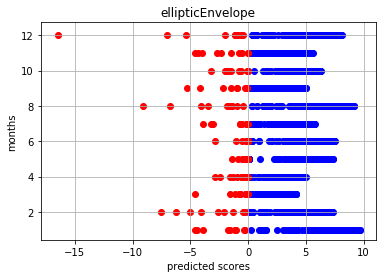


    kernelDensity


<div>
<style scoped>
    .dataframe tbody tr th:only-of-type {
        vertical-align: middle;
    }

    .dataframe tbody tr th {
        vertical-align: top;
    }

    .dataframe thead th {
        text-align: right;
    }
</style>
<table border="1" class="dataframe">
  <thead>
    <tr style="text-align: right;">
      <th></th>
      <th>MONTH</th>
      <th>DATASIZE</th>
      <th>NORMALS</th>
      <th>ANOMALIES</th>
      <th>ANOMALY_RATE</th>
    </tr>
  </thead>
  <tbody>
    <tr>
      <th>0</th>
      <td>Jan</td>
      <td>961</td>
      <td>943</td>
      <td>18</td>
      <td>1.87</td>
    </tr>
    <tr>
      <th>1</th>
      <td>Feb</td>
      <td>876</td>
      <td>864</td>
      <td>12</td>
      <td>1.37</td>
    </tr>
    <tr>
      <th>2</th>
      <td>Mar</td>
      <td>961</td>
      <td>961</td>
      <td>0</td>
      <td>0.0</td>
    </tr>
    <tr>
      <th>3</th>
      <td>Apr</td>
      <td>930</td>
      <td>930</td>
      <td>0</td>
      <td>0.0</td>
    </tr>
    <tr>
      <th>4</th>
      <td>May</td>
      <td>961</td>
      <td>960</td>
      <td>1</td>
      <td>0.1</td>
    </tr>
    <tr>
      <th>5</th>
      <td>Jun</td>
      <td>930</td>
      <td>925</td>
      <td>5</td>
      <td>0.54</td>
    </tr>
    <tr>
      <th>6</th>
      <td>Jul</td>
      <td>961</td>
      <td>952</td>
      <td>9</td>
      <td>0.94</td>
    </tr>
    <tr>
      <th>7</th>
      <td>Aug</td>
      <td>961</td>
      <td>942</td>
      <td>19</td>
      <td>1.98</td>
    </tr>
    <tr>
      <th>8</th>
      <td>Sep</td>
      <td>930</td>
      <td>920</td>
      <td>10</td>
      <td>1.08</td>
    </tr>
    <tr>
      <th>9</th>
      <td>Oct</td>
      <td>961</td>
      <td>950</td>
      <td>11</td>
      <td>1.14</td>
    </tr>
    <tr>
      <th>10</th>
      <td>Nov</td>
      <td>930</td>
      <td>926</td>
      <td>4</td>
      <td>0.43</td>
    </tr>
    <tr>
      <th>11</th>
      <td>Dec</td>
      <td>961</td>
      <td>941</td>
      <td>20</td>
      <td>2.08</td>
    </tr>
  </tbody>
</table>
</div>


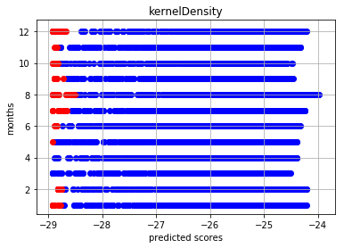


    gaussianMixture


<div>
<style scoped>
    .dataframe tbody tr th:only-of-type {
        vertical-align: middle;
    }

    .dataframe tbody tr th {
        vertical-align: top;
    }

    .dataframe thead th {
        text-align: right;
    }
</style>
<table border="1" class="dataframe">
  <thead>
    <tr style="text-align: right;">
      <th></th>
      <th>MONTH</th>
      <th>DATASIZE</th>
      <th>NORMALS</th>
      <th>ANOMALIES</th>
      <th>ANOMALY_RATE</th>
    </tr>
  </thead>
  <tbody>
    <tr>
      <th>0</th>
      <td>Jan</td>
      <td>961</td>
      <td>944</td>
      <td>17</td>
      <td>1.77</td>
    </tr>
    <tr>
      <th>1</th>
      <td>Feb</td>
      <td>876</td>
      <td>837</td>
      <td>39</td>
      <td>4.45</td>
    </tr>
    <tr>
      <th>2</th>
      <td>Mar</td>
      <td>961</td>
      <td>954</td>
      <td>7</td>
      <td>0.73</td>
    </tr>
    <tr>
      <th>3</th>
      <td>Apr</td>
      <td>930</td>
      <td>921</td>
      <td>9</td>
      <td>0.97</td>
    </tr>
    <tr>
      <th>4</th>
      <td>May</td>
      <td>961</td>
      <td>953</td>
      <td>8</td>
      <td>0.83</td>
    </tr>
    <tr>
      <th>5</th>
      <td>Jun</td>
      <td>930</td>
      <td>925</td>
      <td>5</td>
      <td>0.54</td>
    </tr>
    <tr>
      <th>6</th>
      <td>Jul</td>
      <td>961</td>
      <td>957</td>
      <td>4</td>
      <td>0.42</td>
    </tr>
    <tr>
      <th>7</th>
      <td>Aug</td>
      <td>961</td>
      <td>939</td>
      <td>22</td>
      <td>2.29</td>
    </tr>
    <tr>
      <th>8</th>
      <td>Sep</td>
      <td>930</td>
      <td>916</td>
      <td>14</td>
      <td>1.51</td>
    </tr>
    <tr>
      <th>9</th>
      <td>Oct</td>
      <td>961</td>
      <td>917</td>
      <td>44</td>
      <td>4.58</td>
    </tr>
    <tr>
      <th>10</th>
      <td>Nov</td>
      <td>930</td>
      <td>927</td>
      <td>3</td>
      <td>0.32</td>
    </tr>
    <tr>
      <th>11</th>
      <td>Dec</td>
      <td>961</td>
      <td>947</td>
      <td>14</td>
      <td>1.46</td>
    </tr>
  </tbody>
</table>
</div>


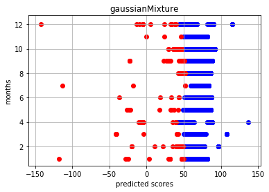


    localOutlierFactor


<div>
<style scoped>
    .dataframe tbody tr th:only-of-type {
        vertical-align: middle;
    }

    .dataframe tbody tr th {
        vertical-align: top;
    }

    .dataframe thead th {
        text-align: right;
    }
</style>
<table border="1" class="dataframe">
  <thead>
    <tr style="text-align: right;">
      <th></th>
      <th>MONTH</th>
      <th>DATASIZE</th>
      <th>NORMALS</th>
      <th>ANOMALIES</th>
      <th>ANOMALY_RATE</th>
    </tr>
  </thead>
  <tbody>
    <tr>
      <th>0</th>
      <td>Jan</td>
      <td>961</td>
      <td>953</td>
      <td>8</td>
      <td>0.83</td>
    </tr>
    <tr>
      <th>1</th>
      <td>Feb</td>
      <td>876</td>
      <td>869</td>
      <td>7</td>
      <td>0.8</td>
    </tr>
    <tr>
      <th>2</th>
      <td>Mar</td>
      <td>961</td>
      <td>952</td>
      <td>9</td>
      <td>0.94</td>
    </tr>
    <tr>
      <th>3</th>
      <td>Apr</td>
      <td>930</td>
      <td>922</td>
      <td>8</td>
      <td>0.86</td>
    </tr>
    <tr>
      <th>4</th>
      <td>May</td>
      <td>961</td>
      <td>955</td>
      <td>6</td>
      <td>0.62</td>
    </tr>
    <tr>
      <th>5</th>
      <td>Jun</td>
      <td>930</td>
      <td>922</td>
      <td>8</td>
      <td>0.86</td>
    </tr>
    <tr>
      <th>6</th>
      <td>Jul</td>
      <td>961</td>
      <td>952</td>
      <td>9</td>
      <td>0.94</td>
    </tr>
    <tr>
      <th>7</th>
      <td>Aug</td>
      <td>961</td>
      <td>953</td>
      <td>8</td>
      <td>0.83</td>
    </tr>
    <tr>
      <th>8</th>
      <td>Sep</td>
      <td>930</td>
      <td>921</td>
      <td>9</td>
      <td>0.97</td>
    </tr>
    <tr>
      <th>9</th>
      <td>Oct</td>
      <td>961</td>
      <td>954</td>
      <td>7</td>
      <td>0.73</td>
    </tr>
    <tr>
      <th>10</th>
      <td>Nov</td>
      <td>930</td>
      <td>921</td>
      <td>9</td>
      <td>0.97</td>
    </tr>
    <tr>
      <th>11</th>
      <td>Dec</td>
      <td>961</td>
      <td>951</td>
      <td>10</td>
      <td>1.04</td>
    </tr>
  </tbody>
</table>
</div>


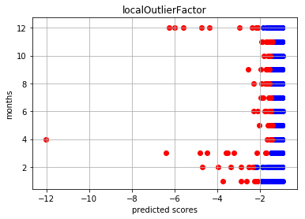


    isolationForest


<div>
<style scoped>
    .dataframe tbody tr th:only-of-type {
        vertical-align: middle;
    }

    .dataframe tbody tr th {
        vertical-align: top;
    }

    .dataframe thead th {
        text-align: right;
    }
</style>
<table border="1" class="dataframe">
  <thead>
    <tr style="text-align: right;">
      <th></th>
      <th>MONTH</th>
      <th>DATASIZE</th>
      <th>NORMALS</th>
      <th>ANOMALIES</th>
      <th>ANOMALY_RATE</th>
    </tr>
  </thead>
  <tbody>
    <tr>
      <th>0</th>
      <td>Jan</td>
      <td>961</td>
      <td>951</td>
      <td>10</td>
      <td>1.04</td>
    </tr>
    <tr>
      <th>1</th>
      <td>Feb</td>
      <td>876</td>
      <td>867</td>
      <td>9</td>
      <td>1.03</td>
    </tr>
    <tr>
      <th>2</th>
      <td>Mar</td>
      <td>961</td>
      <td>951</td>
      <td>10</td>
      <td>1.04</td>
    </tr>
    <tr>
      <th>3</th>
      <td>Apr</td>
      <td>930</td>
      <td>920</td>
      <td>10</td>
      <td>1.08</td>
    </tr>
    <tr>
      <th>4</th>
      <td>May</td>
      <td>961</td>
      <td>951</td>
      <td>10</td>
      <td>1.04</td>
    </tr>
    <tr>
      <th>5</th>
      <td>Jun</td>
      <td>930</td>
      <td>920</td>
      <td>10</td>
      <td>1.08</td>
    </tr>
    <tr>
      <th>6</th>
      <td>Jul</td>
      <td>961</td>
      <td>951</td>
      <td>10</td>
      <td>1.04</td>
    </tr>
    <tr>
      <th>7</th>
      <td>Aug</td>
      <td>961</td>
      <td>951</td>
      <td>10</td>
      <td>1.04</td>
    </tr>
    <tr>
      <th>8</th>
      <td>Sep</td>
      <td>930</td>
      <td>920</td>
      <td>10</td>
      <td>1.08</td>
    </tr>
    <tr>
      <th>9</th>
      <td>Oct</td>
      <td>961</td>
      <td>951</td>
      <td>10</td>
      <td>1.04</td>
    </tr>
    <tr>
      <th>10</th>
      <td>Nov</td>
      <td>930</td>
      <td>920</td>
      <td>10</td>
      <td>1.08</td>
    </tr>
    <tr>
      <th>11</th>
      <td>Dec</td>
      <td>961</td>
      <td>951</td>
      <td>10</td>
      <td>1.04</td>
    </tr>
  </tbody>
</table>
</div>


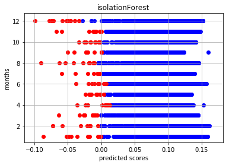


    oneClassSVM


<div>
<style scoped>
    .dataframe tbody tr th:only-of-type {
        vertical-align: middle;
    }

    .dataframe tbody tr th {
        vertical-align: top;
    }

    .dataframe thead th {
        text-align: right;
    }
</style>
<table border="1" class="dataframe">
  <thead>
    <tr style="text-align: right;">
      <th></th>
      <th>MONTH</th>
      <th>DATASIZE</th>
      <th>NORMALS</th>
      <th>ANOMALIES</th>
      <th>ANOMALY_RATE</th>
    </tr>
  </thead>
  <tbody>
    <tr>
      <th>0</th>
      <td>Jan</td>
      <td>961</td>
      <td>947</td>
      <td>14</td>
      <td>1.46</td>
    </tr>
    <tr>
      <th>1</th>
      <td>Feb</td>
      <td>876</td>
      <td>867</td>
      <td>9</td>
      <td>1.03</td>
    </tr>
    <tr>
      <th>2</th>
      <td>Mar</td>
      <td>961</td>
      <td>951</td>
      <td>10</td>
      <td>1.04</td>
    </tr>
    <tr>
      <th>3</th>
      <td>Apr</td>
      <td>930</td>
      <td>919</td>
      <td>11</td>
      <td>1.18</td>
    </tr>
    <tr>
      <th>4</th>
      <td>May</td>
      <td>961</td>
      <td>947</td>
      <td>14</td>
      <td>1.46</td>
    </tr>
    <tr>
      <th>5</th>
      <td>Jun</td>
      <td>930</td>
      <td>919</td>
      <td>11</td>
      <td>1.18</td>
    </tr>
    <tr>
      <th>6</th>
      <td>Jul</td>
      <td>961</td>
      <td>952</td>
      <td>9</td>
      <td>0.94</td>
    </tr>
    <tr>
      <th>7</th>
      <td>Aug</td>
      <td>961</td>
      <td>950</td>
      <td>11</td>
      <td>1.14</td>
    </tr>
    <tr>
      <th>8</th>
      <td>Sep</td>
      <td>930</td>
      <td>920</td>
      <td>10</td>
      <td>1.08</td>
    </tr>
    <tr>
      <th>9</th>
      <td>Oct</td>
      <td>961</td>
      <td>947</td>
      <td>14</td>
      <td>1.46</td>
    </tr>
    <tr>
      <th>10</th>
      <td>Nov</td>
      <td>930</td>
      <td>919</td>
      <td>11</td>
      <td>1.18</td>
    </tr>
    <tr>
      <th>11</th>
      <td>Dec</td>
      <td>961</td>
      <td>950</td>
      <td>11</td>
      <td>1.14</td>
    </tr>
  </tbody>
</table>
</div>


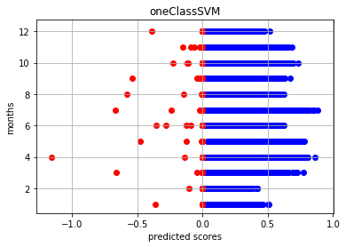


```python
# gathered outlier rows on each month
outliers
```


    {'Apr': {37: 3,
      67: 1,
      87: 2,
      158: 1,
      192: 1,
      222: 1,
      262: 1,
      281: 1,
      354: 2,
      367: 1,
      370: 1,
      383: 1,
      465: 2,
      484: 3,
      497: 1,
      536: 1,
      567: 2,
      581: 1,
      608: 1,
      621: 1,
      637: 1,
      647: 4,
      673: 1,
      684: 1,
      685: 1,
      717: 1,
      752: 3,
      782: 1,
      785: 3,
      812: 3,
      876: 1},
     'Aug': {41: 3,
      55: 1,
      62: 4,
      67: 2,
      102: 4,
      149: 1,
      154: 1,
      191: 3,
      212: 6,
      263: 1,
      294: 1,
      332: 3,
      368: 1,
      385: 2,
      395: 1,
      409: 1,
      466: 1,
      468: 1,
      484: 1,
      485: 1,
      509: 1,
      510: 6,
      511: 1,
      512: 1,
      541: 3,
      545: 1,
      554: 1,
      557: 2,
      582: 3,
      583: 1,
      624: 1,
      654: 1,
      655: 2,
      673: 1,
      691: 2,
      712: 3,
      816: 1,
      828: 1,
      850: 1,
      893: 1,
      896: 1,
      915: 1,
      920: 3,
      947: 1,
      952: 1},
     'Dec': {5: 3,
      12: 3,
      29: 2,
      46: 1,
      64: 1,
      80: 2,
      93: 5,
      103: 2,
      104: 2,
      150: 4,
      151: 1,
      162: 3,
      273: 1,
      283: 1,
      392: 1,
      473: 3,
      496: 1,
      531: 5,
      557: 4,
      562: 1,
      614: 5,
      615: 3,
      692: 1,
      715: 5,
      734: 1,
      746: 3,
      752: 1,
      804: 2,
      815: 1,
      878: 5,
      912: 1,
      940: 1},
     'Feb': {1: 1,
      2: 1,
      17: 1,
      39: 1,
      73: 1,
      85: 3,
      86: 1,
      127: 3,
      141: 4,
      166: 1,
      201: 1,
      209: 4,
      218: 2,
      230: 1,
      270: 2,
      271: 2,
      324: 1,
      325: 1,
      330: 2,
      477: 1,
      509: 1,
      510: 1,
      532: 1,
      533: 1,
      537: 2,
      543: 1,
      565: 1,
      580: 1,
      582: 1,
      595: 1,
      601: 1,
      604: 1,
      635: 1,
      636: 1,
      650: 2,
      651: 1,
      655: 1,
      658: 1,
      662: 1,
      673: 1,
      675: 2,
      676: 1,
      695: 3,
      707: 1,
      712: 1,
      734: 1,
      765: 1,
      770: 3,
      776: 3,
      777: 3,
      797: 1,
      800: 1,
      813: 1,
      832: 2,
      838: 3,
      850: 1,
      852: 1},
     'Jan': {5: 1,
      12: 2,
      54: 1,
      81: 3,
      84: 1,
      108: 2,
      143: 1,
      245: 2,
      293: 2,
      331: 1,
      348: 3,
      349: 1,
      355: 6,
      364: 1,
      409: 1,
      417: 1,
      421: 1,
      460: 3,
      461: 1,
      472: 1,
      485: 3,
      491: 2,
      522: 3,
      524: 1,
      525: 1,
      539: 1,
      548: 1,
      573: 1,
      602: 4,
      609: 3,
      711: 3,
      712: 2,
      797: 3,
      819: 4,
      871: 1,
      901: 1,
      916: 4,
      917: 1,
      924: 1,
      944: 1,
      949: 1},
     'Jul': {31: 1,
      63: 1,
      64: 2,
      155: 3,
      188: 1,
      189: 1,
      190: 1,
      210: 1,
      287: 5,
      288: 3,
      384: 4,
      385: 1,
      406: 3,
      409: 1,
      410: 5,
      445: 1,
      457: 1,
      474: 2,
      480: 1,
      547: 1,
      583: 3,
      603: 2,
      634: 2,
      669: 1,
      736: 1,
      738: 1,
      873: 1,
      881: 1},
     'Jun': {59: 2,
      68: 2,
      69: 2,
      70: 2,
      111: 1,
      123: 1,
      172: 1,
      173: 1,
      200: 1,
      228: 1,
      237: 1,
      252: 1,
      319: 3,
      335: 1,
      336: 1,
      357: 2,
      430: 1,
      433: 1,
      468: 1,
      531: 1,
      543: 1,
      567: 1,
      690: 1,
      721: 1,
      743: 1,
      768: 5,
      769: 3,
      810: 1,
      815: 5,
      866: 1,
      882: 2},
     'Mar': {6: 4,
      7: 2,
      52: 3,
      56: 1,
      105: 1,
      231: 1,
      239: 1,
      247: 2,
      248: 3,
      339: 1,
      341: 4,
      346: 1,
      360: 1,
      438: 2,
      496: 3,
      537: 1,
      556: 3,
      561: 4,
      624: 1,
      815: 1,
      818: 1,
      823: 1,
      881: 2,
      905: 1,
      937: 1},
     'May': {3: 1,
      53: 2,
      68: 2,
      91: 1,
      126: 2,
      127: 1,
      186: 2,
      187: 1,
      205: 1,
      259: 1,
      262: 1,
      283: 1,
      286: 1,
      317: 3,
      333: 3,
      343: 1,
      411: 1,
      530: 2,
      547: 1,
      556: 1,
      557: 2,
      608: 1,
      670: 3,
      679: 1,
      735: 1,
      754: 1,
      776: 1,
      777: 4,
      780: 1,
      807: 1,
      858: 1,
      867: 1,
      879: 2},
     'Nov': {60: 1,
      119: 5,
      147: 2,
      156: 1,
      169: 2,
      192: 4,
      247: 1,
      282: 1,
      325: 1,
      360: 5,
      409: 1,
      410: 1,
      481: 1,
      504: 1,
      510: 1,
      660: 1,
      670: 5,
      722: 1,
      738: 4,
      766: 1,
      777: 1,
      893: 3,
      894: 3},
     'Oct': {60: 1,
      134: 1,
      159: 1,
      163: 2,
      237: 1,
      251: 1,
      358: 1,
      398: 1,
      399: 1,
      443: 4,
      461: 1,
      465: 3,
      529: 1,
      531: 1,
      535: 6,
      546: 4,
      594: 4,
      595: 1,
      598: 1,
      608: 2,
      612: 3,
      626: 1,
      646: 1,
      664: 1,
      674: 1,
      684: 1,
      689: 4,
      699: 1,
      750: 1,
      775: 3,
      797: 1,
      802: 1,
      814: 2,
      816: 1,
      817: 2,
      821: 6,
      836: 1,
      840: 1,
      841: 4,
      842: 4,
      849: 1,
      868: 1,
      887: 1,
      903: 1,
      904: 2,
      907: 1,
      914: 1,
      936: 1,
      948: 1,
      951: 3,
      952: 2,
      955: 1,
      956: 1,
      958: 1},
     'Sep': {44: 1,
      79: 2,
      119: 3,
      138: 5,
      256: 6,
      271: 1,
      291: 6,
      345: 4,
      391: 2,
      430: 5,
      442: 1,
      455: 1,
      482: 2,
      500: 2,
      501: 1,
      517: 2,
      605: 1,
      606: 1,
      693: 1,
      697: 2,
      717: 1,
      740: 5,
      761: 1,
      848: 4,
      856: 1,
      916: 1,
      929: 1}}


```python
# all the days detected as outlier
for i in range(1,13,1):
    print(months[i-1])
    display(orig_monthly_weathers[i].iloc[list(outliers[months[i-1]].keys()),:])
```

    Jan


<div>
<style scoped>
    .dataframe tbody tr th:only-of-type {
        vertical-align: middle;
    }

    .dataframe tbody tr th {
        vertical-align: top;
    }

    .dataframe thead th {
        text-align: right;
    }
</style>
<table border="1" class="dataframe">
  <thead>
    <tr style="text-align: right;">
      <th></th>
      <th>yyyy/mm/dd</th>
      <th>year</th>
      <th>month</th>
      <th>day</th>
      <th>ave_temp</th>
      <th>high_temp</th>
      <th>low_temp</th>
      <th>precip</th>
      <th>daylight</th>
      <th>snowfall</th>
      <th>ave_wind_speed</th>
      <th>high_wind_speed</th>
      <th>high_wind_direc</th>
    </tr>
  </thead>
  <tbody>
    <tr>
      <th>525</th>
      <td>2003/1/30</td>
      <td>2003</td>
      <td>1</td>
      <td>30</td>
      <td>3.9</td>
      <td>8.6</td>
      <td>-0.1</td>
      <td>0.0</td>
      <td>9.7</td>
      <td>0</td>
      <td>3.4</td>
      <td>6.2</td>
      <td>WSW</td>
    </tr>
    <tr>
      <th>5</th>
      <td>1987/1/6</td>
      <td>1987</td>
      <td>1</td>
      <td>6</td>
      <td>3.5</td>
      <td>6.7</td>
      <td>0.4</td>
      <td>3.0</td>
      <td>5.7</td>
      <td>5</td>
      <td>3.3</td>
      <td>7.5</td>
      <td>NNW</td>
    </tr>
    <tr>
      <th>711</th>
      <td>2009/1/30</td>
      <td>2009</td>
      <td>1</td>
      <td>30</td>
      <td>9.6</td>
      <td>11.5</td>
      <td>8.3</td>
      <td>31.0</td>
      <td>0.0</td>
      <td>0</td>
      <td>2.4</td>
      <td>4.9</td>
      <td>ENE</td>
    </tr>
    <tr>
      <th>712</th>
      <td>2009/1/31</td>
      <td>2009</td>
      <td>1</td>
      <td>31</td>
      <td>7.8</td>
      <td>8.9</td>
      <td>5.7</td>
      <td>68.0</td>
      <td>0.2</td>
      <td>0</td>
      <td>4.2</td>
      <td>7.4</td>
      <td>NNW</td>
    </tr>
    <tr>
      <th>460</th>
      <td>2001/1/27</td>
      <td>2001</td>
      <td>1</td>
      <td>27</td>
      <td>1.8</td>
      <td>4.5</td>
      <td>0.5</td>
      <td>33.0</td>
      <td>0.0</td>
      <td>9</td>
      <td>6.3</td>
      <td>10.8</td>
      <td>NNW</td>
    </tr>
    <tr>
      <th>522</th>
      <td>2003/1/27</td>
      <td>2003</td>
      <td>1</td>
      <td>27</td>
      <td>3.8</td>
      <td>5.6</td>
      <td>2.4</td>
      <td>46.5</td>
      <td>0.0</td>
      <td>0</td>
      <td>2.9</td>
      <td>4.5</td>
      <td>NNW</td>
    </tr>
    <tr>
      <th>331</th>
      <td>1997/1/22</td>
      <td>1997</td>
      <td>1</td>
      <td>22</td>
      <td>1.7</td>
      <td>4.9</td>
      <td>-2.1</td>
      <td>0.0</td>
      <td>9.1</td>
      <td>0</td>
      <td>7.2</td>
      <td>11.9</td>
      <td>NNW</td>
    </tr>
    <tr>
      <th>12</th>
      <td>1987/1/13</td>
      <td>1987</td>
      <td>1</td>
      <td>13</td>
      <td>5.0</td>
      <td>9.7</td>
      <td>0.5</td>
      <td>0.0</td>
      <td>6.8</td>
      <td>4</td>
      <td>3.3</td>
      <td>8.9</td>
      <td>NW</td>
    </tr>
    <tr>
      <th>461</th>
      <td>2001/1/28</td>
      <td>2001</td>
      <td>1</td>
      <td>28</td>
      <td>5.6</td>
      <td>10.1</td>
      <td>0.4</td>
      <td>0.0</td>
      <td>7.8</td>
      <td>0</td>
      <td>2.4</td>
      <td>4.7</td>
      <td>WSW</td>
    </tr>
    <tr>
      <th>143</th>
      <td>1991/1/20</td>
      <td>1991</td>
      <td>1</td>
      <td>20</td>
      <td>7.6</td>
      <td>12.3</td>
      <td>3.6</td>
      <td>0.0</td>
      <td>9.1</td>
      <td>0</td>
      <td>2.3</td>
      <td>4.1</td>
      <td>WSW</td>
    </tr>
    <tr>
      <th>81</th>
      <td>1989/1/20</td>
      <td>1989</td>
      <td>1</td>
      <td>20</td>
      <td>14.6</td>
      <td>19.2</td>
      <td>10.1</td>
      <td>38.0</td>
      <td>0.1</td>
      <td>0</td>
      <td>4.4</td>
      <td>9.7</td>
      <td>SW</td>
    </tr>
    <tr>
      <th>916</th>
      <td>2016/1/18</td>
      <td>2016</td>
      <td>1</td>
      <td>18</td>
      <td>2.8</td>
      <td>6.2</td>
      <td>0.2</td>
      <td>67.0</td>
      <td>1.4</td>
      <td>6</td>
      <td>3.7</td>
      <td>7.7</td>
      <td>NW</td>
    </tr>
    <tr>
      <th>917</th>
      <td>2016/1/19</td>
      <td>2016</td>
      <td>1</td>
      <td>19</td>
      <td>5.1</td>
      <td>8.6</td>
      <td>0.9</td>
      <td>0.0</td>
      <td>9.1</td>
      <td>0</td>
      <td>4.0</td>
      <td>7.9</td>
      <td>WSW</td>
    </tr>
    <tr>
      <th>472</th>
      <td>2002/1/8</td>
      <td>2002</td>
      <td>1</td>
      <td>8</td>
      <td>7.4</td>
      <td>14.3</td>
      <td>2.6</td>
      <td>2.5</td>
      <td>8.5</td>
      <td>0</td>
      <td>3.7</td>
      <td>8.7</td>
      <td>WSW</td>
    </tr>
    <tr>
      <th>409</th>
      <td>2000/1/7</td>
      <td>2000</td>
      <td>1</td>
      <td>7</td>
      <td>12.4</td>
      <td>16.9</td>
      <td>8.8</td>
      <td>0.5</td>
      <td>1.6</td>
      <td>0</td>
      <td>2.2</td>
      <td>4.3</td>
      <td>NNE</td>
    </tr>
    <tr>
      <th>602</th>
      <td>2006/1/14</td>
      <td>2006</td>
      <td>1</td>
      <td>14</td>
      <td>6.6</td>
      <td>10.7</td>
      <td>4.1</td>
      <td>48.5</td>
      <td>0.0</td>
      <td>0</td>
      <td>3.5</td>
      <td>13.5</td>
      <td>N</td>
    </tr>
    <tr>
      <th>539</th>
      <td>2004/1/13</td>
      <td>2004</td>
      <td>1</td>
      <td>13</td>
      <td>6.4</td>
      <td>12.3</td>
      <td>2.9</td>
      <td>0.5</td>
      <td>4.4</td>
      <td>0</td>
      <td>3.3</td>
      <td>8.6</td>
      <td>W</td>
    </tr>
    <tr>
      <th>348</th>
      <td>1998/1/8</td>
      <td>1998</td>
      <td>1</td>
      <td>8</td>
      <td>2.4</td>
      <td>5.0</td>
      <td>0.4</td>
      <td>34.0</td>
      <td>0.0</td>
      <td>10</td>
      <td>3.4</td>
      <td>8.8</td>
      <td>N</td>
    </tr>
    <tr>
      <th>797</th>
      <td>2012/1/23</td>
      <td>2012</td>
      <td>1</td>
      <td>23</td>
      <td>5.0</td>
      <td>8.2</td>
      <td>0.6</td>
      <td>22.5</td>
      <td>0.0</td>
      <td>4</td>
      <td>1.9</td>
      <td>4.9</td>
      <td>ENE</td>
    </tr>
    <tr>
      <th>364</th>
      <td>1998/1/24</td>
      <td>1998</td>
      <td>1</td>
      <td>24</td>
      <td>4.7</td>
      <td>10.1</td>
      <td>0.1</td>
      <td>0.0</td>
      <td>8.4</td>
      <td>0</td>
      <td>4.4</td>
      <td>9.9</td>
      <td>WSW</td>
    </tr>
    <tr>
      <th>293</th>
      <td>1996/1/15</td>
      <td>1996</td>
      <td>1</td>
      <td>15</td>
      <td>16.1</td>
      <td>19.9</td>
      <td>13.2</td>
      <td>0.0</td>
      <td>7.6</td>
      <td>0</td>
      <td>4.6</td>
      <td>7.3</td>
      <td>SW</td>
    </tr>
    <tr>
      <th>609</th>
      <td>2006/1/21</td>
      <td>2006</td>
      <td>1</td>
      <td>21</td>
      <td>1.3</td>
      <td>4.5</td>
      <td>0.0</td>
      <td>15.0</td>
      <td>0.0</td>
      <td>10</td>
      <td>3.9</td>
      <td>6.7</td>
      <td>NNW</td>
    </tr>
    <tr>
      <th>355</th>
      <td>1998/1/15</td>
      <td>1998</td>
      <td>1</td>
      <td>15</td>
      <td>1.2</td>
      <td>5.9</td>
      <td>0.0</td>
      <td>50.5</td>
      <td>0.0</td>
      <td>18</td>
      <td>5.6</td>
      <td>10.3</td>
      <td>N</td>
    </tr>
    <tr>
      <th>548</th>
      <td>2004/1/22</td>
      <td>2004</td>
      <td>1</td>
      <td>22</td>
      <td>4.8</td>
      <td>9.2</td>
      <td>1.0</td>
      <td>0.0</td>
      <td>7.0</td>
      <td>0</td>
      <td>4.0</td>
      <td>9.4</td>
      <td>W</td>
    </tr>
    <tr>
      <th>485</th>
      <td>2002/1/21</td>
      <td>2002</td>
      <td>1</td>
      <td>21</td>
      <td>9.5</td>
      <td>14.7</td>
      <td>4.9</td>
      <td>42.0</td>
      <td>0.0</td>
      <td>0</td>
      <td>3.1</td>
      <td>8.5</td>
      <td>SSW</td>
    </tr>
    <tr>
      <th>871</th>
      <td>2015/1/4</td>
      <td>2015</td>
      <td>1</td>
      <td>4</td>
      <td>4.0</td>
      <td>9.3</td>
      <td>-0.4</td>
      <td>0.0</td>
      <td>6.0</td>
      <td>0</td>
      <td>1.3</td>
      <td>2.8</td>
      <td>WNW</td>
    </tr>
    <tr>
      <th>421</th>
      <td>2000/1/19</td>
      <td>2000</td>
      <td>1</td>
      <td>19</td>
      <td>5.5</td>
      <td>7.1</td>
      <td>3.5</td>
      <td>5.0</td>
      <td>0.0</td>
      <td>0</td>
      <td>2.5</td>
      <td>4.4</td>
      <td>E</td>
    </tr>
    <tr>
      <th>924</th>
      <td>2016/1/26</td>
      <td>2016</td>
      <td>1</td>
      <td>26</td>
      <td>3.8</td>
      <td>9.6</td>
      <td>-1.3</td>
      <td>0.0</td>
      <td>8.6</td>
      <td>0</td>
      <td>2.0</td>
      <td>3.6</td>
      <td>SSE</td>
    </tr>
    <tr>
      <th>491</th>
      <td>2002/1/27</td>
      <td>2002</td>
      <td>1</td>
      <td>27</td>
      <td>7.3</td>
      <td>12.1</td>
      <td>2.3</td>
      <td>42.0</td>
      <td>1.7</td>
      <td>0</td>
      <td>5.7</td>
      <td>10.6</td>
      <td>NW</td>
    </tr>
    <tr>
      <th>108</th>
      <td>1990/1/16</td>
      <td>1990</td>
      <td>1</td>
      <td>16</td>
      <td>1.3</td>
      <td>5.4</td>
      <td>0.8</td>
      <td>19.5</td>
      <td>0.0</td>
      <td>4</td>
      <td>4.5</td>
      <td>6.6</td>
      <td>N</td>
    </tr>
    <tr>
      <th>349</th>
      <td>1998/1/9</td>
      <td>1998</td>
      <td>1</td>
      <td>9</td>
      <td>3.3</td>
      <td>6.8</td>
      <td>0.4</td>
      <td>2.0</td>
      <td>8.3</td>
      <td>4</td>
      <td>3.8</td>
      <td>7.8</td>
      <td>N</td>
    </tr>
    <tr>
      <th>944</th>
      <td>2017/1/15</td>
      <td>2017</td>
      <td>1</td>
      <td>15</td>
      <td>0.7</td>
      <td>4.7</td>
      <td>-2.3</td>
      <td>0.0</td>
      <td>8.1</td>
      <td>0</td>
      <td>3.1</td>
      <td>6.2</td>
      <td>NW</td>
    </tr>
    <tr>
      <th>417</th>
      <td>2000/1/15</td>
      <td>2000</td>
      <td>1</td>
      <td>15</td>
      <td>9.1</td>
      <td>11.2</td>
      <td>7.3</td>
      <td>1.5</td>
      <td>5.4</td>
      <td>0</td>
      <td>3.3</td>
      <td>4.9</td>
      <td>ENE</td>
    </tr>
    <tr>
      <th>819</th>
      <td>2013/1/14</td>
      <td>2013</td>
      <td>1</td>
      <td>14</td>
      <td>3.5</td>
      <td>10.0</td>
      <td>0.7</td>
      <td>64.0</td>
      <td>0.0</td>
      <td>8</td>
      <td>4.1</td>
      <td>9.0</td>
      <td>NNW</td>
    </tr>
    <tr>
      <th>245</th>
      <td>1994/1/29</td>
      <td>1994</td>
      <td>1</td>
      <td>29</td>
      <td>2.5</td>
      <td>5.7</td>
      <td>0.2</td>
      <td>4.0</td>
      <td>4.6</td>
      <td>7</td>
      <td>4.4</td>
      <td>8.2</td>
      <td>NW</td>
    </tr>
    <tr>
      <th>54</th>
      <td>1988/1/24</td>
      <td>1988</td>
      <td>1</td>
      <td>24</td>
      <td>5.7</td>
      <td>9.0</td>
      <td>2.5</td>
      <td>0.0</td>
      <td>9.1</td>
      <td>0</td>
      <td>4.3</td>
      <td>7.9</td>
      <td>WSW</td>
    </tr>
    <tr>
      <th>901</th>
      <td>2016/1/3</td>
      <td>2016</td>
      <td>1</td>
      <td>3</td>
      <td>9.3</td>
      <td>16.2</td>
      <td>3.0</td>
      <td>0.0</td>
      <td>8.3</td>
      <td>0</td>
      <td>1.4</td>
      <td>3.4</td>
      <td>WNW</td>
    </tr>
    <tr>
      <th>84</th>
      <td>1989/1/23</td>
      <td>1989</td>
      <td>1</td>
      <td>23</td>
      <td>4.3</td>
      <td>7.5</td>
      <td>2.7</td>
      <td>42.5</td>
      <td>0.0</td>
      <td>0</td>
      <td>5.7</td>
      <td>9.8</td>
      <td>NNW</td>
    </tr>
    <tr>
      <th>573</th>
      <td>2005/1/16</td>
      <td>2005</td>
      <td>1</td>
      <td>16</td>
      <td>5.3</td>
      <td>8.0</td>
      <td>2.9</td>
      <td>47.0</td>
      <td>0.0</td>
      <td>0</td>
      <td>5.7</td>
      <td>9.5</td>
      <td>NNW</td>
    </tr>
    <tr>
      <th>524</th>
      <td>2003/1/29</td>
      <td>2003</td>
      <td>1</td>
      <td>29</td>
      <td>4.2</td>
      <td>8.8</td>
      <td>0.6</td>
      <td>0.0</td>
      <td>6.9</td>
      <td>0</td>
      <td>5.6</td>
      <td>8.7</td>
      <td>W</td>
    </tr>
    <tr>
      <th>949</th>
      <td>2017/1/20</td>
      <td>2017</td>
      <td>1</td>
      <td>20</td>
      <td>3.0</td>
      <td>3.8</td>
      <td>2.2</td>
      <td>0.0</td>
      <td>0.0</td>
      <td>0</td>
      <td>2.6</td>
      <td>4.6</td>
      <td>NW</td>
    </tr>
  </tbody>
</table>
</div>


    Feb


<div>
<style scoped>
    .dataframe tbody tr th:only-of-type {
        vertical-align: middle;
    }

    .dataframe tbody tr th {
        vertical-align: top;
    }

    .dataframe thead th {
        text-align: right;
    }
</style>
<table border="1" class="dataframe">
  <thead>
    <tr style="text-align: right;">
      <th></th>
      <th>yyyy/mm/dd</th>
      <th>year</th>
      <th>month</th>
      <th>day</th>
      <th>ave_temp</th>
      <th>high_temp</th>
      <th>low_temp</th>
      <th>precip</th>
      <th>daylight</th>
      <th>snowfall</th>
      <th>ave_wind_speed</th>
      <th>high_wind_speed</th>
      <th>high_wind_direc</th>
    </tr>
  </thead>
  <tbody>
    <tr>
      <th>1</th>
      <td>1987/2/2</td>
      <td>1987</td>
      <td>2</td>
      <td>2</td>
      <td>0.9</td>
      <td>3.4</td>
      <td>-0.7</td>
      <td>8.5</td>
      <td>0.0</td>
      <td>3</td>
      <td>4.4</td>
      <td>6.9</td>
      <td>NNW</td>
    </tr>
    <tr>
      <th>770</th>
      <td>2014/2/8</td>
      <td>2014</td>
      <td>2</td>
      <td>8</td>
      <td>0.3</td>
      <td>4.0</td>
      <td>-0.9</td>
      <td>29.5</td>
      <td>0.0</td>
      <td>22</td>
      <td>4.9</td>
      <td>9.0</td>
      <td>NNW</td>
    </tr>
    <tr>
      <th>662</th>
      <td>2010/2/13</td>
      <td>2010</td>
      <td>2</td>
      <td>13</td>
      <td>2.2</td>
      <td>4.0</td>
      <td>1.1</td>
      <td>0.5</td>
      <td>0.0</td>
      <td>0</td>
      <td>2.5</td>
      <td>4.4</td>
      <td>NNE</td>
    </tr>
    <tr>
      <th>776</th>
      <td>2014/2/14</td>
      <td>2014</td>
      <td>2</td>
      <td>14</td>
      <td>1.4</td>
      <td>5.4</td>
      <td>-0.2</td>
      <td>28.5</td>
      <td>0.0</td>
      <td>18</td>
      <td>3.8</td>
      <td>6.8</td>
      <td>NNW</td>
    </tr>
    <tr>
      <th>777</th>
      <td>2014/2/15</td>
      <td>2014</td>
      <td>2</td>
      <td>15</td>
      <td>3.9</td>
      <td>6.9</td>
      <td>-0.2</td>
      <td>67.5</td>
      <td>0.5</td>
      <td>9</td>
      <td>5.4</td>
      <td>9.8</td>
      <td>NNW</td>
    </tr>
    <tr>
      <th>650</th>
      <td>2010/2/1</td>
      <td>2010</td>
      <td>2</td>
      <td>1</td>
      <td>5.9</td>
      <td>9.4</td>
      <td>0.6</td>
      <td>31.5</td>
      <td>0.8</td>
      <td>1</td>
      <td>2.7</td>
      <td>5.8</td>
      <td>ENE</td>
    </tr>
    <tr>
      <th>651</th>
      <td>2010/2/2</td>
      <td>2010</td>
      <td>2</td>
      <td>2</td>
      <td>4.2</td>
      <td>7.5</td>
      <td>1.0</td>
      <td>1.5</td>
      <td>3.2</td>
      <td>1</td>
      <td>2.3</td>
      <td>4.9</td>
      <td>NW</td>
    </tr>
    <tr>
      <th>2</th>
      <td>1987/2/3</td>
      <td>1987</td>
      <td>2</td>
      <td>3</td>
      <td>3.4</td>
      <td>4.8</td>
      <td>0.7</td>
      <td>3.0</td>
      <td>2.3</td>
      <td>2</td>
      <td>3.1</td>
      <td>9.4</td>
      <td>NW</td>
    </tr>
    <tr>
      <th>270</th>
      <td>1996/2/17</td>
      <td>1996</td>
      <td>2</td>
      <td>17</td>
      <td>0.7</td>
      <td>2.0</td>
      <td>-0.2</td>
      <td>4.5</td>
      <td>0.0</td>
      <td>7</td>
      <td>3.2</td>
      <td>5.2</td>
      <td>NE</td>
    </tr>
    <tr>
      <th>655</th>
      <td>2010/2/6</td>
      <td>2010</td>
      <td>2</td>
      <td>6</td>
      <td>3.2</td>
      <td>7.6</td>
      <td>0.1</td>
      <td>0.0</td>
      <td>7.7</td>
      <td>0</td>
      <td>4.8</td>
      <td>11.8</td>
      <td>WNW</td>
    </tr>
    <tr>
      <th>17</th>
      <td>1987/2/18</td>
      <td>1987</td>
      <td>2</td>
      <td>18</td>
      <td>2.3</td>
      <td>3.4</td>
      <td>1.0</td>
      <td>9.5</td>
      <td>0.0</td>
      <td>2</td>
      <td>4.5</td>
      <td>6.8</td>
      <td>NNW</td>
    </tr>
    <tr>
      <th>658</th>
      <td>2010/2/9</td>
      <td>2010</td>
      <td>2</td>
      <td>9</td>
      <td>11.8</td>
      <td>21.0</td>
      <td>3.7</td>
      <td>0.0</td>
      <td>7.8</td>
      <td>0</td>
      <td>2.1</td>
      <td>6.1</td>
      <td>SSW</td>
    </tr>
    <tr>
      <th>532</th>
      <td>2005/2/24</td>
      <td>2005</td>
      <td>2</td>
      <td>24</td>
      <td>7.1</td>
      <td>10.6</td>
      <td>1.7</td>
      <td>7.0</td>
      <td>2.5</td>
      <td>0</td>
      <td>4.8</td>
      <td>7.8</td>
      <td>ENE</td>
    </tr>
    <tr>
      <th>533</th>
      <td>2005/2/25</td>
      <td>2005</td>
      <td>2</td>
      <td>25</td>
      <td>3.6</td>
      <td>6.3</td>
      <td>0.8</td>
      <td>9.5</td>
      <td>0.0</td>
      <td>1</td>
      <td>3.5</td>
      <td>7.2</td>
      <td>N</td>
    </tr>
    <tr>
      <th>73</th>
      <td>1989/2/17</td>
      <td>1989</td>
      <td>2</td>
      <td>17</td>
      <td>9.2</td>
      <td>16.1</td>
      <td>7.2</td>
      <td>24.5</td>
      <td>0.0</td>
      <td>0</td>
      <td>4.6</td>
      <td>7.2</td>
      <td>ENE</td>
    </tr>
    <tr>
      <th>537</th>
      <td>2006/2/1</td>
      <td>2006</td>
      <td>2</td>
      <td>1</td>
      <td>5.7</td>
      <td>8.1</td>
      <td>4.7</td>
      <td>45.0</td>
      <td>0.0</td>
      <td>0</td>
      <td>4.6</td>
      <td>7.4</td>
      <td>NW</td>
    </tr>
    <tr>
      <th>580</th>
      <td>2007/2/16</td>
      <td>2007</td>
      <td>2</td>
      <td>16</td>
      <td>8.2</td>
      <td>12.7</td>
      <td>4.6</td>
      <td>0.0</td>
      <td>9.8</td>
      <td>0</td>
      <td>4.3</td>
      <td>7.0</td>
      <td>WNW</td>
    </tr>
    <tr>
      <th>797</th>
      <td>2015/2/7</td>
      <td>2015</td>
      <td>2</td>
      <td>7</td>
      <td>5.3</td>
      <td>9.6</td>
      <td>1.2</td>
      <td>1.5</td>
      <td>3.6</td>
      <td>0</td>
      <td>2.4</td>
      <td>5.9</td>
      <td>SE</td>
    </tr>
    <tr>
      <th>543</th>
      <td>2006/2/7</td>
      <td>2006</td>
      <td>2</td>
      <td>7</td>
      <td>3.6</td>
      <td>8.3</td>
      <td>0.3</td>
      <td>7.0</td>
      <td>0.2</td>
      <td>2</td>
      <td>NaN</td>
      <td>5.8</td>
      <td>NW</td>
    </tr>
    <tr>
      <th>800</th>
      <td>2015/2/10</td>
      <td>2015</td>
      <td>2</td>
      <td>10</td>
      <td>3.2</td>
      <td>8.1</td>
      <td>-2.4</td>
      <td>0.0</td>
      <td>9.6</td>
      <td>0</td>
      <td>2.2</td>
      <td>5.0</td>
      <td>SSE</td>
    </tr>
    <tr>
      <th>673</th>
      <td>2010/2/24</td>
      <td>2010</td>
      <td>2</td>
      <td>24</td>
      <td>12.0</td>
      <td>16.6</td>
      <td>8.0</td>
      <td>0.0</td>
      <td>9.7</td>
      <td>0</td>
      <td>1.9</td>
      <td>3.5</td>
      <td>NE</td>
    </tr>
    <tr>
      <th>675</th>
      <td>2010/2/26</td>
      <td>2010</td>
      <td>2</td>
      <td>26</td>
      <td>16.9</td>
      <td>18.7</td>
      <td>14.7</td>
      <td>2.5</td>
      <td>0.0</td>
      <td>0</td>
      <td>6.0</td>
      <td>9.7</td>
      <td>S</td>
    </tr>
    <tr>
      <th>676</th>
      <td>2010/2/27</td>
      <td>2010</td>
      <td>2</td>
      <td>27</td>
      <td>10.9</td>
      <td>14.7</td>
      <td>7.7</td>
      <td>30.0</td>
      <td>0.1</td>
      <td>0</td>
      <td>2.8</td>
      <td>4.9</td>
      <td>NNW</td>
    </tr>
    <tr>
      <th>582</th>
      <td>2007/2/18</td>
      <td>2007</td>
      <td>2</td>
      <td>18</td>
      <td>6.8</td>
      <td>9.4</td>
      <td>4.9</td>
      <td>29.0</td>
      <td>1.7</td>
      <td>0</td>
      <td>4.3</td>
      <td>7.6</td>
      <td>N</td>
    </tr>
    <tr>
      <th>166</th>
      <td>1992/2/26</td>
      <td>1992</td>
      <td>2</td>
      <td>26</td>
      <td>6.3</td>
      <td>10.8</td>
      <td>0.8</td>
      <td>0.0</td>
      <td>9.9</td>
      <td>0</td>
      <td>3.3</td>
      <td>6.6</td>
      <td>WNW</td>
    </tr>
    <tr>
      <th>39</th>
      <td>1988/2/12</td>
      <td>1988</td>
      <td>2</td>
      <td>12</td>
      <td>3.2</td>
      <td>5.2</td>
      <td>0.4</td>
      <td>2.5</td>
      <td>1.3</td>
      <td>1</td>
      <td>2.8</td>
      <td>5.6</td>
      <td>N</td>
    </tr>
    <tr>
      <th>813</th>
      <td>2015/2/23</td>
      <td>2015</td>
      <td>2</td>
      <td>23</td>
      <td>10.7</td>
      <td>19.2</td>
      <td>6.3</td>
      <td>16.0</td>
      <td>4.9</td>
      <td>0</td>
      <td>2.3</td>
      <td>7.1</td>
      <td>ENE</td>
    </tr>
    <tr>
      <th>565</th>
      <td>2007/2/1</td>
      <td>2007</td>
      <td>2</td>
      <td>1</td>
      <td>8.5</td>
      <td>13.9</td>
      <td>5.0</td>
      <td>0.0</td>
      <td>9.4</td>
      <td>0</td>
      <td>3.3</td>
      <td>7.2</td>
      <td>WSW</td>
    </tr>
    <tr>
      <th>695</th>
      <td>2011/2/18</td>
      <td>2011</td>
      <td>2</td>
      <td>18</td>
      <td>9.1</td>
      <td>14.5</td>
      <td>5.3</td>
      <td>76.5</td>
      <td>5.0</td>
      <td>0</td>
      <td>5.4</td>
      <td>10.4</td>
      <td>NW</td>
    </tr>
    <tr>
      <th>832</th>
      <td>2016/2/14</td>
      <td>2016</td>
      <td>2</td>
      <td>14</td>
      <td>18.5</td>
      <td>23.0</td>
      <td>15.1</td>
      <td>12.5</td>
      <td>4.4</td>
      <td>0</td>
      <td>5.8</td>
      <td>10.8</td>
      <td>S</td>
    </tr>
    <tr>
      <th>707</th>
      <td>2012/2/2</td>
      <td>2012</td>
      <td>2</td>
      <td>2</td>
      <td>2.6</td>
      <td>6.0</td>
      <td>0.7</td>
      <td>0.0</td>
      <td>8.7</td>
      <td>0</td>
      <td>4.8</td>
      <td>9.8</td>
      <td>WNW</td>
    </tr>
    <tr>
      <th>324</th>
      <td>1998/2/14</td>
      <td>1998</td>
      <td>2</td>
      <td>14</td>
      <td>12.7</td>
      <td>23.1</td>
      <td>7.7</td>
      <td>0.0</td>
      <td>6.3</td>
      <td>0</td>
      <td>3.6</td>
      <td>7.8</td>
      <td>ENE</td>
    </tr>
    <tr>
      <th>325</th>
      <td>1998/2/15</td>
      <td>1998</td>
      <td>2</td>
      <td>15</td>
      <td>3.0</td>
      <td>8.1</td>
      <td>1.3</td>
      <td>23.5</td>
      <td>0.0</td>
      <td>0</td>
      <td>3.4</td>
      <td>7.4</td>
      <td>ENE</td>
    </tr>
    <tr>
      <th>838</th>
      <td>2016/2/20</td>
      <td>2016</td>
      <td>2</td>
      <td>20</td>
      <td>8.0</td>
      <td>11.2</td>
      <td>6.5</td>
      <td>40.5</td>
      <td>0.6</td>
      <td>0</td>
      <td>2.3</td>
      <td>4.6</td>
      <td>WNW</td>
    </tr>
    <tr>
      <th>712</th>
      <td>2012/2/7</td>
      <td>2012</td>
      <td>2</td>
      <td>7</td>
      <td>7.7</td>
      <td>10.0</td>
      <td>5.0</td>
      <td>28.5</td>
      <td>0.0</td>
      <td>0</td>
      <td>2.0</td>
      <td>4.7</td>
      <td>NNW</td>
    </tr>
    <tr>
      <th>201</th>
      <td>1994/2/4</td>
      <td>1994</td>
      <td>2</td>
      <td>4</td>
      <td>5.7</td>
      <td>10.6</td>
      <td>0.4</td>
      <td>0.0</td>
      <td>9.4</td>
      <td>0</td>
      <td>5.1</td>
      <td>8.9</td>
      <td>WNW</td>
    </tr>
    <tr>
      <th>330</th>
      <td>1998/2/20</td>
      <td>1998</td>
      <td>2</td>
      <td>20</td>
      <td>8.3</td>
      <td>10.5</td>
      <td>7.1</td>
      <td>37.5</td>
      <td>0.0</td>
      <td>0</td>
      <td>2.6</td>
      <td>6.8</td>
      <td>NNW</td>
    </tr>
    <tr>
      <th>141</th>
      <td>1992/2/1</td>
      <td>1992</td>
      <td>2</td>
      <td>1</td>
      <td>2.2</td>
      <td>5.6</td>
      <td>-0.5</td>
      <td>31.0</td>
      <td>0.4</td>
      <td>13</td>
      <td>6.2</td>
      <td>12.8</td>
      <td>N</td>
    </tr>
    <tr>
      <th>209</th>
      <td>1994/2/12</td>
      <td>1994</td>
      <td>2</td>
      <td>12</td>
      <td>0.9</td>
      <td>4.1</td>
      <td>-0.5</td>
      <td>25.0</td>
      <td>0.0</td>
      <td>27</td>
      <td>4.7</td>
      <td>9.0</td>
      <td>N</td>
    </tr>
    <tr>
      <th>850</th>
      <td>2017/2/3</td>
      <td>2017</td>
      <td>2</td>
      <td>3</td>
      <td>7.4</td>
      <td>13.7</td>
      <td>1.0</td>
      <td>0.0</td>
      <td>9.6</td>
      <td>0</td>
      <td>4.1</td>
      <td>7.3</td>
      <td>WNW</td>
    </tr>
    <tr>
      <th>595</th>
      <td>2008/2/3</td>
      <td>2008</td>
      <td>2</td>
      <td>3</td>
      <td>1.5</td>
      <td>5.0</td>
      <td>0.7</td>
      <td>23.0</td>
      <td>0.0</td>
      <td>3</td>
      <td>3.5</td>
      <td>5.5</td>
      <td>NNW</td>
    </tr>
    <tr>
      <th>852</th>
      <td>2017/2/5</td>
      <td>2017</td>
      <td>2</td>
      <td>5</td>
      <td>7.2</td>
      <td>9.9</td>
      <td>3.4</td>
      <td>0.0</td>
      <td>2.5</td>
      <td>0</td>
      <td>1.7</td>
      <td>3.4</td>
      <td>WNW</td>
    </tr>
    <tr>
      <th>85</th>
      <td>1990/2/1</td>
      <td>1990</td>
      <td>2</td>
      <td>1</td>
      <td>1.0</td>
      <td>1.5</td>
      <td>0.4</td>
      <td>23.0</td>
      <td>0.0</td>
      <td>11</td>
      <td>4.6</td>
      <td>6.8</td>
      <td>NNW</td>
    </tr>
    <tr>
      <th>86</th>
      <td>1990/2/2</td>
      <td>1990</td>
      <td>2</td>
      <td>2</td>
      <td>2.8</td>
      <td>5.1</td>
      <td>0.1</td>
      <td>0.0</td>
      <td>9.8</td>
      <td>0</td>
      <td>3.1</td>
      <td>5.3</td>
      <td>NE</td>
    </tr>
    <tr>
      <th>601</th>
      <td>2008/2/9</td>
      <td>2008</td>
      <td>2</td>
      <td>9</td>
      <td>2.4</td>
      <td>4.5</td>
      <td>0.5</td>
      <td>11.5</td>
      <td>0.0</td>
      <td>1</td>
      <td>3.0</td>
      <td>5.4</td>
      <td>NW</td>
    </tr>
    <tr>
      <th>218</th>
      <td>1994/2/21</td>
      <td>1994</td>
      <td>2</td>
      <td>21</td>
      <td>9.4</td>
      <td>11.7</td>
      <td>7.4</td>
      <td>53.5</td>
      <td>0.1</td>
      <td>0</td>
      <td>5.7</td>
      <td>12.3</td>
      <td>NW</td>
    </tr>
    <tr>
      <th>271</th>
      <td>1996/2/18</td>
      <td>1996</td>
      <td>2</td>
      <td>18</td>
      <td>1.2</td>
      <td>2.8</td>
      <td>-0.2</td>
      <td>7.5</td>
      <td>0.0</td>
      <td>9</td>
      <td>3.7</td>
      <td>5.6</td>
      <td>NNW</td>
    </tr>
    <tr>
      <th>604</th>
      <td>2008/2/12</td>
      <td>2008</td>
      <td>2</td>
      <td>12</td>
      <td>6.1</td>
      <td>7.9</td>
      <td>4.5</td>
      <td>6.5</td>
      <td>0.0</td>
      <td>0</td>
      <td>2.6</td>
      <td>12.6</td>
      <td>NW</td>
    </tr>
    <tr>
      <th>477</th>
      <td>2003/2/26</td>
      <td>2003</td>
      <td>2</td>
      <td>26</td>
      <td>9.1</td>
      <td>14.3</td>
      <td>4.2</td>
      <td>0.0</td>
      <td>7.9</td>
      <td>0</td>
      <td>2.2</td>
      <td>4.6</td>
      <td>WSW</td>
    </tr>
    <tr>
      <th>734</th>
      <td>2012/2/29</td>
      <td>2012</td>
      <td>2</td>
      <td>29</td>
      <td>2.3</td>
      <td>5.4</td>
      <td>0.7</td>
      <td>18.5</td>
      <td>0.0</td>
      <td>2</td>
      <td>3.4</td>
      <td>5.3</td>
      <td>NW</td>
    </tr>
    <tr>
      <th>230</th>
      <td>1995/2/5</td>
      <td>1995</td>
      <td>2</td>
      <td>5</td>
      <td>2.5</td>
      <td>4.7</td>
      <td>0.8</td>
      <td>3.5</td>
      <td>0.0</td>
      <td>1</td>
      <td>3.8</td>
      <td>6.3</td>
      <td>N</td>
    </tr>
    <tr>
      <th>765</th>
      <td>2014/2/3</td>
      <td>2014</td>
      <td>2</td>
      <td>3</td>
      <td>12.8</td>
      <td>17.8</td>
      <td>7.0</td>
      <td>0.0</td>
      <td>5.9</td>
      <td>0</td>
      <td>2.2</td>
      <td>6.5</td>
      <td>WNW</td>
    </tr>
    <tr>
      <th>635</th>
      <td>2009/2/14</td>
      <td>2009</td>
      <td>2</td>
      <td>14</td>
      <td>18.1</td>
      <td>23.9</td>
      <td>13.3</td>
      <td>0.0</td>
      <td>7.5</td>
      <td>0</td>
      <td>4.0</td>
      <td>9.9</td>
      <td>SSW</td>
    </tr>
    <tr>
      <th>636</th>
      <td>2009/2/15</td>
      <td>2009</td>
      <td>2</td>
      <td>15</td>
      <td>12.7</td>
      <td>14.9</td>
      <td>10.6</td>
      <td>0.0</td>
      <td>1.9</td>
      <td>0</td>
      <td>2.1</td>
      <td>4.5</td>
      <td>SE</td>
    </tr>
    <tr>
      <th>509</th>
      <td>2005/2/1</td>
      <td>2005</td>
      <td>2</td>
      <td>1</td>
      <td>4.4</td>
      <td>8.5</td>
      <td>1.4</td>
      <td>0.0</td>
      <td>6.9</td>
      <td>0</td>
      <td>4.0</td>
      <td>7.8</td>
      <td>WSW</td>
    </tr>
    <tr>
      <th>510</th>
      <td>2005/2/2</td>
      <td>2005</td>
      <td>2</td>
      <td>2</td>
      <td>4.8</td>
      <td>8.7</td>
      <td>0.3</td>
      <td>0.0</td>
      <td>8.4</td>
      <td>0</td>
      <td>4.0</td>
      <td>6.9</td>
      <td>WNW</td>
    </tr>
    <tr>
      <th>127</th>
      <td>1991/2/15</td>
      <td>1991</td>
      <td>2</td>
      <td>15</td>
      <td>7.5</td>
      <td>13.4</td>
      <td>5.2</td>
      <td>60.5</td>
      <td>0.0</td>
      <td>0</td>
      <td>3.9</td>
      <td>7.3</td>
      <td>S</td>
    </tr>
  </tbody>
</table>
</div>


    Mar


<div>
<style scoped>
    .dataframe tbody tr th:only-of-type {
        vertical-align: middle;
    }

    .dataframe tbody tr th {
        vertical-align: top;
    }

    .dataframe thead th {
        text-align: right;
    }
</style>
<table border="1" class="dataframe">
  <thead>
    <tr style="text-align: right;">
      <th></th>
      <th>yyyy/mm/dd</th>
      <th>year</th>
      <th>month</th>
      <th>day</th>
      <th>ave_temp</th>
      <th>high_temp</th>
      <th>low_temp</th>
      <th>precip</th>
      <th>daylight</th>
      <th>snowfall</th>
      <th>ave_wind_speed</th>
      <th>high_wind_speed</th>
      <th>high_wind_direc</th>
    </tr>
  </thead>
  <tbody>
    <tr>
      <th>6</th>
      <td>1987/3/7</td>
      <td>1987</td>
      <td>3</td>
      <td>7</td>
      <td>3.3</td>
      <td>7.0</td>
      <td>0.7</td>
      <td>16.5</td>
      <td>2.2</td>
      <td>3</td>
      <td>5.0</td>
      <td>9.7</td>
      <td>N</td>
    </tr>
    <tr>
      <th>7</th>
      <td>1987/3/8</td>
      <td>1987</td>
      <td>3</td>
      <td>8</td>
      <td>5.7</td>
      <td>9.5</td>
      <td>0.6</td>
      <td>1.0</td>
      <td>9.6</td>
      <td>2</td>
      <td>3.4</td>
      <td>7.4</td>
      <td>N</td>
    </tr>
    <tr>
      <th>905</th>
      <td>2016/3/7</td>
      <td>2016</td>
      <td>3</td>
      <td>7</td>
      <td>14.1</td>
      <td>15.5</td>
      <td>12.8</td>
      <td>31.5</td>
      <td>0.0</td>
      <td>0</td>
      <td>1.9</td>
      <td>4.3</td>
      <td>SSE</td>
    </tr>
    <tr>
      <th>823</th>
      <td>2013/3/18</td>
      <td>2013</td>
      <td>3</td>
      <td>18</td>
      <td>18.3</td>
      <td>20.7</td>
      <td>14.5</td>
      <td>0.5</td>
      <td>3.1</td>
      <td>0</td>
      <td>7.4</td>
      <td>12.7</td>
      <td>S</td>
    </tr>
    <tr>
      <th>937</th>
      <td>2017/3/8</td>
      <td>2017</td>
      <td>3</td>
      <td>8</td>
      <td>5.5</td>
      <td>11.8</td>
      <td>0.0</td>
      <td>0.0</td>
      <td>8.1</td>
      <td>0</td>
      <td>1.9</td>
      <td>5.8</td>
      <td>SSE</td>
    </tr>
    <tr>
      <th>248</th>
      <td>1995/3/1</td>
      <td>1995</td>
      <td>3</td>
      <td>1</td>
      <td>6.3</td>
      <td>11.6</td>
      <td>1.0</td>
      <td>32.0</td>
      <td>2.9</td>
      <td>2</td>
      <td>3.9</td>
      <td>8.1</td>
      <td>NNW</td>
    </tr>
    <tr>
      <th>339</th>
      <td>1997/3/30</td>
      <td>1997</td>
      <td>3</td>
      <td>30</td>
      <td>16.0</td>
      <td>25.1</td>
      <td>10.4</td>
      <td>40.0</td>
      <td>9.9</td>
      <td>0</td>
      <td>3.5</td>
      <td>8.2</td>
      <td>NNW</td>
    </tr>
    <tr>
      <th>341</th>
      <td>1998/3/1</td>
      <td>1998</td>
      <td>3</td>
      <td>1</td>
      <td>4.4</td>
      <td>8.2</td>
      <td>0.7</td>
      <td>40.5</td>
      <td>0.0</td>
      <td>5</td>
      <td>5.8</td>
      <td>10.6</td>
      <td>N</td>
    </tr>
    <tr>
      <th>537</th>
      <td>2004/3/11</td>
      <td>2004</td>
      <td>3</td>
      <td>11</td>
      <td>17.5</td>
      <td>21.5</td>
      <td>11.1</td>
      <td>0.0</td>
      <td>8.3</td>
      <td>0</td>
      <td>8.2</td>
      <td>14.6</td>
      <td>SW</td>
    </tr>
    <tr>
      <th>346</th>
      <td>1998/3/6</td>
      <td>1998</td>
      <td>3</td>
      <td>6</td>
      <td>6.9</td>
      <td>11.6</td>
      <td>0.8</td>
      <td>4.0</td>
      <td>9.7</td>
      <td>1</td>
      <td>3.4</td>
      <td>6.7</td>
      <td>NNW</td>
    </tr>
    <tr>
      <th>815</th>
      <td>2013/3/10</td>
      <td>2013</td>
      <td>3</td>
      <td>10</td>
      <td>13.6</td>
      <td>25.3</td>
      <td>5.7</td>
      <td>0.0</td>
      <td>5.4</td>
      <td>0</td>
      <td>5.0</td>
      <td>11.5</td>
      <td>NW</td>
    </tr>
    <tr>
      <th>881</th>
      <td>2015/3/14</td>
      <td>2015</td>
      <td>3</td>
      <td>14</td>
      <td>8.9</td>
      <td>13.5</td>
      <td>4.7</td>
      <td>0.0</td>
      <td>6.0</td>
      <td>0</td>
      <td>2.6</td>
      <td>4.6</td>
      <td>WSW</td>
    </tr>
    <tr>
      <th>496</th>
      <td>2003/3/1</td>
      <td>2003</td>
      <td>3</td>
      <td>1</td>
      <td>4.9</td>
      <td>8.7</td>
      <td>3.2</td>
      <td>65.5</td>
      <td>0.0</td>
      <td>0</td>
      <td>2.5</td>
      <td>4.8</td>
      <td>NNW</td>
    </tr>
    <tr>
      <th>231</th>
      <td>1994/3/15</td>
      <td>1994</td>
      <td>3</td>
      <td>15</td>
      <td>6.0</td>
      <td>9.4</td>
      <td>3.4</td>
      <td>0.0</td>
      <td>4.0</td>
      <td>0</td>
      <td>2.9</td>
      <td>5.0</td>
      <td>W</td>
    </tr>
    <tr>
      <th>360</th>
      <td>1998/3/20</td>
      <td>1998</td>
      <td>3</td>
      <td>20</td>
      <td>16.3</td>
      <td>19.6</td>
      <td>12.2</td>
      <td>1.0</td>
      <td>0.3</td>
      <td>0</td>
      <td>7.3</td>
      <td>12.9</td>
      <td>SW</td>
    </tr>
    <tr>
      <th>105</th>
      <td>1990/3/13</td>
      <td>1990</td>
      <td>3</td>
      <td>13</td>
      <td>7.7</td>
      <td>11.4</td>
      <td>5.3</td>
      <td>0.0</td>
      <td>10.8</td>
      <td>0</td>
      <td>8.7</td>
      <td>12.9</td>
      <td>NNW</td>
    </tr>
    <tr>
      <th>556</th>
      <td>2004/3/30</td>
      <td>2004</td>
      <td>3</td>
      <td>30</td>
      <td>16.5</td>
      <td>18.5</td>
      <td>15.0</td>
      <td>47.5</td>
      <td>0.0</td>
      <td>0</td>
      <td>5.0</td>
      <td>7.9</td>
      <td>SW</td>
    </tr>
    <tr>
      <th>239</th>
      <td>1994/3/23</td>
      <td>1994</td>
      <td>3</td>
      <td>23</td>
      <td>5.9</td>
      <td>7.6</td>
      <td>3.4</td>
      <td>56.0</td>
      <td>0.0</td>
      <td>0</td>
      <td>5.0</td>
      <td>8.5</td>
      <td>NNW</td>
    </tr>
    <tr>
      <th>624</th>
      <td>2007/3/5</td>
      <td>2007</td>
      <td>3</td>
      <td>5</td>
      <td>17.1</td>
      <td>20.6</td>
      <td>12.7</td>
      <td>23.5</td>
      <td>0.6</td>
      <td>0</td>
      <td>6.8</td>
      <td>13.2</td>
      <td>SW</td>
    </tr>
    <tr>
      <th>561</th>
      <td>2005/3/4</td>
      <td>2005</td>
      <td>3</td>
      <td>4</td>
      <td>2.1</td>
      <td>3.6</td>
      <td>0.7</td>
      <td>20.5</td>
      <td>0.5</td>
      <td>2</td>
      <td>5.1</td>
      <td>8.6</td>
      <td>NNW</td>
    </tr>
    <tr>
      <th>818</th>
      <td>2013/3/13</td>
      <td>2013</td>
      <td>3</td>
      <td>13</td>
      <td>17.2</td>
      <td>21.2</td>
      <td>13.1</td>
      <td>4.5</td>
      <td>9.1</td>
      <td>0</td>
      <td>7.5</td>
      <td>14.5</td>
      <td>SSW</td>
    </tr>
    <tr>
      <th>52</th>
      <td>1988/3/22</td>
      <td>1988</td>
      <td>3</td>
      <td>22</td>
      <td>8.3</td>
      <td>12.6</td>
      <td>4.6</td>
      <td>70.0</td>
      <td>0.0</td>
      <td>0</td>
      <td>5.6</td>
      <td>8.2</td>
      <td>NNW</td>
    </tr>
    <tr>
      <th>438</th>
      <td>2001/3/5</td>
      <td>2001</td>
      <td>3</td>
      <td>5</td>
      <td>8.3</td>
      <td>13.7</td>
      <td>3.3</td>
      <td>0.0</td>
      <td>10.6</td>
      <td>0</td>
      <td>4.1</td>
      <td>8.8</td>
      <td>WSW</td>
    </tr>
    <tr>
      <th>247</th>
      <td>1994/3/31</td>
      <td>1994</td>
      <td>3</td>
      <td>31</td>
      <td>13.1</td>
      <td>18.7</td>
      <td>7.9</td>
      <td>0.0</td>
      <td>10.8</td>
      <td>0</td>
      <td>3.1</td>
      <td>5.3</td>
      <td>WSW</td>
    </tr>
    <tr>
      <th>56</th>
      <td>1988/3/26</td>
      <td>1988</td>
      <td>3</td>
      <td>26</td>
      <td>5.1</td>
      <td>8.8</td>
      <td>1.4</td>
      <td>31.5</td>
      <td>0.0</td>
      <td>1</td>
      <td>5.5</td>
      <td>10.3</td>
      <td>NNW</td>
    </tr>
  </tbody>
</table>
</div>


    Apr


<div>
<style scoped>
    .dataframe tbody tr th:only-of-type {
        vertical-align: middle;
    }

    .dataframe tbody tr th {
        vertical-align: top;
    }

    .dataframe thead th {
        text-align: right;
    }
</style>
<table border="1" class="dataframe">
  <thead>
    <tr style="text-align: right;">
      <th></th>
      <th>yyyy/mm/dd</th>
      <th>year</th>
      <th>month</th>
      <th>day</th>
      <th>ave_temp</th>
      <th>high_temp</th>
      <th>low_temp</th>
      <th>precip</th>
      <th>daylight</th>
      <th>snowfall</th>
      <th>ave_wind_speed</th>
      <th>high_wind_speed</th>
      <th>high_wind_direc</th>
    </tr>
  </thead>
  <tbody>
    <tr>
      <th>192</th>
      <td>1993/4/13</td>
      <td>1993</td>
      <td>4</td>
      <td>13</td>
      <td>9.0</td>
      <td>12.3</td>
      <td>6.5</td>
      <td>3.5</td>
      <td>4.2</td>
      <td>0</td>
      <td>2.3</td>
      <td>6.1</td>
      <td>WSW</td>
    </tr>
    <tr>
      <th>67</th>
      <td>1989/4/8</td>
      <td>1989</td>
      <td>4</td>
      <td>8</td>
      <td>13.6</td>
      <td>16.0</td>
      <td>10.9</td>
      <td>62.5</td>
      <td>0.0</td>
      <td>0</td>
      <td>2.7</td>
      <td>4.7</td>
      <td>NNW</td>
    </tr>
    <tr>
      <th>581</th>
      <td>2006/4/12</td>
      <td>2006</td>
      <td>4</td>
      <td>12</td>
      <td>15.1</td>
      <td>17.8</td>
      <td>12.3</td>
      <td>37.5</td>
      <td>0.0</td>
      <td>0</td>
      <td>2.4</td>
      <td>6.0</td>
      <td>E</td>
    </tr>
    <tr>
      <th>262</th>
      <td>1995/4/23</td>
      <td>1995</td>
      <td>4</td>
      <td>23</td>
      <td>21.5</td>
      <td>24.8</td>
      <td>17.7</td>
      <td>1.0</td>
      <td>0.5</td>
      <td>0</td>
      <td>6.7</td>
      <td>11.9</td>
      <td>SW</td>
    </tr>
    <tr>
      <th>647</th>
      <td>2008/4/18</td>
      <td>2008</td>
      <td>4</td>
      <td>18</td>
      <td>13.4</td>
      <td>14.9</td>
      <td>12.3</td>
      <td>91.5</td>
      <td>0.0</td>
      <td>0</td>
      <td>3.8</td>
      <td>10.5</td>
      <td>ENE</td>
    </tr>
    <tr>
      <th>684</th>
      <td>2009/4/25</td>
      <td>2009</td>
      <td>4</td>
      <td>25</td>
      <td>11.2</td>
      <td>13.3</td>
      <td>10.0</td>
      <td>61.0</td>
      <td>0.0</td>
      <td>0</td>
      <td>2.9</td>
      <td>6.2</td>
      <td>NW</td>
    </tr>
    <tr>
      <th>717</th>
      <td>2010/4/28</td>
      <td>2010</td>
      <td>4</td>
      <td>28</td>
      <td>14.1</td>
      <td>15.4</td>
      <td>12.5</td>
      <td>79.0</td>
      <td>0.0</td>
      <td>0</td>
      <td>2.8</td>
      <td>5.6</td>
      <td>NW</td>
    </tr>
    <tr>
      <th>782</th>
      <td>2013/4/3</td>
      <td>2013</td>
      <td>4</td>
      <td>3</td>
      <td>13.7</td>
      <td>16.6</td>
      <td>11.3</td>
      <td>60.0</td>
      <td>0.3</td>
      <td>0</td>
      <td>5.1</td>
      <td>9.4</td>
      <td>NW</td>
    </tr>
    <tr>
      <th>621</th>
      <td>2007/4/22</td>
      <td>2007</td>
      <td>4</td>
      <td>22</td>
      <td>20.0</td>
      <td>22.0</td>
      <td>18.0</td>
      <td>0.0</td>
      <td>2.0</td>
      <td>0</td>
      <td>7.6</td>
      <td>11.9</td>
      <td>SW</td>
    </tr>
    <tr>
      <th>785</th>
      <td>2013/4/6</td>
      <td>2013</td>
      <td>4</td>
      <td>6</td>
      <td>17.4</td>
      <td>20.7</td>
      <td>15.3</td>
      <td>99.5</td>
      <td>0.4</td>
      <td>0</td>
      <td>3.7</td>
      <td>8.8</td>
      <td>S</td>
    </tr>
    <tr>
      <th>87</th>
      <td>1989/4/28</td>
      <td>1989</td>
      <td>4</td>
      <td>28</td>
      <td>12.5</td>
      <td>15.5</td>
      <td>9.2</td>
      <td>0.0</td>
      <td>13.0</td>
      <td>0</td>
      <td>8.7</td>
      <td>13.9</td>
      <td>NNW</td>
    </tr>
    <tr>
      <th>536</th>
      <td>2004/4/27</td>
      <td>2004</td>
      <td>4</td>
      <td>27</td>
      <td>19.0</td>
      <td>21.7</td>
      <td>13.7</td>
      <td>5.5</td>
      <td>0.0</td>
      <td>0</td>
      <td>7.9</td>
      <td>14.5</td>
      <td>SW</td>
    </tr>
    <tr>
      <th>484</th>
      <td>2003/4/5</td>
      <td>2003</td>
      <td>4</td>
      <td>5</td>
      <td>6.9</td>
      <td>9.1</td>
      <td>5.6</td>
      <td>55.5</td>
      <td>0.0</td>
      <td>0</td>
      <td>5.9</td>
      <td>9.7</td>
      <td>N</td>
    </tr>
    <tr>
      <th>222</th>
      <td>1994/4/13</td>
      <td>1994</td>
      <td>4</td>
      <td>13</td>
      <td>16.1</td>
      <td>19.1</td>
      <td>8.8</td>
      <td>10.0</td>
      <td>2.3</td>
      <td>0</td>
      <td>5.1</td>
      <td>7.9</td>
      <td>E</td>
    </tr>
    <tr>
      <th>608</th>
      <td>2007/4/9</td>
      <td>2007</td>
      <td>4</td>
      <td>9</td>
      <td>12.0</td>
      <td>16.3</td>
      <td>9.4</td>
      <td>12.5</td>
      <td>4.2</td>
      <td>0</td>
      <td>3.5</td>
      <td>7.6</td>
      <td>E</td>
    </tr>
    <tr>
      <th>673</th>
      <td>2009/4/14</td>
      <td>2009</td>
      <td>4</td>
      <td>14</td>
      <td>17.9</td>
      <td>23.0</td>
      <td>15.1</td>
      <td>38.0</td>
      <td>0.5</td>
      <td>0</td>
      <td>3.4</td>
      <td>7.3</td>
      <td>SSE</td>
    </tr>
    <tr>
      <th>354</th>
      <td>1998/4/25</td>
      <td>1998</td>
      <td>4</td>
      <td>25</td>
      <td>21.8</td>
      <td>23.9</td>
      <td>19.5</td>
      <td>3.5</td>
      <td>0.0</td>
      <td>0</td>
      <td>2.0</td>
      <td>3.9</td>
      <td>NNW</td>
    </tr>
    <tr>
      <th>812</th>
      <td>2014/4/3</td>
      <td>2014</td>
      <td>4</td>
      <td>3</td>
      <td>13.8</td>
      <td>15.6</td>
      <td>12.9</td>
      <td>65.0</td>
      <td>0.0</td>
      <td>0</td>
      <td>2.0</td>
      <td>3.4</td>
      <td>WNW</td>
    </tr>
    <tr>
      <th>37</th>
      <td>1988/4/8</td>
      <td>1988</td>
      <td>4</td>
      <td>8</td>
      <td>3.8</td>
      <td>6.8</td>
      <td>0.7</td>
      <td>31.5</td>
      <td>0.0</td>
      <td>9</td>
      <td>6.0</td>
      <td>9.3</td>
      <td>NNW</td>
    </tr>
    <tr>
      <th>465</th>
      <td>2002/4/16</td>
      <td>2002</td>
      <td>4</td>
      <td>16</td>
      <td>21.6</td>
      <td>25.1</td>
      <td>20.3</td>
      <td>0.0</td>
      <td>1.4</td>
      <td>0</td>
      <td>6.9</td>
      <td>9.5</td>
      <td>SW</td>
    </tr>
    <tr>
      <th>876</th>
      <td>2016/4/7</td>
      <td>2016</td>
      <td>4</td>
      <td>7</td>
      <td>13.8</td>
      <td>20.1</td>
      <td>11.8</td>
      <td>33.0</td>
      <td>0.5</td>
      <td>0</td>
      <td>2.2</td>
      <td>7.2</td>
      <td>S</td>
    </tr>
    <tr>
      <th>685</th>
      <td>2009/4/26</td>
      <td>2009</td>
      <td>4</td>
      <td>26</td>
      <td>16.8</td>
      <td>22.7</td>
      <td>11.8</td>
      <td>0.0</td>
      <td>10.8</td>
      <td>0</td>
      <td>4.3</td>
      <td>9.0</td>
      <td>WSW</td>
    </tr>
    <tr>
      <th>367</th>
      <td>1999/4/8</td>
      <td>1999</td>
      <td>4</td>
      <td>8</td>
      <td>9.1</td>
      <td>13.0</td>
      <td>6.1</td>
      <td>0.0</td>
      <td>12.0</td>
      <td>0</td>
      <td>6.4</td>
      <td>11.8</td>
      <td>N</td>
    </tr>
    <tr>
      <th>752</th>
      <td>2012/4/3</td>
      <td>2012</td>
      <td>4</td>
      <td>3</td>
      <td>14.0</td>
      <td>17.7</td>
      <td>9.7</td>
      <td>21.5</td>
      <td>2.0</td>
      <td>0</td>
      <td>6.5</td>
      <td>15.1</td>
      <td>SSE</td>
    </tr>
    <tr>
      <th>497</th>
      <td>2003/4/18</td>
      <td>2003</td>
      <td>4</td>
      <td>18</td>
      <td>20.3</td>
      <td>26.1</td>
      <td>14.8</td>
      <td>0.0</td>
      <td>9.6</td>
      <td>0</td>
      <td>1.9</td>
      <td>4.1</td>
      <td>S</td>
    </tr>
    <tr>
      <th>370</th>
      <td>1999/4/11</td>
      <td>1999</td>
      <td>4</td>
      <td>11</td>
      <td>15.0</td>
      <td>16.6</td>
      <td>12.0</td>
      <td>56.0</td>
      <td>0.0</td>
      <td>0</td>
      <td>5.2</td>
      <td>7.8</td>
      <td>NNE</td>
    </tr>
    <tr>
      <th>158</th>
      <td>1992/4/9</td>
      <td>1992</td>
      <td>4</td>
      <td>9</td>
      <td>18.0</td>
      <td>24.1</td>
      <td>11.3</td>
      <td>0.0</td>
      <td>7.2</td>
      <td>0</td>
      <td>2.1</td>
      <td>5.6</td>
      <td>WSW</td>
    </tr>
    <tr>
      <th>567</th>
      <td>2005/4/28</td>
      <td>2005</td>
      <td>4</td>
      <td>28</td>
      <td>21.3</td>
      <td>27.9</td>
      <td>14.9</td>
      <td>0.0</td>
      <td>12.0</td>
      <td>0</td>
      <td>6.3</td>
      <td>12.3</td>
      <td>SW</td>
    </tr>
    <tr>
      <th>281</th>
      <td>1996/4/12</td>
      <td>1996</td>
      <td>4</td>
      <td>12</td>
      <td>7.4</td>
      <td>11.8</td>
      <td>4.4</td>
      <td>0.0</td>
      <td>12.0</td>
      <td>0</td>
      <td>6.1</td>
      <td>13.1</td>
      <td>NNW</td>
    </tr>
    <tr>
      <th>637</th>
      <td>2008/4/8</td>
      <td>2008</td>
      <td>4</td>
      <td>8</td>
      <td>12.1</td>
      <td>14.0</td>
      <td>10.8</td>
      <td>75.5</td>
      <td>0.0</td>
      <td>0</td>
      <td>4.8</td>
      <td>8.7</td>
      <td>NNE</td>
    </tr>
    <tr>
      <th>383</th>
      <td>1999/4/24</td>
      <td>1999</td>
      <td>4</td>
      <td>24</td>
      <td>14.7</td>
      <td>16.1</td>
      <td>13.2</td>
      <td>69.5</td>
      <td>0.0</td>
      <td>0</td>
      <td>5.9</td>
      <td>9.3</td>
      <td>NNE</td>
    </tr>
  </tbody>
</table>
</div>


    May


<div>
<style scoped>
    .dataframe tbody tr th:only-of-type {
        vertical-align: middle;
    }

    .dataframe tbody tr th {
        vertical-align: top;
    }

    .dataframe thead th {
        text-align: right;
    }
</style>
<table border="1" class="dataframe">
  <thead>
    <tr style="text-align: right;">
      <th></th>
      <th>yyyy/mm/dd</th>
      <th>year</th>
      <th>month</th>
      <th>day</th>
      <th>ave_temp</th>
      <th>high_temp</th>
      <th>low_temp</th>
      <th>precip</th>
      <th>daylight</th>
      <th>snowfall</th>
      <th>ave_wind_speed</th>
      <th>high_wind_speed</th>
      <th>high_wind_direc</th>
    </tr>
  </thead>
  <tbody>
    <tr>
      <th>259</th>
      <td>1995/5/12</td>
      <td>1995</td>
      <td>5</td>
      <td>12</td>
      <td>18.4</td>
      <td>21.5</td>
      <td>15.3</td>
      <td>61.0</td>
      <td>0.4</td>
      <td>0</td>
      <td>4.3</td>
      <td>8.3</td>
      <td>ESE</td>
    </tr>
    <tr>
      <th>68</th>
      <td>1989/5/7</td>
      <td>1989</td>
      <td>5</td>
      <td>7</td>
      <td>11.3</td>
      <td>13.0</td>
      <td>10.4</td>
      <td>19.0</td>
      <td>0.0</td>
      <td>0</td>
      <td>6.3</td>
      <td>8.8</td>
      <td>N</td>
    </tr>
    <tr>
      <th>262</th>
      <td>1995/5/15</td>
      <td>1995</td>
      <td>5</td>
      <td>15</td>
      <td>17.9</td>
      <td>18.8</td>
      <td>16.6</td>
      <td>63.5</td>
      <td>0.0</td>
      <td>0</td>
      <td>2.1</td>
      <td>5.2</td>
      <td>NNE</td>
    </tr>
    <tr>
      <th>776</th>
      <td>2012/5/2</td>
      <td>2012</td>
      <td>5</td>
      <td>2</td>
      <td>18.8</td>
      <td>20.9</td>
      <td>16.9</td>
      <td>37.0</td>
      <td>0.0</td>
      <td>0</td>
      <td>3.3</td>
      <td>5.9</td>
      <td>ESE</td>
    </tr>
    <tr>
      <th>777</th>
      <td>2012/5/3</td>
      <td>2012</td>
      <td>5</td>
      <td>3</td>
      <td>17.9</td>
      <td>19.2</td>
      <td>16.7</td>
      <td>121.5</td>
      <td>0.0</td>
      <td>0</td>
      <td>2.7</td>
      <td>5.4</td>
      <td>NW</td>
    </tr>
    <tr>
      <th>780</th>
      <td>2012/5/6</td>
      <td>2012</td>
      <td>5</td>
      <td>6</td>
      <td>19.7</td>
      <td>26.2</td>
      <td>16.0</td>
      <td>1.0</td>
      <td>7.6</td>
      <td>0</td>
      <td>3.6</td>
      <td>10.1</td>
      <td>W</td>
    </tr>
    <tr>
      <th>333</th>
      <td>1997/5/24</td>
      <td>1997</td>
      <td>5</td>
      <td>24</td>
      <td>16.4</td>
      <td>18.1</td>
      <td>14.6</td>
      <td>85.0</td>
      <td>0.0</td>
      <td>0</td>
      <td>2.6</td>
      <td>7.3</td>
      <td>ESE</td>
    </tr>
    <tr>
      <th>205</th>
      <td>1993/5/20</td>
      <td>1993</td>
      <td>5</td>
      <td>20</td>
      <td>20.7</td>
      <td>26.2</td>
      <td>17.0</td>
      <td>0.5</td>
      <td>5.2</td>
      <td>0</td>
      <td>2.8</td>
      <td>7.0</td>
      <td>W</td>
    </tr>
    <tr>
      <th>530</th>
      <td>2004/5/4</td>
      <td>2004</td>
      <td>5</td>
      <td>4</td>
      <td>21.2</td>
      <td>24.3</td>
      <td>19.2</td>
      <td>1.5</td>
      <td>0.4</td>
      <td>0</td>
      <td>7.9</td>
      <td>13.7</td>
      <td>SW</td>
    </tr>
    <tr>
      <th>3</th>
      <td>1987/5/4</td>
      <td>1987</td>
      <td>5</td>
      <td>4</td>
      <td>14.3</td>
      <td>17.5</td>
      <td>10.9</td>
      <td>0.0</td>
      <td>7.7</td>
      <td>0</td>
      <td>6.8</td>
      <td>13.8</td>
      <td>NNW</td>
    </tr>
    <tr>
      <th>343</th>
      <td>1998/5/3</td>
      <td>1998</td>
      <td>5</td>
      <td>3</td>
      <td>21.7</td>
      <td>25.7</td>
      <td>12.0</td>
      <td>3.0</td>
      <td>0.0</td>
      <td>0</td>
      <td>5.1</td>
      <td>9.0</td>
      <td>SW</td>
    </tr>
    <tr>
      <th>858</th>
      <td>2014/5/22</td>
      <td>2014</td>
      <td>5</td>
      <td>22</td>
      <td>18.6</td>
      <td>22.8</td>
      <td>13.5</td>
      <td>19.5</td>
      <td>7.9</td>
      <td>0</td>
      <td>2.4</td>
      <td>5.9</td>
      <td>ESE</td>
    </tr>
    <tr>
      <th>91</th>
      <td>1989/5/30</td>
      <td>1989</td>
      <td>5</td>
      <td>30</td>
      <td>17.5</td>
      <td>21.9</td>
      <td>14.8</td>
      <td>15.0</td>
      <td>6.9</td>
      <td>0</td>
      <td>3.0</td>
      <td>6.3</td>
      <td>SE</td>
    </tr>
    <tr>
      <th>670</th>
      <td>2008/5/20</td>
      <td>2008</td>
      <td>5</td>
      <td>20</td>
      <td>20.4</td>
      <td>24.1</td>
      <td>17.7</td>
      <td>91.5</td>
      <td>0.0</td>
      <td>0</td>
      <td>3.8</td>
      <td>10.4</td>
      <td>SSE</td>
    </tr>
    <tr>
      <th>735</th>
      <td>2010/5/23</td>
      <td>2010</td>
      <td>5</td>
      <td>23</td>
      <td>18.3</td>
      <td>21.0</td>
      <td>15.5</td>
      <td>20.0</td>
      <td>0.0</td>
      <td>0</td>
      <td>2.1</td>
      <td>4.7</td>
      <td>ESE</td>
    </tr>
    <tr>
      <th>608</th>
      <td>2006/5/20</td>
      <td>2006</td>
      <td>5</td>
      <td>20</td>
      <td>23.7</td>
      <td>28.1</td>
      <td>20.0</td>
      <td>5.5</td>
      <td>8.4</td>
      <td>0</td>
      <td>5.9</td>
      <td>8.9</td>
      <td>W</td>
    </tr>
    <tr>
      <th>547</th>
      <td>2004/5/21</td>
      <td>2004</td>
      <td>5</td>
      <td>21</td>
      <td>18.9</td>
      <td>26.5</td>
      <td>14.2</td>
      <td>53.0</td>
      <td>7.5</td>
      <td>0</td>
      <td>5.3</td>
      <td>9.9</td>
      <td>NNW</td>
    </tr>
    <tr>
      <th>679</th>
      <td>2008/5/29</td>
      <td>2008</td>
      <td>5</td>
      <td>29</td>
      <td>15.8</td>
      <td>17.5</td>
      <td>14.8</td>
      <td>27.5</td>
      <td>0.0</td>
      <td>0</td>
      <td>2.9</td>
      <td>5.3</td>
      <td>ESE</td>
    </tr>
    <tr>
      <th>867</th>
      <td>2014/5/31</td>
      <td>2014</td>
      <td>5</td>
      <td>31</td>
      <td>25.6</td>
      <td>31.6</td>
      <td>20.2</td>
      <td>0.0</td>
      <td>12.4</td>
      <td>0</td>
      <td>2.4</td>
      <td>5.3</td>
      <td>SSE</td>
    </tr>
    <tr>
      <th>286</th>
      <td>1996/5/8</td>
      <td>1996</td>
      <td>5</td>
      <td>8</td>
      <td>13.2</td>
      <td>14.2</td>
      <td>12.1</td>
      <td>0.0</td>
      <td>0.0</td>
      <td>0</td>
      <td>2.3</td>
      <td>4.1</td>
      <td>N</td>
    </tr>
    <tr>
      <th>807</th>
      <td>2013/5/2</td>
      <td>2013</td>
      <td>5</td>
      <td>2</td>
      <td>14.6</td>
      <td>19.7</td>
      <td>10.6</td>
      <td>4.5</td>
      <td>4.4</td>
      <td>0</td>
      <td>3.6</td>
      <td>6.2</td>
      <td>WNW</td>
    </tr>
    <tr>
      <th>556</th>
      <td>2004/5/30</td>
      <td>2004</td>
      <td>5</td>
      <td>30</td>
      <td>26.3</td>
      <td>31.7</td>
      <td>22.3</td>
      <td>0.0</td>
      <td>11.5</td>
      <td>0</td>
      <td>3.2</td>
      <td>7.5</td>
      <td>SW</td>
    </tr>
    <tr>
      <th>557</th>
      <td>2004/5/31</td>
      <td>2004</td>
      <td>5</td>
      <td>31</td>
      <td>26.1</td>
      <td>31.0</td>
      <td>18.1</td>
      <td>0.0</td>
      <td>9.8</td>
      <td>0</td>
      <td>7.4</td>
      <td>12.7</td>
      <td>SW</td>
    </tr>
    <tr>
      <th>879</th>
      <td>2015/5/12</td>
      <td>2015</td>
      <td>5</td>
      <td>12</td>
      <td>19.6</td>
      <td>22.7</td>
      <td>15.9</td>
      <td>58.5</td>
      <td>1.0</td>
      <td>0</td>
      <td>6.0</td>
      <td>9.3</td>
      <td>SSW</td>
    </tr>
    <tr>
      <th>754</th>
      <td>2011/5/11</td>
      <td>2011</td>
      <td>5</td>
      <td>11</td>
      <td>15.2</td>
      <td>18.5</td>
      <td>13.9</td>
      <td>35.0</td>
      <td>0.0</td>
      <td>0</td>
      <td>2.4</td>
      <td>4.7</td>
      <td>ESE</td>
    </tr>
    <tr>
      <th>53</th>
      <td>1988/5/23</td>
      <td>1988</td>
      <td>5</td>
      <td>23</td>
      <td>12.4</td>
      <td>14.0</td>
      <td>10.1</td>
      <td>32.5</td>
      <td>0.0</td>
      <td>0</td>
      <td>6.1</td>
      <td>9.6</td>
      <td>NNE</td>
    </tr>
    <tr>
      <th>283</th>
      <td>1996/5/5</td>
      <td>1996</td>
      <td>5</td>
      <td>5</td>
      <td>15.0</td>
      <td>18.4</td>
      <td>11.6</td>
      <td>38.5</td>
      <td>5.4</td>
      <td>0</td>
      <td>5.7</td>
      <td>11.3</td>
      <td>N</td>
    </tr>
    <tr>
      <th>186</th>
      <td>1993/5/1</td>
      <td>1993</td>
      <td>5</td>
      <td>1</td>
      <td>10.3</td>
      <td>13.2</td>
      <td>8.6</td>
      <td>0.0</td>
      <td>1.6</td>
      <td>0</td>
      <td>3.1</td>
      <td>5.2</td>
      <td>ESE</td>
    </tr>
    <tr>
      <th>187</th>
      <td>1993/5/2</td>
      <td>1993</td>
      <td>5</td>
      <td>2</td>
      <td>9.2</td>
      <td>11.2</td>
      <td>8.3</td>
      <td>12.5</td>
      <td>0.0</td>
      <td>0</td>
      <td>2.9</td>
      <td>6.2</td>
      <td>NNW</td>
    </tr>
    <tr>
      <th>411</th>
      <td>2000/5/9</td>
      <td>2000</td>
      <td>5</td>
      <td>9</td>
      <td>20.6</td>
      <td>28.4</td>
      <td>16.7</td>
      <td>0.0</td>
      <td>11.2</td>
      <td>0</td>
      <td>3.0</td>
      <td>6.7</td>
      <td>ESE</td>
    </tr>
    <tr>
      <th>317</th>
      <td>1997/5/8</td>
      <td>1997</td>
      <td>5</td>
      <td>8</td>
      <td>23.2</td>
      <td>27.4</td>
      <td>19.0</td>
      <td>10.5</td>
      <td>3.0</td>
      <td>0</td>
      <td>7.1</td>
      <td>15.4</td>
      <td>SW</td>
    </tr>
    <tr>
      <th>126</th>
      <td>1991/5/3</td>
      <td>1991</td>
      <td>5</td>
      <td>3</td>
      <td>12.6</td>
      <td>17.0</td>
      <td>9.0</td>
      <td>0.0</td>
      <td>12.3</td>
      <td>0</td>
      <td>6.5</td>
      <td>11.4</td>
      <td>NNW</td>
    </tr>
    <tr>
      <th>127</th>
      <td>1991/5/4</td>
      <td>1991</td>
      <td>5</td>
      <td>4</td>
      <td>12.2</td>
      <td>16.7</td>
      <td>7.8</td>
      <td>0.0</td>
      <td>11.8</td>
      <td>0</td>
      <td>3.2</td>
      <td>7.1</td>
      <td>N</td>
    </tr>
  </tbody>
</table>
</div>


    Jun


<div>
<style scoped>
    .dataframe tbody tr th:only-of-type {
        vertical-align: middle;
    }

    .dataframe tbody tr th {
        vertical-align: top;
    }

    .dataframe thead th {
        text-align: right;
    }
</style>
<table border="1" class="dataframe">
  <thead>
    <tr style="text-align: right;">
      <th></th>
      <th>yyyy/mm/dd</th>
      <th>year</th>
      <th>month</th>
      <th>day</th>
      <th>ave_temp</th>
      <th>high_temp</th>
      <th>low_temp</th>
      <th>precip</th>
      <th>daylight</th>
      <th>snowfall</th>
      <th>ave_wind_speed</th>
      <th>high_wind_speed</th>
      <th>high_wind_direc</th>
    </tr>
  </thead>
  <tbody>
    <tr>
      <th>768</th>
      <td>2012/6/19</td>
      <td>2012</td>
      <td>6</td>
      <td>19</td>
      <td>23.9</td>
      <td>27.2</td>
      <td>22.6</td>
      <td>72.5</td>
      <td>0.0</td>
      <td>0</td>
      <td>4.2</td>
      <td>16.3</td>
      <td>S</td>
    </tr>
    <tr>
      <th>769</th>
      <td>2012/6/20</td>
      <td>2012</td>
      <td>6</td>
      <td>20</td>
      <td>26.9</td>
      <td>30.2</td>
      <td>22.4</td>
      <td>0.0</td>
      <td>4.9</td>
      <td>0</td>
      <td>6.5</td>
      <td>15.7</td>
      <td>S</td>
    </tr>
    <tr>
      <th>68</th>
      <td>1989/6/9</td>
      <td>1989</td>
      <td>6</td>
      <td>9</td>
      <td>13.2</td>
      <td>16.0</td>
      <td>12.2</td>
      <td>19.0</td>
      <td>0.0</td>
      <td>0</td>
      <td>4.0</td>
      <td>5.7</td>
      <td>NE</td>
    </tr>
    <tr>
      <th>69</th>
      <td>1989/6/10</td>
      <td>1989</td>
      <td>6</td>
      <td>10</td>
      <td>13.3</td>
      <td>14.5</td>
      <td>11.7</td>
      <td>6.0</td>
      <td>0.0</td>
      <td>0</td>
      <td>4.2</td>
      <td>6.2</td>
      <td>NNE</td>
    </tr>
    <tr>
      <th>70</th>
      <td>1989/6/11</td>
      <td>1989</td>
      <td>6</td>
      <td>11</td>
      <td>14.2</td>
      <td>15.6</td>
      <td>12.5</td>
      <td>8.5</td>
      <td>0.1</td>
      <td>0</td>
      <td>2.1</td>
      <td>3.5</td>
      <td>NE</td>
    </tr>
    <tr>
      <th>200</th>
      <td>1993/6/21</td>
      <td>1993</td>
      <td>6</td>
      <td>21</td>
      <td>22.7</td>
      <td>27.6</td>
      <td>19.4</td>
      <td>22.5</td>
      <td>4.0</td>
      <td>0</td>
      <td>3.0</td>
      <td>10.8</td>
      <td>NNE</td>
    </tr>
    <tr>
      <th>335</th>
      <td>1998/6/6</td>
      <td>1998</td>
      <td>6</td>
      <td>6</td>
      <td>15.2</td>
      <td>17.1</td>
      <td>14.1</td>
      <td>7.5</td>
      <td>0.0</td>
      <td>0</td>
      <td>5.2</td>
      <td>7.2</td>
      <td>NNE</td>
    </tr>
    <tr>
      <th>336</th>
      <td>1998/6/7</td>
      <td>1998</td>
      <td>6</td>
      <td>7</td>
      <td>15.3</td>
      <td>17.4</td>
      <td>13.8</td>
      <td>0.0</td>
      <td>0.2</td>
      <td>0</td>
      <td>4.6</td>
      <td>7.8</td>
      <td>NNE</td>
    </tr>
    <tr>
      <th>173</th>
      <td>1992/6/24</td>
      <td>1992</td>
      <td>6</td>
      <td>24</td>
      <td>16.9</td>
      <td>19.2</td>
      <td>15.1</td>
      <td>52.0</td>
      <td>1.0</td>
      <td>0</td>
      <td>5.3</td>
      <td>8.6</td>
      <td>NNW</td>
    </tr>
    <tr>
      <th>531</th>
      <td>2004/6/22</td>
      <td>2004</td>
      <td>6</td>
      <td>22</td>
      <td>28.0</td>
      <td>32.3</td>
      <td>24.9</td>
      <td>0.0</td>
      <td>13.4</td>
      <td>0</td>
      <td>5.5</td>
      <td>11.0</td>
      <td>SW</td>
    </tr>
    <tr>
      <th>468</th>
      <td>2002/6/19</td>
      <td>2002</td>
      <td>6</td>
      <td>19</td>
      <td>23.9</td>
      <td>31.1</td>
      <td>16.3</td>
      <td>0.0</td>
      <td>12.9</td>
      <td>0</td>
      <td>3.5</td>
      <td>6.3</td>
      <td>NW</td>
    </tr>
    <tr>
      <th>111</th>
      <td>1990/6/22</td>
      <td>1990</td>
      <td>6</td>
      <td>22</td>
      <td>29.5</td>
      <td>34.1</td>
      <td>23.4</td>
      <td>0.0</td>
      <td>10.9</td>
      <td>0</td>
      <td>2.4</td>
      <td>5.1</td>
      <td>NNW</td>
    </tr>
    <tr>
      <th>543</th>
      <td>2005/6/4</td>
      <td>2005</td>
      <td>6</td>
      <td>4</td>
      <td>18.6</td>
      <td>23.1</td>
      <td>16.2</td>
      <td>18.5</td>
      <td>4.0</td>
      <td>0</td>
      <td>2.9</td>
      <td>9.0</td>
      <td>NE</td>
    </tr>
    <tr>
      <th>866</th>
      <td>2015/6/27</td>
      <td>2015</td>
      <td>6</td>
      <td>27</td>
      <td>22.6</td>
      <td>25.5</td>
      <td>20.6</td>
      <td>3.0</td>
      <td>0.0</td>
      <td>0</td>
      <td>1.5</td>
      <td>2.8</td>
      <td>NW</td>
    </tr>
    <tr>
      <th>59</th>
      <td>1988/6/30</td>
      <td>1988</td>
      <td>6</td>
      <td>30</td>
      <td>20.6</td>
      <td>22.3</td>
      <td>18.1</td>
      <td>57.5</td>
      <td>0.0</td>
      <td>0</td>
      <td>NaN</td>
      <td>NaN</td>
      <td>NaN</td>
    </tr>
    <tr>
      <th>228</th>
      <td>1994/6/19</td>
      <td>1994</td>
      <td>6</td>
      <td>19</td>
      <td>16.6</td>
      <td>20.3</td>
      <td>14.4</td>
      <td>70.0</td>
      <td>0.0</td>
      <td>0</td>
      <td>4.4</td>
      <td>7.4</td>
      <td>NE</td>
    </tr>
    <tr>
      <th>357</th>
      <td>1998/6/28</td>
      <td>1998</td>
      <td>6</td>
      <td>28</td>
      <td>28.6</td>
      <td>31.9</td>
      <td>26.0</td>
      <td>0.0</td>
      <td>0.3</td>
      <td>0</td>
      <td>1.4</td>
      <td>3.2</td>
      <td>S</td>
    </tr>
    <tr>
      <th>721</th>
      <td>2011/6/2</td>
      <td>2011</td>
      <td>6</td>
      <td>2</td>
      <td>16.0</td>
      <td>17.4</td>
      <td>14.3</td>
      <td>10.0</td>
      <td>0.0</td>
      <td>0</td>
      <td>1.7</td>
      <td>4.0</td>
      <td>NW</td>
    </tr>
    <tr>
      <th>810</th>
      <td>2014/6/1</td>
      <td>2014</td>
      <td>6</td>
      <td>1</td>
      <td>26.6</td>
      <td>33.1</td>
      <td>21.0</td>
      <td>0.0</td>
      <td>13.1</td>
      <td>0</td>
      <td>2.4</td>
      <td>5.2</td>
      <td>SSW</td>
    </tr>
    <tr>
      <th>743</th>
      <td>2011/6/24</td>
      <td>2011</td>
      <td>6</td>
      <td>24</td>
      <td>29.1</td>
      <td>32.7</td>
      <td>26.1</td>
      <td>0.0</td>
      <td>7.1</td>
      <td>0</td>
      <td>6.3</td>
      <td>11.0</td>
      <td>S</td>
    </tr>
    <tr>
      <th>172</th>
      <td>1992/6/23</td>
      <td>1992</td>
      <td>6</td>
      <td>23</td>
      <td>16.0</td>
      <td>17.4</td>
      <td>15.0</td>
      <td>42.0</td>
      <td>0.0</td>
      <td>0</td>
      <td>3.5</td>
      <td>6.0</td>
      <td>NE</td>
    </tr>
    <tr>
      <th>237</th>
      <td>1994/6/28</td>
      <td>1994</td>
      <td>6</td>
      <td>28</td>
      <td>21.8</td>
      <td>29.1</td>
      <td>17.8</td>
      <td>10.0</td>
      <td>0.0</td>
      <td>0</td>
      <td>3.4</td>
      <td>7.1</td>
      <td>NE</td>
    </tr>
    <tr>
      <th>430</th>
      <td>2001/6/11</td>
      <td>2001</td>
      <td>6</td>
      <td>11</td>
      <td>23.1</td>
      <td>28.2</td>
      <td>19.5</td>
      <td>39.5</td>
      <td>7.3</td>
      <td>0</td>
      <td>2.5</td>
      <td>6.5</td>
      <td>NE</td>
    </tr>
    <tr>
      <th>815</th>
      <td>2014/6/6</td>
      <td>2014</td>
      <td>6</td>
      <td>6</td>
      <td>19.9</td>
      <td>20.9</td>
      <td>19.0</td>
      <td>123.5</td>
      <td>0.0</td>
      <td>0</td>
      <td>3.5</td>
      <td>5.5</td>
      <td>NE</td>
    </tr>
    <tr>
      <th>433</th>
      <td>2001/6/14</td>
      <td>2001</td>
      <td>6</td>
      <td>14</td>
      <td>19.1</td>
      <td>20.9</td>
      <td>17.3</td>
      <td>38.0</td>
      <td>0.0</td>
      <td>0</td>
      <td>3.8</td>
      <td>6.1</td>
      <td>NE</td>
    </tr>
    <tr>
      <th>882</th>
      <td>2016/6/13</td>
      <td>2016</td>
      <td>6</td>
      <td>13</td>
      <td>19.8</td>
      <td>22.7</td>
      <td>18.3</td>
      <td>98.5</td>
      <td>0.0</td>
      <td>0</td>
      <td>3.6</td>
      <td>6.2</td>
      <td>NNE</td>
    </tr>
    <tr>
      <th>567</th>
      <td>2005/6/28</td>
      <td>2005</td>
      <td>6</td>
      <td>28</td>
      <td>30.8</td>
      <td>36.2</td>
      <td>26.3</td>
      <td>0.0</td>
      <td>6.0</td>
      <td>0</td>
      <td>2.8</td>
      <td>8.0</td>
      <td>NE</td>
    </tr>
    <tr>
      <th>690</th>
      <td>2010/6/1</td>
      <td>2010</td>
      <td>6</td>
      <td>1</td>
      <td>17.6</td>
      <td>23.2</td>
      <td>13.4</td>
      <td>0.0</td>
      <td>12.9</td>
      <td>0</td>
      <td>3.0</td>
      <td>6.3</td>
      <td>SSE</td>
    </tr>
    <tr>
      <th>123</th>
      <td>1991/6/4</td>
      <td>1991</td>
      <td>6</td>
      <td>4</td>
      <td>21.2</td>
      <td>29.0</td>
      <td>18.3</td>
      <td>0.0</td>
      <td>8.6</td>
      <td>0</td>
      <td>4.0</td>
      <td>10.4</td>
      <td>NNW</td>
    </tr>
    <tr>
      <th>252</th>
      <td>1995/6/13</td>
      <td>1995</td>
      <td>6</td>
      <td>13</td>
      <td>17.5</td>
      <td>18.7</td>
      <td>16.6</td>
      <td>32.0</td>
      <td>0.0</td>
      <td>0</td>
      <td>3.6</td>
      <td>6.3</td>
      <td>NE</td>
    </tr>
    <tr>
      <th>319</th>
      <td>1997/6/20</td>
      <td>1997</td>
      <td>6</td>
      <td>20</td>
      <td>23.7</td>
      <td>25.4</td>
      <td>21.3</td>
      <td>81.5</td>
      <td>0.0</td>
      <td>0</td>
      <td>5.2</td>
      <td>11.6</td>
      <td>S</td>
    </tr>
  </tbody>
</table>
</div>


    Jul


<div>
<style scoped>
    .dataframe tbody tr th:only-of-type {
        vertical-align: middle;
    }

    .dataframe tbody tr th {
        vertical-align: top;
    }

    .dataframe thead th {
        text-align: right;
    }
</style>
<table border="1" class="dataframe">
  <thead>
    <tr style="text-align: right;">
      <th></th>
      <th>yyyy/mm/dd</th>
      <th>year</th>
      <th>month</th>
      <th>day</th>
      <th>ave_temp</th>
      <th>high_temp</th>
      <th>low_temp</th>
      <th>precip</th>
      <th>daylight</th>
      <th>snowfall</th>
      <th>ave_wind_speed</th>
      <th>high_wind_speed</th>
      <th>high_wind_direc</th>
    </tr>
  </thead>
  <tbody>
    <tr>
      <th>384</th>
      <td>1999/7/13</td>
      <td>1999</td>
      <td>7</td>
      <td>13</td>
      <td>23.3</td>
      <td>24.8</td>
      <td>21.9</td>
      <td>130.5</td>
      <td>0.0</td>
      <td>0</td>
      <td>2.5</td>
      <td>4.4</td>
      <td>N</td>
    </tr>
    <tr>
      <th>385</th>
      <td>1999/7/14</td>
      <td>1999</td>
      <td>7</td>
      <td>14</td>
      <td>26.3</td>
      <td>30.2</td>
      <td>23.8</td>
      <td>66.5</td>
      <td>1.0</td>
      <td>0</td>
      <td>3.0</td>
      <td>4.7</td>
      <td>S</td>
    </tr>
    <tr>
      <th>583</th>
      <td>2005/7/26</td>
      <td>2005</td>
      <td>7</td>
      <td>26</td>
      <td>25.4</td>
      <td>28.2</td>
      <td>23.3</td>
      <td>74.5</td>
      <td>0.0</td>
      <td>0</td>
      <td>5.4</td>
      <td>9.3</td>
      <td>NW</td>
    </tr>
    <tr>
      <th>64</th>
      <td>1989/7/3</td>
      <td>1989</td>
      <td>7</td>
      <td>3</td>
      <td>17.3</td>
      <td>18.6</td>
      <td>15.1</td>
      <td>14.5</td>
      <td>0.0</td>
      <td>0</td>
      <td>4.0</td>
      <td>6.2</td>
      <td>NNW</td>
    </tr>
    <tr>
      <th>457</th>
      <td>2001/7/24</td>
      <td>2001</td>
      <td>7</td>
      <td>24</td>
      <td>32.4</td>
      <td>38.1</td>
      <td>28.2</td>
      <td>0.0</td>
      <td>8.9</td>
      <td>0</td>
      <td>2.4</td>
      <td>5.1</td>
      <td>SW</td>
    </tr>
    <tr>
      <th>210</th>
      <td>1993/7/25</td>
      <td>1993</td>
      <td>7</td>
      <td>25</td>
      <td>23.2</td>
      <td>25.3</td>
      <td>20.1</td>
      <td>77.5</td>
      <td>0.0</td>
      <td>0</td>
      <td>2.9</td>
      <td>5.5</td>
      <td>S</td>
    </tr>
    <tr>
      <th>480</th>
      <td>2002/7/16</td>
      <td>2002</td>
      <td>7</td>
      <td>16</td>
      <td>28.0</td>
      <td>31.5</td>
      <td>23.7</td>
      <td>36.0</td>
      <td>4.5</td>
      <td>0</td>
      <td>4.3</td>
      <td>10.2</td>
      <td>NW</td>
    </tr>
    <tr>
      <th>406</th>
      <td>2000/7/4</td>
      <td>2000</td>
      <td>7</td>
      <td>4</td>
      <td>26.3</td>
      <td>31.7</td>
      <td>19.9</td>
      <td>112.0</td>
      <td>4.5</td>
      <td>0</td>
      <td>2.4</td>
      <td>6.4</td>
      <td>NNE</td>
    </tr>
    <tr>
      <th>409</th>
      <td>2000/7/7</td>
      <td>2000</td>
      <td>7</td>
      <td>7</td>
      <td>23.4</td>
      <td>25.4</td>
      <td>21.2</td>
      <td>70.0</td>
      <td>0.0</td>
      <td>0</td>
      <td>4.5</td>
      <td>7.9</td>
      <td>N</td>
    </tr>
    <tr>
      <th>474</th>
      <td>2002/7/10</td>
      <td>2002</td>
      <td>7</td>
      <td>10</td>
      <td>26.6</td>
      <td>28.2</td>
      <td>24.9</td>
      <td>54.0</td>
      <td>0.0</td>
      <td>0</td>
      <td>3.7</td>
      <td>10.4</td>
      <td>ESE</td>
    </tr>
    <tr>
      <th>603</th>
      <td>2006/7/15</td>
      <td>2006</td>
      <td>7</td>
      <td>15</td>
      <td>30.2</td>
      <td>36.1</td>
      <td>26.7</td>
      <td>4.0</td>
      <td>8.0</td>
      <td>0</td>
      <td>1.9</td>
      <td>5.6</td>
      <td>W</td>
    </tr>
    <tr>
      <th>736</th>
      <td>2010/7/24</td>
      <td>2010</td>
      <td>7</td>
      <td>24</td>
      <td>30.8</td>
      <td>35.8</td>
      <td>26.5</td>
      <td>0.0</td>
      <td>11.9</td>
      <td>0</td>
      <td>2.8</td>
      <td>10.0</td>
      <td>NW</td>
    </tr>
    <tr>
      <th>410</th>
      <td>2000/7/8</td>
      <td>2000</td>
      <td>7</td>
      <td>8</td>
      <td>25.6</td>
      <td>31.5</td>
      <td>20.9</td>
      <td>115.0</td>
      <td>4.9</td>
      <td>0</td>
      <td>6.4</td>
      <td>12.6</td>
      <td>N</td>
    </tr>
    <tr>
      <th>31</th>
      <td>1988/7/1</td>
      <td>1988</td>
      <td>7</td>
      <td>1</td>
      <td>22.1</td>
      <td>26.8</td>
      <td>17.3</td>
      <td>4.5</td>
      <td>2.2</td>
      <td>0</td>
      <td>NaN</td>
      <td>NaN</td>
      <td>NaN</td>
    </tr>
    <tr>
      <th>288</th>
      <td>1996/7/10</td>
      <td>1996</td>
      <td>7</td>
      <td>10</td>
      <td>20.6</td>
      <td>22.4</td>
      <td>18.5</td>
      <td>68.5</td>
      <td>0.0</td>
      <td>0</td>
      <td>5.7</td>
      <td>8.8</td>
      <td>NNW</td>
    </tr>
    <tr>
      <th>738</th>
      <td>2010/7/26</td>
      <td>2010</td>
      <td>7</td>
      <td>26</td>
      <td>28.6</td>
      <td>33.3</td>
      <td>25.7</td>
      <td>0.5</td>
      <td>5.4</td>
      <td>0</td>
      <td>2.7</td>
      <td>6.7</td>
      <td>WNW</td>
    </tr>
    <tr>
      <th>547</th>
      <td>2004/7/21</td>
      <td>2004</td>
      <td>7</td>
      <td>21</td>
      <td>32.5</td>
      <td>38.1</td>
      <td>29.6</td>
      <td>0.0</td>
      <td>9.0</td>
      <td>0</td>
      <td>3.6</td>
      <td>7.9</td>
      <td>NNE</td>
    </tr>
    <tr>
      <th>873</th>
      <td>2015/7/6</td>
      <td>2015</td>
      <td>7</td>
      <td>6</td>
      <td>19.8</td>
      <td>21.1</td>
      <td>18.9</td>
      <td>14.5</td>
      <td>0.0</td>
      <td>0</td>
      <td>1.7</td>
      <td>3.1</td>
      <td>ENE</td>
    </tr>
    <tr>
      <th>669</th>
      <td>2008/7/19</td>
      <td>2008</td>
      <td>7</td>
      <td>19</td>
      <td>29.1</td>
      <td>33.8</td>
      <td>26.0</td>
      <td>0.0</td>
      <td>8.3</td>
      <td>0</td>
      <td>2.4</td>
      <td>6.3</td>
      <td>E</td>
    </tr>
    <tr>
      <th>881</th>
      <td>2015/7/14</td>
      <td>2015</td>
      <td>7</td>
      <td>14</td>
      <td>29.9</td>
      <td>34.3</td>
      <td>26.7</td>
      <td>0.0</td>
      <td>13.3</td>
      <td>0</td>
      <td>6.8</td>
      <td>10.3</td>
      <td>S</td>
    </tr>
    <tr>
      <th>155</th>
      <td>1992/7/1</td>
      <td>1992</td>
      <td>7</td>
      <td>1</td>
      <td>24.6</td>
      <td>30.5</td>
      <td>17.0</td>
      <td>9.5</td>
      <td>10.6</td>
      <td>0</td>
      <td>4.6</td>
      <td>11.6</td>
      <td>NNW</td>
    </tr>
    <tr>
      <th>445</th>
      <td>2001/7/12</td>
      <td>2001</td>
      <td>7</td>
      <td>12</td>
      <td>30.8</td>
      <td>35.7</td>
      <td>26.9</td>
      <td>0.0</td>
      <td>13.3</td>
      <td>0</td>
      <td>6.3</td>
      <td>9.6</td>
      <td>SW</td>
    </tr>
    <tr>
      <th>634</th>
      <td>2007/7/15</td>
      <td>2007</td>
      <td>7</td>
      <td>15</td>
      <td>23.8</td>
      <td>26.5</td>
      <td>20.9</td>
      <td>67.5</td>
      <td>0.0</td>
      <td>0</td>
      <td>NaN</td>
      <td>10.1</td>
      <td>N</td>
    </tr>
    <tr>
      <th>287</th>
      <td>1996/7/9</td>
      <td>1996</td>
      <td>7</td>
      <td>9</td>
      <td>18.9</td>
      <td>20.1</td>
      <td>17.6</td>
      <td>81.0</td>
      <td>0.0</td>
      <td>0</td>
      <td>2.7</td>
      <td>4.4</td>
      <td>NE</td>
    </tr>
    <tr>
      <th>188</th>
      <td>1993/7/3</td>
      <td>1993</td>
      <td>7</td>
      <td>3</td>
      <td>22.8</td>
      <td>27.0</td>
      <td>17.0</td>
      <td>31.5</td>
      <td>3.4</td>
      <td>0</td>
      <td>3.8</td>
      <td>8.3</td>
      <td>SW</td>
    </tr>
    <tr>
      <th>189</th>
      <td>1993/7/4</td>
      <td>1993</td>
      <td>7</td>
      <td>4</td>
      <td>23.9</td>
      <td>26.6</td>
      <td>21.4</td>
      <td>0.0</td>
      <td>9.2</td>
      <td>0</td>
      <td>3.5</td>
      <td>6.4</td>
      <td>W</td>
    </tr>
    <tr>
      <th>190</th>
      <td>1993/7/5</td>
      <td>1993</td>
      <td>7</td>
      <td>5</td>
      <td>19.5</td>
      <td>21.6</td>
      <td>17.7</td>
      <td>55.5</td>
      <td>0.0</td>
      <td>0</td>
      <td>3.6</td>
      <td>6.9</td>
      <td>NNW</td>
    </tr>
    <tr>
      <th>63</th>
      <td>1989/7/2</td>
      <td>1989</td>
      <td>7</td>
      <td>2</td>
      <td>17.3</td>
      <td>18.9</td>
      <td>16.0</td>
      <td>1.0</td>
      <td>0.0</td>
      <td>0</td>
      <td>3.4</td>
      <td>5.4</td>
      <td>ENE</td>
    </tr>
  </tbody>
</table>
</div>


    Aug


<div>
<style scoped>
    .dataframe tbody tr th:only-of-type {
        vertical-align: middle;
    }

    .dataframe tbody tr th {
        vertical-align: top;
    }

    .dataframe thead th {
        text-align: right;
    }
</style>
<table border="1" class="dataframe">
  <thead>
    <tr style="text-align: right;">
      <th></th>
      <th>yyyy/mm/dd</th>
      <th>year</th>
      <th>month</th>
      <th>day</th>
      <th>ave_temp</th>
      <th>high_temp</th>
      <th>low_temp</th>
      <th>precip</th>
      <th>daylight</th>
      <th>snowfall</th>
      <th>ave_wind_speed</th>
      <th>high_wind_speed</th>
      <th>high_wind_direc</th>
    </tr>
  </thead>
  <tbody>
    <tr>
      <th>896</th>
      <td>2015/8/29</td>
      <td>2015</td>
      <td>8</td>
      <td>29</td>
      <td>20.0</td>
      <td>21.0</td>
      <td>19.1</td>
      <td>2.5</td>
      <td>0.0</td>
      <td>0</td>
      <td>2.4</td>
      <td>4.3</td>
      <td>NW</td>
    </tr>
    <tr>
      <th>385</th>
      <td>1999/8/14</td>
      <td>1999</td>
      <td>8</td>
      <td>14</td>
      <td>26.3</td>
      <td>27.5</td>
      <td>25.1</td>
      <td>112.0</td>
      <td>0.0</td>
      <td>0</td>
      <td>4.4</td>
      <td>7.5</td>
      <td>NE</td>
    </tr>
    <tr>
      <th>263</th>
      <td>1995/8/16</td>
      <td>1995</td>
      <td>8</td>
      <td>16</td>
      <td>29.1</td>
      <td>34.3</td>
      <td>25.9</td>
      <td>1.5</td>
      <td>9.4</td>
      <td>0</td>
      <td>2.4</td>
      <td>6.7</td>
      <td>NW</td>
    </tr>
    <tr>
      <th>395</th>
      <td>1999/8/24</td>
      <td>1999</td>
      <td>8</td>
      <td>24</td>
      <td>28.0</td>
      <td>31.0</td>
      <td>23.6</td>
      <td>62.0</td>
      <td>0.6</td>
      <td>0</td>
      <td>2.4</td>
      <td>9.5</td>
      <td>N</td>
    </tr>
    <tr>
      <th>654</th>
      <td>2008/8/4</td>
      <td>2008</td>
      <td>8</td>
      <td>4</td>
      <td>30.2</td>
      <td>34.5</td>
      <td>26.4</td>
      <td>25.5</td>
      <td>4.4</td>
      <td>0</td>
      <td>2.7</td>
      <td>5.5</td>
      <td>NW</td>
    </tr>
    <tr>
      <th>655</th>
      <td>2008/8/5</td>
      <td>2008</td>
      <td>8</td>
      <td>5</td>
      <td>27.6</td>
      <td>30.6</td>
      <td>25.5</td>
      <td>111.5</td>
      <td>0.0</td>
      <td>0</td>
      <td>2.4</td>
      <td>7.8</td>
      <td>WNW</td>
    </tr>
    <tr>
      <th>915</th>
      <td>2016/8/17</td>
      <td>2016</td>
      <td>8</td>
      <td>17</td>
      <td>28.7</td>
      <td>34.3</td>
      <td>23.0</td>
      <td>14.0</td>
      <td>10.0</td>
      <td>0</td>
      <td>5.0</td>
      <td>9.9</td>
      <td>NW</td>
    </tr>
    <tr>
      <th>149</th>
      <td>1991/8/26</td>
      <td>1991</td>
      <td>8</td>
      <td>26</td>
      <td>25.9</td>
      <td>31.5</td>
      <td>20.7</td>
      <td>0.0</td>
      <td>11.1</td>
      <td>0</td>
      <td>1.8</td>
      <td>4.4</td>
      <td>S</td>
    </tr>
    <tr>
      <th>512</th>
      <td>2003/8/17</td>
      <td>2003</td>
      <td>8</td>
      <td>17</td>
      <td>19.9</td>
      <td>21.6</td>
      <td>18.4</td>
      <td>10.5</td>
      <td>0.0</td>
      <td>0</td>
      <td>2.2</td>
      <td>4.2</td>
      <td>NNE</td>
    </tr>
    <tr>
      <th>920</th>
      <td>2016/8/22</td>
      <td>2016</td>
      <td>8</td>
      <td>22</td>
      <td>25.7</td>
      <td>28.3</td>
      <td>23.2</td>
      <td>106.5</td>
      <td>0.0</td>
      <td>0</td>
      <td>4.6</td>
      <td>11.3</td>
      <td>W</td>
    </tr>
    <tr>
      <th>409</th>
      <td>2000/8/7</td>
      <td>2000</td>
      <td>8</td>
      <td>7</td>
      <td>27.9</td>
      <td>32.8</td>
      <td>23.4</td>
      <td>71.5</td>
      <td>3.0</td>
      <td>0</td>
      <td>2.0</td>
      <td>7.1</td>
      <td>W</td>
    </tr>
    <tr>
      <th>154</th>
      <td>1991/8/31</td>
      <td>1991</td>
      <td>8</td>
      <td>31</td>
      <td>28.0</td>
      <td>31.2</td>
      <td>25.3</td>
      <td>34.5</td>
      <td>5.7</td>
      <td>0</td>
      <td>4.6</td>
      <td>9.7</td>
      <td>S</td>
    </tr>
    <tr>
      <th>541</th>
      <td>2004/8/15</td>
      <td>2004</td>
      <td>8</td>
      <td>15</td>
      <td>21.2</td>
      <td>28.5</td>
      <td>18.1</td>
      <td>14.0</td>
      <td>0.0</td>
      <td>0</td>
      <td>3.8</td>
      <td>10.5</td>
      <td>NNE</td>
    </tr>
    <tr>
      <th>545</th>
      <td>2004/8/19</td>
      <td>2004</td>
      <td>8</td>
      <td>19</td>
      <td>30.9</td>
      <td>34.9</td>
      <td>28.8</td>
      <td>0.0</td>
      <td>11.3</td>
      <td>0</td>
      <td>7.1</td>
      <td>10.3</td>
      <td>SSW</td>
    </tr>
    <tr>
      <th>294</th>
      <td>1996/8/16</td>
      <td>1996</td>
      <td>8</td>
      <td>16</td>
      <td>31.8</td>
      <td>36.6</td>
      <td>28.2</td>
      <td>0.0</td>
      <td>7.2</td>
      <td>0</td>
      <td>2.8</td>
      <td>5.5</td>
      <td>NW</td>
    </tr>
    <tr>
      <th>41</th>
      <td>1988/8/11</td>
      <td>1988</td>
      <td>8</td>
      <td>11</td>
      <td>25.4</td>
      <td>29.6</td>
      <td>23.5</td>
      <td>141.0</td>
      <td>1.6</td>
      <td>0</td>
      <td>4.3</td>
      <td>9.2</td>
      <td>SSW</td>
    </tr>
    <tr>
      <th>554</th>
      <td>2004/8/28</td>
      <td>2004</td>
      <td>8</td>
      <td>28</td>
      <td>21.6</td>
      <td>23.4</td>
      <td>19.6</td>
      <td>0.5</td>
      <td>0.0</td>
      <td>0</td>
      <td>5.4</td>
      <td>8.4</td>
      <td>NE</td>
    </tr>
    <tr>
      <th>557</th>
      <td>2004/8/31</td>
      <td>2004</td>
      <td>8</td>
      <td>31</td>
      <td>30.0</td>
      <td>34.4</td>
      <td>25.8</td>
      <td>15.5</td>
      <td>9.1</td>
      <td>0</td>
      <td>7.9</td>
      <td>13.2</td>
      <td>SW</td>
    </tr>
    <tr>
      <th>816</th>
      <td>2013/8/11</td>
      <td>2013</td>
      <td>8</td>
      <td>11</td>
      <td>32.9</td>
      <td>38.3</td>
      <td>30.4</td>
      <td>0.0</td>
      <td>8.0</td>
      <td>0</td>
      <td>2.2</td>
      <td>5.8</td>
      <td>WSW</td>
    </tr>
    <tr>
      <th>368</th>
      <td>1998/8/28</td>
      <td>1998</td>
      <td>8</td>
      <td>28</td>
      <td>26.5</td>
      <td>28.1</td>
      <td>24.2</td>
      <td>56.5</td>
      <td>0.0</td>
      <td>0</td>
      <td>2.8</td>
      <td>5.6</td>
      <td>SW</td>
    </tr>
    <tr>
      <th>947</th>
      <td>2017/8/18</td>
      <td>2017</td>
      <td>8</td>
      <td>18</td>
      <td>26.5</td>
      <td>30.2</td>
      <td>24.0</td>
      <td>0.0</td>
      <td>0.8</td>
      <td>0</td>
      <td>1.9</td>
      <td>3.5</td>
      <td>NW</td>
    </tr>
    <tr>
      <th>55</th>
      <td>1988/8/25</td>
      <td>1988</td>
      <td>8</td>
      <td>25</td>
      <td>26.9</td>
      <td>29.5</td>
      <td>25.0</td>
      <td>36.5</td>
      <td>0.3</td>
      <td>0</td>
      <td>4.0</td>
      <td>6.1</td>
      <td>ENE</td>
    </tr>
    <tr>
      <th>952</th>
      <td>2017/8/23</td>
      <td>2017</td>
      <td>8</td>
      <td>23</td>
      <td>29.4</td>
      <td>33.7</td>
      <td>24.7</td>
      <td>0.0</td>
      <td>5.6</td>
      <td>0</td>
      <td>2.0</td>
      <td>3.5</td>
      <td>NW</td>
    </tr>
    <tr>
      <th>828</th>
      <td>2013/8/23</td>
      <td>2013</td>
      <td>8</td>
      <td>23</td>
      <td>28.2</td>
      <td>30.9</td>
      <td>24.8</td>
      <td>7.5</td>
      <td>0.0</td>
      <td>0</td>
      <td>2.1</td>
      <td>6.0</td>
      <td>NW</td>
    </tr>
    <tr>
      <th>62</th>
      <td>1989/8/1</td>
      <td>1989</td>
      <td>8</td>
      <td>1</td>
      <td>24.3</td>
      <td>25.1</td>
      <td>23.2</td>
      <td>195.0</td>
      <td>0.0</td>
      <td>0</td>
      <td>2.3</td>
      <td>4.9</td>
      <td>ESE</td>
    </tr>
    <tr>
      <th>191</th>
      <td>1993/8/6</td>
      <td>1993</td>
      <td>8</td>
      <td>6</td>
      <td>19.2</td>
      <td>20.2</td>
      <td>18.5</td>
      <td>69.0</td>
      <td>0.0</td>
      <td>0</td>
      <td>4.0</td>
      <td>5.5</td>
      <td>NNW</td>
    </tr>
    <tr>
      <th>67</th>
      <td>1989/8/6</td>
      <td>1989</td>
      <td>8</td>
      <td>6</td>
      <td>24.4</td>
      <td>26.1</td>
      <td>23.2</td>
      <td>85.0</td>
      <td>0.0</td>
      <td>0</td>
      <td>7.4</td>
      <td>12.4</td>
      <td>NNW</td>
    </tr>
    <tr>
      <th>582</th>
      <td>2005/8/25</td>
      <td>2005</td>
      <td>8</td>
      <td>25</td>
      <td>24.6</td>
      <td>26.6</td>
      <td>21.9</td>
      <td>70.0</td>
      <td>0.0</td>
      <td>0</td>
      <td>5.4</td>
      <td>13.1</td>
      <td>ESE</td>
    </tr>
    <tr>
      <th>583</th>
      <td>2005/8/26</td>
      <td>2005</td>
      <td>8</td>
      <td>26</td>
      <td>29.3</td>
      <td>34.8</td>
      <td>23.8</td>
      <td>32.0</td>
      <td>5.5</td>
      <td>0</td>
      <td>5.6</td>
      <td>13.4</td>
      <td>NE</td>
    </tr>
    <tr>
      <th>712</th>
      <td>2009/8/31</td>
      <td>2009</td>
      <td>8</td>
      <td>31</td>
      <td>19.1</td>
      <td>22.2</td>
      <td>17.6</td>
      <td>80.0</td>
      <td>0.0</td>
      <td>0</td>
      <td>3.4</td>
      <td>7.7</td>
      <td>NNW</td>
    </tr>
    <tr>
      <th>332</th>
      <td>1997/8/23</td>
      <td>1997</td>
      <td>8</td>
      <td>23</td>
      <td>28.2</td>
      <td>34.1</td>
      <td>23.4</td>
      <td>98.5</td>
      <td>3.5</td>
      <td>0</td>
      <td>2.6</td>
      <td>6.3</td>
      <td>ESE</td>
    </tr>
    <tr>
      <th>466</th>
      <td>2002/8/2</td>
      <td>2002</td>
      <td>8</td>
      <td>2</td>
      <td>28.4</td>
      <td>35.2</td>
      <td>23.5</td>
      <td>10.0</td>
      <td>5.6</td>
      <td>0</td>
      <td>2.1</td>
      <td>7.8</td>
      <td>NW</td>
    </tr>
    <tr>
      <th>212</th>
      <td>1993/8/27</td>
      <td>1993</td>
      <td>8</td>
      <td>27</td>
      <td>24.4</td>
      <td>26.0</td>
      <td>22.2</td>
      <td>234.5</td>
      <td>0.0</td>
      <td>0</td>
      <td>7.5</td>
      <td>13.6</td>
      <td>NNW</td>
    </tr>
    <tr>
      <th>484</th>
      <td>2002/8/20</td>
      <td>2002</td>
      <td>8</td>
      <td>20</td>
      <td>27.7</td>
      <td>31.8</td>
      <td>24.1</td>
      <td>0.0</td>
      <td>11.2</td>
      <td>0</td>
      <td>6.6</td>
      <td>11.0</td>
      <td>NW</td>
    </tr>
    <tr>
      <th>485</th>
      <td>2002/8/21</td>
      <td>2002</td>
      <td>8</td>
      <td>21</td>
      <td>25.9</td>
      <td>30.4</td>
      <td>22.6</td>
      <td>0.0</td>
      <td>9.4</td>
      <td>0</td>
      <td>5.1</td>
      <td>8.6</td>
      <td>NW</td>
    </tr>
    <tr>
      <th>102</th>
      <td>1990/8/10</td>
      <td>1990</td>
      <td>8</td>
      <td>10</td>
      <td>26.5</td>
      <td>28.0</td>
      <td>24.9</td>
      <td>116.5</td>
      <td>0.0</td>
      <td>0</td>
      <td>6.9</td>
      <td>13.8</td>
      <td>S</td>
    </tr>
    <tr>
      <th>691</th>
      <td>2009/8/10</td>
      <td>2009</td>
      <td>8</td>
      <td>10</td>
      <td>27.1</td>
      <td>28.6</td>
      <td>25.0</td>
      <td>111.5</td>
      <td>0.3</td>
      <td>0</td>
      <td>3.1</td>
      <td>6.5</td>
      <td>S</td>
    </tr>
    <tr>
      <th>468</th>
      <td>2002/8/4</td>
      <td>2002</td>
      <td>8</td>
      <td>4</td>
      <td>27.0</td>
      <td>31.4</td>
      <td>23.8</td>
      <td>31.5</td>
      <td>3.1</td>
      <td>0</td>
      <td>2.2</td>
      <td>5.1</td>
      <td>SW</td>
    </tr>
    <tr>
      <th>850</th>
      <td>2014/8/14</td>
      <td>2014</td>
      <td>8</td>
      <td>14</td>
      <td>27.1</td>
      <td>30.1</td>
      <td>25.8</td>
      <td>19.5</td>
      <td>1.1</td>
      <td>0</td>
      <td>1.3</td>
      <td>3.4</td>
      <td>SSW</td>
    </tr>
    <tr>
      <th>509</th>
      <td>2003/8/14</td>
      <td>2003</td>
      <td>8</td>
      <td>14</td>
      <td>19.9</td>
      <td>22.8</td>
      <td>18.6</td>
      <td>72.0</td>
      <td>0.0</td>
      <td>0</td>
      <td>4.5</td>
      <td>7.9</td>
      <td>NE</td>
    </tr>
    <tr>
      <th>624</th>
      <td>2007/8/5</td>
      <td>2007</td>
      <td>8</td>
      <td>5</td>
      <td>29.5</td>
      <td>33.5</td>
      <td>26.4</td>
      <td>0.0</td>
      <td>10.9</td>
      <td>0</td>
      <td>2.9</td>
      <td>6.5</td>
      <td>N</td>
    </tr>
    <tr>
      <th>673</th>
      <td>2008/8/23</td>
      <td>2008</td>
      <td>8</td>
      <td>23</td>
      <td>20.9</td>
      <td>22.8</td>
      <td>20.0</td>
      <td>5.5</td>
      <td>0.0</td>
      <td>0</td>
      <td>1.9</td>
      <td>3.4</td>
      <td>NE</td>
    </tr>
    <tr>
      <th>893</th>
      <td>2015/8/26</td>
      <td>2015</td>
      <td>8</td>
      <td>26</td>
      <td>19.5</td>
      <td>21.3</td>
      <td>17.9</td>
      <td>35.5</td>
      <td>0.0</td>
      <td>0</td>
      <td>3.3</td>
      <td>5.3</td>
      <td>NW</td>
    </tr>
    <tr>
      <th>510</th>
      <td>2003/8/15</td>
      <td>2003</td>
      <td>8</td>
      <td>15</td>
      <td>19.5</td>
      <td>20.7</td>
      <td>18.4</td>
      <td>151.0</td>
      <td>0.0</td>
      <td>0</td>
      <td>3.5</td>
      <td>5.4</td>
      <td>NNE</td>
    </tr>
    <tr>
      <th>511</th>
      <td>2003/8/16</td>
      <td>2003</td>
      <td>8</td>
      <td>16</td>
      <td>19.3</td>
      <td>20.2</td>
      <td>18.4</td>
      <td>47.0</td>
      <td>0.0</td>
      <td>0</td>
      <td>3.8</td>
      <td>6.0</td>
      <td>NNE</td>
    </tr>
  </tbody>
</table>
</div>


    Sep


<div>
<style scoped>
    .dataframe tbody tr th:only-of-type {
        vertical-align: middle;
    }

    .dataframe tbody tr th {
        vertical-align: top;
    }

    .dataframe thead th {
        text-align: right;
    }
</style>
<table border="1" class="dataframe">
  <thead>
    <tr style="text-align: right;">
      <th></th>
      <th>yyyy/mm/dd</th>
      <th>year</th>
      <th>month</th>
      <th>day</th>
      <th>ave_temp</th>
      <th>high_temp</th>
      <th>low_temp</th>
      <th>precip</th>
      <th>daylight</th>
      <th>snowfall</th>
      <th>ave_wind_speed</th>
      <th>high_wind_speed</th>
      <th>high_wind_direc</th>
    </tr>
  </thead>
  <tbody>
    <tr>
      <th>256</th>
      <td>1995/9/17</td>
      <td>1995</td>
      <td>9</td>
      <td>17</td>
      <td>17.2</td>
      <td>19.8</td>
      <td>15.1</td>
      <td>93.5</td>
      <td>0.1</td>
      <td>0</td>
      <td>6.8</td>
      <td>16.0</td>
      <td>N</td>
    </tr>
    <tr>
      <th>517</th>
      <td>2004/9/8</td>
      <td>2004</td>
      <td>9</td>
      <td>8</td>
      <td>29.6</td>
      <td>33.1</td>
      <td>25.8</td>
      <td>0.0</td>
      <td>11.1</td>
      <td>0</td>
      <td>8.2</td>
      <td>13.0</td>
      <td>SSW</td>
    </tr>
    <tr>
      <th>455</th>
      <td>2002/9/6</td>
      <td>2002</td>
      <td>9</td>
      <td>6</td>
      <td>23.1</td>
      <td>24.3</td>
      <td>22.3</td>
      <td>107.5</td>
      <td>0.0</td>
      <td>0</td>
      <td>3.9</td>
      <td>7.1</td>
      <td>NE</td>
    </tr>
    <tr>
      <th>138</th>
      <td>1991/9/19</td>
      <td>1991</td>
      <td>9</td>
      <td>19</td>
      <td>22.4</td>
      <td>25.5</td>
      <td>20.5</td>
      <td>220.5</td>
      <td>0.0</td>
      <td>0</td>
      <td>4.2</td>
      <td>9.3</td>
      <td>S</td>
    </tr>
    <tr>
      <th>717</th>
      <td>2010/9/28</td>
      <td>2010</td>
      <td>9</td>
      <td>28</td>
      <td>18.9</td>
      <td>22.8</td>
      <td>16.0</td>
      <td>65.0</td>
      <td>0.1</td>
      <td>0</td>
      <td>2.4</td>
      <td>6.1</td>
      <td>WNW</td>
    </tr>
    <tr>
      <th>79</th>
      <td>1989/9/20</td>
      <td>1989</td>
      <td>9</td>
      <td>20</td>
      <td>23.8</td>
      <td>30.5</td>
      <td>18.6</td>
      <td>78.5</td>
      <td>9.6</td>
      <td>0</td>
      <td>5.9</td>
      <td>11.1</td>
      <td>NNW</td>
    </tr>
    <tr>
      <th>848</th>
      <td>2015/9/9</td>
      <td>2015</td>
      <td>9</td>
      <td>9</td>
      <td>22.4</td>
      <td>25.3</td>
      <td>18.7</td>
      <td>156.5</td>
      <td>0.0</td>
      <td>0</td>
      <td>2.7</td>
      <td>6.3</td>
      <td>SE</td>
    </tr>
    <tr>
      <th>916</th>
      <td>2017/9/17</td>
      <td>2017</td>
      <td>9</td>
      <td>17</td>
      <td>19.0</td>
      <td>20.9</td>
      <td>17.9</td>
      <td>52.0</td>
      <td>0.0</td>
      <td>0</td>
      <td>2.5</td>
      <td>5.3</td>
      <td>WNW</td>
    </tr>
    <tr>
      <th>697</th>
      <td>2010/9/8</td>
      <td>2010</td>
      <td>9</td>
      <td>8</td>
      <td>25.8</td>
      <td>30.5</td>
      <td>22.8</td>
      <td>102.0</td>
      <td>0.0</td>
      <td>0</td>
      <td>3.3</td>
      <td>6.1</td>
      <td>NNW</td>
    </tr>
    <tr>
      <th>856</th>
      <td>2015/9/17</td>
      <td>2015</td>
      <td>9</td>
      <td>17</td>
      <td>17.9</td>
      <td>18.9</td>
      <td>16.1</td>
      <td>74.5</td>
      <td>0.0</td>
      <td>0</td>
      <td>2.6</td>
      <td>4.3</td>
      <td>NW</td>
    </tr>
    <tr>
      <th>345</th>
      <td>1998/9/16</td>
      <td>1998</td>
      <td>9</td>
      <td>16</td>
      <td>27.3</td>
      <td>32.8</td>
      <td>22.3</td>
      <td>94.0</td>
      <td>7.1</td>
      <td>0</td>
      <td>6.7</td>
      <td>11.7</td>
      <td>W</td>
    </tr>
    <tr>
      <th>271</th>
      <td>1996/9/2</td>
      <td>1996</td>
      <td>9</td>
      <td>2</td>
      <td>26.6</td>
      <td>34.5</td>
      <td>23.9</td>
      <td>5.0</td>
      <td>5.1</td>
      <td>0</td>
      <td>3.2</td>
      <td>6.6</td>
      <td>N</td>
    </tr>
    <tr>
      <th>605</th>
      <td>2007/9/6</td>
      <td>2007</td>
      <td>9</td>
      <td>6</td>
      <td>27.3</td>
      <td>29.8</td>
      <td>25.3</td>
      <td>57.5</td>
      <td>0.0</td>
      <td>0</td>
      <td>8.0</td>
      <td>14.9</td>
      <td>ESE</td>
    </tr>
    <tr>
      <th>606</th>
      <td>2007/9/7</td>
      <td>2007</td>
      <td>9</td>
      <td>7</td>
      <td>27.1</td>
      <td>31.1</td>
      <td>23.8</td>
      <td>50.0</td>
      <td>3.0</td>
      <td>0</td>
      <td>8.4</td>
      <td>14.4</td>
      <td>ESE</td>
    </tr>
    <tr>
      <th>929</th>
      <td>2017/9/30</td>
      <td>2017</td>
      <td>9</td>
      <td>30</td>
      <td>20.1</td>
      <td>24.2</td>
      <td>17.6</td>
      <td>0.0</td>
      <td>2.8</td>
      <td>0</td>
      <td>1.9</td>
      <td>3.5</td>
      <td>WNW</td>
    </tr>
    <tr>
      <th>482</th>
      <td>2003/9/3</td>
      <td>2003</td>
      <td>9</td>
      <td>3</td>
      <td>28.7</td>
      <td>33.4</td>
      <td>24.1</td>
      <td>29.0</td>
      <td>5.8</td>
      <td>0</td>
      <td>2.1</td>
      <td>10.8</td>
      <td>NNE</td>
    </tr>
    <tr>
      <th>291</th>
      <td>1996/9/22</td>
      <td>1996</td>
      <td>9</td>
      <td>22</td>
      <td>19.3</td>
      <td>23.2</td>
      <td>17.7</td>
      <td>259.5</td>
      <td>0.0</td>
      <td>0</td>
      <td>8.4</td>
      <td>17.0</td>
      <td>NNW</td>
    </tr>
    <tr>
      <th>740</th>
      <td>2011/9/21</td>
      <td>2011</td>
      <td>9</td>
      <td>21</td>
      <td>22.2</td>
      <td>26.3</td>
      <td>17.3</td>
      <td>124.0</td>
      <td>0.0</td>
      <td>0</td>
      <td>5.9</td>
      <td>16.9</td>
      <td>S</td>
    </tr>
    <tr>
      <th>391</th>
      <td>2000/9/2</td>
      <td>2000</td>
      <td>9</td>
      <td>2</td>
      <td>32.0</td>
      <td>37.8</td>
      <td>28.2</td>
      <td>2.5</td>
      <td>9.9</td>
      <td>0</td>
      <td>3.3</td>
      <td>5.5</td>
      <td>NW</td>
    </tr>
    <tr>
      <th>44</th>
      <td>1988/9/15</td>
      <td>1988</td>
      <td>9</td>
      <td>15</td>
      <td>22.3</td>
      <td>24.0</td>
      <td>18.1</td>
      <td>4.5</td>
      <td>0.0</td>
      <td>0</td>
      <td>8.4</td>
      <td>11.4</td>
      <td>NNW</td>
    </tr>
    <tr>
      <th>430</th>
      <td>2001/9/11</td>
      <td>2001</td>
      <td>9</td>
      <td>11</td>
      <td>26.0</td>
      <td>27.8</td>
      <td>24.7</td>
      <td>99.5</td>
      <td>0.0</td>
      <td>0</td>
      <td>5.5</td>
      <td>17.7</td>
      <td>NE</td>
    </tr>
    <tr>
      <th>500</th>
      <td>2003/9/21</td>
      <td>2003</td>
      <td>9</td>
      <td>21</td>
      <td>16.2</td>
      <td>17.7</td>
      <td>14.2</td>
      <td>83.0</td>
      <td>0.0</td>
      <td>0</td>
      <td>5.0</td>
      <td>8.1</td>
      <td>NE</td>
    </tr>
    <tr>
      <th>501</th>
      <td>2003/9/22</td>
      <td>2003</td>
      <td>9</td>
      <td>22</td>
      <td>16.6</td>
      <td>19.3</td>
      <td>13.9</td>
      <td>0.5</td>
      <td>1.0</td>
      <td>0</td>
      <td>6.4</td>
      <td>10.3</td>
      <td>N</td>
    </tr>
    <tr>
      <th>119</th>
      <td>1990/9/30</td>
      <td>1990</td>
      <td>9</td>
      <td>30</td>
      <td>20.4</td>
      <td>21.9</td>
      <td>19.5</td>
      <td>123.5</td>
      <td>0.0</td>
      <td>0</td>
      <td>4.0</td>
      <td>10.1</td>
      <td>E</td>
    </tr>
    <tr>
      <th>761</th>
      <td>2012/9/12</td>
      <td>2012</td>
      <td>9</td>
      <td>12</td>
      <td>28.1</td>
      <td>32.9</td>
      <td>24.4</td>
      <td>0.0</td>
      <td>9.4</td>
      <td>0</td>
      <td>2.6</td>
      <td>4.9</td>
      <td>WNW</td>
    </tr>
    <tr>
      <th>442</th>
      <td>2001/9/23</td>
      <td>2001</td>
      <td>9</td>
      <td>23</td>
      <td>17.3</td>
      <td>21.7</td>
      <td>13.2</td>
      <td>0.0</td>
      <td>11.4</td>
      <td>0</td>
      <td>3.8</td>
      <td>5.8</td>
      <td>N</td>
    </tr>
    <tr>
      <th>693</th>
      <td>2010/9/4</td>
      <td>2010</td>
      <td>9</td>
      <td>4</td>
      <td>31.2</td>
      <td>35.9</td>
      <td>28.5</td>
      <td>0.0</td>
      <td>11.6</td>
      <td>0</td>
      <td>3.2</td>
      <td>6.9</td>
      <td>SSE</td>
    </tr>
  </tbody>
</table>
</div>


    Oct


<div>
<style scoped>
    .dataframe tbody tr th:only-of-type {
        vertical-align: middle;
    }

    .dataframe tbody tr th {
        vertical-align: top;
    }

    .dataframe thead th {
        text-align: right;
    }
</style>
<table border="1" class="dataframe">
  <thead>
    <tr style="text-align: right;">
      <th></th>
      <th>yyyy/mm/dd</th>
      <th>year</th>
      <th>month</th>
      <th>day</th>
      <th>ave_temp</th>
      <th>high_temp</th>
      <th>low_temp</th>
      <th>precip</th>
      <th>daylight</th>
      <th>snowfall</th>
      <th>ave_wind_speed</th>
      <th>high_wind_speed</th>
      <th>high_wind_direc</th>
    </tr>
  </thead>
  <tbody>
    <tr>
      <th>134</th>
      <td>1991/10/11</td>
      <td>1991</td>
      <td>10</td>
      <td>11</td>
      <td>17.1</td>
      <td>17.6</td>
      <td>16.4</td>
      <td>96.5</td>
      <td>0.0</td>
      <td>0</td>
      <td>6.8</td>
      <td>9.4</td>
      <td>N</td>
    </tr>
    <tr>
      <th>775</th>
      <td>2012/10/1</td>
      <td>2012</td>
      <td>10</td>
      <td>1</td>
      <td>26.9</td>
      <td>31.0</td>
      <td>24.7</td>
      <td>0.0</td>
      <td>11.1</td>
      <td>0</td>
      <td>4.8</td>
      <td>12.4</td>
      <td>SSW</td>
    </tr>
    <tr>
      <th>904</th>
      <td>2016/10/6</td>
      <td>2016</td>
      <td>10</td>
      <td>6</td>
      <td>26.0</td>
      <td>31.3</td>
      <td>21.4</td>
      <td>0.0</td>
      <td>8.3</td>
      <td>0</td>
      <td>3.7</td>
      <td>10.3</td>
      <td>SSW</td>
    </tr>
    <tr>
      <th>907</th>
      <td>2016/10/9</td>
      <td>2016</td>
      <td>10</td>
      <td>9</td>
      <td>22.3</td>
      <td>25.7</td>
      <td>18.6</td>
      <td>32.5</td>
      <td>0.0</td>
      <td>0</td>
      <td>3.9</td>
      <td>8.2</td>
      <td>SSW</td>
    </tr>
    <tr>
      <th>955</th>
      <td>2017/10/26</td>
      <td>2017</td>
      <td>10</td>
      <td>26</td>
      <td>14.4</td>
      <td>20.2</td>
      <td>10.3</td>
      <td>0.0</td>
      <td>9.9</td>
      <td>0</td>
      <td>2.0</td>
      <td>4.1</td>
      <td>ENE</td>
    </tr>
    <tr>
      <th>398</th>
      <td>1999/10/27</td>
      <td>1999</td>
      <td>10</td>
      <td>27</td>
      <td>16.3</td>
      <td>18.7</td>
      <td>14.3</td>
      <td>60.0</td>
      <td>0.0</td>
      <td>0</td>
      <td>4.4</td>
      <td>12.0</td>
      <td>NNE</td>
    </tr>
    <tr>
      <th>399</th>
      <td>1999/10/28</td>
      <td>1999</td>
      <td>10</td>
      <td>28</td>
      <td>21.1</td>
      <td>26.6</td>
      <td>15.6</td>
      <td>3.5</td>
      <td>9.6</td>
      <td>0</td>
      <td>5.4</td>
      <td>10.3</td>
      <td>WNW</td>
    </tr>
    <tr>
      <th>529</th>
      <td>2004/10/3</td>
      <td>2004</td>
      <td>10</td>
      <td>3</td>
      <td>18.8</td>
      <td>24.8</td>
      <td>15.6</td>
      <td>66.0</td>
      <td>0.0</td>
      <td>0</td>
      <td>4.0</td>
      <td>6.5</td>
      <td>NE</td>
    </tr>
    <tr>
      <th>914</th>
      <td>2016/10/16</td>
      <td>2016</td>
      <td>10</td>
      <td>16</td>
      <td>17.4</td>
      <td>22.9</td>
      <td>12.7</td>
      <td>0.0</td>
      <td>5.2</td>
      <td>0</td>
      <td>1.9</td>
      <td>3.8</td>
      <td>WNW</td>
    </tr>
    <tr>
      <th>531</th>
      <td>2004/10/5</td>
      <td>2004</td>
      <td>10</td>
      <td>5</td>
      <td>16.5</td>
      <td>17.1</td>
      <td>16.0</td>
      <td>97.0</td>
      <td>0.0</td>
      <td>0</td>
      <td>5.3</td>
      <td>7.9</td>
      <td>N</td>
    </tr>
    <tr>
      <th>535</th>
      <td>2004/10/9</td>
      <td>2004</td>
      <td>10</td>
      <td>9</td>
      <td>17.2</td>
      <td>19.1</td>
      <td>15.4</td>
      <td>222.5</td>
      <td>0.0</td>
      <td>0</td>
      <td>5.7</td>
      <td>14.8</td>
      <td>NNW</td>
    </tr>
    <tr>
      <th>664</th>
      <td>2008/10/14</td>
      <td>2008</td>
      <td>10</td>
      <td>14</td>
      <td>18.6</td>
      <td>21.1</td>
      <td>17.5</td>
      <td>10.0</td>
      <td>0.0</td>
      <td>0</td>
      <td>1.9</td>
      <td>4.2</td>
      <td>WNW</td>
    </tr>
    <tr>
      <th>797</th>
      <td>2012/10/23</td>
      <td>2012</td>
      <td>10</td>
      <td>23</td>
      <td>20.5</td>
      <td>25.2</td>
      <td>15.1</td>
      <td>6.0</td>
      <td>1.2</td>
      <td>0</td>
      <td>5.0</td>
      <td>9.7</td>
      <td>SSW</td>
    </tr>
    <tr>
      <th>159</th>
      <td>1992/10/5</td>
      <td>1992</td>
      <td>10</td>
      <td>5</td>
      <td>14.1</td>
      <td>21.0</td>
      <td>10.2</td>
      <td>14.5</td>
      <td>0.0</td>
      <td>0</td>
      <td>5.5</td>
      <td>8.3</td>
      <td>ENE</td>
    </tr>
    <tr>
      <th>802</th>
      <td>2012/10/28</td>
      <td>2012</td>
      <td>10</td>
      <td>28</td>
      <td>15.4</td>
      <td>16.4</td>
      <td>14.4</td>
      <td>20.5</td>
      <td>0.5</td>
      <td>0</td>
      <td>2.3</td>
      <td>4.3</td>
      <td>WNW</td>
    </tr>
    <tr>
      <th>163</th>
      <td>1992/10/9</td>
      <td>1992</td>
      <td>10</td>
      <td>9</td>
      <td>18.7</td>
      <td>23.4</td>
      <td>14.8</td>
      <td>119.0</td>
      <td>3.8</td>
      <td>0</td>
      <td>4.6</td>
      <td>11.2</td>
      <td>NNW</td>
    </tr>
    <tr>
      <th>646</th>
      <td>2007/10/27</td>
      <td>2007</td>
      <td>10</td>
      <td>27</td>
      <td>16.8</td>
      <td>19.1</td>
      <td>14.1</td>
      <td>88.5</td>
      <td>0.0</td>
      <td>0</td>
      <td>5.3</td>
      <td>12.7</td>
      <td>N</td>
    </tr>
    <tr>
      <th>689</th>
      <td>2009/10/8</td>
      <td>2009</td>
      <td>10</td>
      <td>8</td>
      <td>21.2</td>
      <td>26.3</td>
      <td>15.8</td>
      <td>127.0</td>
      <td>6.3</td>
      <td>0</td>
      <td>6.6</td>
      <td>13.1</td>
      <td>S</td>
    </tr>
    <tr>
      <th>936</th>
      <td>2017/10/7</td>
      <td>2017</td>
      <td>10</td>
      <td>7</td>
      <td>18.0</td>
      <td>22.4</td>
      <td>14.8</td>
      <td>33.5</td>
      <td>1.8</td>
      <td>0</td>
      <td>2.4</td>
      <td>5.0</td>
      <td>WNW</td>
    </tr>
    <tr>
      <th>903</th>
      <td>2016/10/5</td>
      <td>2016</td>
      <td>10</td>
      <td>5</td>
      <td>24.0</td>
      <td>26.4</td>
      <td>21.5</td>
      <td>0.5</td>
      <td>0.7</td>
      <td>0</td>
      <td>3.1</td>
      <td>9.5</td>
      <td>SSW</td>
    </tr>
    <tr>
      <th>684</th>
      <td>2009/10/3</td>
      <td>2009</td>
      <td>10</td>
      <td>3</td>
      <td>22.8</td>
      <td>25.1</td>
      <td>21.0</td>
      <td>1.5</td>
      <td>1.2</td>
      <td>0</td>
      <td>3.1</td>
      <td>6.2</td>
      <td>SSW</td>
    </tr>
    <tr>
      <th>814</th>
      <td>2013/10/9</td>
      <td>2013</td>
      <td>10</td>
      <td>9</td>
      <td>26.1</td>
      <td>28.8</td>
      <td>24.4</td>
      <td>0.0</td>
      <td>5.3</td>
      <td>0</td>
      <td>5.6</td>
      <td>10.9</td>
      <td>S</td>
    </tr>
    <tr>
      <th>816</th>
      <td>2013/10/11</td>
      <td>2013</td>
      <td>10</td>
      <td>11</td>
      <td>25.7</td>
      <td>30.2</td>
      <td>22.0</td>
      <td>0.5</td>
      <td>7.4</td>
      <td>0</td>
      <td>4.9</td>
      <td>10.3</td>
      <td>S</td>
    </tr>
    <tr>
      <th>817</th>
      <td>2013/10/12</td>
      <td>2013</td>
      <td>10</td>
      <td>12</td>
      <td>26.1</td>
      <td>31.3</td>
      <td>19.8</td>
      <td>0.0</td>
      <td>8.8</td>
      <td>0</td>
      <td>4.1</td>
      <td>9.1</td>
      <td>SSW</td>
    </tr>
    <tr>
      <th>948</th>
      <td>2017/10/19</td>
      <td>2017</td>
      <td>10</td>
      <td>19</td>
      <td>11.0</td>
      <td>12.3</td>
      <td>9.9</td>
      <td>42.0</td>
      <td>0.0</td>
      <td>0</td>
      <td>2.8</td>
      <td>4.6</td>
      <td>NW</td>
    </tr>
    <tr>
      <th>821</th>
      <td>2013/10/16</td>
      <td>2013</td>
      <td>10</td>
      <td>16</td>
      <td>20.1</td>
      <td>26.0</td>
      <td>16.2</td>
      <td>176.5</td>
      <td>2.8</td>
      <td>0</td>
      <td>6.9</td>
      <td>14.1</td>
      <td>NNW</td>
    </tr>
    <tr>
      <th>951</th>
      <td>2017/10/22</td>
      <td>2017</td>
      <td>10</td>
      <td>22</td>
      <td>17.4</td>
      <td>18.1</td>
      <td>16.8</td>
      <td>147.5</td>
      <td>0.0</td>
      <td>0</td>
      <td>3.2</td>
      <td>7.1</td>
      <td>NE</td>
    </tr>
    <tr>
      <th>952</th>
      <td>2017/10/23</td>
      <td>2017</td>
      <td>10</td>
      <td>23</td>
      <td>19.0</td>
      <td>22.7</td>
      <td>15.0</td>
      <td>40.0</td>
      <td>5.5</td>
      <td>0</td>
      <td>6.8</td>
      <td>13.7</td>
      <td>SSE</td>
    </tr>
    <tr>
      <th>699</th>
      <td>2009/10/18</td>
      <td>2009</td>
      <td>10</td>
      <td>18</td>
      <td>19.7</td>
      <td>24.4</td>
      <td>15.7</td>
      <td>0.0</td>
      <td>10.1</td>
      <td>0</td>
      <td>2.3</td>
      <td>5.3</td>
      <td>SSW</td>
    </tr>
    <tr>
      <th>60</th>
      <td>1988/10/30</td>
      <td>1988</td>
      <td>10</td>
      <td>30</td>
      <td>12.5</td>
      <td>16.9</td>
      <td>9.6</td>
      <td>0.0</td>
      <td>10.3</td>
      <td>0</td>
      <td>6.1</td>
      <td>10.8</td>
      <td>NNW</td>
    </tr>
    <tr>
      <th>958</th>
      <td>2017/10/29</td>
      <td>2017</td>
      <td>10</td>
      <td>29</td>
      <td>14.5</td>
      <td>16.3</td>
      <td>13.4</td>
      <td>105.5</td>
      <td>0.0</td>
      <td>0</td>
      <td>2.9</td>
      <td>6.4</td>
      <td>NNW</td>
    </tr>
    <tr>
      <th>836</th>
      <td>2013/10/31</td>
      <td>2013</td>
      <td>10</td>
      <td>31</td>
      <td>17.8</td>
      <td>21.5</td>
      <td>13.8</td>
      <td>0.0</td>
      <td>7.8</td>
      <td>0</td>
      <td>2.1</td>
      <td>4.1</td>
      <td>WNW</td>
    </tr>
    <tr>
      <th>840</th>
      <td>2014/10/4</td>
      <td>2014</td>
      <td>10</td>
      <td>4</td>
      <td>24.2</td>
      <td>25.7</td>
      <td>22.4</td>
      <td>0.0</td>
      <td>0.2</td>
      <td>0</td>
      <td>2.4</td>
      <td>4.5</td>
      <td>ESE</td>
    </tr>
    <tr>
      <th>841</th>
      <td>2014/10/5</td>
      <td>2014</td>
      <td>10</td>
      <td>5</td>
      <td>17.2</td>
      <td>22.4</td>
      <td>15.2</td>
      <td>148.5</td>
      <td>0.0</td>
      <td>0</td>
      <td>3.1</td>
      <td>4.7</td>
      <td>NE</td>
    </tr>
    <tr>
      <th>842</th>
      <td>2014/10/6</td>
      <td>2014</td>
      <td>10</td>
      <td>6</td>
      <td>21.3</td>
      <td>28.4</td>
      <td>16.1</td>
      <td>123.5</td>
      <td>4.6</td>
      <td>0</td>
      <td>3.9</td>
      <td>11.5</td>
      <td>NW</td>
    </tr>
    <tr>
      <th>461</th>
      <td>2001/10/28</td>
      <td>2001</td>
      <td>10</td>
      <td>28</td>
      <td>16.6</td>
      <td>21.1</td>
      <td>13.4</td>
      <td>16.0</td>
      <td>0.0</td>
      <td>0</td>
      <td>2.3</td>
      <td>5.8</td>
      <td>SSW</td>
    </tr>
    <tr>
      <th>465</th>
      <td>2002/10/1</td>
      <td>2002</td>
      <td>10</td>
      <td>1</td>
      <td>20.7</td>
      <td>26.3</td>
      <td>18.0</td>
      <td>59.5</td>
      <td>0.0</td>
      <td>0</td>
      <td>5.3</td>
      <td>13.9</td>
      <td>W</td>
    </tr>
    <tr>
      <th>594</th>
      <td>2006/10/6</td>
      <td>2006</td>
      <td>10</td>
      <td>6</td>
      <td>17.0</td>
      <td>18.5</td>
      <td>16.0</td>
      <td>133.5</td>
      <td>0.0</td>
      <td>0</td>
      <td>8.6</td>
      <td>13.5</td>
      <td>NNW</td>
    </tr>
    <tr>
      <th>595</th>
      <td>2006/10/7</td>
      <td>2006</td>
      <td>10</td>
      <td>7</td>
      <td>20.9</td>
      <td>25.7</td>
      <td>15.9</td>
      <td>2.0</td>
      <td>8.2</td>
      <td>0</td>
      <td>6.2</td>
      <td>12.8</td>
      <td>NW</td>
    </tr>
    <tr>
      <th>598</th>
      <td>2006/10/10</td>
      <td>2006</td>
      <td>10</td>
      <td>10</td>
      <td>21.3</td>
      <td>25.8</td>
      <td>16.5</td>
      <td>0.0</td>
      <td>10.5</td>
      <td>0</td>
      <td>2.5</td>
      <td>5.6</td>
      <td>SSW</td>
    </tr>
    <tr>
      <th>612</th>
      <td>2006/10/24</td>
      <td>2006</td>
      <td>10</td>
      <td>24</td>
      <td>13.4</td>
      <td>14.9</td>
      <td>12.1</td>
      <td>41.0</td>
      <td>0.0</td>
      <td>0</td>
      <td>7.6</td>
      <td>11.7</td>
      <td>N</td>
    </tr>
    <tr>
      <th>608</th>
      <td>2006/10/20</td>
      <td>2006</td>
      <td>10</td>
      <td>20</td>
      <td>20.7</td>
      <td>23.5</td>
      <td>17.2</td>
      <td>0.0</td>
      <td>0.1</td>
      <td>0</td>
      <td>1.7</td>
      <td>3.7</td>
      <td>W</td>
    </tr>
    <tr>
      <th>546</th>
      <td>2004/10/20</td>
      <td>2004</td>
      <td>10</td>
      <td>20</td>
      <td>17.2</td>
      <td>24.4</td>
      <td>15.8</td>
      <td>183.5</td>
      <td>0.0</td>
      <td>0</td>
      <td>5.0</td>
      <td>11.3</td>
      <td>SW</td>
    </tr>
    <tr>
      <th>443</th>
      <td>2001/10/10</td>
      <td>2001</td>
      <td>10</td>
      <td>10</td>
      <td>17.0</td>
      <td>19.9</td>
      <td>14.5</td>
      <td>186.0</td>
      <td>0.0</td>
      <td>0</td>
      <td>5.0</td>
      <td>8.3</td>
      <td>NE</td>
    </tr>
    <tr>
      <th>868</th>
      <td>2015/10/1</td>
      <td>2015</td>
      <td>10</td>
      <td>1</td>
      <td>19.4</td>
      <td>23.4</td>
      <td>14.8</td>
      <td>7.5</td>
      <td>1.2</td>
      <td>0</td>
      <td>3.9</td>
      <td>10.9</td>
      <td>SSW</td>
    </tr>
    <tr>
      <th>358</th>
      <td>1998/10/18</td>
      <td>1998</td>
      <td>10</td>
      <td>18</td>
      <td>24.1</td>
      <td>28.2</td>
      <td>15.8</td>
      <td>4.5</td>
      <td>5.7</td>
      <td>0</td>
      <td>6.0</td>
      <td>11.0</td>
      <td>S</td>
    </tr>
    <tr>
      <th>849</th>
      <td>2014/10/13</td>
      <td>2014</td>
      <td>10</td>
      <td>13</td>
      <td>18.1</td>
      <td>24.0</td>
      <td>15.7</td>
      <td>49.0</td>
      <td>0.0</td>
      <td>0</td>
      <td>2.4</td>
      <td>9.6</td>
      <td>SSE</td>
    </tr>
    <tr>
      <th>956</th>
      <td>2017/10/27</td>
      <td>2017</td>
      <td>10</td>
      <td>27</td>
      <td>15.1</td>
      <td>20.7</td>
      <td>9.5</td>
      <td>0.0</td>
      <td>9.8</td>
      <td>0</td>
      <td>2.1</td>
      <td>4.0</td>
      <td>ESE</td>
    </tr>
    <tr>
      <th>237</th>
      <td>1994/10/21</td>
      <td>1994</td>
      <td>10</td>
      <td>21</td>
      <td>13.9</td>
      <td>17.8</td>
      <td>12.3</td>
      <td>24.5</td>
      <td>0.0</td>
      <td>0</td>
      <td>4.9</td>
      <td>7.7</td>
      <td>WNW</td>
    </tr>
    <tr>
      <th>750</th>
      <td>2011/10/7</td>
      <td>2011</td>
      <td>10</td>
      <td>7</td>
      <td>21.1</td>
      <td>25.6</td>
      <td>17.9</td>
      <td>1.5</td>
      <td>10.8</td>
      <td>0</td>
      <td>4.0</td>
      <td>8.5</td>
      <td>WNW</td>
    </tr>
    <tr>
      <th>626</th>
      <td>2007/10/7</td>
      <td>2007</td>
      <td>10</td>
      <td>7</td>
      <td>19.9</td>
      <td>23.4</td>
      <td>15.7</td>
      <td>0.0</td>
      <td>9.5</td>
      <td>0</td>
      <td>3.0</td>
      <td>5.7</td>
      <td>SSW</td>
    </tr>
    <tr>
      <th>674</th>
      <td>2008/10/24</td>
      <td>2008</td>
      <td>10</td>
      <td>24</td>
      <td>21.0</td>
      <td>23.4</td>
      <td>19.7</td>
      <td>75.0</td>
      <td>0.0</td>
      <td>0</td>
      <td>2.7</td>
      <td>8.3</td>
      <td>S</td>
    </tr>
    <tr>
      <th>887</th>
      <td>2015/10/20</td>
      <td>2015</td>
      <td>10</td>
      <td>20</td>
      <td>19.0</td>
      <td>23.9</td>
      <td>15.5</td>
      <td>0.0</td>
      <td>6.9</td>
      <td>0</td>
      <td>1.9</td>
      <td>4.4</td>
      <td>SSW</td>
    </tr>
    <tr>
      <th>251</th>
      <td>1995/10/4</td>
      <td>1995</td>
      <td>10</td>
      <td>4</td>
      <td>24.1</td>
      <td>26.4</td>
      <td>21.9</td>
      <td>0.0</td>
      <td>1.1</td>
      <td>0</td>
      <td>1.9</td>
      <td>3.7</td>
      <td>NNW</td>
    </tr>
  </tbody>
</table>
</div>


    Nov


<div>
<style scoped>
    .dataframe tbody tr th:only-of-type {
        vertical-align: middle;
    }

    .dataframe tbody tr th {
        vertical-align: top;
    }

    .dataframe thead th {
        text-align: right;
    }
</style>
<table border="1" class="dataframe">
  <thead>
    <tr style="text-align: right;">
      <th></th>
      <th>yyyy/mm/dd</th>
      <th>year</th>
      <th>month</th>
      <th>day</th>
      <th>ave_temp</th>
      <th>high_temp</th>
      <th>low_temp</th>
      <th>precip</th>
      <th>daylight</th>
      <th>snowfall</th>
      <th>ave_wind_speed</th>
      <th>high_wind_speed</th>
      <th>high_wind_direc</th>
    </tr>
  </thead>
  <tbody>
    <tr>
      <th>192</th>
      <td>1993/11/13</td>
      <td>1993</td>
      <td>11</td>
      <td>13</td>
      <td>15.9</td>
      <td>20.1</td>
      <td>14.4</td>
      <td>110.5</td>
      <td>0.0</td>
      <td>0</td>
      <td>3.3</td>
      <td>7.4</td>
      <td>ESE</td>
    </tr>
    <tr>
      <th>325</th>
      <td>1997/11/26</td>
      <td>1997</td>
      <td>11</td>
      <td>26</td>
      <td>14.7</td>
      <td>21.9</td>
      <td>10.9</td>
      <td>19.0</td>
      <td>0.0</td>
      <td>0</td>
      <td>3.8</td>
      <td>11.1</td>
      <td>SSW</td>
    </tr>
    <tr>
      <th>777</th>
      <td>2012/11/28</td>
      <td>2012</td>
      <td>11</td>
      <td>28</td>
      <td>7.2</td>
      <td>8.5</td>
      <td>5.7</td>
      <td>0.5</td>
      <td>0.3</td>
      <td>0</td>
      <td>1.8</td>
      <td>3.8</td>
      <td>NW</td>
    </tr>
    <tr>
      <th>119</th>
      <td>1990/11/30</td>
      <td>1990</td>
      <td>11</td>
      <td>30</td>
      <td>16.2</td>
      <td>21.2</td>
      <td>11.5</td>
      <td>102.5</td>
      <td>0.0</td>
      <td>0</td>
      <td>6.0</td>
      <td>11.3</td>
      <td>SSW</td>
    </tr>
    <tr>
      <th>722</th>
      <td>2011/11/3</td>
      <td>2011</td>
      <td>11</td>
      <td>3</td>
      <td>18.4</td>
      <td>21.3</td>
      <td>15.6</td>
      <td>0.0</td>
      <td>0.7</td>
      <td>0</td>
      <td>1.3</td>
      <td>3.3</td>
      <td>NW</td>
    </tr>
    <tr>
      <th>147</th>
      <td>1991/11/28</td>
      <td>1991</td>
      <td>11</td>
      <td>28</td>
      <td>11.3</td>
      <td>19.1</td>
      <td>8.8</td>
      <td>65.0</td>
      <td>0.0</td>
      <td>0</td>
      <td>2.2</td>
      <td>7.6</td>
      <td>SSW</td>
    </tr>
    <tr>
      <th>660</th>
      <td>2009/11/1</td>
      <td>2009</td>
      <td>11</td>
      <td>1</td>
      <td>19.6</td>
      <td>25.9</td>
      <td>14.7</td>
      <td>7.5</td>
      <td>4.7</td>
      <td>0</td>
      <td>3.7</td>
      <td>10.0</td>
      <td>SSW</td>
    </tr>
    <tr>
      <th>409</th>
      <td>2000/11/20</td>
      <td>2000</td>
      <td>11</td>
      <td>20</td>
      <td>9.2</td>
      <td>18.7</td>
      <td>7.4</td>
      <td>45.0</td>
      <td>0.0</td>
      <td>0</td>
      <td>3.0</td>
      <td>6.1</td>
      <td>SW</td>
    </tr>
    <tr>
      <th>282</th>
      <td>1996/11/13</td>
      <td>1996</td>
      <td>11</td>
      <td>13</td>
      <td>10.0</td>
      <td>14.0</td>
      <td>8.2</td>
      <td>2.5</td>
      <td>6.5</td>
      <td>0</td>
      <td>6.8</td>
      <td>12.9</td>
      <td>NNW</td>
    </tr>
    <tr>
      <th>156</th>
      <td>1992/11/7</td>
      <td>1992</td>
      <td>11</td>
      <td>7</td>
      <td>14.9</td>
      <td>15.7</td>
      <td>14.3</td>
      <td>2.0</td>
      <td>0.0</td>
      <td>0</td>
      <td>6.7</td>
      <td>10.3</td>
      <td>NE</td>
    </tr>
    <tr>
      <th>410</th>
      <td>2000/11/21</td>
      <td>2000</td>
      <td>11</td>
      <td>21</td>
      <td>17.4</td>
      <td>21.2</td>
      <td>14.1</td>
      <td>14.5</td>
      <td>0.5</td>
      <td>0</td>
      <td>4.3</td>
      <td>8.9</td>
      <td>SSW</td>
    </tr>
    <tr>
      <th>670</th>
      <td>2009/11/11</td>
      <td>2009</td>
      <td>11</td>
      <td>11</td>
      <td>17.3</td>
      <td>18.8</td>
      <td>15.7</td>
      <td>85.0</td>
      <td>0.0</td>
      <td>0</td>
      <td>2.5</td>
      <td>5.4</td>
      <td>NW</td>
    </tr>
    <tr>
      <th>481</th>
      <td>2003/11/2</td>
      <td>2003</td>
      <td>11</td>
      <td>2</td>
      <td>19.0</td>
      <td>23.1</td>
      <td>15.1</td>
      <td>0.0</td>
      <td>9.1</td>
      <td>0</td>
      <td>1.5</td>
      <td>2.9</td>
      <td>N</td>
    </tr>
    <tr>
      <th>738</th>
      <td>2011/11/19</td>
      <td>2011</td>
      <td>11</td>
      <td>19</td>
      <td>16.3</td>
      <td>22.0</td>
      <td>12.1</td>
      <td>78.0</td>
      <td>0.0</td>
      <td>0</td>
      <td>3.2</td>
      <td>9.7</td>
      <td>S</td>
    </tr>
    <tr>
      <th>766</th>
      <td>2012/11/17</td>
      <td>2012</td>
      <td>11</td>
      <td>17</td>
      <td>13.7</td>
      <td>17.2</td>
      <td>10.1</td>
      <td>60.5</td>
      <td>0.0</td>
      <td>0</td>
      <td>3.6</td>
      <td>6.9</td>
      <td>NW</td>
    </tr>
    <tr>
      <th>360</th>
      <td>1999/11/1</td>
      <td>1999</td>
      <td>11</td>
      <td>1</td>
      <td>19.1</td>
      <td>23.8</td>
      <td>15.0</td>
      <td>48.5</td>
      <td>0.1</td>
      <td>0</td>
      <td>3.5</td>
      <td>10.9</td>
      <td>SW</td>
    </tr>
    <tr>
      <th>169</th>
      <td>1992/11/20</td>
      <td>1992</td>
      <td>11</td>
      <td>20</td>
      <td>14.6</td>
      <td>20.0</td>
      <td>11.5</td>
      <td>102.5</td>
      <td>0.0</td>
      <td>0</td>
      <td>3.2</td>
      <td>8.7</td>
      <td>NNW</td>
    </tr>
    <tr>
      <th>510</th>
      <td>2004/11/1</td>
      <td>2004</td>
      <td>11</td>
      <td>1</td>
      <td>19.3</td>
      <td>21.8</td>
      <td>17.3</td>
      <td>17.5</td>
      <td>0.1</td>
      <td>0</td>
      <td>2.1</td>
      <td>7.4</td>
      <td>ENE</td>
    </tr>
    <tr>
      <th>247</th>
      <td>1995/11/8</td>
      <td>1995</td>
      <td>11</td>
      <td>8</td>
      <td>15.6</td>
      <td>20.8</td>
      <td>10.2</td>
      <td>23.0</td>
      <td>7.0</td>
      <td>0</td>
      <td>4.1</td>
      <td>10.5</td>
      <td>SSW</td>
    </tr>
    <tr>
      <th>504</th>
      <td>2003/11/25</td>
      <td>2003</td>
      <td>11</td>
      <td>25</td>
      <td>11.5</td>
      <td>14.8</td>
      <td>9.3</td>
      <td>58.5</td>
      <td>0.0</td>
      <td>0</td>
      <td>4.2</td>
      <td>6.3</td>
      <td>NNW</td>
    </tr>
    <tr>
      <th>60</th>
      <td>1989/11/1</td>
      <td>1989</td>
      <td>11</td>
      <td>1</td>
      <td>17.1</td>
      <td>22.1</td>
      <td>13.4</td>
      <td>22.0</td>
      <td>5.8</td>
      <td>0</td>
      <td>3.0</td>
      <td>6.6</td>
      <td>NNW</td>
    </tr>
    <tr>
      <th>893</th>
      <td>2016/11/24</td>
      <td>2016</td>
      <td>11</td>
      <td>24</td>
      <td>2.8</td>
      <td>8.6</td>
      <td>0.9</td>
      <td>23.0</td>
      <td>0.0</td>
      <td>0</td>
      <td>2.9</td>
      <td>4.9</td>
      <td>NW</td>
    </tr>
    <tr>
      <th>894</th>
      <td>2016/11/25</td>
      <td>2016</td>
      <td>11</td>
      <td>25</td>
      <td>5.6</td>
      <td>10.8</td>
      <td>0.3</td>
      <td>0.0</td>
      <td>9.3</td>
      <td>0</td>
      <td>1.9</td>
      <td>3.4</td>
      <td>SE</td>
    </tr>
  </tbody>
</table>
</div>


    Dec


<div>
<style scoped>
    .dataframe tbody tr th:only-of-type {
        vertical-align: middle;
    }

    .dataframe tbody tr th {
        vertical-align: top;
    }

    .dataframe thead th {
        text-align: right;
    }
</style>
<table border="1" class="dataframe">
  <thead>
    <tr style="text-align: right;">
      <th></th>
      <th>yyyy/mm/dd</th>
      <th>year</th>
      <th>month</th>
      <th>day</th>
      <th>ave_temp</th>
      <th>high_temp</th>
      <th>low_temp</th>
      <th>precip</th>
      <th>daylight</th>
      <th>snowfall</th>
      <th>ave_wind_speed</th>
      <th>high_wind_speed</th>
      <th>high_wind_direc</th>
    </tr>
  </thead>
  <tbody>
    <tr>
      <th>64</th>
      <td>1989/12/3</td>
      <td>1989</td>
      <td>12</td>
      <td>3</td>
      <td>12.2</td>
      <td>18.6</td>
      <td>6.4</td>
      <td>0.0</td>
      <td>9.3</td>
      <td>0</td>
      <td>1.6</td>
      <td>4.5</td>
      <td>S</td>
    </tr>
    <tr>
      <th>5</th>
      <td>1987/12/6</td>
      <td>1987</td>
      <td>12</td>
      <td>6</td>
      <td>2.9</td>
      <td>5.2</td>
      <td>0.9</td>
      <td>17.5</td>
      <td>0.0</td>
      <td>2</td>
      <td>3.7</td>
      <td>6.2</td>
      <td>NNE</td>
    </tr>
    <tr>
      <th>392</th>
      <td>1999/12/21</td>
      <td>1999</td>
      <td>12</td>
      <td>21</td>
      <td>6.9</td>
      <td>12.1</td>
      <td>1.8</td>
      <td>0.0</td>
      <td>8.7</td>
      <td>0</td>
      <td>3.2</td>
      <td>6.6</td>
      <td>WSW</td>
    </tr>
    <tr>
      <th>715</th>
      <td>2010/12/3</td>
      <td>2010</td>
      <td>12</td>
      <td>3</td>
      <td>17.0</td>
      <td>23.7</td>
      <td>12.3</td>
      <td>76.0</td>
      <td>5.3</td>
      <td>0</td>
      <td>4.5</td>
      <td>10.6</td>
      <td>S</td>
    </tr>
    <tr>
      <th>12</th>
      <td>1987/12/13</td>
      <td>1987</td>
      <td>12</td>
      <td>13</td>
      <td>3.0</td>
      <td>7.9</td>
      <td>1.0</td>
      <td>29.5</td>
      <td>0.0</td>
      <td>3</td>
      <td>4.7</td>
      <td>6.9</td>
      <td>NE</td>
    </tr>
    <tr>
      <th>80</th>
      <td>1989/12/19</td>
      <td>1989</td>
      <td>12</td>
      <td>19</td>
      <td>5.7</td>
      <td>8.6</td>
      <td>4.1</td>
      <td>0.0</td>
      <td>8.4</td>
      <td>0</td>
      <td>8.5</td>
      <td>11.7</td>
      <td>NNW</td>
    </tr>
    <tr>
      <th>273</th>
      <td>1995/12/26</td>
      <td>1995</td>
      <td>12</td>
      <td>26</td>
      <td>2.3</td>
      <td>5.0</td>
      <td>0.2</td>
      <td>0.0</td>
      <td>8.8</td>
      <td>0</td>
      <td>5.2</td>
      <td>9.4</td>
      <td>NW</td>
    </tr>
    <tr>
      <th>531</th>
      <td>2004/12/5</td>
      <td>2004</td>
      <td>12</td>
      <td>5</td>
      <td>17.5</td>
      <td>24.8</td>
      <td>8.5</td>
      <td>41.0</td>
      <td>6.5</td>
      <td>0</td>
      <td>5.9</td>
      <td>17.5</td>
      <td>SW</td>
    </tr>
    <tr>
      <th>46</th>
      <td>1988/12/16</td>
      <td>1988</td>
      <td>12</td>
      <td>16</td>
      <td>6.1</td>
      <td>10.2</td>
      <td>3.0</td>
      <td>0.0</td>
      <td>9.2</td>
      <td>0</td>
      <td>3.8</td>
      <td>7.2</td>
      <td>WSW</td>
    </tr>
    <tr>
      <th>150</th>
      <td>1991/12/27</td>
      <td>1991</td>
      <td>12</td>
      <td>27</td>
      <td>2.8</td>
      <td>4.9</td>
      <td>1.2</td>
      <td>15.5</td>
      <td>0.0</td>
      <td>1</td>
      <td>3.1</td>
      <td>5.9</td>
      <td>NNW</td>
    </tr>
    <tr>
      <th>151</th>
      <td>1991/12/28</td>
      <td>1991</td>
      <td>12</td>
      <td>28</td>
      <td>4.9</td>
      <td>9.7</td>
      <td>2.0</td>
      <td>1.0</td>
      <td>0.6</td>
      <td>0</td>
      <td>2.7</td>
      <td>6.1</td>
      <td>WSW</td>
    </tr>
    <tr>
      <th>473</th>
      <td>2002/12/9</td>
      <td>2002</td>
      <td>12</td>
      <td>9</td>
      <td>1.7</td>
      <td>3.0</td>
      <td>0.8</td>
      <td>25.0</td>
      <td>0.0</td>
      <td>3</td>
      <td>3.7</td>
      <td>5.9</td>
      <td>NNW</td>
    </tr>
    <tr>
      <th>283</th>
      <td>1996/12/5</td>
      <td>1996</td>
      <td>12</td>
      <td>5</td>
      <td>14.4</td>
      <td>18.6</td>
      <td>6.6</td>
      <td>14.5</td>
      <td>0.0</td>
      <td>0</td>
      <td>5.0</td>
      <td>12.0</td>
      <td>SW</td>
    </tr>
    <tr>
      <th>93</th>
      <td>1990/12/1</td>
      <td>1990</td>
      <td>12</td>
      <td>1</td>
      <td>19.7</td>
      <td>23.5</td>
      <td>17.0</td>
      <td>0.0</td>
      <td>9.3</td>
      <td>0</td>
      <td>4.6</td>
      <td>10.1</td>
      <td>SSW</td>
    </tr>
    <tr>
      <th>734</th>
      <td>2010/12/22</td>
      <td>2010</td>
      <td>12</td>
      <td>22</td>
      <td>13.3</td>
      <td>17.0</td>
      <td>8.6</td>
      <td>28.5</td>
      <td>5.0</td>
      <td>0</td>
      <td>2.9</td>
      <td>8.1</td>
      <td>NW</td>
    </tr>
    <tr>
      <th>912</th>
      <td>2016/12/14</td>
      <td>2016</td>
      <td>12</td>
      <td>14</td>
      <td>8.1</td>
      <td>11.3</td>
      <td>5.3</td>
      <td>37.0</td>
      <td>0.3</td>
      <td>0</td>
      <td>3.2</td>
      <td>6.4</td>
      <td>NNW</td>
    </tr>
    <tr>
      <th>162</th>
      <td>1992/12/8</td>
      <td>1992</td>
      <td>12</td>
      <td>8</td>
      <td>17.2</td>
      <td>20.6</td>
      <td>13.6</td>
      <td>38.0</td>
      <td>3.0</td>
      <td>0</td>
      <td>4.3</td>
      <td>9.9</td>
      <td>S</td>
    </tr>
    <tr>
      <th>804</th>
      <td>2012/12/30</td>
      <td>2012</td>
      <td>12</td>
      <td>30</td>
      <td>7.2</td>
      <td>8.7</td>
      <td>6.0</td>
      <td>40.0</td>
      <td>0.0</td>
      <td>0</td>
      <td>2.1</td>
      <td>4.7</td>
      <td>NW</td>
    </tr>
    <tr>
      <th>614</th>
      <td>2006/12/26</td>
      <td>2006</td>
      <td>12</td>
      <td>26</td>
      <td>8.1</td>
      <td>10.9</td>
      <td>5.7</td>
      <td>154.5</td>
      <td>0.0</td>
      <td>0</td>
      <td>4.9</td>
      <td>8.1</td>
      <td>NNW</td>
    </tr>
    <tr>
      <th>615</th>
      <td>2006/12/27</td>
      <td>2006</td>
      <td>12</td>
      <td>27</td>
      <td>14.7</td>
      <td>20.3</td>
      <td>9.9</td>
      <td>22.5</td>
      <td>6.7</td>
      <td>0</td>
      <td>5.6</td>
      <td>11.9</td>
      <td>W</td>
    </tr>
    <tr>
      <th>104</th>
      <td>1990/12/12</td>
      <td>1990</td>
      <td>12</td>
      <td>12</td>
      <td>11.9</td>
      <td>15.5</td>
      <td>7.8</td>
      <td>13.5</td>
      <td>9.0</td>
      <td>0</td>
      <td>7.8</td>
      <td>12.5</td>
      <td>NNW</td>
    </tr>
    <tr>
      <th>746</th>
      <td>2011/12/3</td>
      <td>2011</td>
      <td>12</td>
      <td>3</td>
      <td>11.1</td>
      <td>18.9</td>
      <td>6.7</td>
      <td>35.0</td>
      <td>0.5</td>
      <td>0</td>
      <td>3.4</td>
      <td>5.9</td>
      <td>NNW</td>
    </tr>
    <tr>
      <th>103</th>
      <td>1990/12/11</td>
      <td>1990</td>
      <td>12</td>
      <td>11</td>
      <td>12.3</td>
      <td>16.6</td>
      <td>7.8</td>
      <td>20.0</td>
      <td>2.5</td>
      <td>0</td>
      <td>2.8</td>
      <td>12.8</td>
      <td>NW</td>
    </tr>
    <tr>
      <th>940</th>
      <td>2017/12/11</td>
      <td>2017</td>
      <td>12</td>
      <td>11</td>
      <td>9.9</td>
      <td>16.0</td>
      <td>5.1</td>
      <td>0.0</td>
      <td>8.6</td>
      <td>0</td>
      <td>2.7</td>
      <td>6.6</td>
      <td>WSW</td>
    </tr>
    <tr>
      <th>557</th>
      <td>2004/12/31</td>
      <td>2004</td>
      <td>12</td>
      <td>31</td>
      <td>2.1</td>
      <td>4.3</td>
      <td>0.2</td>
      <td>13.5</td>
      <td>0.0</td>
      <td>3</td>
      <td>3.8</td>
      <td>7.7</td>
      <td>N</td>
    </tr>
    <tr>
      <th>878</th>
      <td>2015/12/11</td>
      <td>2015</td>
      <td>12</td>
      <td>11</td>
      <td>14.7</td>
      <td>24.1</td>
      <td>6.9</td>
      <td>64.0</td>
      <td>4.9</td>
      <td>0</td>
      <td>4.6</td>
      <td>11.0</td>
      <td>SSW</td>
    </tr>
    <tr>
      <th>29</th>
      <td>1987/12/30</td>
      <td>1987</td>
      <td>12</td>
      <td>30</td>
      <td>10.3</td>
      <td>21.5</td>
      <td>5.0</td>
      <td>0.0</td>
      <td>8.0</td>
      <td>0</td>
      <td>5.1</td>
      <td>11.7</td>
      <td>NNW</td>
    </tr>
    <tr>
      <th>496</th>
      <td>2003/12/1</td>
      <td>2003</td>
      <td>12</td>
      <td>1</td>
      <td>13.0</td>
      <td>16.3</td>
      <td>11.2</td>
      <td>29.5</td>
      <td>0.0</td>
      <td>0</td>
      <td>4.5</td>
      <td>7.9</td>
      <td>N</td>
    </tr>
    <tr>
      <th>562</th>
      <td>2005/12/5</td>
      <td>2005</td>
      <td>12</td>
      <td>5</td>
      <td>7.9</td>
      <td>12.2</td>
      <td>3.9</td>
      <td>0.0</td>
      <td>9.1</td>
      <td>0</td>
      <td>3.2</td>
      <td>7.2</td>
      <td>WSW</td>
    </tr>
    <tr>
      <th>692</th>
      <td>2009/12/11</td>
      <td>2009</td>
      <td>12</td>
      <td>11</td>
      <td>8.1</td>
      <td>9.3</td>
      <td>7.4</td>
      <td>38.5</td>
      <td>0.0</td>
      <td>0</td>
      <td>3.8</td>
      <td>7.0</td>
      <td>NNW</td>
    </tr>
    <tr>
      <th>752</th>
      <td>2011/12/9</td>
      <td>2011</td>
      <td>12</td>
      <td>9</td>
      <td>5.5</td>
      <td>7.4</td>
      <td>2.7</td>
      <td>4.0</td>
      <td>2.5</td>
      <td>0</td>
      <td>2.5</td>
      <td>4.4</td>
      <td>WNW</td>
    </tr>
    <tr>
      <th>815</th>
      <td>2013/12/10</td>
      <td>2013</td>
      <td>12</td>
      <td>10</td>
      <td>9.5</td>
      <td>14.1</td>
      <td>5.1</td>
      <td>9.5</td>
      <td>0.4</td>
      <td>0</td>
      <td>2.7</td>
      <td>8.2</td>
      <td>WNW</td>
    </tr>
  </tbody>
</table>
</div>


```python
# pick up days detected by more than or equal to 3 algorithms
out_more_than_three = {}
for m,v in outliers.items():
    out_more_than_three[m] = []
    for k,n in v.items():
        if n >= 3:
            out_more_than_three[m].append(k)
```


```python
out_more_than_three
```


    {'Apr': [647, 785, 484, 812, 37, 752],
     'Aug': [920, 541, 41, 62, 191, 582, 712, 332, 212, 102, 510],
     'Dec': [5, 715, 12, 531, 150, 473, 93, 162, 614, 615, 746, 557, 878],
     'Feb': [770, 776, 777, 695, 838, 141, 209, 85, 127],
     'Jan': [711, 460, 522, 81, 916, 602, 348, 797, 609, 355, 485, 819],
     'Jul': [384, 583, 406, 410, 288, 155, 287],
     'Jun': [768, 769, 815, 319],
     'Mar': [6, 248, 341, 496, 556, 561, 52],
     'May': [777, 333, 670, 317],
     'Nov': [192, 119, 670, 738, 360, 893, 894],
     'Oct': [775, 535, 689, 821, 951, 841, 842, 465, 594, 612, 546, 443],
     'Sep': [256, 138, 848, 345, 291, 740, 430, 119]}


```python
# days detected by more than or equal to 3 algorithms
for i in range(1,13,1):
    print(months[i-1])
    display(orig_monthly_weathers[i].iloc[out_more_than_three[months[i-1]],:])
```

    Jan


<div>
<style scoped>
    .dataframe tbody tr th:only-of-type {
        vertical-align: middle;
    }

    .dataframe tbody tr th {
        vertical-align: top;
    }

    .dataframe thead th {
        text-align: right;
    }
</style>
<table border="1" class="dataframe">
  <thead>
    <tr style="text-align: right;">
      <th></th>
      <th>yyyy/mm/dd</th>
      <th>year</th>
      <th>month</th>
      <th>day</th>
      <th>ave_temp</th>
      <th>high_temp</th>
      <th>low_temp</th>
      <th>precip</th>
      <th>daylight</th>
      <th>snowfall</th>
      <th>ave_wind_speed</th>
      <th>high_wind_speed</th>
      <th>high_wind_direc</th>
    </tr>
  </thead>
  <tbody>
    <tr>
      <th>711</th>
      <td>2009/1/30</td>
      <td>2009</td>
      <td>1</td>
      <td>30</td>
      <td>9.6</td>
      <td>11.5</td>
      <td>8.3</td>
      <td>31.0</td>
      <td>0.0</td>
      <td>0</td>
      <td>2.4</td>
      <td>4.9</td>
      <td>ENE</td>
    </tr>
    <tr>
      <th>460</th>
      <td>2001/1/27</td>
      <td>2001</td>
      <td>1</td>
      <td>27</td>
      <td>1.8</td>
      <td>4.5</td>
      <td>0.5</td>
      <td>33.0</td>
      <td>0.0</td>
      <td>9</td>
      <td>6.3</td>
      <td>10.8</td>
      <td>NNW</td>
    </tr>
    <tr>
      <th>522</th>
      <td>2003/1/27</td>
      <td>2003</td>
      <td>1</td>
      <td>27</td>
      <td>3.8</td>
      <td>5.6</td>
      <td>2.4</td>
      <td>46.5</td>
      <td>0.0</td>
      <td>0</td>
      <td>2.9</td>
      <td>4.5</td>
      <td>NNW</td>
    </tr>
    <tr>
      <th>81</th>
      <td>1989/1/20</td>
      <td>1989</td>
      <td>1</td>
      <td>20</td>
      <td>14.6</td>
      <td>19.2</td>
      <td>10.1</td>
      <td>38.0</td>
      <td>0.1</td>
      <td>0</td>
      <td>4.4</td>
      <td>9.7</td>
      <td>SW</td>
    </tr>
    <tr>
      <th>916</th>
      <td>2016/1/18</td>
      <td>2016</td>
      <td>1</td>
      <td>18</td>
      <td>2.8</td>
      <td>6.2</td>
      <td>0.2</td>
      <td>67.0</td>
      <td>1.4</td>
      <td>6</td>
      <td>3.7</td>
      <td>7.7</td>
      <td>NW</td>
    </tr>
    <tr>
      <th>602</th>
      <td>2006/1/14</td>
      <td>2006</td>
      <td>1</td>
      <td>14</td>
      <td>6.6</td>
      <td>10.7</td>
      <td>4.1</td>
      <td>48.5</td>
      <td>0.0</td>
      <td>0</td>
      <td>3.5</td>
      <td>13.5</td>
      <td>N</td>
    </tr>
    <tr>
      <th>348</th>
      <td>1998/1/8</td>
      <td>1998</td>
      <td>1</td>
      <td>8</td>
      <td>2.4</td>
      <td>5.0</td>
      <td>0.4</td>
      <td>34.0</td>
      <td>0.0</td>
      <td>10</td>
      <td>3.4</td>
      <td>8.8</td>
      <td>N</td>
    </tr>
    <tr>
      <th>797</th>
      <td>2012/1/23</td>
      <td>2012</td>
      <td>1</td>
      <td>23</td>
      <td>5.0</td>
      <td>8.2</td>
      <td>0.6</td>
      <td>22.5</td>
      <td>0.0</td>
      <td>4</td>
      <td>1.9</td>
      <td>4.9</td>
      <td>ENE</td>
    </tr>
    <tr>
      <th>609</th>
      <td>2006/1/21</td>
      <td>2006</td>
      <td>1</td>
      <td>21</td>
      <td>1.3</td>
      <td>4.5</td>
      <td>0.0</td>
      <td>15.0</td>
      <td>0.0</td>
      <td>10</td>
      <td>3.9</td>
      <td>6.7</td>
      <td>NNW</td>
    </tr>
    <tr>
      <th>355</th>
      <td>1998/1/15</td>
      <td>1998</td>
      <td>1</td>
      <td>15</td>
      <td>1.2</td>
      <td>5.9</td>
      <td>0.0</td>
      <td>50.5</td>
      <td>0.0</td>
      <td>18</td>
      <td>5.6</td>
      <td>10.3</td>
      <td>N</td>
    </tr>
    <tr>
      <th>485</th>
      <td>2002/1/21</td>
      <td>2002</td>
      <td>1</td>
      <td>21</td>
      <td>9.5</td>
      <td>14.7</td>
      <td>4.9</td>
      <td>42.0</td>
      <td>0.0</td>
      <td>0</td>
      <td>3.1</td>
      <td>8.5</td>
      <td>SSW</td>
    </tr>
    <tr>
      <th>819</th>
      <td>2013/1/14</td>
      <td>2013</td>
      <td>1</td>
      <td>14</td>
      <td>3.5</td>
      <td>10.0</td>
      <td>0.7</td>
      <td>64.0</td>
      <td>0.0</td>
      <td>8</td>
      <td>4.1</td>
      <td>9.0</td>
      <td>NNW</td>
    </tr>
  </tbody>
</table>
</div>


    Feb


<div>
<style scoped>
    .dataframe tbody tr th:only-of-type {
        vertical-align: middle;
    }

    .dataframe tbody tr th {
        vertical-align: top;
    }

    .dataframe thead th {
        text-align: right;
    }
</style>
<table border="1" class="dataframe">
  <thead>
    <tr style="text-align: right;">
      <th></th>
      <th>yyyy/mm/dd</th>
      <th>year</th>
      <th>month</th>
      <th>day</th>
      <th>ave_temp</th>
      <th>high_temp</th>
      <th>low_temp</th>
      <th>precip</th>
      <th>daylight</th>
      <th>snowfall</th>
      <th>ave_wind_speed</th>
      <th>high_wind_speed</th>
      <th>high_wind_direc</th>
    </tr>
  </thead>
  <tbody>
    <tr>
      <th>770</th>
      <td>2014/2/8</td>
      <td>2014</td>
      <td>2</td>
      <td>8</td>
      <td>0.3</td>
      <td>4.0</td>
      <td>-0.9</td>
      <td>29.5</td>
      <td>0.0</td>
      <td>22</td>
      <td>4.9</td>
      <td>9.0</td>
      <td>NNW</td>
    </tr>
    <tr>
      <th>776</th>
      <td>2014/2/14</td>
      <td>2014</td>
      <td>2</td>
      <td>14</td>
      <td>1.4</td>
      <td>5.4</td>
      <td>-0.2</td>
      <td>28.5</td>
      <td>0.0</td>
      <td>18</td>
      <td>3.8</td>
      <td>6.8</td>
      <td>NNW</td>
    </tr>
    <tr>
      <th>777</th>
      <td>2014/2/15</td>
      <td>2014</td>
      <td>2</td>
      <td>15</td>
      <td>3.9</td>
      <td>6.9</td>
      <td>-0.2</td>
      <td>67.5</td>
      <td>0.5</td>
      <td>9</td>
      <td>5.4</td>
      <td>9.8</td>
      <td>NNW</td>
    </tr>
    <tr>
      <th>695</th>
      <td>2011/2/18</td>
      <td>2011</td>
      <td>2</td>
      <td>18</td>
      <td>9.1</td>
      <td>14.5</td>
      <td>5.3</td>
      <td>76.5</td>
      <td>5.0</td>
      <td>0</td>
      <td>5.4</td>
      <td>10.4</td>
      <td>NW</td>
    </tr>
    <tr>
      <th>838</th>
      <td>2016/2/20</td>
      <td>2016</td>
      <td>2</td>
      <td>20</td>
      <td>8.0</td>
      <td>11.2</td>
      <td>6.5</td>
      <td>40.5</td>
      <td>0.6</td>
      <td>0</td>
      <td>2.3</td>
      <td>4.6</td>
      <td>WNW</td>
    </tr>
    <tr>
      <th>141</th>
      <td>1992/2/1</td>
      <td>1992</td>
      <td>2</td>
      <td>1</td>
      <td>2.2</td>
      <td>5.6</td>
      <td>-0.5</td>
      <td>31.0</td>
      <td>0.4</td>
      <td>13</td>
      <td>6.2</td>
      <td>12.8</td>
      <td>N</td>
    </tr>
    <tr>
      <th>209</th>
      <td>1994/2/12</td>
      <td>1994</td>
      <td>2</td>
      <td>12</td>
      <td>0.9</td>
      <td>4.1</td>
      <td>-0.5</td>
      <td>25.0</td>
      <td>0.0</td>
      <td>27</td>
      <td>4.7</td>
      <td>9.0</td>
      <td>N</td>
    </tr>
    <tr>
      <th>85</th>
      <td>1990/2/1</td>
      <td>1990</td>
      <td>2</td>
      <td>1</td>
      <td>1.0</td>
      <td>1.5</td>
      <td>0.4</td>
      <td>23.0</td>
      <td>0.0</td>
      <td>11</td>
      <td>4.6</td>
      <td>6.8</td>
      <td>NNW</td>
    </tr>
    <tr>
      <th>127</th>
      <td>1991/2/15</td>
      <td>1991</td>
      <td>2</td>
      <td>15</td>
      <td>7.5</td>
      <td>13.4</td>
      <td>5.2</td>
      <td>60.5</td>
      <td>0.0</td>
      <td>0</td>
      <td>3.9</td>
      <td>7.3</td>
      <td>S</td>
    </tr>
  </tbody>
</table>
</div>


    Mar


<div>
<style scoped>
    .dataframe tbody tr th:only-of-type {
        vertical-align: middle;
    }

    .dataframe tbody tr th {
        vertical-align: top;
    }

    .dataframe thead th {
        text-align: right;
    }
</style>
<table border="1" class="dataframe">
  <thead>
    <tr style="text-align: right;">
      <th></th>
      <th>yyyy/mm/dd</th>
      <th>year</th>
      <th>month</th>
      <th>day</th>
      <th>ave_temp</th>
      <th>high_temp</th>
      <th>low_temp</th>
      <th>precip</th>
      <th>daylight</th>
      <th>snowfall</th>
      <th>ave_wind_speed</th>
      <th>high_wind_speed</th>
      <th>high_wind_direc</th>
    </tr>
  </thead>
  <tbody>
    <tr>
      <th>6</th>
      <td>1987/3/7</td>
      <td>1987</td>
      <td>3</td>
      <td>7</td>
      <td>3.3</td>
      <td>7.0</td>
      <td>0.7</td>
      <td>16.5</td>
      <td>2.2</td>
      <td>3</td>
      <td>5.0</td>
      <td>9.7</td>
      <td>N</td>
    </tr>
    <tr>
      <th>248</th>
      <td>1995/3/1</td>
      <td>1995</td>
      <td>3</td>
      <td>1</td>
      <td>6.3</td>
      <td>11.6</td>
      <td>1.0</td>
      <td>32.0</td>
      <td>2.9</td>
      <td>2</td>
      <td>3.9</td>
      <td>8.1</td>
      <td>NNW</td>
    </tr>
    <tr>
      <th>341</th>
      <td>1998/3/1</td>
      <td>1998</td>
      <td>3</td>
      <td>1</td>
      <td>4.4</td>
      <td>8.2</td>
      <td>0.7</td>
      <td>40.5</td>
      <td>0.0</td>
      <td>5</td>
      <td>5.8</td>
      <td>10.6</td>
      <td>N</td>
    </tr>
    <tr>
      <th>496</th>
      <td>2003/3/1</td>
      <td>2003</td>
      <td>3</td>
      <td>1</td>
      <td>4.9</td>
      <td>8.7</td>
      <td>3.2</td>
      <td>65.5</td>
      <td>0.0</td>
      <td>0</td>
      <td>2.5</td>
      <td>4.8</td>
      <td>NNW</td>
    </tr>
    <tr>
      <th>556</th>
      <td>2004/3/30</td>
      <td>2004</td>
      <td>3</td>
      <td>30</td>
      <td>16.5</td>
      <td>18.5</td>
      <td>15.0</td>
      <td>47.5</td>
      <td>0.0</td>
      <td>0</td>
      <td>5.0</td>
      <td>7.9</td>
      <td>SW</td>
    </tr>
    <tr>
      <th>561</th>
      <td>2005/3/4</td>
      <td>2005</td>
      <td>3</td>
      <td>4</td>
      <td>2.1</td>
      <td>3.6</td>
      <td>0.7</td>
      <td>20.5</td>
      <td>0.5</td>
      <td>2</td>
      <td>5.1</td>
      <td>8.6</td>
      <td>NNW</td>
    </tr>
    <tr>
      <th>52</th>
      <td>1988/3/22</td>
      <td>1988</td>
      <td>3</td>
      <td>22</td>
      <td>8.3</td>
      <td>12.6</td>
      <td>4.6</td>
      <td>70.0</td>
      <td>0.0</td>
      <td>0</td>
      <td>5.6</td>
      <td>8.2</td>
      <td>NNW</td>
    </tr>
  </tbody>
</table>
</div>


    Apr


<div>
<style scoped>
    .dataframe tbody tr th:only-of-type {
        vertical-align: middle;
    }

    .dataframe tbody tr th {
        vertical-align: top;
    }

    .dataframe thead th {
        text-align: right;
    }
</style>
<table border="1" class="dataframe">
  <thead>
    <tr style="text-align: right;">
      <th></th>
      <th>yyyy/mm/dd</th>
      <th>year</th>
      <th>month</th>
      <th>day</th>
      <th>ave_temp</th>
      <th>high_temp</th>
      <th>low_temp</th>
      <th>precip</th>
      <th>daylight</th>
      <th>snowfall</th>
      <th>ave_wind_speed</th>
      <th>high_wind_speed</th>
      <th>high_wind_direc</th>
    </tr>
  </thead>
  <tbody>
    <tr>
      <th>647</th>
      <td>2008/4/18</td>
      <td>2008</td>
      <td>4</td>
      <td>18</td>
      <td>13.4</td>
      <td>14.9</td>
      <td>12.3</td>
      <td>91.5</td>
      <td>0.0</td>
      <td>0</td>
      <td>3.8</td>
      <td>10.5</td>
      <td>ENE</td>
    </tr>
    <tr>
      <th>785</th>
      <td>2013/4/6</td>
      <td>2013</td>
      <td>4</td>
      <td>6</td>
      <td>17.4</td>
      <td>20.7</td>
      <td>15.3</td>
      <td>99.5</td>
      <td>0.4</td>
      <td>0</td>
      <td>3.7</td>
      <td>8.8</td>
      <td>S</td>
    </tr>
    <tr>
      <th>484</th>
      <td>2003/4/5</td>
      <td>2003</td>
      <td>4</td>
      <td>5</td>
      <td>6.9</td>
      <td>9.1</td>
      <td>5.6</td>
      <td>55.5</td>
      <td>0.0</td>
      <td>0</td>
      <td>5.9</td>
      <td>9.7</td>
      <td>N</td>
    </tr>
    <tr>
      <th>812</th>
      <td>2014/4/3</td>
      <td>2014</td>
      <td>4</td>
      <td>3</td>
      <td>13.8</td>
      <td>15.6</td>
      <td>12.9</td>
      <td>65.0</td>
      <td>0.0</td>
      <td>0</td>
      <td>2.0</td>
      <td>3.4</td>
      <td>WNW</td>
    </tr>
    <tr>
      <th>37</th>
      <td>1988/4/8</td>
      <td>1988</td>
      <td>4</td>
      <td>8</td>
      <td>3.8</td>
      <td>6.8</td>
      <td>0.7</td>
      <td>31.5</td>
      <td>0.0</td>
      <td>9</td>
      <td>6.0</td>
      <td>9.3</td>
      <td>NNW</td>
    </tr>
    <tr>
      <th>752</th>
      <td>2012/4/3</td>
      <td>2012</td>
      <td>4</td>
      <td>3</td>
      <td>14.0</td>
      <td>17.7</td>
      <td>9.7</td>
      <td>21.5</td>
      <td>2.0</td>
      <td>0</td>
      <td>6.5</td>
      <td>15.1</td>
      <td>SSE</td>
    </tr>
  </tbody>
</table>
</div>


    May


<div>
<style scoped>
    .dataframe tbody tr th:only-of-type {
        vertical-align: middle;
    }

    .dataframe tbody tr th {
        vertical-align: top;
    }

    .dataframe thead th {
        text-align: right;
    }
</style>
<table border="1" class="dataframe">
  <thead>
    <tr style="text-align: right;">
      <th></th>
      <th>yyyy/mm/dd</th>
      <th>year</th>
      <th>month</th>
      <th>day</th>
      <th>ave_temp</th>
      <th>high_temp</th>
      <th>low_temp</th>
      <th>precip</th>
      <th>daylight</th>
      <th>snowfall</th>
      <th>ave_wind_speed</th>
      <th>high_wind_speed</th>
      <th>high_wind_direc</th>
    </tr>
  </thead>
  <tbody>
    <tr>
      <th>777</th>
      <td>2012/5/3</td>
      <td>2012</td>
      <td>5</td>
      <td>3</td>
      <td>17.9</td>
      <td>19.2</td>
      <td>16.7</td>
      <td>121.5</td>
      <td>0.0</td>
      <td>0</td>
      <td>2.7</td>
      <td>5.4</td>
      <td>NW</td>
    </tr>
    <tr>
      <th>333</th>
      <td>1997/5/24</td>
      <td>1997</td>
      <td>5</td>
      <td>24</td>
      <td>16.4</td>
      <td>18.1</td>
      <td>14.6</td>
      <td>85.0</td>
      <td>0.0</td>
      <td>0</td>
      <td>2.6</td>
      <td>7.3</td>
      <td>ESE</td>
    </tr>
    <tr>
      <th>670</th>
      <td>2008/5/20</td>
      <td>2008</td>
      <td>5</td>
      <td>20</td>
      <td>20.4</td>
      <td>24.1</td>
      <td>17.7</td>
      <td>91.5</td>
      <td>0.0</td>
      <td>0</td>
      <td>3.8</td>
      <td>10.4</td>
      <td>SSE</td>
    </tr>
    <tr>
      <th>317</th>
      <td>1997/5/8</td>
      <td>1997</td>
      <td>5</td>
      <td>8</td>
      <td>23.2</td>
      <td>27.4</td>
      <td>19.0</td>
      <td>10.5</td>
      <td>3.0</td>
      <td>0</td>
      <td>7.1</td>
      <td>15.4</td>
      <td>SW</td>
    </tr>
  </tbody>
</table>
</div>


    Jun


<div>
<style scoped>
    .dataframe tbody tr th:only-of-type {
        vertical-align: middle;
    }

    .dataframe tbody tr th {
        vertical-align: top;
    }

    .dataframe thead th {
        text-align: right;
    }
</style>
<table border="1" class="dataframe">
  <thead>
    <tr style="text-align: right;">
      <th></th>
      <th>yyyy/mm/dd</th>
      <th>year</th>
      <th>month</th>
      <th>day</th>
      <th>ave_temp</th>
      <th>high_temp</th>
      <th>low_temp</th>
      <th>precip</th>
      <th>daylight</th>
      <th>snowfall</th>
      <th>ave_wind_speed</th>
      <th>high_wind_speed</th>
      <th>high_wind_direc</th>
    </tr>
  </thead>
  <tbody>
    <tr>
      <th>768</th>
      <td>2012/6/19</td>
      <td>2012</td>
      <td>6</td>
      <td>19</td>
      <td>23.9</td>
      <td>27.2</td>
      <td>22.6</td>
      <td>72.5</td>
      <td>0.0</td>
      <td>0</td>
      <td>4.2</td>
      <td>16.3</td>
      <td>S</td>
    </tr>
    <tr>
      <th>769</th>
      <td>2012/6/20</td>
      <td>2012</td>
      <td>6</td>
      <td>20</td>
      <td>26.9</td>
      <td>30.2</td>
      <td>22.4</td>
      <td>0.0</td>
      <td>4.9</td>
      <td>0</td>
      <td>6.5</td>
      <td>15.7</td>
      <td>S</td>
    </tr>
    <tr>
      <th>815</th>
      <td>2014/6/6</td>
      <td>2014</td>
      <td>6</td>
      <td>6</td>
      <td>19.9</td>
      <td>20.9</td>
      <td>19.0</td>
      <td>123.5</td>
      <td>0.0</td>
      <td>0</td>
      <td>3.5</td>
      <td>5.5</td>
      <td>NE</td>
    </tr>
    <tr>
      <th>319</th>
      <td>1997/6/20</td>
      <td>1997</td>
      <td>6</td>
      <td>20</td>
      <td>23.7</td>
      <td>25.4</td>
      <td>21.3</td>
      <td>81.5</td>
      <td>0.0</td>
      <td>0</td>
      <td>5.2</td>
      <td>11.6</td>
      <td>S</td>
    </tr>
  </tbody>
</table>
</div>


    Jul


<div>
<style scoped>
    .dataframe tbody tr th:only-of-type {
        vertical-align: middle;
    }

    .dataframe tbody tr th {
        vertical-align: top;
    }

    .dataframe thead th {
        text-align: right;
    }
</style>
<table border="1" class="dataframe">
  <thead>
    <tr style="text-align: right;">
      <th></th>
      <th>yyyy/mm/dd</th>
      <th>year</th>
      <th>month</th>
      <th>day</th>
      <th>ave_temp</th>
      <th>high_temp</th>
      <th>low_temp</th>
      <th>precip</th>
      <th>daylight</th>
      <th>snowfall</th>
      <th>ave_wind_speed</th>
      <th>high_wind_speed</th>
      <th>high_wind_direc</th>
    </tr>
  </thead>
  <tbody>
    <tr>
      <th>384</th>
      <td>1999/7/13</td>
      <td>1999</td>
      <td>7</td>
      <td>13</td>
      <td>23.3</td>
      <td>24.8</td>
      <td>21.9</td>
      <td>130.5</td>
      <td>0.0</td>
      <td>0</td>
      <td>2.5</td>
      <td>4.4</td>
      <td>N</td>
    </tr>
    <tr>
      <th>583</th>
      <td>2005/7/26</td>
      <td>2005</td>
      <td>7</td>
      <td>26</td>
      <td>25.4</td>
      <td>28.2</td>
      <td>23.3</td>
      <td>74.5</td>
      <td>0.0</td>
      <td>0</td>
      <td>5.4</td>
      <td>9.3</td>
      <td>NW</td>
    </tr>
    <tr>
      <th>406</th>
      <td>2000/7/4</td>
      <td>2000</td>
      <td>7</td>
      <td>4</td>
      <td>26.3</td>
      <td>31.7</td>
      <td>19.9</td>
      <td>112.0</td>
      <td>4.5</td>
      <td>0</td>
      <td>2.4</td>
      <td>6.4</td>
      <td>NNE</td>
    </tr>
    <tr>
      <th>410</th>
      <td>2000/7/8</td>
      <td>2000</td>
      <td>7</td>
      <td>8</td>
      <td>25.6</td>
      <td>31.5</td>
      <td>20.9</td>
      <td>115.0</td>
      <td>4.9</td>
      <td>0</td>
      <td>6.4</td>
      <td>12.6</td>
      <td>N</td>
    </tr>
    <tr>
      <th>288</th>
      <td>1996/7/10</td>
      <td>1996</td>
      <td>7</td>
      <td>10</td>
      <td>20.6</td>
      <td>22.4</td>
      <td>18.5</td>
      <td>68.5</td>
      <td>0.0</td>
      <td>0</td>
      <td>5.7</td>
      <td>8.8</td>
      <td>NNW</td>
    </tr>
    <tr>
      <th>155</th>
      <td>1992/7/1</td>
      <td>1992</td>
      <td>7</td>
      <td>1</td>
      <td>24.6</td>
      <td>30.5</td>
      <td>17.0</td>
      <td>9.5</td>
      <td>10.6</td>
      <td>0</td>
      <td>4.6</td>
      <td>11.6</td>
      <td>NNW</td>
    </tr>
    <tr>
      <th>287</th>
      <td>1996/7/9</td>
      <td>1996</td>
      <td>7</td>
      <td>9</td>
      <td>18.9</td>
      <td>20.1</td>
      <td>17.6</td>
      <td>81.0</td>
      <td>0.0</td>
      <td>0</td>
      <td>2.7</td>
      <td>4.4</td>
      <td>NE</td>
    </tr>
  </tbody>
</table>
</div>


    Aug


<div>
<style scoped>
    .dataframe tbody tr th:only-of-type {
        vertical-align: middle;
    }

    .dataframe tbody tr th {
        vertical-align: top;
    }

    .dataframe thead th {
        text-align: right;
    }
</style>
<table border="1" class="dataframe">
  <thead>
    <tr style="text-align: right;">
      <th></th>
      <th>yyyy/mm/dd</th>
      <th>year</th>
      <th>month</th>
      <th>day</th>
      <th>ave_temp</th>
      <th>high_temp</th>
      <th>low_temp</th>
      <th>precip</th>
      <th>daylight</th>
      <th>snowfall</th>
      <th>ave_wind_speed</th>
      <th>high_wind_speed</th>
      <th>high_wind_direc</th>
    </tr>
  </thead>
  <tbody>
    <tr>
      <th>920</th>
      <td>2016/8/22</td>
      <td>2016</td>
      <td>8</td>
      <td>22</td>
      <td>25.7</td>
      <td>28.3</td>
      <td>23.2</td>
      <td>106.5</td>
      <td>0.0</td>
      <td>0</td>
      <td>4.6</td>
      <td>11.3</td>
      <td>W</td>
    </tr>
    <tr>
      <th>541</th>
      <td>2004/8/15</td>
      <td>2004</td>
      <td>8</td>
      <td>15</td>
      <td>21.2</td>
      <td>28.5</td>
      <td>18.1</td>
      <td>14.0</td>
      <td>0.0</td>
      <td>0</td>
      <td>3.8</td>
      <td>10.5</td>
      <td>NNE</td>
    </tr>
    <tr>
      <th>41</th>
      <td>1988/8/11</td>
      <td>1988</td>
      <td>8</td>
      <td>11</td>
      <td>25.4</td>
      <td>29.6</td>
      <td>23.5</td>
      <td>141.0</td>
      <td>1.6</td>
      <td>0</td>
      <td>4.3</td>
      <td>9.2</td>
      <td>SSW</td>
    </tr>
    <tr>
      <th>62</th>
      <td>1989/8/1</td>
      <td>1989</td>
      <td>8</td>
      <td>1</td>
      <td>24.3</td>
      <td>25.1</td>
      <td>23.2</td>
      <td>195.0</td>
      <td>0.0</td>
      <td>0</td>
      <td>2.3</td>
      <td>4.9</td>
      <td>ESE</td>
    </tr>
    <tr>
      <th>191</th>
      <td>1993/8/6</td>
      <td>1993</td>
      <td>8</td>
      <td>6</td>
      <td>19.2</td>
      <td>20.2</td>
      <td>18.5</td>
      <td>69.0</td>
      <td>0.0</td>
      <td>0</td>
      <td>4.0</td>
      <td>5.5</td>
      <td>NNW</td>
    </tr>
    <tr>
      <th>582</th>
      <td>2005/8/25</td>
      <td>2005</td>
      <td>8</td>
      <td>25</td>
      <td>24.6</td>
      <td>26.6</td>
      <td>21.9</td>
      <td>70.0</td>
      <td>0.0</td>
      <td>0</td>
      <td>5.4</td>
      <td>13.1</td>
      <td>ESE</td>
    </tr>
    <tr>
      <th>712</th>
      <td>2009/8/31</td>
      <td>2009</td>
      <td>8</td>
      <td>31</td>
      <td>19.1</td>
      <td>22.2</td>
      <td>17.6</td>
      <td>80.0</td>
      <td>0.0</td>
      <td>0</td>
      <td>3.4</td>
      <td>7.7</td>
      <td>NNW</td>
    </tr>
    <tr>
      <th>332</th>
      <td>1997/8/23</td>
      <td>1997</td>
      <td>8</td>
      <td>23</td>
      <td>28.2</td>
      <td>34.1</td>
      <td>23.4</td>
      <td>98.5</td>
      <td>3.5</td>
      <td>0</td>
      <td>2.6</td>
      <td>6.3</td>
      <td>ESE</td>
    </tr>
    <tr>
      <th>212</th>
      <td>1993/8/27</td>
      <td>1993</td>
      <td>8</td>
      <td>27</td>
      <td>24.4</td>
      <td>26.0</td>
      <td>22.2</td>
      <td>234.5</td>
      <td>0.0</td>
      <td>0</td>
      <td>7.5</td>
      <td>13.6</td>
      <td>NNW</td>
    </tr>
    <tr>
      <th>102</th>
      <td>1990/8/10</td>
      <td>1990</td>
      <td>8</td>
      <td>10</td>
      <td>26.5</td>
      <td>28.0</td>
      <td>24.9</td>
      <td>116.5</td>
      <td>0.0</td>
      <td>0</td>
      <td>6.9</td>
      <td>13.8</td>
      <td>S</td>
    </tr>
    <tr>
      <th>510</th>
      <td>2003/8/15</td>
      <td>2003</td>
      <td>8</td>
      <td>15</td>
      <td>19.5</td>
      <td>20.7</td>
      <td>18.4</td>
      <td>151.0</td>
      <td>0.0</td>
      <td>0</td>
      <td>3.5</td>
      <td>5.4</td>
      <td>NNE</td>
    </tr>
  </tbody>
</table>
</div>


    Sep


<div>
<style scoped>
    .dataframe tbody tr th:only-of-type {
        vertical-align: middle;
    }

    .dataframe tbody tr th {
        vertical-align: top;
    }

    .dataframe thead th {
        text-align: right;
    }
</style>
<table border="1" class="dataframe">
  <thead>
    <tr style="text-align: right;">
      <th></th>
      <th>yyyy/mm/dd</th>
      <th>year</th>
      <th>month</th>
      <th>day</th>
      <th>ave_temp</th>
      <th>high_temp</th>
      <th>low_temp</th>
      <th>precip</th>
      <th>daylight</th>
      <th>snowfall</th>
      <th>ave_wind_speed</th>
      <th>high_wind_speed</th>
      <th>high_wind_direc</th>
    </tr>
  </thead>
  <tbody>
    <tr>
      <th>256</th>
      <td>1995/9/17</td>
      <td>1995</td>
      <td>9</td>
      <td>17</td>
      <td>17.2</td>
      <td>19.8</td>
      <td>15.1</td>
      <td>93.5</td>
      <td>0.1</td>
      <td>0</td>
      <td>6.8</td>
      <td>16.0</td>
      <td>N</td>
    </tr>
    <tr>
      <th>138</th>
      <td>1991/9/19</td>
      <td>1991</td>
      <td>9</td>
      <td>19</td>
      <td>22.4</td>
      <td>25.5</td>
      <td>20.5</td>
      <td>220.5</td>
      <td>0.0</td>
      <td>0</td>
      <td>4.2</td>
      <td>9.3</td>
      <td>S</td>
    </tr>
    <tr>
      <th>848</th>
      <td>2015/9/9</td>
      <td>2015</td>
      <td>9</td>
      <td>9</td>
      <td>22.4</td>
      <td>25.3</td>
      <td>18.7</td>
      <td>156.5</td>
      <td>0.0</td>
      <td>0</td>
      <td>2.7</td>
      <td>6.3</td>
      <td>SE</td>
    </tr>
    <tr>
      <th>345</th>
      <td>1998/9/16</td>
      <td>1998</td>
      <td>9</td>
      <td>16</td>
      <td>27.3</td>
      <td>32.8</td>
      <td>22.3</td>
      <td>94.0</td>
      <td>7.1</td>
      <td>0</td>
      <td>6.7</td>
      <td>11.7</td>
      <td>W</td>
    </tr>
    <tr>
      <th>291</th>
      <td>1996/9/22</td>
      <td>1996</td>
      <td>9</td>
      <td>22</td>
      <td>19.3</td>
      <td>23.2</td>
      <td>17.7</td>
      <td>259.5</td>
      <td>0.0</td>
      <td>0</td>
      <td>8.4</td>
      <td>17.0</td>
      <td>NNW</td>
    </tr>
    <tr>
      <th>740</th>
      <td>2011/9/21</td>
      <td>2011</td>
      <td>9</td>
      <td>21</td>
      <td>22.2</td>
      <td>26.3</td>
      <td>17.3</td>
      <td>124.0</td>
      <td>0.0</td>
      <td>0</td>
      <td>5.9</td>
      <td>16.9</td>
      <td>S</td>
    </tr>
    <tr>
      <th>430</th>
      <td>2001/9/11</td>
      <td>2001</td>
      <td>9</td>
      <td>11</td>
      <td>26.0</td>
      <td>27.8</td>
      <td>24.7</td>
      <td>99.5</td>
      <td>0.0</td>
      <td>0</td>
      <td>5.5</td>
      <td>17.7</td>
      <td>NE</td>
    </tr>
    <tr>
      <th>119</th>
      <td>1990/9/30</td>
      <td>1990</td>
      <td>9</td>
      <td>30</td>
      <td>20.4</td>
      <td>21.9</td>
      <td>19.5</td>
      <td>123.5</td>
      <td>0.0</td>
      <td>0</td>
      <td>4.0</td>
      <td>10.1</td>
      <td>E</td>
    </tr>
  </tbody>
</table>
</div>


    Oct


<div>
<style scoped>
    .dataframe tbody tr th:only-of-type {
        vertical-align: middle;
    }

    .dataframe tbody tr th {
        vertical-align: top;
    }

    .dataframe thead th {
        text-align: right;
    }
</style>
<table border="1" class="dataframe">
  <thead>
    <tr style="text-align: right;">
      <th></th>
      <th>yyyy/mm/dd</th>
      <th>year</th>
      <th>month</th>
      <th>day</th>
      <th>ave_temp</th>
      <th>high_temp</th>
      <th>low_temp</th>
      <th>precip</th>
      <th>daylight</th>
      <th>snowfall</th>
      <th>ave_wind_speed</th>
      <th>high_wind_speed</th>
      <th>high_wind_direc</th>
    </tr>
  </thead>
  <tbody>
    <tr>
      <th>775</th>
      <td>2012/10/1</td>
      <td>2012</td>
      <td>10</td>
      <td>1</td>
      <td>26.9</td>
      <td>31.0</td>
      <td>24.7</td>
      <td>0.0</td>
      <td>11.1</td>
      <td>0</td>
      <td>4.8</td>
      <td>12.4</td>
      <td>SSW</td>
    </tr>
    <tr>
      <th>535</th>
      <td>2004/10/9</td>
      <td>2004</td>
      <td>10</td>
      <td>9</td>
      <td>17.2</td>
      <td>19.1</td>
      <td>15.4</td>
      <td>222.5</td>
      <td>0.0</td>
      <td>0</td>
      <td>5.7</td>
      <td>14.8</td>
      <td>NNW</td>
    </tr>
    <tr>
      <th>689</th>
      <td>2009/10/8</td>
      <td>2009</td>
      <td>10</td>
      <td>8</td>
      <td>21.2</td>
      <td>26.3</td>
      <td>15.8</td>
      <td>127.0</td>
      <td>6.3</td>
      <td>0</td>
      <td>6.6</td>
      <td>13.1</td>
      <td>S</td>
    </tr>
    <tr>
      <th>821</th>
      <td>2013/10/16</td>
      <td>2013</td>
      <td>10</td>
      <td>16</td>
      <td>20.1</td>
      <td>26.0</td>
      <td>16.2</td>
      <td>176.5</td>
      <td>2.8</td>
      <td>0</td>
      <td>6.9</td>
      <td>14.1</td>
      <td>NNW</td>
    </tr>
    <tr>
      <th>951</th>
      <td>2017/10/22</td>
      <td>2017</td>
      <td>10</td>
      <td>22</td>
      <td>17.4</td>
      <td>18.1</td>
      <td>16.8</td>
      <td>147.5</td>
      <td>0.0</td>
      <td>0</td>
      <td>3.2</td>
      <td>7.1</td>
      <td>NE</td>
    </tr>
    <tr>
      <th>841</th>
      <td>2014/10/5</td>
      <td>2014</td>
      <td>10</td>
      <td>5</td>
      <td>17.2</td>
      <td>22.4</td>
      <td>15.2</td>
      <td>148.5</td>
      <td>0.0</td>
      <td>0</td>
      <td>3.1</td>
      <td>4.7</td>
      <td>NE</td>
    </tr>
    <tr>
      <th>842</th>
      <td>2014/10/6</td>
      <td>2014</td>
      <td>10</td>
      <td>6</td>
      <td>21.3</td>
      <td>28.4</td>
      <td>16.1</td>
      <td>123.5</td>
      <td>4.6</td>
      <td>0</td>
      <td>3.9</td>
      <td>11.5</td>
      <td>NW</td>
    </tr>
    <tr>
      <th>465</th>
      <td>2002/10/1</td>
      <td>2002</td>
      <td>10</td>
      <td>1</td>
      <td>20.7</td>
      <td>26.3</td>
      <td>18.0</td>
      <td>59.5</td>
      <td>0.0</td>
      <td>0</td>
      <td>5.3</td>
      <td>13.9</td>
      <td>W</td>
    </tr>
    <tr>
      <th>594</th>
      <td>2006/10/6</td>
      <td>2006</td>
      <td>10</td>
      <td>6</td>
      <td>17.0</td>
      <td>18.5</td>
      <td>16.0</td>
      <td>133.5</td>
      <td>0.0</td>
      <td>0</td>
      <td>8.6</td>
      <td>13.5</td>
      <td>NNW</td>
    </tr>
    <tr>
      <th>612</th>
      <td>2006/10/24</td>
      <td>2006</td>
      <td>10</td>
      <td>24</td>
      <td>13.4</td>
      <td>14.9</td>
      <td>12.1</td>
      <td>41.0</td>
      <td>0.0</td>
      <td>0</td>
      <td>7.6</td>
      <td>11.7</td>
      <td>N</td>
    </tr>
    <tr>
      <th>546</th>
      <td>2004/10/20</td>
      <td>2004</td>
      <td>10</td>
      <td>20</td>
      <td>17.2</td>
      <td>24.4</td>
      <td>15.8</td>
      <td>183.5</td>
      <td>0.0</td>
      <td>0</td>
      <td>5.0</td>
      <td>11.3</td>
      <td>SW</td>
    </tr>
    <tr>
      <th>443</th>
      <td>2001/10/10</td>
      <td>2001</td>
      <td>10</td>
      <td>10</td>
      <td>17.0</td>
      <td>19.9</td>
      <td>14.5</td>
      <td>186.0</td>
      <td>0.0</td>
      <td>0</td>
      <td>5.0</td>
      <td>8.3</td>
      <td>NE</td>
    </tr>
  </tbody>
</table>
</div>


    Nov


<div>
<style scoped>
    .dataframe tbody tr th:only-of-type {
        vertical-align: middle;
    }

    .dataframe tbody tr th {
        vertical-align: top;
    }

    .dataframe thead th {
        text-align: right;
    }
</style>
<table border="1" class="dataframe">
  <thead>
    <tr style="text-align: right;">
      <th></th>
      <th>yyyy/mm/dd</th>
      <th>year</th>
      <th>month</th>
      <th>day</th>
      <th>ave_temp</th>
      <th>high_temp</th>
      <th>low_temp</th>
      <th>precip</th>
      <th>daylight</th>
      <th>snowfall</th>
      <th>ave_wind_speed</th>
      <th>high_wind_speed</th>
      <th>high_wind_direc</th>
    </tr>
  </thead>
  <tbody>
    <tr>
      <th>192</th>
      <td>1993/11/13</td>
      <td>1993</td>
      <td>11</td>
      <td>13</td>
      <td>15.9</td>
      <td>20.1</td>
      <td>14.4</td>
      <td>110.5</td>
      <td>0.0</td>
      <td>0</td>
      <td>3.3</td>
      <td>7.4</td>
      <td>ESE</td>
    </tr>
    <tr>
      <th>119</th>
      <td>1990/11/30</td>
      <td>1990</td>
      <td>11</td>
      <td>30</td>
      <td>16.2</td>
      <td>21.2</td>
      <td>11.5</td>
      <td>102.5</td>
      <td>0.0</td>
      <td>0</td>
      <td>6.0</td>
      <td>11.3</td>
      <td>SSW</td>
    </tr>
    <tr>
      <th>670</th>
      <td>2009/11/11</td>
      <td>2009</td>
      <td>11</td>
      <td>11</td>
      <td>17.3</td>
      <td>18.8</td>
      <td>15.7</td>
      <td>85.0</td>
      <td>0.0</td>
      <td>0</td>
      <td>2.5</td>
      <td>5.4</td>
      <td>NW</td>
    </tr>
    <tr>
      <th>738</th>
      <td>2011/11/19</td>
      <td>2011</td>
      <td>11</td>
      <td>19</td>
      <td>16.3</td>
      <td>22.0</td>
      <td>12.1</td>
      <td>78.0</td>
      <td>0.0</td>
      <td>0</td>
      <td>3.2</td>
      <td>9.7</td>
      <td>S</td>
    </tr>
    <tr>
      <th>360</th>
      <td>1999/11/1</td>
      <td>1999</td>
      <td>11</td>
      <td>1</td>
      <td>19.1</td>
      <td>23.8</td>
      <td>15.0</td>
      <td>48.5</td>
      <td>0.1</td>
      <td>0</td>
      <td>3.5</td>
      <td>10.9</td>
      <td>SW</td>
    </tr>
    <tr>
      <th>893</th>
      <td>2016/11/24</td>
      <td>2016</td>
      <td>11</td>
      <td>24</td>
      <td>2.8</td>
      <td>8.6</td>
      <td>0.9</td>
      <td>23.0</td>
      <td>0.0</td>
      <td>0</td>
      <td>2.9</td>
      <td>4.9</td>
      <td>NW</td>
    </tr>
    <tr>
      <th>894</th>
      <td>2016/11/25</td>
      <td>2016</td>
      <td>11</td>
      <td>25</td>
      <td>5.6</td>
      <td>10.8</td>
      <td>0.3</td>
      <td>0.0</td>
      <td>9.3</td>
      <td>0</td>
      <td>1.9</td>
      <td>3.4</td>
      <td>SE</td>
    </tr>
  </tbody>
</table>
</div>


    Dec


<div>
<style scoped>
    .dataframe tbody tr th:only-of-type {
        vertical-align: middle;
    }

    .dataframe tbody tr th {
        vertical-align: top;
    }

    .dataframe thead th {
        text-align: right;
    }
</style>
<table border="1" class="dataframe">
  <thead>
    <tr style="text-align: right;">
      <th></th>
      <th>yyyy/mm/dd</th>
      <th>year</th>
      <th>month</th>
      <th>day</th>
      <th>ave_temp</th>
      <th>high_temp</th>
      <th>low_temp</th>
      <th>precip</th>
      <th>daylight</th>
      <th>snowfall</th>
      <th>ave_wind_speed</th>
      <th>high_wind_speed</th>
      <th>high_wind_direc</th>
    </tr>
  </thead>
  <tbody>
    <tr>
      <th>5</th>
      <td>1987/12/6</td>
      <td>1987</td>
      <td>12</td>
      <td>6</td>
      <td>2.9</td>
      <td>5.2</td>
      <td>0.9</td>
      <td>17.5</td>
      <td>0.0</td>
      <td>2</td>
      <td>3.7</td>
      <td>6.2</td>
      <td>NNE</td>
    </tr>
    <tr>
      <th>715</th>
      <td>2010/12/3</td>
      <td>2010</td>
      <td>12</td>
      <td>3</td>
      <td>17.0</td>
      <td>23.7</td>
      <td>12.3</td>
      <td>76.0</td>
      <td>5.3</td>
      <td>0</td>
      <td>4.5</td>
      <td>10.6</td>
      <td>S</td>
    </tr>
    <tr>
      <th>12</th>
      <td>1987/12/13</td>
      <td>1987</td>
      <td>12</td>
      <td>13</td>
      <td>3.0</td>
      <td>7.9</td>
      <td>1.0</td>
      <td>29.5</td>
      <td>0.0</td>
      <td>3</td>
      <td>4.7</td>
      <td>6.9</td>
      <td>NE</td>
    </tr>
    <tr>
      <th>531</th>
      <td>2004/12/5</td>
      <td>2004</td>
      <td>12</td>
      <td>5</td>
      <td>17.5</td>
      <td>24.8</td>
      <td>8.5</td>
      <td>41.0</td>
      <td>6.5</td>
      <td>0</td>
      <td>5.9</td>
      <td>17.5</td>
      <td>SW</td>
    </tr>
    <tr>
      <th>150</th>
      <td>1991/12/27</td>
      <td>1991</td>
      <td>12</td>
      <td>27</td>
      <td>2.8</td>
      <td>4.9</td>
      <td>1.2</td>
      <td>15.5</td>
      <td>0.0</td>
      <td>1</td>
      <td>3.1</td>
      <td>5.9</td>
      <td>NNW</td>
    </tr>
    <tr>
      <th>473</th>
      <td>2002/12/9</td>
      <td>2002</td>
      <td>12</td>
      <td>9</td>
      <td>1.7</td>
      <td>3.0</td>
      <td>0.8</td>
      <td>25.0</td>
      <td>0.0</td>
      <td>3</td>
      <td>3.7</td>
      <td>5.9</td>
      <td>NNW</td>
    </tr>
    <tr>
      <th>93</th>
      <td>1990/12/1</td>
      <td>1990</td>
      <td>12</td>
      <td>1</td>
      <td>19.7</td>
      <td>23.5</td>
      <td>17.0</td>
      <td>0.0</td>
      <td>9.3</td>
      <td>0</td>
      <td>4.6</td>
      <td>10.1</td>
      <td>SSW</td>
    </tr>
    <tr>
      <th>162</th>
      <td>1992/12/8</td>
      <td>1992</td>
      <td>12</td>
      <td>8</td>
      <td>17.2</td>
      <td>20.6</td>
      <td>13.6</td>
      <td>38.0</td>
      <td>3.0</td>
      <td>0</td>
      <td>4.3</td>
      <td>9.9</td>
      <td>S</td>
    </tr>
    <tr>
      <th>614</th>
      <td>2006/12/26</td>
      <td>2006</td>
      <td>12</td>
      <td>26</td>
      <td>8.1</td>
      <td>10.9</td>
      <td>5.7</td>
      <td>154.5</td>
      <td>0.0</td>
      <td>0</td>
      <td>4.9</td>
      <td>8.1</td>
      <td>NNW</td>
    </tr>
    <tr>
      <th>615</th>
      <td>2006/12/27</td>
      <td>2006</td>
      <td>12</td>
      <td>27</td>
      <td>14.7</td>
      <td>20.3</td>
      <td>9.9</td>
      <td>22.5</td>
      <td>6.7</td>
      <td>0</td>
      <td>5.6</td>
      <td>11.9</td>
      <td>W</td>
    </tr>
    <tr>
      <th>746</th>
      <td>2011/12/3</td>
      <td>2011</td>
      <td>12</td>
      <td>3</td>
      <td>11.1</td>
      <td>18.9</td>
      <td>6.7</td>
      <td>35.0</td>
      <td>0.5</td>
      <td>0</td>
      <td>3.4</td>
      <td>5.9</td>
      <td>NNW</td>
    </tr>
    <tr>
      <th>557</th>
      <td>2004/12/31</td>
      <td>2004</td>
      <td>12</td>
      <td>31</td>
      <td>2.1</td>
      <td>4.3</td>
      <td>0.2</td>
      <td>13.5</td>
      <td>0.0</td>
      <td>3</td>
      <td>3.8</td>
      <td>7.7</td>
      <td>N</td>
    </tr>
    <tr>
      <th>878</th>
      <td>2015/12/11</td>
      <td>2015</td>
      <td>12</td>
      <td>11</td>
      <td>14.7</td>
      <td>24.1</td>
      <td>6.9</td>
      <td>64.0</td>
      <td>4.9</td>
      <td>0</td>
      <td>4.6</td>
      <td>11.0</td>
      <td>SSW</td>
    </tr>
  </tbody>
</table>
</div>

